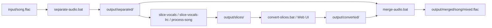

# voice-translate

基于 [Seed-VC](https://github.com/Plachtaa/seed-vc) 的本地语音/歌声转换工作区，包含 Seed-VC 源码（含 Web UI 报错增强）、词曲分离/切片/重组脚本、**统一管线 Web UI** 与安装文档。

> 上游参考：Plachta/seed-vc。模型权重不纳入版本库，首次运行时会自动下载到 `seed-vc/checkpoints/`。

## 目录结构

| 路径 | 说明 |
| --- | --- |
| `docs/` | 安装与排障文档 |
| `pipeline/` | 编排内核（项目状态、阶段调度、GPU 队列） |
| `webui/` | 统一管线 Gradio Web UI |
| `scripts/` | 管线脚本（分离、切片、转换、重组、Web UI 启动） |
| `seed-vc/` | Seed-VC 源码（已纳入版本库，模型权重除外） |
| `separator-env/` | 词曲分离与切片 Python 环境（不纳入版本库） |
| `seed-vc-env/` | Seed-VC 推理 Python 环境（不纳入版本库） |
| `input/` | 原始歌曲输入 |
| `output/` | 各阶段产物；项目元数据在 `output/.projects/` |

## 完整管线



| 阶段 | CLI 脚本 | Web UI |
| --- | --- | --- |
| 1. 词曲分离 | `scripts/separate-audio.bat` | 管线 Web UI「分离」Tab |
| 2. 声乐切片 | `scripts/slice-vocals*.bat` | 「切片」Tab |
| 3. 歌声转换 | `scripts/convert-slices.bat` | 「转换」Tab（整段 / 批量） |
| 4. 人声伴奏重组 | `scripts/merge-audio.bat` | 「合并」Tab |

> 分离与 Seed-VC **不要同时占用 GPU**，按顺序串行执行。管线 Web UI 内置 GPU 任务队列自动串行。

## 快速开始

### 管线 Web UI（推荐）

四阶段全覆盖：项目制管理、向导一键全流程、各阶段可独立重跑、批量队列。

1. 完成 [词曲分离与声乐切片安装指南](docs/词曲分离与声乐切片安装指南.md)（`separator-env`）
2. 完成 [Seed-VC 安装指南](docs/Seed-VC安装指南.md)（`seed-vc-env`）
3. 安装 **FFmpeg** 并确保 `ffmpeg` 在 PATH 中可用
4. 启动：

```powershell
scripts\start-pipeline-webui.bat
```

5. 浏览器访问 `http://127.0.0.1:7860/`
6. 关闭：`scripts\stop-pipeline-webui.bat`

设计说明见 [管线 Web UI 设计方案](docs/管线WebUI设计方案.md)。已有 `output/slices/`、`output/separated/` 等目录时，侧栏点「刷新列表」可自动导入为项目。

### Seed-VC 调试 Web UI（仅歌声转换）

单文件交互式转换，产物不落盘 `output/`，适合快速试听：

```powershell
scripts\start-seed-vc-webui.bat
```

> 与管线 Web UI 共用 **7860** 端口，请勿同时启动。

### 命令行管线（批量处理）

```powershell
# 有 LRC 歌词：分离 + 切片一步完成
scripts\process-song.bat input\song.flac

# 批量歌声转换
scripts\convert-slices.bat output\slices\song

# 重组混音（新布局：按项目分子目录）
scripts\merge-audio.bat `
  --vocals output\converted\song `
  --instrumental "output\separated\song_(Instrumental)_mel_band_roformer_kim_ft_unwa.flac" `
  --reference input\song.flac `
  --profile full `
  -o output\merged\song
```

## 脚本清单

| 脚本 | 说明 |
| --- | --- |
| `scripts/start-pipeline-webui.bat` | **启动统一管线 Web UI** |
| `scripts/stop-pipeline-webui.bat` | 关闭管线 Web UI |
| `scripts/separate-audio.bat` | 词曲分离 |
| `scripts/process-song.bat` | 词曲分离 + LRC 切片 |
| `scripts/slice-vocals.bat` | Silero VAD 声学切片 |
| `scripts/slice-vocals-lrc.bat` | LRC 时间戳切片 |
| `scripts/convert-slices.bat` | 批量 Seed-VC 切片转换 |
| `scripts/merge-audio.bat` | 人声与伴奏重组混音 |
| `scripts/start-seed-vc-webui.bat` | 启动 Seed-VC 调试 Web UI |
| `scripts/stop-seed-vc-webui.bat` | 关闭 Seed-VC Web UI |
| `scripts/repair-separator-model.bat` | 修复损坏的分离模型权重 |

## 测试

```powershell
py -m pytest tests/ -v
```

## 本地定制

- `seed-vc/app_svc.py`：已增强 Web UI 报错提示（如 FFmpeg 缺失、文件不存在等）
- `pipeline/` + `webui/`：统一管线编排与 Gradio 界面
- 详见各安装指南与 [管线 Web UI 开发记录](docs/管线WebUI开发记录.md)
