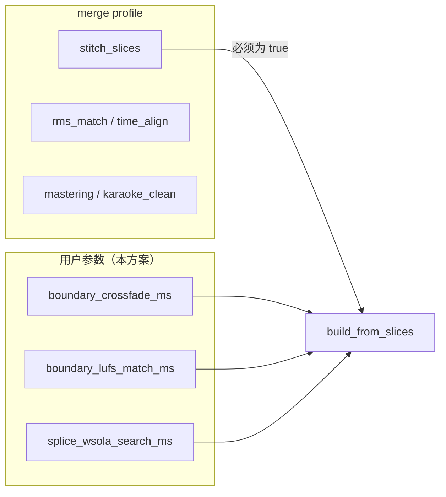
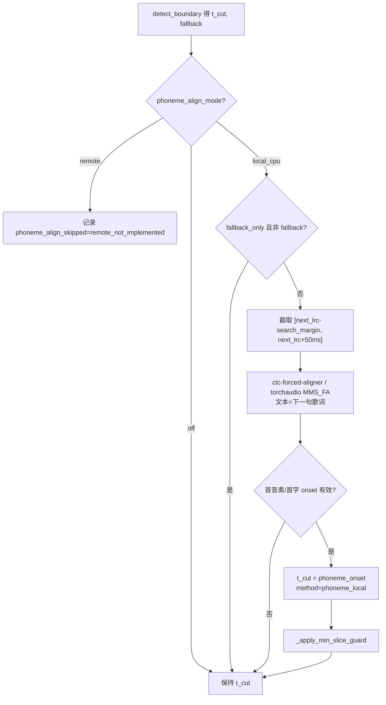
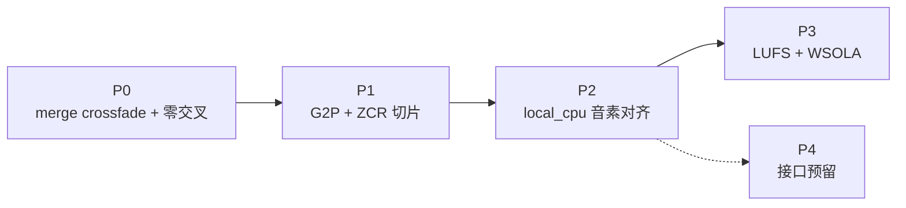

# LRC 切片与 Merge 拼接增强方案（P0–P3）

> **关联文档：** [LRC切片起音对齐方案.md](./LRC切片起音对齐方案.md)、[LRC切片能量谷底与安全边距方案.md](./LRC切片能量谷底与安全边距方案.md)、[音乐歌词音频切分与拼接合并的技术方案调研报告.md](./音乐歌词音频切分与拼接合并的技术方案调研报告.md)、[人声伴奏结合技术调研报告.md](./人声伴奏结合技术调研报告.md)  
> **版本：** v1.0  
> **日期：** 2026-07-30  
> **状态：** 待实施

---

## 1. 背景与动机

### 1.1 现状

在方案 A（起音对齐）与方案 B（能量谷底 + 安全边距）已落地后，全链路仍存在两类声学问题：

| 环节 | 现状 | 痛点 |
|------|------|------|
| **切片** | RMS 谷底 → silence/legato onset → fallback + `safety_margin_ms` | 抢字/微弱预起音仍可能漏检；连唱无静音时切点偏保守 |
| **Merge 拼接** | 按 `start_ms` 叠加 + **线性** fade（8/15ms） | 句间能量凹陷（-3dB）、click/pop、连唱相位干涉 |
| **Merge 响度** | 逐片全局 `rms_match` | 不针对**接缝**局部响度跳变 |
| **参数暴露** | `quick/balanced/full` Profile 硬编码 `stitch_slices` 等行为 | 用户无法单独调节句间 crossfade 等接缝参数 |

### 1.2 与调研报告的映射

| 优先级 | 调研报告方案 | 本仓库落地 |
|--------|--------------|------------|
| **P0** | Merge 方案一：等功率交叉淡化 + 零交叉对齐 | `boundary_crossfade_ms` 等 |
| **P1** | 切分方案三增强：G2P 抢跑 + ZCR 联合谷底 | `g2p_preroll_ms`、`boundary_zcr_weight` |
| **P2** | 切分方案一简化：CTC 强制对齐（仅 fallback 边界） | `phoneme_align_mode=local_cpu` |
| **P3** | Merge 方案二/三：WSOLA + 边界 LUFS 匹配 | `splice_wsola_search_ms`、`boundary_lufs_match_ms` |
| **P4** | 远程 GPU 对齐（Modal / 歌唱音素模型） | **仅预留接口，暂不实现** |

### 1.3 方案目标

1. **P0–P3**：在 `separator-env`（CPU）内可完成，不依赖远程 GPU；
2. **参数自选**：接缝与对齐能力通过 `stage_params` 暴露，**不绑定** `quick/balanced/full` Profile；
3. **向后兼容**：新参数默认值保持与当前行为一致（crossfade=0、对齐=off 等）；
4. **manifest 可复现**：切片/合并所用关键参数写入 manifest 快照。

**非目标：**

- 不改造 VAD 切片逻辑；
- 不解决逐片 Seed-VC 冷启动带来的句间音色/F0 微差（靠重转或整轨 convert）；
- P4 远程对齐**不实现调用逻辑**，仅定义接口与错误提示；
- 不引入 MFA conda 全轨对齐作为默认路径。

---

## 2. 已锁定决策

| # | 决策项 | 结论 |
|---|--------|------|
| D1 | 参数与 Profile 关系 | **解耦**：`boundary_crossfade_ms` 等由用户自选；Profile 仍控制 `stitch_slices`、母带、Karaoke 净化等粗粒度开关 |
| D2 | crossfade 默认 | `boundary_crossfade_ms=0` → 与现有一致（仅片内线性 fade） |
| D3 | crossfade 生效条件 | `merge_mode=slice_stitch` 且 `profile.stitch_slices=true` 且 `boundary_crossfade_ms>0` |
| D4 | 重叠策略 | **Merge 阶段短时 overlap**；切片导出仍无重叠、无空隙（manifest `start_ms/end_ms` 语义不变） |
| D5 | G2P 抢跑 | `g2p_preroll_ms=0` 禁用；`>0` 时作为 `search_margin` 左边界下限（见 §4.2） |
| D6 | ZCR 权重 | `boundary_zcr_weight=0` 禁用；`0.1~0.3` 启用联合寻优 |
| D7 | 音素对齐范围 | **仅 fallback 边界**（`boundary_in_fallback=true` 或 `method` 含 `lrc_fallback`） |
| D8 | 音素对齐默认 | `phoneme_align_mode=off`；`local_cpu` 可选启用 |
| D9 | P4 远程 | 参数与类型预留；`phoneme_align_mode=remote` 时 **明确报错/日志提示未实现** |
| D10 | 依赖环境 | P2 `local_cpu` 放入 `separator-env`（`requirements-api.txt` 增量依赖） |
| D11 | WSOLA 触发 | 仅当 `splice_wsola_search_ms>0` 且 manifest 上一边界 `method` 为 `legato_onset` |
| D12 | VC 差异 | 文档说明 crossfade/WSOLA 可**部分**掩盖，非本方案核心目标 |

---

## 3. 参数设计（`stage_params`）

### 3.1 切片阶段（`StageName.SLICE`，`lrc_only`）

| key | 类型 | 默认 | 范围 | 说明 |
|-----|------|------|------|------|
| `g2p_preroll_ms` | int | `0` | 0–200 | `0` 关闭；>0 启用下句首字 G2P 抢跑窗口下限 |
| `boundary_zcr_weight` | float | `0.0` | 0.0–1.0 | 谷底寻优中 ZCR 项权重 λ |
| `phoneme_align_mode` | choice | `off` | `off` \| `local_cpu` \| `remote` | 音素级边界精修（P2/P4） |
| `phoneme_align_fallback_only` | bool | `true` | — | 仅对 fallback 边界尝试对齐 |
| `phoneme_align_remote_url` | str | `""` | — | P4 预留；`remote` 时校验非空 |
| `phoneme_align_remote_timeout_s` | int | `30` | 5–120 | P4 预留 |

现有 LRC 参数（`boundary_mode`、`search_margin_ms` 等）不变。

### 3.2 合并阶段（`StageName.MERGE`）

| key | 类型 | 默认 | 范围 | 说明 |
|-----|------|------|------|------|
| `boundary_crossfade_ms` | int | `0` | 0–50 | `0` 保持现状；>0 句间 overlap 交叉淡化 |
| `boundary_crossfade_curve` | choice | `equal_power` | `linear` \| `equal_power` | 交叉淡化曲线 |
| `boundary_zero_crossing` | bool | `true` | — | crossfade 前在 overlap 区找零交叉点 |
| `boundary_lufs_match_ms` | int | `0` | 0–500 | `0` 关闭；典型 300 启用边界短时响度匹配 |
| `splice_wsola_search_ms` | int | `0` | 0–30 | `0` 关闭；legato 边界 NCC 相位搜索半径 |

现有 `vocals_gain_db`、`instrumental_gain_db`、`clean_instrumental`、`skip_mastering` 不变。`profile` 保留。

### 3.3 Profile 与参数交互



| 场景 | 行为 |
|------|------|
| `profile=quick`（`stitch_slices=false`） | 新 merge 参数**不生效**；UI 可灰显并提示 |
| `profile=balanced` + `boundary_crossfade_ms=20` | 启用句间 crossfade，与 profile 无关 |
| `merge_mode=whole_track` | 新 merge 参数不生效 |

---

## 4. P1–P2：切片算法

### 4.1 P1：G2P 抢跑窗口

**文件：** `scripts/slice-vocals-lrc.py`

对相邻行 `i` / `i+1`，在 `detect_boundary()` 计算窗口前：

1. 取 `lyrics[i+1].text` 首字符（去空格）；
2. 查轻量 G2P 规则表（内置，无外部服务）：

| 首字类型 | 示例 | `Δt_pre_roll` |
|----------|------|----------------|
| 清塞音/擦音起头 | 他、思、可、七 | `g2p_preroll_ms`（默认建议 80–120） |
| 鼻音/边音 | 么、呢、来 | `g2p_preroll_ms * 0.6` |
| 元音/其他 | 爱、我、啊 | `g2p_preroll_ms * 0.3` |

3. 修正搜索左边界：

```
pre_roll = lookup_preroll(next_line_text, g2p_preroll_ms)
window_start_ms = max(
    line_start_ms + min_slice_ms,
    next_lrc_ts - search_margin_ms,
    next_lrc_ts - pre_roll,   # 仅当 g2p_preroll_ms > 0
)
```

`g2p_preroll_ms=0` 时跳过步骤 2–3，与现行为一致。

**新增模块：** `scripts/lrc_g2p_preroll.py`（纯规则，便于单测）。

### 4.2 P1：ZCR 联合谷底

在 `_detect_energy_valley()` 候选评分中，当 `boundary_zcr_weight > 0`：

1. 对窗口内每帧计算 ZCR（与 RMS 同帧长 `RMS_FRAME_MS`）；
2. 归一化 `E_norm`、`Z_norm` 至 [0,1]；
3. 评分 `score = E_norm + λ * Z_norm`，在低于 `threshold` 的候选中取 **score 最小**（tie-break 仍取最靠左）。

`λ = boundary_zcr_weight`，`λ=0` 时退化为纯 RMS 谷底（方案 B 现状）。

### 4.3 P2：本地 CPU 音素对齐（仅 fallback）

**触发：** `phoneme_align_mode=local_cpu` 且（`phoneme_align_fallback_only=false` 或该边界 `fallback=true`）。

**流程：**



**实现要点：**

- 新建 `scripts/phoneme_align.py`：`align_boundary_local(audio, sr, text, window_start_ms, window_end_ms) -> float | None`
- 默认后端：`ctc-forced-aligner` CLI 或 Python API，`language=zho`，`split_size=char`
- 懒加载模型：首次 fallback 边界时加载，同次切片任务复用
- 失败不阻断：记录 `phoneme_align_error` 到 diagnostic，回退原 `t_cut`

**依赖（`requirements-api.txt` 可选 extra 或主列表增量）：**

```
ctc-forced-aligner>=1.0.2
```

首次运行会下载 MMS 模型（~300MB），需文档说明。

**CPU 耗时预估：** 单边界 2–5s（i7 级）；一首歌 10 个 fallback 边界约 30–50s，可接受。

### 4.4 P4：远程接口预留（不实现）

**类型与入口：**

```python
# scripts/phoneme_align.py

class PhonemeAlignMode(str, Enum):
    OFF = "off"
    LOCAL_CPU = "local_cpu"
    REMOTE = "remote"  # 预留

def refine_boundary(
    *,
    mode: str,
    audio: np.ndarray,
    sr: int,
    next_line_text: str,
    window_start_ms: float,
    window_end_ms: float,
    remote_url: str = "",
    remote_timeout_s: int = 30,
) -> PhonemeAlignResult:
    if mode == PhonemeAlignMode.OFF:
        return PhonemeAlignResult(skipped=True, reason="disabled")
    if mode == PhonemeAlignMode.REMOTE:
        return PhonemeAlignResult(
            skipped=True,
            reason="remote_not_implemented",
            message="phoneme_align_mode=remote is reserved; use local_cpu or off",
        )
    ...
```

**未来 P4 契约（仅文档，不编码 HTTP 客户端）：**

```
POST {phoneme_align_remote_url}/align
Content-Type: multipart/form-data
  audio: wav/flac 片段
  text: 下一句歌词
  language: zho

Response JSON:
{
  "onset_ms": 24820.5,
  "confidence": 0.92,
  "method": "zh_singing_phoneme"
}
```

`pipeline/stages/slice.py` 与 `stage_log` 在 `remote` 时写 WARN，不 fail 整个切片阶段。

---

## 5. P0 & P3：Merge 拼接算法

### 5.1 P0：句间交叉淡化 + 零交叉

**文件：** `scripts/merge-audio.py`

**现状：**

```python
# overlay_segment: 独立 fade_in/fade_out 后叠加，相邻片无 overlap
timeline[start:end] += apply_fade(segment, fade_in_ms, fade_out_ms)
```

**改造：** `build_from_slices()` 顺序拼接时，对相邻片 `(i, i+1)`：

1. 若 `boundary_crossfade_ms <= 0`：走现有 `overlay_segment`；
2. 若 `> 0`：
   - `τ = boundary_crossfade_ms`
   - `overlap_samples = int(τ * sr / 1000)`
   - 片 B 的叠加起点：`start_b = int(slice[i+1].start_ms * sr / 1000) - overlap_samples // 2`
   - 片 A 尾部、片 B 头部各取 `overlap_samples` 做 crossfade

**等功率曲线（`boundary_crossfade_curve=equal_power`）：**

```python
t = np.linspace(0, 1, overlap_samples, dtype=np.float32)
g_out = np.cos(t * np.pi / 2)   # A 淡出
g_in  = np.sin(t * np.pi / 2)   # B 淡入
mixed_overlap = g_out * tail_a + g_in * head_b
```

**零交叉（`boundary_zero_crossing=true`）：**

在 `tail_a`、`head_b` 各 ±`min(5ms, τ/4)` 采样范围内，找最接近零且斜率同向的样本点，微调 overlap 切片起点（不改变 manifest 时间轴）。

**自适应 τ（可选，实现简单版）：**

| 上一边界 `method` | 建议 τ |
|-------------------|--------|
| `valley_onset` / `silence_onset` | `boundary_crossfade_ms`（用户值） |
| `legato_onset` | `min(boundary_crossfade_ms, 10)` |

可在 `build_from_slices` 内根据 manifest 条目 `boundary_method`（见 §6）自动 clamp，无需新参数。

**片内 fade：** crossfade 启用时，片级 `fade_in_ms/fade_out_ms` 在 overlap 区**不再重复**施加（避免双重衰减）；非 overlap 区保留原 fade。

### 5.2 P3：边界 LUFS 包络匹配

当 `boundary_lufs_match_ms = W > 0`：

1. 对相邻片 A、B，取 A 尾部 W ms、B 头部 W ms 单声道；
2. 用 K-weighting 近似（`pyloudnorm` 或简化 RMS→LUFS 线性映射）得 `L_A`、`L_B`；
3. 若 `|L_A - L_B| > 2 LU`：对 B 全段施加平滑增益包络，在接缝处从 `gain_A` 过渡到 `gain_B`（线性或 50ms 余弦）；
4. 与现有 `rms_match` **叠加**：先 per-slice `rms_match`，再边界 LUFS 微调（顺序在 crossfade 之前）。

**依赖：**

```
pyloudnorm>=0.1.1
```

若希望零新依赖，可用「边界 300ms RMS dB 差 → 线性增益」简化实现，文档标注为 BS.1770 近似。

### 5.3 P3：条件 WSOLA（NCC 相位搜索）

当 `splice_wsola_search_ms = Δ > 0` 且片 `i+1` 的 entry 边界 `method=legato_onset`：

1. 取 A 尾 `2*Δ`、B 头 `2*Δ` 参考区；
2. 在 `δ ∈ [-Δ, +Δ]` 以 1ms 步长算 NCC，取 `δ*`；
3. 将 B 整体平移 `δ*` 样本后再进入 crossfade（平移仅影响叠加相位，**不改** `start_ms` 时间轴定位）。

WSOLA 与 `time_align`（RubberBand 整段拉伸）独立：前者只调接缝相位，后者仍按 profile 控制。

### 5.4 `build_from_slices` 签名扩展

```python
@dataclass(frozen=True)
class SpliceParams:
    boundary_crossfade_ms: int = 0
    boundary_crossfade_curve: str = "equal_power"
    boundary_zero_crossing: bool = True
    boundary_lufs_match_ms: int = 0
    splice_wsola_search_ms: int = 0

def build_from_slices(
    manifest_path: Path,
    converted_dir: Path,
    slices_dir: Path,
    profile: Profile,
    original_vocals: Path | None,
    *,
    splice: SpliceParams | None = None,
) -> np.ndarray:
    ...
```

`merge_audio()` / `pipeline/stages/merge.py` / `pipeline/runner.py` 透传 `SpliceParams`。

---

## 6. manifest 契约扩展

### 6.1 切片 manifest 顶层

```json
{
  "g2p_preroll_ms": 0,
  "boundary_zcr_weight": 0.0,
  "phoneme_align_mode": "off",
  "phoneme_align_fallback_only": true,
  "phoneme_align_remote_url": "",
  "phoneme_align_applied_count": 0,
  "phoneme_align_skipped_remote_count": 0
}
```

### 6.2 切片条目（entry 边界诊断）

在 `slice_{i}`（`i>0`）侧增加可选字段（由 `diagnostics[i-1]` 写入）：

```json
{
  "boundary_method": "valley_onset",
  "boundary_reason": "aligned_valley",
  "phoneme_align_applied": false,
  "g2p_preroll_ms_used": 0
}
```

### 6.3 merge 写入人声轨侧车（可选）

`output/merged/{project}/{mode}/splice_meta.json`：

```json
{
  "boundary_crossfade_ms": 15,
  "boundary_crossfade_curve": "equal_power",
  "boundary_zero_crossing": true,
  "boundary_lufs_match_ms": 300,
  "splice_wsola_search_ms": 0
}
```

便于回放合并参数；非必须，merge 阶段 params 优先。

---

## 7. 代码改动清单

### 7.1 P0 — Merge 交叉淡化

| 文件 | 改动 |
|------|------|
| `scripts/merge-audio.py` | `SpliceParams`、`equal_power_crossfade()`、`find_zero_crossing_offset()`、改造 `build_from_slices()` |
| `pipeline/stages/merge.py` | `run_merge()` 增加 splice 参数 |
| `pipeline/runner.py` | merge 阶段透传 5 个新参数 |
| `pipeline/stage_params.py` | MERGE 段 5 个 `StageParam` |
| `tests/test_merge_splice.py` | **新建**：crossfade 功率、零交叉、τ=0 回归 |
| `frontend/e2e/merge-page.spec.ts` | 断言新参数可见 |

### 7.2 P1 — 切片 G2P + ZCR

| 文件 | 改动 |
|------|------|
| `scripts/lrc_g2p_preroll.py` | **新建** G2P 规则表 |
| `scripts/slice-vocals-lrc.py` | `BoundaryParams` 扩展、`detect_boundary` 接入 G2P/ZCR |
| `pipeline/stages/slice.py` | 透传新参数 |
| `pipeline/runner.py` | slice 阶段透传 |
| `pipeline/stage_params.py` | SLICE 段 2 个参数（`lrc_only`） |
| `tests/test_slice_vocals_lrc.py` | G2P 窗口、ZCR 谷底用例 |

### 7.3 P2 — 本地音素对齐

| 文件 | 改动 |
|------|------|
| `scripts/phoneme_align.py` | **新建**；含 P4 stub |
| `scripts/slice-vocals-lrc.py` | `compute_boundaries` 后处理 fallback 边界 |
| `requirements-api.txt` | `ctc-forced-aligner`（可选 marker `align`） |
| `tests/test_phoneme_align.py` | **新建**；mock 对齐结果 |
| `tests/test_slice_vocals_lrc.py` | 集成：fallback + local_cpu mock |

### 7.4 P3 — LUFS + WSOLA

| 文件 | 改动 |
|------|------|
| `scripts/merge-audio.py` | `boundary_lufs_match()`、`ncc_splice_offset()` |
| `requirements-api.txt` | `pyloudnorm`（或内联简化版则省略） |
| `tests/test_merge_splice.py` | LUFS 增益、legato WSOLA 触发 |

### 7.5 P4 — 仅预留

| 文件 | 改动 |
|------|------|
| `scripts/phoneme_align.py` | `REMOTE` 分支返回 `remote_not_implemented` |
| `pipeline/stage_params.py` | `phoneme_align_remote_*` 字段 + `remote` choice |
| `docs/` | 本文 §4.4 契约；**无** HTTP 客户端、无 Modal 部署脚本 |

---

## 8. 实施阶段



| 阶段 | 交付物 | 验收 |
|------|--------|------|
| **P0** | `boundary_crossfade_*`、`build_from_slices` 改造 | pytest + 合成两片接缝无 click；τ=0 回归 |
| **P1** | `lrc_g2p_preroll.py`、ZCR 谷底 | 抢字合成用例；`g2p_preroll_ms=0` 回归 |
| **P2** | `phoneme_align.py` local_cpu；P4 stub | mock 测试；`remote` 写 WARN 不失败 |
| **P3** | LUFS + WSOLA | legato 合成用例；与 P0 crossfade 联调 |
| **P4** | 参数 + 类型 + 文档契约 | `phoneme_align_mode=remote` 明确跳过 |

**建议 PR 拆分：** `[merge] P0 crossfade` → `[slice] P1 G2P/ZCR` → `[slice] P2 phoneme local` → `[merge] P3 LUFS/WSOLA`。

---

## 9. 测试计划

### 9.1 单元测试

**`tests/test_merge_splice.py`（P0/P3）**

| 用例 | 断言 |
|------|------|
| `test_crossfade_zero_preserves_legacy_overlay` | `boundary_crossfade_ms=0` 与旧 `overlay_segment` 数值一致 |
| `test_equal_power_midpoint_energy` | overlap 中点功率 ≈ 单侧功率（±1dB） |
| `test_zero_crossing_reduces_jump` | 接缝样本跳变 < 无 ZC |
| `test_lufs_match_reduces_boundary_delta` | 边界前后 300ms RMS 差缩小 |
| `test_wsola_only_on_legato` | `method=silence_onset` 不触发 NCC |
| `test_quick_profile_with_crossfade_param` | `profile=quick` 但 stitch 路径未启用时不崩溃 |

**`tests/test_slice_vocals_lrc.py`（P1）**

| 用例 | 断言 |
|------|------|
| `test_g2p_extends_window_for_sibilant` | 下句「思」时 `window_start` 更早 |
| `test_g2p_disabled_when_zero` | `g2p_preroll_ms=0` 与旧窗口一致 |
| `test_zcr_valley_prefers_silence_gap` | 有 ZCR 谷时切点左移 |

**`tests/test_phoneme_align.py`（P2/P4）**

| 用例 | 断言 |
|------|------|
| `test_remote_returns_not_implemented` | `mode=remote` → `skipped`, `reason=remote_not_implemented` |
| `test_local_cpu_mock_refines_fallback` | mock 返回 onset → `method=phoneme_local` |

### 9.2 集成测试

| 用例 | 断言 |
|------|------|
| `test_loveyou_reslice_with_p1_params` | 切片数不变；fallback 不增 |
| `test_merge_timeline_continuous_with_crossfade` | overlap 后时间轴覆盖连续；无 NaN |
| `test_schema_merge_splice_params` | API `/params/merge` 含 5 个新字段 |
| `test_schema_slice_align_params` | API `/params/slice` LRC 模式含 P1/P2/P4 字段 |

### 9.3 前端 E2E

| 用例 | 文件 | 断言 |
|------|------|------|
| Merge 页显示 crossfade 参数 | `merge-page.spec.ts` | `param-boundary_crossfade_ms` 可见 |
| Slice LRC 显示 G2P/ZCR | `slice-page.spec.ts` | `param-g2p_preroll_ms` 可见；VAD 不可见 |
| `remote` 选项存在 | `slice-page.spec.ts` | `phoneme_align_mode` 含 `remote` |

### 9.4 人工验收

| 项 | 说明 |
|----|------|
| loveyou 全曲 | P0：`boundary_crossfade_ms=15` 句间咔哒减轻 |
| 用户截图类尾部突起 | P1：`g2p_preroll_ms=100` + 默认谷底 |
| fallback 密集曲目 | P2：`local_cpu` 后 fallback 率下降（需实机下载模型） |
| `phoneme_align_mode=remote` | UI 可选，运行日志 WARN，切片仍成功 |

---

## 10. 风险与缓解

| 风险 | 缓解 |
|------|------|
| crossfade overlap 与 `time_align` 叠加导致双重要求长度 | WSOLA 只调相位；stretch 仍在 align 阶段；联调测试 |
| `ctc-forced-aligner` 对歌唱域偏差 | 仅 fallback；失败回退；未来 P4 换歌唱模型 |
| 模型下载失败 / 离线环境 | `local_cpu` 捕获异常；diagnostic 记录；切片继续 |
| `pyloudnorm` 新依赖 | 可提供 `boundary_lufs_match_ms>0` 时 importorskip；或 RMS 近似 |
| 参数过多 UI 拥挤 | Merge / Slice 页 bool 折叠区；Wizard 仅暴露 `boundary_crossfade_ms` + `g2p_preroll_ms` |
| 改切片边界后未重转 | 沿用现有「边界变更建议重转」提示 |

---

## 11. VC 冷启动差异（说明）

| 手段 | 掩盖程度 |
|------|----------|
| P0 crossfade | 中：句间突变柔化 |
| P3 WSOLA | 中高：连唱相位 |
| P3 LUFS | 低：仅响度 |
| P2 音素对齐 | 低：改善切点，不改善 VC 音色 |

整轨 convert 或重切片后重转仍是音色一致性的根本手段。

---

## 附录 A：推荐默认（试听起点）

用户未调参时保持代码默认值（全 0 / off）。以下为**试听建议**，非默认：

| 参数 | 建议试听值 |
|------|------------|
| `boundary_crossfade_ms` | 12–20 |
| `boundary_crossfade_curve` | `equal_power` |
| `g2p_preroll_ms` | 80–120 |
| `boundary_zcr_weight` | 0.15 |
| `phoneme_align_mode` | `local_cpu`（fallback 多时） |
| `boundary_lufs_match_ms` | 300 |
| `splice_wsola_search_ms` | 15（连唱曲目） |

---

## 附录 B：P4 远程方案调研摘要（暂不实现）

| 路径 | 可行性 | 说明 |
|------|--------|------|
| MFA 官方云 | ❌ | 无托管 API，需自建 |
| HuggingFace Inference | ❌ | MFA/歌唱模型未部署 |
| Modal $30/月 | ⚠️ 需自建 | 可部署 `zh-singing-phoneme-ctc`；用户无免费端点时不可用 |
| ElevenLabs / VocaSync | ⚠️ 付费 | 词级对齐；按分钟计费 |
| **当前决策** | — | 预留 `phoneme_align_remote_url` 与 HTTP 契约；实现留待有稳定端点后 |

---

## 附录 C：决策记录

| 日期 | 事项 | 结论 |
|------|------|------|
| 2026-07-30 | 优化范围 | 全链路；参数与 Profile 解耦 |
| 2026-07-30 | 远程对齐 | P4 仅预留接口，暂不实现 |
| 2026-07-30 | crossfade 默认 | `0` 保持向后兼容 |
| 2026-07-30 | 重叠策略 | Merge 短时 overlap，切片无重叠 |
| 2026-07-30 | 音素对齐范围 | 仅 fallback 边界；默认 `off` |
