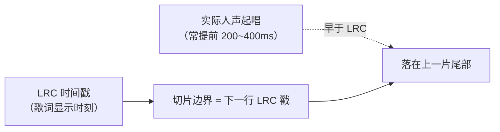
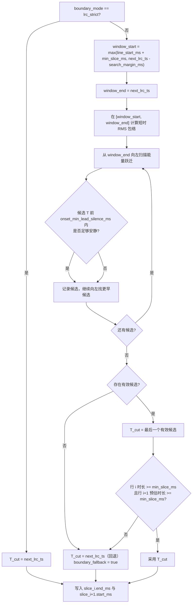
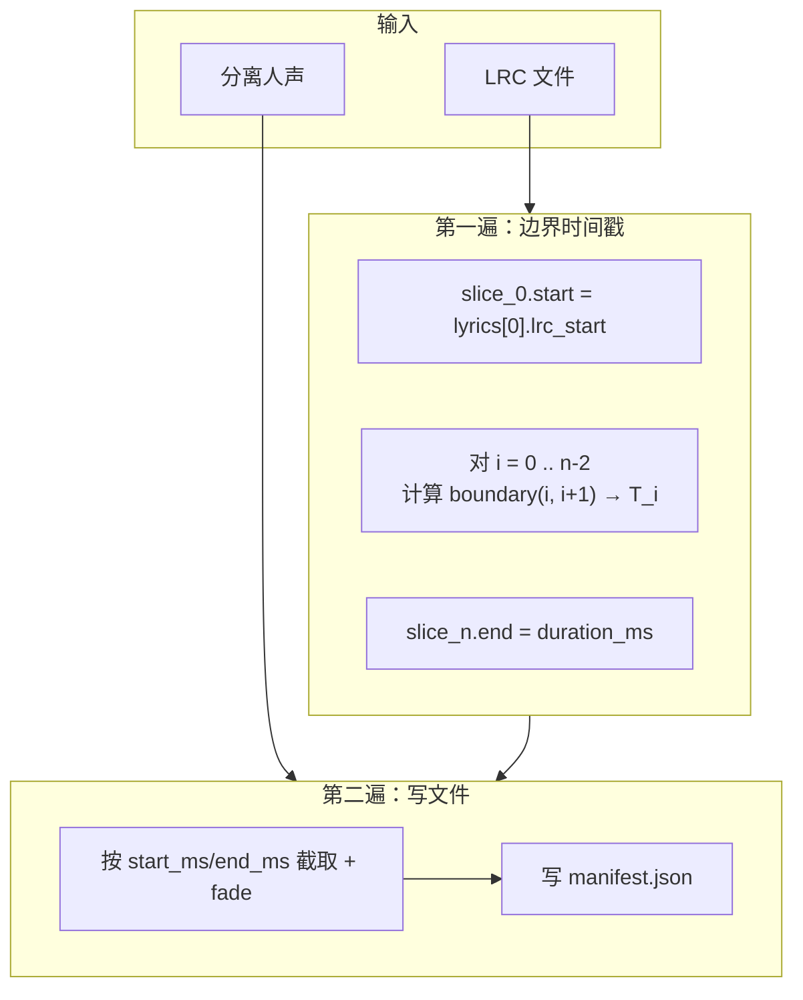
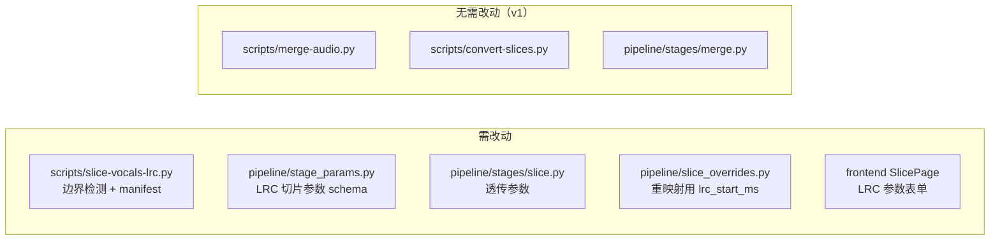

# LRC 切片起音对齐方案（方案 A）

> **关联文档：** [切片模式分仓与精修功能实施方案.md](./切片模式分仓与精修功能实施方案.md)、[人声伴奏结合技术调研报告.md](./人声伴奏结合技术调研报告.md)、[converted产物目录改造与合并修复方案.md](./converted产物目录改造与合并修复方案.md)  
> **版本：** v1.1  
> **日期：** 2026-07-30  
> **状态：** 已实施（阶段 1–4 完成）

---

## 1. 背景与动机

### 1.1 问题描述

在 LRC 切片 → 逐片 Seed-VC 转换 → manifest 回贴合并的流程中，用户反馈：

1. 合并后相邻歌词句之间过渡不自然；
2. 下一句首个音节音调异常；
3. 试听**未转换**的 LRC 切片时，每片尾部带有「下半句首音节」；
4. 界面无相关可调参数。

### 1.2 根因分析

当前 LRC 切片采用 **「本行 LRC 戳 → 下一行 LRC 戳」** 的硬切模型（`scripts/slice-vocals-lrc.py`）：



| 环节 | 现状 | 影响 |
|------|------|------|
| 切片 | 相邻片共享 LRC 边界，无重叠 | 下一句预起音进入上一片尾部 |
| 转换 | 每片独立冷启动推理 | 被切开的音节两段 F0/音色不一致 |
| 合并 | 线性 fade + 按 `start_ms` 贴回，无句间 crossfade | 边界处能量凹陷或相位突变 |

VAD 模式有 `speech_pad_ms` 等切片参数；LRC 模式除写死的 8/15ms fade 外无可调边界参数。

### 1.3 方案目标

在 **切片阶段** 对相邻歌词行之间的切点做 **起音对齐（onset alignment）**，使：

- 上一片不再包含下一句的起音部分；
- 下一片从完整起音开始；
- merge / convert 接口保持兼容（manifest 契约扩展，merge 仍读 `start_ms` / `end_ms`）。

**非目标（v1）：**

- 不改造 VAD 切片逻辑；
- 不在「切片精修」Tab 做边界手调（仍属切片阶段）；
- 不解决逐片独立 VC 带来的音色微差（需整轨 convert 或后续 crossfade）；
- 不自动修正 LRC 文件内容。

---

## 2. 已锁定决策

| # | 决策项 | 结论 |
|---|--------|------|
| D1 | 对齐范围 | **仅调整相邻句之间的切点**；第一句 `start_ms` 仍用 LRC 行首；最后一句 `end_ms` 仍用音频总时长 |
| D2 | 起音选择策略 | 在搜索窗口内 **从右向左** 扫描，取 **最后一个** 满足 `onset_min_lead_silence_ms` 的起音候选 |
| D3 | manifest 时间戳 | `start_ms` / `end_ms` 写 **对齐后的切点**；另增 `lrc_start_ms` / `lrc_end_ms` 保留原始 LRC |
| D4 | 过短切片保护 | 若对齐后某句时长 &lt; `min_slice_ms`，**该边界回退** 到 LRC 戳 |
| D5 | 默认边界模式 | 默认 `onset_aligned`；可切回 `lrc_strict`（与旧行为一致） |
| D6 | 静音参数命名 | 使用 `onset_min_lead_silence_ms`，避免与 VAD 的 `min_silence_ms` 混淆 |
| D7 | 参数作用域 | `search_margin_ms`、`onset_min_lead_silence_ms` 等为 **全局** 参数，作用于每一对相邻切片边界 |

---

## 3. 边界模式

### 3.1 模式定义

| 模式 | 说明 | 用途 |
|------|------|------|
| `lrc_strict` | 现状：`end_ms = 下一行 LRC 戳` | 回退、对比、兼容旧 manifest |
| `onset_aligned` | 在相邻行之间检测真实起音并前移切点 | **默认** |

### 3.2 切点关系（`onset_aligned`）

对歌词行 `i` 与 `i+1`：

```mermaid
gantt
    title 相邻切片边界（onset_aligned）
    dateFormat X
    axisFormat %L

    section slice_i
    LRC区间           :a1, 22110, 25090
    实际切片          :a2, 22110, 24820

    section slice_i+1
    LRC区间           :b1, 25090, 28640
    实际切片          :b2, 24820, 28640

    section 切点
    T_onset           :milestone, 24820, 0
    next_lrc_ts       :milestone, 25090, 0
```



- `lrc_end_ms`（行 i）= `lrc_start_ms`（行 i+1）= 下一行 LRC 戳（如 `25090`）
- `end_ms`（行 i）= `start_ms`（行 i+1）= `T_onset`（如 `24820`）
- 音频连续：无重叠、无空隙

---

## 4. 核心算法

### 4.1 参数说明

| 参数 | 类型 | 默认值 | 说明 |
|------|------|--------|------|
| `boundary_mode` | choice | `onset_aligned` | `onset_aligned` \| `lrc_strict` |
| `search_margin_ms` | int | `400` | 从下一行 LRC 戳向前回溯的最大搜索距离（ms） |
| `onset_min_lead_silence_ms` | int | `80` | 起音点前要求的最短「低能量」区间（ms） |
| `min_slice_ms` | int | `500` | 对齐后切片短于此值则 **该边界** 回退 LRC 戳 |
| `onset_energy_threshold_db` | float | `-40` | 相对片段峰值的可选能量阈值（实现时可调） |

仅 **LRC 切片** 暴露；VAD 参数不受影响。

### 4.2 单对边界检测（行 i 与行 i+1）

**输入：**

- `next_lrc_ts` = `lyrics[i+1].start_ms`
- `line_start_ms` = 行 i 当前已确定的 `start_ms`（首句为 LRC 行首；后续句为上一边界 `T_onset` 或 LRC 回退值）
- 人声音频单声道数组与 `sr`

**步骤：**



**起音选择策略（D2）说明：**

窗口内可能存在多个能量跃迁（本句尾音、换气、下一句起唱）。从右向左取 **最后一个** 满足静音条件的候选，目的是优先命中 **最靠近 LRC 戳的下一句真实起唱**，避免把本句尾音误判为下一句开头。

### 4.3 全曲切片流程



- **第一句开头**不做起音检测（D1）
- **最后一句结尾**不做起音检测，`= 音频总时长`
- 每一对相邻行 **只产生一个切点**，同时更新 `slice_i.end_ms` 与 `slice_i+1.start_ms`

### 4.4 伪代码

```python
def compute_boundaries(lyrics, audio, sr, params) -> list[float]:
    """返回长度为 n 的 start_ms 列表；start[i+1] 即边界 i 的切点。"""
    n = len(lyrics)
    starts = [lyrics[0].start_ms]
    fallbacks: list[bool] = []

    for i in range(n - 1):
        next_lrc = lyrics[i + 1].start_ms
        if params.boundary_mode == "lrc_strict":
            t_cut = next_lrc
            fallbacks.append(False)
        else:
            t_cut, fb = detect_boundary(
                audio, sr,
                line_start_ms=starts[i],
                next_lrc_ts=next_lrc,
                search_margin_ms=params.search_margin_ms,
                onset_min_lead_silence_ms=params.onset_min_lead_silence_ms,
                min_slice_ms=params.min_slice_ms,
            )
            fallbacks.append(fb)
        starts.append(t_cut)

    return starts, fallbacks
```

---

## 5. manifest 契约扩展

### 5.1 顶层字段

在现有 manifest 上增加：

```json
{
  "slice_mode": "lrc",
  "boundary_mode": "onset_aligned",
  "search_margin_ms": 400,
  "onset_min_lead_silence_ms": 80,
  "min_slice_ms": 500,
  "fade_in_ms": 8,
  "fade_out_ms": 15,
  "slices": []
}
```

### 5.2 单片条目

```json
{
  "id": "slice_001",
  "file": "loveyou_slice_001.flac",
  "start_ms": 24820,
  "end_ms": 28640,
  "lrc_start_ms": 25090,
  "lrc_end_ms": 28640,
  "text": "给我你的外衣",
  "lrc_line": 11,
  "boundary_in_fallback": false
}
```

| 字段 | 含义 |
|------|------|
| `start_ms` / `end_ms` | **对齐后**切点；merge 回贴使用此字段 |
| `lrc_start_ms` / `lrc_end_ms` | 原始 LRC 区间；调试、UI 展示、overrides 重映射 |
| `boundary_in_fallback` | 该片 **入口边界**（与上一片之间）是否回退到 LRC；首片恒为 `false` |

**`lrc_end_ms` 规则：**

- 非最后一片：`lrc_end_ms` = 下一行 `lrc_start_ms`
- 最后一片：`lrc_end_ms` = 音频总时长（或下一行不存在时的 LRC 逻辑终点）

### 5.3 下游兼容性

| 模块 | 变更 |
|------|------|
| `merge-audio.py` | **无需修改**；继续读 `start_ms` / `end_ms` |
| `convert-slices.py` | **无需修改**；按文件逐片转换 |
| `slice_overrides.merge_after_reslice` | **需修改**：LRC 模式匹配 overrides 时优先用 `lrc_start_ms` + `text`，避免对齐后 `start_ms` 偏移导致 orphan |
| 旧 manifest（无 `lrc_*` 字段） | 视为 `lrc_start_ms = start_ms`，`boundary_mode` 缺失时按 `lrc_strict` 理解 |

---

## 6. 模块改动范围



### 6.1 `scripts/slice-vocals-lrc.py`

- 新增 `detect_boundary()` 及 RMS/onset 工具函数
- `slice_vocals_lrc()` 增加参数：`boundary_mode`, `search_margin_ms`, `onset_min_lead_silence_ms`, `min_slice_ms`
- CLI 增加对应 flags
- 日志输出：对齐边界数、回退边界数、首条 fallback 示例

### 6.2 `pipeline/stage_params.py`

在 `StageName.SLICE` 下新增（`lrc_only: true`，与 `vad_only` 对称）：

| key | label |
|-----|-------|
| `boundary_mode` | 边界模式 |
| `search_margin_ms` | 起音搜索回溯 (ms) |
| `onset_min_lead_silence_ms` | 起音前最短静音 (ms) |
| `min_slice_ms` | 最短切片 (ms) |

`collect_params()` 增加 `lrc_only` 过滤逻辑（镜像 `vad_only`）。

### 6.3 `frontend/src/pages/SlicePage.tsx`

- LRC 模式下展示 `lrc_only` 参数；VAD 模式展示 `vad_only` 参数
- `boundary_mode` 默认选中 `onset_aligned`（D5）

### 6.4 `pipeline/slice_overrides.py`

`_slice_identity()` / `_match_slice()` 调整：

```python
def _lrc_match_start(item: dict) -> float:
    return float(item.get("lrc_start_ms", item.get("start_ms", 0)))
```

重切片后 overrides 按 `slice_id` → `lrc_start_ms`+`text` → 最近 `lrc_start_ms` 顺序匹配。

---

## 7. 典型场景与预期行为

| 场景 | 预期 |
|------|------|
| 歌手提前 200~400ms 起唱 | `T_onset` 落在搜索窗口内，尾部半音节消除 |
| LRC 与演唱对齐良好 | 窗口内无明显起音 → 回退 LRC，等同 `lrc_strict` |
| 连唱、滑音进下一句 | 起音前静音不足 → 回退 LRC |
| 两句 LRC 间隔极短 | `window_start` 被 `line_start_ms + min_slice_ms` 钳制，可能回退 |
| 重跑切片 | manifest 更新；overrides 按 `lrc_start_ms` 迁移；**已转换切片需用户重跑 convert** |

---

## 8. 测试计划与结果

> **测试日期：** 2026-07-30  
> **命令：** `python -m pytest tests/test_slice_vocals_lrc.py tests/test_slice_overrides.py tests/test_stage_params.py tests/api/test_params_schema.py`  
> **结果：** 28 passed（含 loveyou 集成用例）

### 8.1 单元测试

| 用例 | 断言 | 结果 |
|------|------|------|
| `lrc_strict` 模式 | 输出与现网 `slice-vocals-lrc.py` 一致 | ✅ `test_lrc_strict_matches_legacy_boundaries` |
| 合成信号：静音 + 起音 @ -300ms | `T_onset` 落在起音点 ±20ms | ✅ `test_onset_detected_at_minus_300ms` |
| 窗口内双起音 | 取右侧（最后一个有效）候选 | ✅ `test_dual_onset_picks_rightmost_candidate` |
| 过短切片 | 边界回退，`boundary_in_fallback=true` | ✅ `test_short_slice_triggers_fallback` |
| manifest 字段 | 含 `lrc_*` 与 `boundary_mode` | ✅ `test_manifest_contains_lrc_fields` |

### 8.2 集成测试

| 用例 | 断言 | 结果 |
|------|------|------|
| `loveyou` 项目重切片 | 切片数不变；`start_ms` ≤ `lrc_start_ms`（非首片） | ✅ `test_loveyou_reslice_when_available`（56 片；7 个边界前移，48 个回退 LRC） |
| 重切片后 overrides 迁移 | 已有 `overrides.json` 按 `lrc_start_ms`+`text` 保留 | ✅ `test_reslice_preserves_overrides_via_lrc_start_ms`、`test_merge_after_reslice_uses_lrc_start_ms_not_aligned_start` |
| merge 回贴 | 时间轴连续，无重叠求和异常 | ✅ `test_merge_timeline_continuous_after_onset_align` |
| pipeline 参数透传 | `lrc_only` / `vad_only` 过滤正确 | ✅ `test_collect_params_skips_*`、`test_schema_lrc_only_filter` |

**loveyou 样例（`output/slices/loveyou/lrc-test-onset/manifest.json`）：**

| 指标 | 值 |
|------|-----|
| 切片总数 | 56（与旧 manifest 一致） |
| 对齐边界数 | 7 |
| 回退边界数 | 48 |
| 典型前移 | 「给我你的外衣」`start_ms=24819.71`，`lrc_start_ms=25090`（前移 ~270ms） |

### 8.3 前端 E2E（Playwright MCP）

| 用例 | 断言 | 结果 |
|------|------|------|
| TC-Phase4-01 | VAD 模式显示 `vad_threshold`，隐藏 `boundary_mode` | ✅ |
| TC-Phase4-01 | LRC 模式显示 `boundary_mode`、`search_margin_ms`、`onset_min_lead_silence_ms`、`min_slice_ms` | ✅ |
| TC-Phase4-01 | LRC 模式隐藏 `vad_threshold`；`boundary_mode` 默认 `onset_aligned` | ✅ |

自动化脚本：`frontend/e2e/slice-page.spec.ts`（`lrc mode shows onset alignment params`）。  
2026-07-30 使用 Playwright MCP 在 `loveyou` 项目上复验通过。

### 8.4 人工验收

| 项 | 状态 |
|----|------|
| 试听未转换切片：尾部不含下一句首音节（LRC 提前量 &lt; `search_margin_ms`） | ⏳ 待用户试听 `lrc-test-onset` 产物 |
| 转换 + 合并：句间首音节音调较现状减轻 | ⏳ 待用户全链路试听 |
| 切换 `lrc_strict` 可复现旧行为 | ✅ 单元测试覆盖；UI 可选 `lrc_strict` |

---

## 9. 实施阶段


| 阶段 | 交付物 | 状态 | 关键文件 |
|------|--------|------|----------|
| 1 | 核心检测、`manifest` 新字段、单元测试 | ✅ 完成 | `scripts/slice-vocals-lrc.py`、`tests/test_slice_vocals_lrc.py` |
| 2 | `run_slice` 透传、API schema | ✅ 完成 | `pipeline/stages/slice.py`、`pipeline/stage_params.py`、`pipeline/runner.py`、`tests/api/test_params_schema.py` |
| 3 | `merge_after_reslice` 使用 `lrc_start_ms` | ✅ 完成 | `pipeline/slice_overrides.py`、`tests/test_slice_overrides.py` |
| 4 | SlicePage UI、集成测试、文档更新 | ✅ 完成 | `frontend/src/pages/SlicePage.tsx`、`frontend/e2e/slice-page.spec.ts` |

### 9.1 实施进度与测试结果

#### 阶段 1：slice-vocals-lrc 算法 + CLI + 单元测试 ✅

**交付物检查：**

| 项 | 状态 |
|----|------|
| `detect_boundary()` / `compute_rms_envelope()` / `compute_boundaries()` | ✅ 已实现 |
| `slice_vocals_lrc()` 新增边界参数 | ✅ 已实现 |
| manifest 新字段（`lrc_*`、`boundary_mode`、`aligned_boundary_count` 等） | ✅ 已实现 |
| CLI flags（`--boundary-mode` 等） | ✅ 已实现 |
| 单元测试 `tests/test_slice_vocals_lrc.py`（§8.1 前 5 项） | ✅ 已实现 |

**测试命令：**

```bash
python -m pytest tests/test_slice_vocals_lrc.py::test_lrc_strict_matches_legacy_boundaries \
  tests/test_slice_vocals_lrc.py::test_onset_detected_at_minus_300ms \
  tests/test_slice_vocals_lrc.py::test_dual_onset_picks_rightmost_candidate \
  tests/test_slice_vocals_lrc.py::test_short_slice_triggers_fallback \
  tests/test_slice_vocals_lrc.py::test_manifest_contains_lrc_fields -v
```

**测试结果（2026-07-30）：** 5/5 passed（0.22s）

| 用例 | 结果 |
|------|------|
| `lrc_strict` 与旧行为一致 | PASS |
| 合成信号起音 @ -300ms，误差 ≤20ms | PASS |
| 窗口内双起音取右侧候选 | PASS |
| 过短切片回退 LRC | PASS |
| manifest 含 `lrc_*` 与 `boundary_mode` | PASS |

#### 阶段 2：pipeline 透传 + stage_params ✅

**交付物检查：**

| 项 | 状态 |
|----|------|
| `pipeline/stage_params.py` 新增 `lrc_only` 参数（`boundary_mode` 等 4 项） | ✅ 已实现 |
| `collect_params()` LRC/VAD 互斥过滤 | ✅ 已实现 |
| `pipeline/stages/slice.py` 透传边界参数至 `slice_vocals_lrc()` | ✅ 已实现 |
| `pipeline/runner.py` `run_slice` 读取并回写参数 | ✅ 已实现 |
| API `/api/params/schema?lrc_only=true` 过滤 | ✅ 已实现 |

**测试命令：**

```bash
python -m pytest tests/test_stage_params.py::test_collect_params_skips_vad_in_lrc_mode \
  tests/test_stage_params.py::test_collect_params_skips_lrc_in_vad_mode \
  tests/api/test_params_schema.py::test_schema_lrc_only_filter -v
```

**测试结果（2026-07-30）：** 3/3 passed（0.14s）

| 用例 | 结果 |
|------|------|
| LRC 模式跳过 VAD 参数 | PASS |
| VAD 模式跳过 LRC 参数 | PASS |
| API schema `lrc_only` 仅返回 4 个 LRC 参数 | PASS |

#### 阶段 3：overrides 重映射 ✅

**交付物检查：**

| 项 | 状态 |
|----|------|
| `_lrc_match_start()` 优先读 `lrc_start_ms` | ✅ 已实现 |
| `_slice_identity()` / `_match_slice()` 使用 LRC 锚点 | ✅ 已实现 |
| `merge_after_reslice()` 迁移时用 `lrc_start_ms`+`text` | ✅ 已实现 |
| 旧 manifest 无 `lrc_*` 时回退 `start_ms` | ✅ 已实现 |

**测试命令：**

```bash
python -m pytest tests/test_slice_overrides.py::test_merge_after_reslice_lrc_text_match \
  tests/test_slice_overrides.py::test_merge_after_reslice_uses_lrc_start_ms_not_aligned_start \
  tests/test_slice_vocals_lrc.py::test_reslice_preserves_overrides_via_lrc_start_ms -v
```

**测试结果（2026-07-30）：** 3/3 passed（0.18s）

| 用例 | 结果 |
|------|------|
| LRC 文本 + `lrc_start_ms` 匹配迁移 | PASS |
| 对齐后 `start_ms` 偏移仍按 `lrc_start_ms` 匹配 | PASS |
| 重切片端到端保留 overrides | PASS |

#### 阶段 4：SlicePage UI + 集成测试 + 文档 ✅

**交付物检查：**

| 项 | 状态 |
|----|------|
| `SlicePage.tsx` LRC 模式请求 `lrc_only` schema | ✅ 已实现 |
| `useStageParams` 支持 `lrcOnly` 过滤 | ✅ 已实现 |
| `StageParamForm` 渲染 `boundary_mode` 等 4 项 | ✅ 已实现 |
| E2E 用例 `lrc mode shows onset alignment params` | ✅ 已实现 |
| loveyou 集成切片 + merge 时间轴连续 | ✅ 已实现 |

**测试命令：**

```bash
# 后端集成（含 loveyou）
python -m pytest tests/test_slice_vocals_lrc.py tests/test_slice_overrides.py \
  tests/test_stage_params.py tests/api/test_params_schema.py -v

# 前端 E2E（Playwright CLI 或 MCP 复验 TC-Phase4-01）
cd frontend && npx playwright test e2e/slice-page.spec.ts -g "lrc mode shows onset alignment params"
```

**测试结果（2026-07-30）：**

| 套件 | 结果 |
|------|------|
| pytest 全量（28 项，含 loveyou 集成） | 28/28 passed（3.40s） |
| Playwright MCP TC-Phase4-01（`loveyou` 项目） | PASS（VAD/LRC 参数互斥；默认 `onset_aligned`） |

| E2E 断言 | 结果 |
|----------|------|
| VAD 模式：`vad_threshold` 可见，`boundary_mode` 不可见 | PASS |
| LRC 模式：4 个起音参数可见，`vad_threshold` 不可见 | PASS |
| LRC 模式：`boundary_mode` 默认 `onset_aligned` | PASS |

---

## 10. 风险与后续

| 风险 | 缓解 |
|------|------|
| LRC 整体偏移 | 用户可用 LRC `[offset:]`；或暂时切 `lrc_strict` |
| 连唱句检测失败 | 回退 LRC；后续可考虑 `legato_mode` 降低 `onset_min_lead_silence_ms` |
| 重切片后未重转 | UI 提示「切片边界已变更，建议重新转换」 |
| 仅解决切分问题，VC 句间音色仍可能微差 | 文档说明；整轨 convert 作为质量备选 |

**后续可选（非 v1）：**

- 切片 Tab 波形上可视化 `lrc_*` 与对齐切点；
- 单片手动微调 `start_ms` / `end_ms`；
- merge 阶段句间 equal-power crossfade（方案 C）。

---

## 附录 A：决策记录

| 日期 | 事项 | 结论 |
|------|------|------|
| 2026-07-29 | 方案选型 | 采用方案 A（LRC 起音对齐） |
| 2026-07-29 | D1 对齐范围 | 1A：仅相邻句间切点 |
| 2026-07-29 | D2 起音策略 | 2A：从右向左，最后一个有效起音 |
| 2026-07-29 | D3 manifest | 3A：`start_ms/end_ms` 对齐 + 保留 `lrc_*` |
| 2026-07-29 | D4 过短保护 | 4A：回退 LRC |
| 2026-07-29 | D5 默认模式 | 5A：默认 `onset_aligned` |
| 2026-07-29 | D6 参数命名 | 6A：`onset_min_lead_silence_ms` |
| 2026-07-30 | 阶段 1–4 实施 | 全部完成；28 项 pytest + Playwright MCP E2E 通过 |
