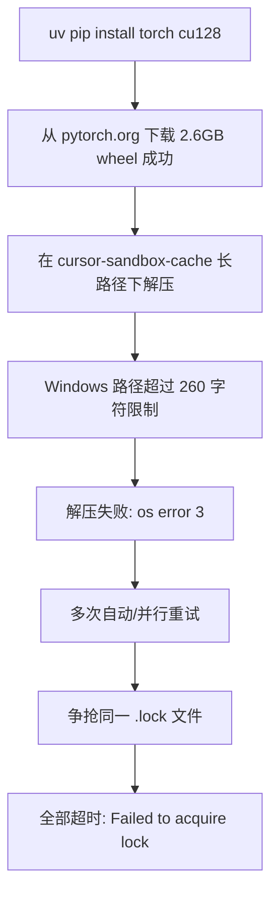

# Seed-VC 本地安装指南（uv 版）

> 适用场景：基于普通话人声特征替换粤语歌声的零样本歌声转换（SVC）  
> 目标模型：`seed-uvit-whisper-base`（V1，`inference.py` + `--f0-condition True`）  
> 包管理工具：**uv**（替代 pip / winget 安装 Python）  
> 最后更新：2026-07-21

---

## 1. 环境与路径

### 1.1 本机硬件评估

| 项目 | 本机配置 | 要求 | 评估 |
| --- | --- | --- | --- |
| GPU | NVIDIA GeForce RTX 5060 Laptop，8 GB 显存 | 6 GB+（推荐 8 GB+） | ✅ |
| GPU 架构 | Blackwell，sm_120 | 需 PyTorch cu128 | ⚠️ 必须 cu128 |
| 驱动 / CUDA | Driver 573.22，CUDA 12.8 | RTX 50 系需 12.8 | ✅ |
| CPU | Intel i7-13700HX | 无硬性要求 | ✅ |
| 内存 | ~16 GB | 建议 16 GB+ | ⚠️ 推理时偏紧 |
| 系统 | Windows 11 | Windows 10/11 | ✅ |

### 1.2 目录规划

| 项目 | 路径 |
| --- | --- |
| 工作区根目录 | `D:\code\voice-translate` |
| Seed-VC 代码仓库 | `D:\code\voice-translate\seed-vc` |
| Python 3.10 虚拟环境 | `D:\code\voice-translate\seed-vc-env` |
| 推理输出目录 | `D:\code\voice-translate\output` |
| 启动脚本 | `D:\code\voice-translate\scripts\start-seed-vc-webui.bat` |
| 关闭脚本 | `D:\code\voice-translate\scripts\stop-seed-vc-webui.bat` |
| uv 缓存（推荐） | `D:\uv-cache` |
| 模型权重（自动下载） | `D:\code\voice-translate\seed-vc\checkpoints\` |
| HF Hub 缓存（自动下载） | `D:\code\voice-translate\seed-vc\checkpoints\hf_cache\` |
| 微调 checkpoint（可选） | `D:\code\voice-translate\seed-vc\runs\` |
| 启动/关闭脚本 | `D:\code\voice-translate\scripts\` |

> **模型存放说明：** Seed-VC 源码硬编码了相对路径（`./checkpoints/`、`./checkpoints/hf_cache`），模型不会默认下载到 `C:\Users\<用户>\.cache\huggingface\`。  
> **必须在 `seed-vc` 目录下运行脚本**，否则模型会下载到当前工作目录而非仓库内：
>
> ```powershell
> cd D:\code\voice-translate\seed-vc   # ✅ 正确
> python app_svc.py --fp16 True
> ```

### 1.3 全局配置

| 配置项 | 值 | 作用域 | 影响范围 |
| --- | --- | --- | --- |
| `HF_ENDPOINT` | `https://hf-mirror.com` | 用户级环境变量（永久生效） | Hugging Face 模型下载（部分模型需临时取消，见 §7.2） |
| `NO_PROXY` | `127.0.0.1,localhost` | 用户级环境变量（**推荐永久设置**） | 防止代理拦截 localhost，避免 Gradio 502 |
| `HTTP_PROXY` / `HTTPS_PROXY` | `http://127.0.0.1:7897` | 用户级（本机已配置） | 系统代理，不影响 PyTorch 安装 |
| `UV_CACHE_DIR` | `D:\uv-cache` | 安装 PyTorch 前临时设置（推荐） | 仅 uv 包缓存，**不影响** HF 镜像 |

> `HF_ENDPOINT` **不影响** PyTorch 安装。PyTorch 从 `download.pytorch.org` 下载，与 HF 镜像无关。  
> 本机已配置 Clash 等代理（`127.0.0.1:7897`），**必须**设置 `NO_PROXY` 排除 localhost，否则 Gradio Web UI 启动自检会返回 502。

---

## 2. 为什么使用 uv 而非 pip

| 对比项 | pip | uv |
| --- | --- | --- |
| Python 版本管理 | 需 winget / 手动安装 | `uv python install 3.10` 一键安装 |
| 依赖安装速度 | 较慢 | 显著更快 |
| 与 Seed-VC 兼容性 | 官方文档默认 | 通过 `uv pip install` 完全兼容 `requirements.txt` |
| PyTorch 自定义源 | `--index-url` | 同样支持 `uv pip install --index-url` |

**结论：** uv 是 pip 的加速替代，不改变 Seed-VC 的依赖声明方式，推荐在本机使用。

---

## 3. Python 3.10 与 3.12 共存说明

本机已安装 Python 3.12，安装 Python 3.10 **不会产生冲突**：

- 两个版本由 `py` 启动器或 uv 分别管理，互不覆盖。
- Seed-VC 使用独立虚拟环境 `seed-vc-env`，依赖（含 PyTorch）仅安装在该 venv 内。
- 未激活 venv 时，系统默认 `python` 仍可能指向 3.12，不影响其他项目。

**操作习惯：**

```powershell
# 每次使用 Seed-VC 前必须先激活虚拟环境
D:\code\voice-translate\seed-vc-env\Scripts\activate
python --version   # 应显示 3.10.x
```

---

## 4. 安装步骤

### 步骤 1：安装 Python 3.10（uv）

```powershell
uv python install 3.10
```

验证：

```powershell
uv python list
# 应看到 cpython-3.10.x-windows-x86_64-none
```

### 步骤 2：创建虚拟环境

```powershell
uv venv --python 3.10 D:\code\voice-translate\seed-vc-env
D:\code\voice-translate\seed-vc-env\Scripts\activate
python --version   # 应显示 Python 3.10.x
```

### 步骤 3：配置环境变量（用户级）

```powershell
# Hugging Face 镜像（加速大部分模型下载）
[Environment]::SetEnvironmentVariable("HF_ENDPOINT", "https://hf-mirror.com", "User")

# 排除 localhost，防止代理导致 Gradio 502（本机有代理时必设）
[Environment]::SetEnvironmentVariable("NO_PROXY", "127.0.0.1,localhost", "User")
[Environment]::SetEnvironmentVariable("no_proxy", "127.0.0.1,localhost", "User")
```

设置后**重新打开终端**，验证：

```powershell
echo $env:HF_ENDPOINT   # https://hf-mirror.com
echo $env:NO_PROXY      # 127.0.0.1,localhost
```

> **注意：** `nvidia/bigvgan` 等部分模型不在 HF 镜像站上。首次启动 Web UI 或遇到 `FileMetadataError` 时，需临时取消镜像（见 §7.2）。

### 步骤 4：安装 PyTorch（CUDA 12.8）

RTX 5060（sm_120）**必须**使用 cu128 版本，不能使用 cu121 / cu124。

> ⚠️ **Windows 特别注意：** torch wheel 约 2.6 GB，在 Cursor 沙箱默认缓存路径下解压可能因路径过长而失败。安装前务必设置短缓存路径，且**只运行一次**安装命令（详见 [§4.1](#41-pytorch-cu128-安装失败分析与修复windows)）。

**推荐安装流程：**

```powershell
# 1. 确保 venv 已激活
D:\code\voice-translate\seed-vc-env\Scripts\activate

# 2. 设置短缓存路径（避免 Windows 路径过长）
$env:UV_CACHE_DIR = "D:\uv-cache"

# 3. 确认无其他 uv 进程在运行
Get-Process uv -ErrorAction SilentlyContinue

# 4. 安装 PyTorch（不要并行重复执行）
uv pip install torch torchvision torchaudio --index-url https://download.pytorch.org/whl/cu128
```

**若 uv 仍失败，改用 pip（Windows 上通常更稳定）：**

```powershell
D:\code\voice-translate\seed-vc-env\Scripts\activate
pip install torch torchvision torchaudio --index-url https://download.pytorch.org/whl/cu128
```

验证 GPU：

```powershell
python -c "import torch; print('PyTorch:', torch.__version__); print('CUDA:', torch.cuda.is_available()); print('GPU:', torch.cuda.get_device_name(0) if torch.cuda.is_available() else 'N/A')"
```

期望输出：

```
PyTorch: 2.x.x+cu128
CUDA: True
GPU: NVIDIA GeForce RTX 5060 Laptop GPU
```

若报错 `sm_120 is not compatible`，改用 nightly：

```powershell
uv pip install --pre torch torchvision torchaudio --index-url https://download.pytorch.org/whl/nightly/cu128
# 或 pip 等效命令
```

### 4.1 PyTorch cu128 安装失败分析与修复（Windows）

本机首次安装失败的实际日志分析（2026-07-20）。

#### 失败现象

| 阶段 | 错误信息 |
| --- | --- |
| 首次安装（~60 分钟后） | `Failed to extract archive: torch-2.11.0+cu128-...whl` → `系统找不到指定的路径。 (os error 3)` |
| 后续重试（10+ 次） | `Failed to acquire lock on the client cache` → `Timeout (600s) when waiting for lock` |

#### 是否与 HF_ENDPOINT 镜像有关？

**无关。** 对比：

| 对比项 | PyTorch 安装 | HF 镜像 |
| --- | --- | --- |
| 下载源 | `download.pytorch.org/whl/cu128` | `huggingface.co` / 镜像站 |
| 环境变量 | `--index-url` 指定 | `HF_ENDPOINT` 仅影响 Hugging Face |
| 实际日志 | `Resolved 14 packages` → `Downloading torch (2.6GiB)` 成功 | 若是镜像问题会报 HTTP 404 / 连接失败 |

首次安装已从 PyTorch 官方源成功开始下载，失败发生在**本地解压**阶段，不是网络或镜像问题。

#### 根因分析



1. **根因 — Windows 路径过长：** torch wheel 解压路径类似 `C:\Users\...\cursor-sandbox-cache\...\uv\.tmp...\torch/lib/cufftw64_11.dll`，超过 Windows 默认 260 字符限制。
2. **连锁原因 — 并行安装冲突：** 第一次失败后同一命令被重复触发 10+ 次，争抢 `torch-2.11.0+cu128-cp310-cp310-win_amd64.lock`，即使 `UV_LOCK_TIMEOUT=600` 也无法成功。

#### 修复步骤

**步骤 A：清理残留（确认无 uv 进程后执行）**

```powershell
Get-Process uv -ErrorAction SilentlyContinue   # 应无输出
Remove-Item "D:\uv-cache" -Recurse -Force -ErrorAction SilentlyContinue
Remove-Item "$env:LOCALAPPDATA\Temp\cursor-sandbox-cache" -Recurse -Force -ErrorAction SilentlyContinue
```

**步骤 B：设置短缓存路径并安装（只执行一次）**

```powershell
D:\code\voice-translate\seed-vc-env\Scripts\activate
$env:UV_CACHE_DIR = "D:\uv-cache"
uv pip install torch torchvision torchaudio --index-url https://download.pytorch.org/whl/cu128
```

**步骤 C：若 uv 仍失败，改用 pip**

```powershell
D:\code\voice-translate\seed-vc-env\Scripts\activate
pip install torch torchvision torchaudio --index-url https://download.pytorch.org/whl/cu128
```

**步骤 D（可选）：开启 Windows 长路径支持**

需管理员权限，一劳永逸解决深层路径问题：

```powershell
New-ItemProperty -Path "HKLM:\SYSTEM\CurrentControlSet\Control\FileSystem" `
  -Name "LongPathsEnabled" -Value 1 -PropertyType DWORD -Force
```

修改后需重启系统生效。

### 步骤 5：克隆本仓库并安装依赖

```powershell
cd D:\code
git clone https://github.com/lastfore/voice-translate.git
cd voice-translate\seed-vc
uv pip install -r requirements.txt
```

> `seed-vc` 源码已纳入本仓库（模型权重除外，首次运行自动下载）。上游参考 [Plachta/seed-vc](https://github.com/Plachtaa/seed-vc)（已归档，但预训练模型仍可用）。

### 步骤 6：Web UI 启动验证

**推荐：使用项目启动脚本**

```cmd
D:\code\voice-translate\scripts\start-seed-vc-webui.bat
```

关闭：

```cmd
D:\code\voice-translate\scripts\stop-seed-vc-webui.bat
```

**或手动启动（PowerShell）：**

```powershell
Remove-Item Env:HF_ENDPOINT -ErrorAction SilentlyContinue   # 首次下载 BigVGAN 等需直连
$env:NO_PROXY = "127.0.0.1,localhost"
$env:no_proxy = "127.0.0.1,localhost"
cd D:\code\voice-translate\seed-vc
D:\code\voice-translate\seed-vc-env\Scripts\python.exe app_svc.py --fp16 True
```

**或手动启动（cmd）：**

```cmd
set HF_ENDPOINT=
set NO_PROXY=127.0.0.1,localhost
set no_proxy=127.0.0.1,localhost
cd /d D:\code\voice-translate\seed-vc
call D:\code\voice-translate\seed-vc-env\Scripts\activate.bat
python app_svc.py --fp16 True
```

浏览器访问：**http://127.0.0.1:7860/**

首次启动会自动下载约 3–5 GB 模型（部分走 HF 镜像，部分需直连）：

- `seed-uvit-whisper-base` 扩散模型（~200M）
- Whisper-base 语义编码器
- BigVGAN 声码器（44.1kHz）
- CampPlus 声纹提取器

**验证通过标准：**

- [ ] 页面正常打开，无 CUDA / sm_120 报错
- [ ] 模型加载完成，界面可上传音频

**禁止运行：**

```powershell
# 会同时加载 V1 + V2 全部模型，8 GB 显存极易 OOM
python app.py --enable-v1 --enable-v2
```

---

## 5. 日常使用

### 5.1 Web UI 启动与关闭

访问地址：**http://127.0.0.1:7860/**

#### 快速命令（推荐）

| 操作 | 命令 |
| --- | --- |
| 启动 | `D:\code\voice-translate\scripts\start-seed-vc-webui.bat` |
| 关闭 | `D:\code\voice-translate\scripts\stop-seed-vc-webui.bat` |

#### 启动

**方式 A：启动脚本（cmd）**

```cmd
D:\code\voice-translate\scripts\start-seed-vc-webui.bat
```

**方式 B：手动启动（cmd）**

```cmd
set HF_ENDPOINT=
set NO_PROXY=127.0.0.1,localhost
set no_proxy=127.0.0.1,localhost
cd /d D:\code\voice-translate\seed-vc
call D:\code\voice-translate\seed-vc-env\Scripts\activate.bat
python app_svc.py --fp16 True
```

**方式 C：手动启动（PowerShell）**

```powershell
Remove-Item Env:HF_ENDPOINT -ErrorAction SilentlyContinue
$env:NO_PROXY = "127.0.0.1,localhost"
$env:no_proxy = "127.0.0.1,localhost"
cd D:\code\voice-translate\seed-vc
D:\code\voice-translate\seed-vc-env\Scripts\python.exe app_svc.py --fp16 True
```

> 首次启动或模型未下载完整时，`HF_ENDPOINT` 需留空以直连 Hugging Face；模型就绪后可在其他场景恢复镜像加速。

#### 关闭

**方式 A：关闭脚本（cmd）**

```cmd
D:\code\voice-translate\scripts\stop-seed-vc-webui.bat
```

**方式 B：手动关闭（cmd）——按端口查找并结束进程**

```cmd
for /f "tokens=5" %a in ('netstat -ano ^| findstr "127.0.0.1:7860" ^| findstr "LISTENING"') do taskkill /PID %a /F
```

> 在 `.bat` 脚本中写 `for` 循环时，`%a` 需写成 `%%a`（见 `scripts\stop-seed-vc-webui.bat`）。

**方式 C：手动关闭（PowerShell）**

```powershell
Get-NetTCPConnection -LocalPort 7860 -State Listen -ErrorAction SilentlyContinue |
  ForEach-Object { Stop-Process -Id $_.OwningProcess -Force }
```

**方式 D：在启动窗口中关闭**

在运行 `start-seed-vc-webui.bat` 的 cmd 窗口按 `Ctrl + C`，或直接关闭该窗口。

#### 检查运行状态

**cmd：**

```cmd
netstat -ano | findstr "127.0.0.1:7860"
```

**PowerShell：**

```powershell
curl.exe -s -o NUL -w "HTTP %{http_code}`n" http://127.0.0.1:7860/
```

返回 `HTTP 200` 且 `netstat` 有 `LISTENING` 记录，表示 Web UI 正在运行。

### 5.2 命令行推理（歌声转换）

| 文件 | 要求 |
| --- | --- |
| 源粤语歌声（`--source`） | 干净干声，无伴奏/和声/混响，WAV，44.1kHz 或 48kHz |
| 普通话参考干声（`--target`） | 1–30 秒清晰普通话说话或歌唱，无背景噪音 |

```powershell
python inference.py `
  --source "D:\path\to\源粤语歌声.wav" `
  --target "D:\path\to\普通话参考干声.wav" `
  --output "D:\code\voice-translate\output" `
  --diffusion-steps 40 `
  --f0-condition True `
  --fp16 True
```

### 5.3 推荐参数（RTX 5060 8GB）

| 参数 | 质量优先 | 速度优先 |
| --- | --- | --- |
| `--diffusion-steps` | 40 | 25 |
| `--fp16` | True（必须） | True（必须） |
| `--f0-condition` | True（必须） | True（必须） |
| `--semi-tone-shift` | 0（按需 -12 ~ +12） | 0 |
| 预计单首耗时 | 5–8 分钟 | 2–4 分钟 |
| 预计显存占用 | ~6–7 GB | ~5–6 GB |

---

## 6. 可选：微调（后续再做）

零样本声纹相似度不够时，可用少量普通话干声微调：

```powershell
python train.py `
  --config configs/presets/config_dit_mel_seed_uvit_whisper_base_f0_44k.yml `
  --dataset-dir "D:\path\to\普通话干声数据集" `
  --run-name my-voice-finetune `
  --batch-size 1 `
  --max-steps 100 `
  --num-workers 0
```

- 数据集：每条 1–30 秒，至少 1 条，支持 `.wav` / `.flac` / `.mp3`
- 8 GB 显存建议 `--batch-size 1`
- checkpoint 输出：`./runs/my-voice-finetune/ft_model.pth`

---

## 7. 故障排查

| 现象 | 处理方式 |
| --- | --- |
| Gradio 502 / `startup-events failed` | 设置 `NO_PROXY=127.0.0.1,localhost`（见 §7.2） |
| `FileMetadataError` / 资源不在 huggingface.co | 临时 `set HF_ENDPOINT=` 直连下载（见 §7.2） |
| `IncompleteRead` 模型下载中断 | 网络不稳定，重新运行即可（支持断点续传） |
| cmd 中 `pip` 找不到 | uv venv 无 `pip.exe`，用 `uv pip` 或 `python -m pip`（见 §7.2） |
| PyTorch 解压失败 `os error 3` | 设置 `$env:UV_CACHE_DIR = "D:\uv-cache"`；或改用 `pip install`（见 §4.1） |
| `Failed to acquire lock on the client cache` | 确认无其他 uv 进程；清理缓存和 `.lock` 文件；**不要并行重复安装**（见 §4.1） |
| CUDA OOM（显存不足） | 降低 `--diffusion-steps` 至 20–30；确保 `--fp16 True`；仅加载 SVC 模型 |
| `sm_120 is not compatible` | 安装 cu128 或 nightly 版 PyTorch（见步骤 4） |
| Hugging Face 下载失败 | 检查 `HF_ENDPOINT` 与代理；部分模型需临时取消镜像 |
| 推理速度慢 | 笔记本 GPU 功耗受限属正常；可降至 `--diffusion-steps 25` |
| 输出有电音/断裂 | 检查源音频是否含伴奏；参考音频是否足够清晰 |
| 内存不足 | 关闭浏览器、IDE 等；保留 4–6 GB 给系统 |
| 用错 Python 版本 | 确认已 `activate` venv，`python --version` 为 3.10.x |
| 模型下载到错误位置 | 确认在 `seed-vc` 目录下运行脚本（见 §1.2） |

### 7.2 cmd 运行失败与代理排错

本机实测（2026-07-21）：**cmd 本身可正常工作**，失败由环境变量和命令写法导致。

#### 本机代理配置

| 变量 | 当前值 | 影响 |
| --- | --- | --- |
| `HTTP_PROXY` | `http://127.0.0.1:7897` | 全局 HTTP 代理 |
| `HTTPS_PROXY` | `http://127.0.0.1:7897` | 全局 HTTPS 代理 |
| `ALL_PROXY` | `socks5://127.0.0.1:7897` | 全局 SOCKS 代理 |
| `NO_PROXY` | 需设为 `127.0.0.1,localhost` | 未设置时代理会拦截 localhost |

实测：不设 `NO_PROXY` 时访问 `http://127.0.0.1:7860/` 返回 **502**；设置后返回 **200**。

#### 失败原因与修复对照

| 现象 | 真正原因 | 修复 |
| --- | --- | --- |
| Gradio 502 | 代理未排除 localhost | 设置 `NO_PROXY=127.0.0.1,localhost` |
| `FileMetadataError` | `nvidia/bigvgan` 等不在 HF 镜像站 | 启动前 `set HF_ENDPOINT=` |
| `IncompleteRead` | 大文件下载中断（网络/代理） | 重新运行，支持断点续传 |
| `pip` 找不到 | uv venv 默认无 `pip.exe` | 使用 `uv pip` 或 `python -m pip` |
| PowerShell 引号错误 | `cmd /c` 嵌套引号被 PS 解析 | 用 `.bat` 或在 cmd 窗口直接运行 |

#### 推荐 cmd 启动命令

```cmd
@echo off
set HF_ENDPOINT=
set NO_PROXY=127.0.0.1,localhost
set no_proxy=127.0.0.1,localhost
cd /d D:\code\voice-translate\seed-vc
call D:\code\voice-translate\seed-vc-env\Scripts\activate.bat
python app_svc.py --fp16 True
```

> 模型全部下载完成后，可恢复 `HF_ENDPOINT=https://hf-mirror.com` 加速后续更新。日常启动推荐使用 `scripts\start-seed-vc-webui.bat`。

---

## 8. 安装进度检查清单

执行安装时，按顺序勾选：

- [ ] **步骤 1** — `uv python install 3.10`
- [ ] **步骤 2** — 创建 `seed-vc-env` 虚拟环境
- [ ] **步骤 3** — 设置用户级 `HF_ENDPOINT`
- [ ] **步骤 4** — 安装 PyTorch cu128 并验证 GPU
- [ ] **步骤 5** — 克隆 `voice-translate` + `uv pip install -r seed-vc/requirements.txt`
- [ ] **步骤 6** — Web UI 启动验证通过

### 当前状态（2026-07-21）

| 步骤 | 状态 | 说明 |
| --- | --- | --- |
| 步骤 1 | ✅ 已完成 | Python 3.10.20（uv 管理） |
| 步骤 2 | ✅ 已完成 | `seed-vc-env` 已创建 |
| 步骤 3 | ✅ 已完成 | `HF_ENDPOINT` + `NO_PROXY` 用户级配置 |
| 步骤 4 | ✅ 已完成 | PyTorch 2.11.0+cu128，CUDA 可用 |
| 步骤 5 | ✅ 已完成 | voice-translate 已 clone，`seed-vc` 源码在库内，依赖已安装 |
| 步骤 6 | ✅ 已完成 | Web UI 可在 `http://127.0.0.1:7860/` 访问 |

---

## 9. 预计耗时

| 阶段 | 耗时 |
| --- | --- |
| Python 3.10 + venv | ~5 分钟（已完成） |
| PyTorch cu128 | ~10–15 分钟 |
| clone + 依赖 | ~5–10 分钟 |
| 首次 Web UI + 模型下载 | ~20–30 分钟 |
| **剩余合计** | **约 35–55 分钟** |

---

## 10. 参考链接

- [Seed-VC 官方仓库](https://github.com/Plachtaa/seed-vc)（已归档）
- [PyTorch cu128 安装说明](https://download.pytorch.org/whl/cu128)
- [uv 官方文档](https://docs.astral.sh/uv/)
- [Hugging Face 镜像站](https://hf-mirror.com)
- 本项目调研报告：`docs/基于普通话人声特征替换粤语歌声的跨语种歌声转换技术调研报告.md`
