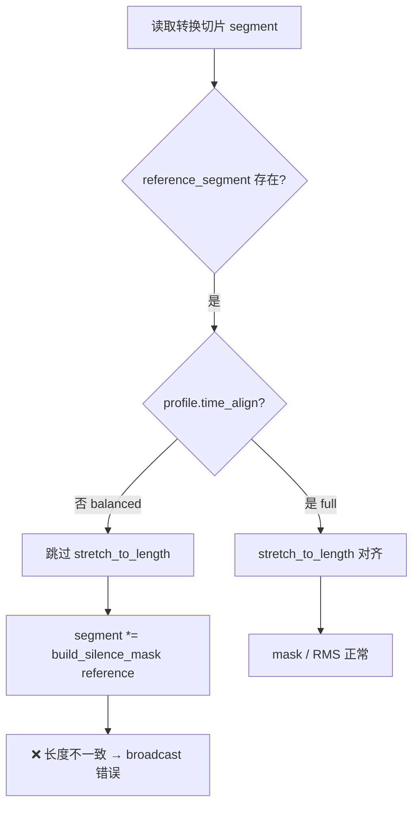
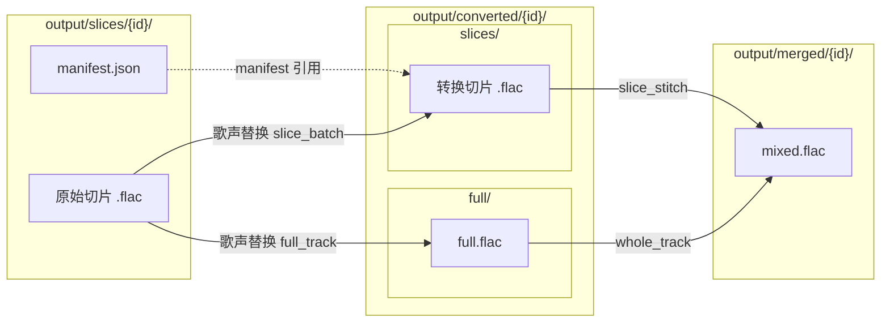
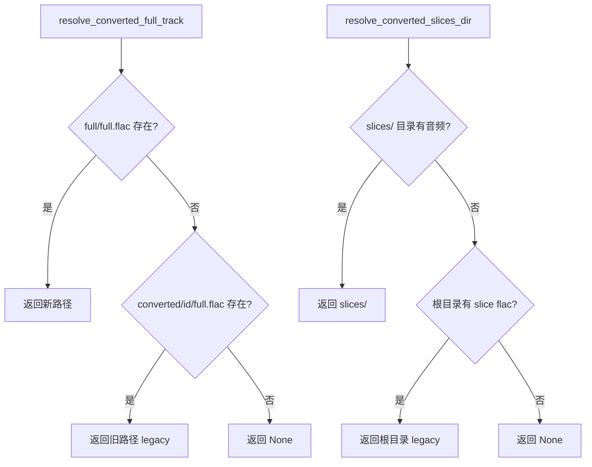
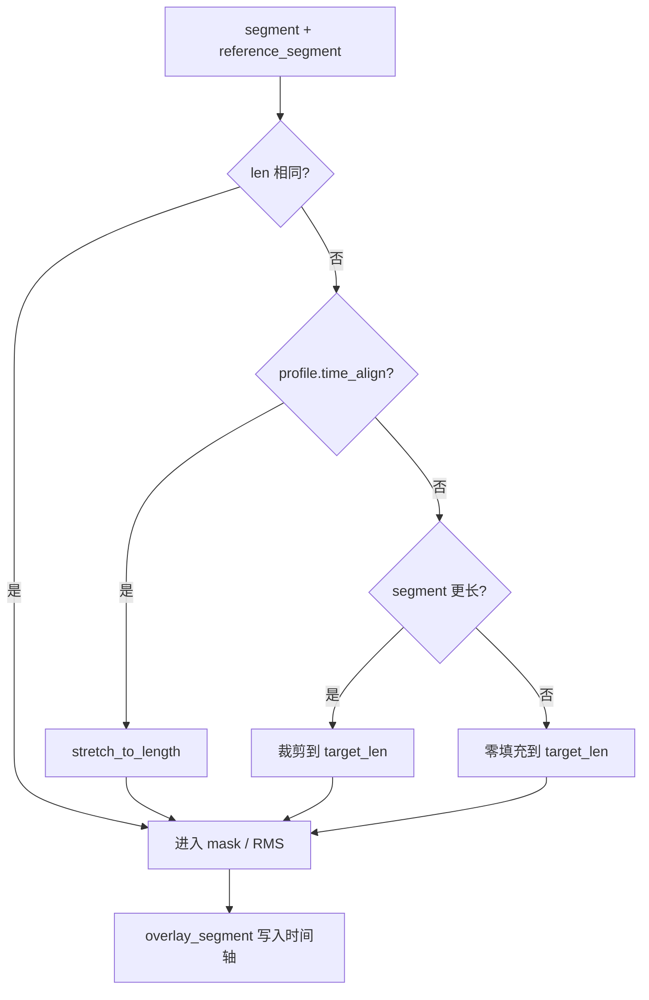
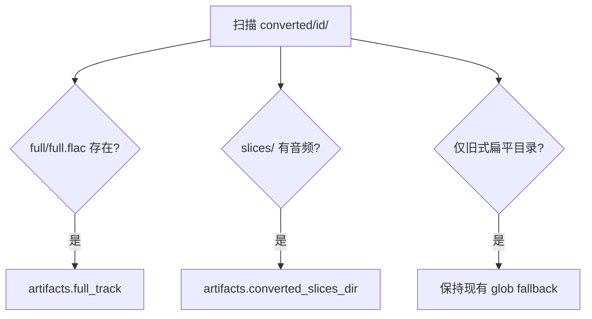

# converted 产物目录改造与合并修复方案

> **关联文档：** [管线WebUI设计方案.md](./管线WebUI设计方案.md)、[人声伴奏结合安装指南.md](./人声伴奏结合安装指南.md)  
> **版本：** v0.1  
> **日期：** 2026-07-24  
> **状态：** 待实施

---

## 1. 背景与动机

### 1.1 现状

当前转换阶段产物统一写入扁平目录：

```
output/converted/{project_id}/
├── full.flac              # 整轨快捷模式
├── *_slice_000.flac       # 批量切片转换
├── *_slice_001.flac
└── ...
```

整轨文件与切片文件混放在同一目录，带来以下问题：

| 问题 | 表现 | 影响 |
|------|------|------|
| 目录语义不清 | `full.flac` 与切片 `.flac` 共存 | Web UI / CLI 容易选错输入路径 |
| 合并 quick profile 歧义 | 目录内多个音频文件 | 报错「directory has N audio files; provide --manifest...」 |
| 扫描推断困难 | `scan_and_repair` 难以区分模式 | 项目状态与 artifacts 推断不准确 |
| 部分转换 + 回退 | 仅转换部分切片，其余用原始切片 | `balanced` profile 下长度不一致导致合并崩溃 |

### 1.2 第二期测试暴露的合并缺陷（D2）

在 `mysong` 项目上，`slice_stitch` + `profile=balanced` 时出现：

```
operands could not be broadcast together with shapes (86016,) (86083,) (86016,)
```

**根因：** `balanced` profile 配置为 `time_align=False`，但 `silence_mask=True`、`rms_match=True`。当转换切片与原始切片长度不一致时，`build_from_slices()` 在未做长度对齐的情况下直接执行 mask / RMS 运算，触发 NumPy 广播错误。



### 1.3 目标

1. 在 `converted/{id}/` 下引入 `full/` 与 `slices/` 子目录，物理隔离两种产物
2. 修复 `merge-audio.py` 在「部分转换 + 原始切片回退」场景下的长度对齐问题
3. 保持对旧式扁平布局的向后兼容
4. 同步更新路径解析、转换写入、Web UI 默认值与测试

### 1.4 非目标

- 不改动 `output/slices/`（原始切片）的目录结构
- 不改动 `output/merged/` 的目录结构
- 不在本期强制迁移所有历史项目（提供可选迁移脚本）

---

## 2. 方案评估

### 2.1 结论

**可行，建议实施。**

子目录方案与现有管线分层一致，改动可集中在 `pipeline/paths.py` 统一解析，其余模块调用 API 即可。

### 2.2 优点

| 维度 | 说明 |
|------|------|
| 职责清晰 | 整轨与切片产物物理隔离，合并时目录语义单一 |
| 合并逻辑简化 | `slice_stitch` 固定读 `slices/`，`whole_track` 固定读 `full/full.flac` |
| 运维友好 | 可单独清理、备份或重跑某一类产物 |
| 消除歧义 | `quick` profile 不再因目录内混入 `full.flac` 而报错 |
| 与 D2 根因一致 | 混放导致的模式误判与长度对齐缺失可一并解决 |

### 2.3 风险与对策

| 风险 | 对策 |
|------|------|
| 旧项目仍为扁平布局 | 新路径优先 + 旧路径 fallback；`scan_and_repair` 双轨推断 |
| 改动面较广 | 路径层集中封装，分阶段实施并回归测试 |
| 已有混放数据（如 `mysong`） | 提供 `scripts/migrate-converted-layout.py` 可选迁移 |

### 2.4 不建议的做法

- 继续在 `converted/{id}/` 根目录同时存放整轨与切片
- 将 `full.flac` 放入 `slices/` 子目录
- 仅改 Web UI 文案而不改写入路径（无法从根本上消除混放）

---

## 3. 目标目录结构

### 3.1 新布局

```
output/
├── slices/{project_id}/           # 原始切片（不变）
│   ├── manifest.json
│   └── *_slice_*.flac
├── converted/{project_id}/        # 转换产物（改造后）
│   ├── full/
│   │   └── full.flac              # 整轨快捷模式
│   └── slices/
│       ├── *_slice_000.flac       # 批量转换（与 manifest 文件名一致）
│       └── *_slice_001.flac
└── merged/{project_id}/           # 合并产物（不变）
    └── mixed.flac
```

### 3.2 与现有结构对照



### 3.3 合并模式与输入路径映射

| 合并模式 | 人声输入路径 | 说明 |
|----------|-------------|------|
| `whole_track`（整轨合并） | `converted/{id}/full/full.flac` | 单文件，忽略 manifest |
| `slice_stitch`（切片拼接） | `converted/{id}/slices/` | 目录 + manifest，缺失切片回退原始 |

---

## 4. 路径层改造

### 4.1 新增 API（`pipeline/paths.py`）

| 函数 | 返回值 | 说明 |
|------|--------|------|
| `converted_full_dir(id)` | `converted/{id}/full/` | 整轨产物目录 |
| `converted_slices_dir(id)` | `converted/{id}/slices/` | 切片产物目录 |
| `converted_full_track_path(id)` | `converted/{id}/full/full.flac` | **变更**：由根目录移至 `full/` |
| `resolve_converted_full_track(id)` | `Path \| None` | 新布局 → 旧布局 fallback |
| `resolve_converted_slices_dir(id)` | `Path \| None` | 新布局 → 旧布局 fallback |

### 4.2 解析逻辑



### 4.3 参考实现

```python
def converted_full_dir(project_id: str) -> Path:
    return converted_dir(project_id) / "full"

def converted_slices_dir(project_id: str) -> Path:
    return converted_dir(project_id) / "slices"

def converted_full_track_path(project_id: str) -> Path:
    return converted_full_dir(project_id) / "full.flac"

def resolve_converted_full_track(project_id: str) -> Path | None:
    new = converted_full_track_path(project_id)
    if new.is_file():
        return new
    legacy = converted_dir(project_id) / "full.flac"
    return legacy if legacy.is_file() else None

def resolve_converted_slices_dir(project_id: str) -> Path | None:
    new = converted_slices_dir(project_id)
    if new.is_dir() and _dir_has_audio(new):
        return new
    legacy = converted_dir(project_id)
    if legacy.is_dir() and _dir_has_slice_flacs(legacy):
        return legacy
    return None
```

辅助函数 `_dir_has_audio`、`_dir_has_slice_flacs`：判断目录内是否存在音频文件；切片目录排除单独的 `full.flac`。

---

## 5. merge-audio.py 长度对齐修复

### 5.1 问题复现条件

- 合并模式：`slice_stitch`
- Profile：`balanced` 或任何 `time_align=False` 且启用 `silence_mask` / `rms_match` 的配置
- 转换产物：仅部分切片存在，其余回退到 `output/slices/{id}/` 原始切片
- 转换切片与原始切片采样长度不一致（Seed-VC 输出边界差异）

### 5.2 修复策略

在 `build_from_slices()` 循环内，于 `silence_mask` / `rms_match` **之前**统一 segment 长度：

| Profile | 长度不一致时的处理 |
|---------|-------------------|
| `full`（`time_align=True`） | `stretch_to_length` 时间拉伸对齐（保持现有行为） |
| `balanced` / `quick`（`time_align=False`） | **不拉伸**：裁剪或零填充到 `reference_segment` 长度，避免广播错误 |



### 5.3 参考实现

```python
def _align_segment_to_reference(
    segment: np.ndarray,
    reference_segment: np.ndarray | None,
    profile: Profile,
) -> np.ndarray:
    if reference_segment is None:
        return segment
    target_len = len(reference_segment)
    if len(segment) == target_len:
        return segment
    if profile.time_align:
        return stretch_to_length(segment, TARGET_SR, target_len)
    if len(segment) > target_len:
        return segment[:target_len]
    return np.pad(segment, (0, target_len - len(segment)))
```

在 `build_from_slices()` 中，于 mask / RMS 前调用：

```python
segment = _align_segment_to_reference(segment, reference_segment, profile)
```

### 5.4 build_vocal_track 补充

- `vocals.is_file()` → 整轨模式，清空 manifest（**已实现**）
- `vocals.is_dir()` → 切片模式；推荐调用方传入 `converted/{id}/slices/`，避免旧式根目录歧义
- 若传入旧式 `converted/{id}/` 根目录：优先检测 `slices/` 子目录；若仅含 `full.flac` 则走整轨

---

## 6. 各模块改动清单

### 6.1 转换阶段写入

**`pipeline/stages/convert.py`**

| 模式 | 输出路径 |
|------|----------|
| `full_track` | `converted_full_track_path(id)` → `.../full/full.flac` |
| `slice_batch` | `converted_slices_dir(id)` → `.../slices/*.flac` |

`ConvertResult.converted_dir` 语义：

- 整轨：项目根 `converted/{id}/`，`full_track` 指向 `full/full.flac`
- 批量：`converted_dir` 为 `converted_slices_dir(id)`

**`scripts/convert-slices.py`**

- 默认 `--output` 改为 `output/converted/{name}/slices/`（或由调用方传入）

### 6.2 合并解析

**`pipeline/store.py` — `resolve_stage_inputs(MERGE)`**

```text
merge_mode == whole_track  → resolve_converted_full_track(pid)
merge_mode == slice_stitch → resolve_converted_slices_dir(pid)
```

**`pipeline/runner.py`**

- `vocals` 为文件时清空 manifest / slices_dir（已有）
- `vocals` 为 `slices/` 目录时显式传入 manifest 与原始 slices_dir

### 6.3 Web UI

**`webui/state.py` / `webui/pipeline_app.py`**

| 字段 | 新默认值 |
|------|----------|
| `merge_vocals_file` | `output/converted/{id}/full/full.flac` |
| `merge_vocals_dir` | `output/converted/{id}/slices/` |

同步更新 placeholder、向导步骤文案与 `_project_field_updates` 中的路径填充逻辑。

### 6.4 扫描与兼容

**`pipeline/store.py` — `scan_and_repair()`**



### 6.5 可选迁移脚本

**`scripts/migrate-converted-layout.py`**

对每个 `output/converted/{id}/`：

1. 若根目录存在 `full.flac` → 移动到 `full/full.flac`
2. 若根目录存在 `*_slice_*.flac` → 移动到 `slices/`
3. 不移动 `merged/` 等其他阶段产物

---

## 7. 实施顺序


| 阶段 | 内容 | 优先级 | 说明 |
|------|------|--------|------|
| 1 | `merge-audio.py` 长度对齐 | **P0** | 不依赖目录改造，可立即消除 D2 崩溃 |
| 2 | `paths.py` 新 API + fallback | P0 | 后续模块的统一入口 |
| 3 | `convert.py` 写入新路径 | P1 | 新产物走新布局 |
| 4 | `store.py` / `runner.py` | P1 | 合并输入解析 |
| 5 | Web UI 默认路径 | P1 | 用户可见路径一致 |
| 6 | 迁移脚本 + `scan_and_repair` | P2 | 处理 `mysong` 等历史数据 |
| 7 | 测试与文档更新 | P1 | 回归 D1/D2/E1/E2 |

---

## 8. 测试计划

### 8.1 单元测试

| 文件 | 用例 |
|------|------|
| `tests/test_paths.py` | 新布局路径解析；legacy fallback |
| `tests/test_merge_partial.py` | 长度不一致 + `balanced` profile 不报错；整轨忽略 manifest |

### 8.2 集成测试（`tests/run_phase2_mysong.py`）

| 编号 | 场景 | 预期 |
|------|------|------|
| D1 | `whole_track` + `full/full.flac` | 无切片回退警告，合并成功 |
| D2 | `slice_stitch` + `converted/.../slices/` | 部分转换 + 原始回退，无 broadcast 错误 |
| E1 | `full_track` 转换过滤 batch 参数 | `limit` 等参数被忽略 |
| E2 | `slice_batch` 保留 `limit` | 批量参数生效 |

### 8.3 迁移验证

对 `mysong` 执行迁移后：

```
output/converted/mysong/
├── full/full.flac
└── slices/
    ├── *_slice_000.flac
    ├── *_slice_001.flac
    └── *_slice_002.flac
```

确认 D1/D2 均可通过。

---

## 9. 文档同步

实施完成后需更新：

| 文档 | 更新内容 |
|------|----------|
| [人声伴奏结合安装指南.md](./人声伴奏结合安装指南.md) | 转换产物路径说明 |
| [管线WebUI设计方案.md](./管线WebUI设计方案.md) | `output/` 目录树与合并输入约定 |
| [管线WebUI开发记录.md](./管线WebUI开发记录.md) | 追加实施记录与测试结果 |

---

## 10. 工作量估算

| 模块 | 预估行数 |
|------|----------|
| `paths.py` + fallback | ~60 |
| `merge-audio.py` 对齐修复 | ~30 |
| `convert.py` + `convert-slices.py` | ~40 |
| `store.py` + `runner.py` | ~50 |
| `webui` 文案 / 默认路径 | ~30 |
| 迁移脚本 + 测试 | ~120 |
| **合计** | **约 300–350 行** |

---

## 11. 决策记录

| 日期 | 决策 | 理由 |
|------|------|------|
| 2026-07-24 | 采用 `full/` + `slices/` 子目录 | 消除混放歧义，与合并模式一一对应 |
| 2026-07-24 | `balanced` 不对齐时裁剪/填充而非拉伸 | 保持「不做 time stretch」的 profile 语义，仅满足 mask/RMS 长度要求 |
| 2026-07-24 | 保留 legacy fallback | 避免破坏已有项目与 `scan_and_repair` 推断 |
| 2026-07-24 | 迁移脚本可选、非强制 | 降低首期实施风险，用户可按需迁移 |
