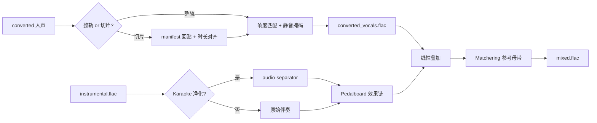
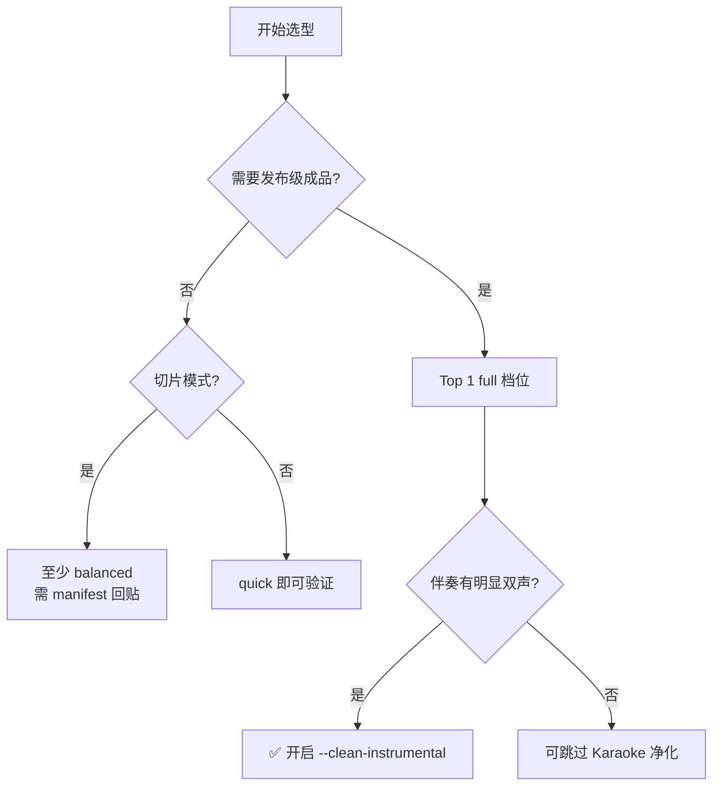
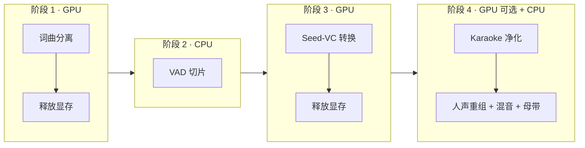
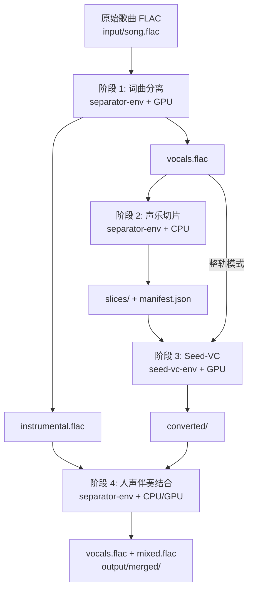
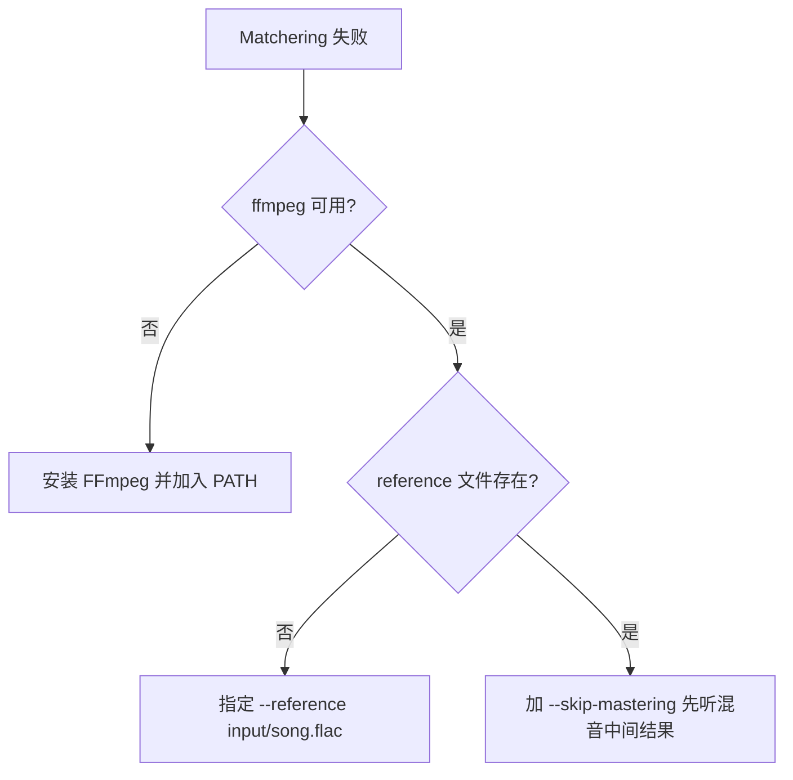
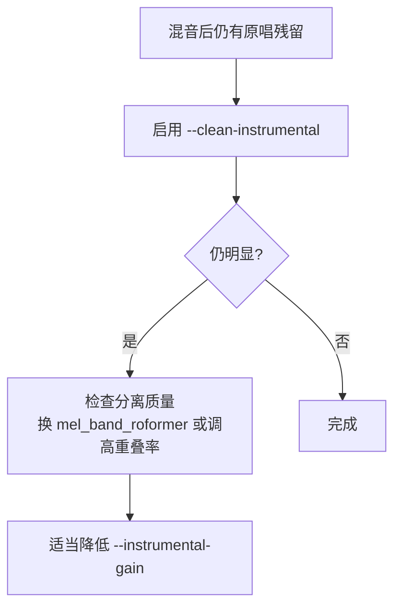

# 人声伴奏结合安装指南（改良版 Top 1）

> 适用场景：将 Seed-VC 转换后的人声（整轨或切片）与分离出的 `instrumental.flac` 重组，输出 `vocals.flac`（完整人声）与 `mixed.flac`（混音成品）  
> 核心框架：`merge-audio` + Pedalboard + pyloudnorm + Matchering +（可选）audio-separator Karaoke 净化  
> 运行环境：复用 `separator-env`（与词曲分离共用，**无需新建 venv**）  
> 包管理工具：**uv**  
> 最后更新：2026-07-23

---

## 1. 方案概述

本方案是 [人声伴奏结合技术调研报告](./人声伴奏结合技术调研报告.md) 中 **Top 1（DSP + AI 混合生产级管线）** 的改良落地版，针对本机硬件与 `voice-translate` 四阶段串行工作流做了裁剪与分步实施设计。



| 组件 | 选型 | 作用 |
| --- | --- | --- |
| 重组引擎 | `scripts/merge-audio.py` | 人声回贴、响度匹配、混音与写出 |
| 效果链 | `pedalboard` | EQ 雕刻、轻压缩、板式混响 |
| 响度测量 | `pyloudnorm` | LUFS 对齐原 `vocals.flac` |
| 参考母带 | `matchering` | 以原曲 mix 为参考匹配最终响度与频谱 |
| 时长对齐 | `pyrubberband` + Rubber Band CLI | 切片 VC 输出与原时长对齐（±5%） |
| 伴奏净化（可选） | `audio-separator` Karaoke 模型 | 降低伴奏中原始人声 bleed |
| 上游依赖 | 词曲分离 + Seed-VC | 提供 `instrumental.flac` 与转换人声 |

### 1.1 分阶段能力档位

脚本通过 `--profile` 切换三档能力，对应调研报告 Top 3，便于渐进落地：

| 档位 | 对应方案 | 启用能力 | 典型场景 |
| --- | --- | --- | --- |
| `quick` | Top 2 Hyper-RVC Lite | 线性叠加 + 可选轻混响 | 快速验证端到端 |
| `balanced` | Top 3 stem-voice-clone | + 静音掩码 + 逐片 RMS 匹配 + 切片回贴 | 日常 Cover 制作 |
| `full`（**默认**） | Top 1 DSP+AI 混合 | + 时长对齐 + Karaoke 净化 + Pedalboard + Matchering | 发布级成品 |

---

## 2. 方案选型理由

### 2.1 候选方案对比

调研报告给出了三个生产级方案，结合本机配置与上游管线评估如下：

| 方案 | 接缝自然 | 人声清晰 | 动态保真 | 本机适配 | 结论 |
| --- | --- | --- | --- | --- | --- |
| **Top 1** DSP+AI 混合 | ★★★★★ | ★★★★★ | ★★★★☆ | ✅ 串行 GPU | **推荐默认** |
| **Top 2** Hyper-RVC Lite | ★★★☆☆ | ★★★☆☆ | ★★★★☆ | ✅ 纯 CPU | 快速原型 / `--profile quick` |
| **Top 3** stem-voice-clone | ★★★★☆ | ★★★★☆ | ★★★★★ | ✅ 纯 CPU | `--profile balanced` |



### 2.2 选择改良 Top 1 的六个理由

**① 复用 separator-env，零额外环境成本**

重组阶段新增依赖（`pedalboard`、`pyloudnorm`、`matchering` 等）均为 CPU 库，与 `audio-separator`、`librosa` 无冲突，直接装入已有 `separator-env`，无需第三个 venv。

**② 解决伴奏人声残留（Bleed）**

MelBand-RoFormer 分离后 `instrumental.flac` 仍可能含 5%–15% 原唱。`full` 档位可选 Karaoke 模型二次净化，显著减轻「双声叠加」。

**③ 切片模式完整闭环**

Silero VAD 切片经 Seed-VC 逐片转换后，须按 `manifest.json` 时间戳回贴；`balanced` / `full` 档位提供静音掩码与 RMS 匹配，避免 SVC 幻觉底噪与句间音量跳变。

**④ 与 Seed-VC 采样率对齐**

Seed-VC 歌声转换固定 **44100 Hz**。重组脚本统一在内部将伴奏重采样至 44.1 kHz 再混音，避免音高/时长漂移。

**⑤ 四阶段串行，不抢 GPU**

Karaoke 净化（若启用）在 Seed-VC **结束之后**单独占用 GPU（~3.5 GB），与分离、转换阶段互不重叠：



**⑥ 双产物输出**

一次运行同时生成 `vocals.flac`（可单独导入 DAW 精修）与 `mixed.flac`（即听成品），满足「人声轨 + 混音成品」双需求。

---

## 3. 环境与路径

### 3.1 本机硬件评估

| 项目 | 本机配置 | 方案要求 | 评估 |
| --- | --- | --- | --- |
| GPU | NVIDIA GeForce RTX 5060 Laptop，8 GB | Karaoke 净化 ~3.5 GB（可选、串行） | ✅ |
| GPU 架构 | Blackwell，sm_120 | 需 PyTorch cu128（separator-env 已满足） | ✅ |
| 驱动 / CUDA | Driver 573.22，CUDA 12.8 | RTX 50 系需 12.8 | ✅ |
| CPU | Intel i7-13700HX（16C / 24T） | DSP + Matchering | ✅ |
| 内存 | ~16 GB | 整轨 5min @ 48kHz < 500 MB 峰值 | ✅ |
| 系统 | Windows 11 | Windows 10/11 | ✅ |

### 3.2 目录规划

| 项目 | 路径 |
| --- | --- |
| 工作区根目录 | `D:\code\voice-translate` |
| 重组运行环境 | `D:\code\voice-translate\separator-env`（复用） |
| 分离产物 | `D:\code\voice-translate\output\separated\` |
| 切片产物 | `D:\code\voice-translate\output\slices\` |
| Seed-VC 转换输出 | `D:\code\voice-translate\output\converted\` |
| **重组最终产物** | `D:\code\voice-translate\output\merged\` |
| 原始输入（母带参考） | `D:\code\voice-translate\input\` |
| 重组脚本 | `D:\code\voice-translate\scripts\merge-audio.py` |
| 相关文档 | `D:\code\voice-translate\docs\` |

**`output/merged/` 典型内容：**

```
output/merged/
├── vocals.flac                  # 重组后的完整转换人声
├── instrumental_clean.flac      # （full + --clean-instrumental）净化后伴奏
└── mixed.flac                   # 最终混音成品
```

### 3.3 前置条件

| 条件 | 说明 | 验证方式 |
| --- | --- | --- |
| 词曲分离已完成 | 存在 `output/separated/*instrumental*.flac` | 运行过 `scripts\separate-audio.bat` |
| Seed-VC 转换已完成 | `output/converted/` 下有对应人声文件 | Web UI 或 `inference.py` 已导出 |
| `separator-env` 可用 | 与 [词曲分离与声乐切片安装指南](./词曲分离与声乐切片安装指南.md) 一致 | `separator-env\Scripts\activate` 成功 |
| 切片模式额外要求 | `output/slices/manifest.json` 存在 | 见 [§5.3 切片模式](#53-切片模式) |

> `slice-vocals.py` 切片时会自动写出 `manifest.json`；重组使用 `scripts\merge-audio.bat`（见 [§5.1](#51-快速开始整轨模式)）。

### 3.4 全局环境变量

与上游阶段共用（若已配置可跳过）：

| 配置项 | 值 | 作用 |
| --- | --- | --- |
| `HF_ENDPOINT` | `https://hf-mirror.com` | 加速模型下载 |
| `NO_PROXY` | `127.0.0.1,localhost` | 防止代理拦截本地服务 |
| `UV_CACHE_DIR` | `D:\uv-cache` | 缩短 uv 缓存路径 |
| `AUDIO_SEPARATOR_MODEL_DIR` | `D:\code\voice-translate\separator-env\models\audio-separator` | Karaoke 模型权重目录 |

---

## 4. 安装步骤

> **前提：** 已完成 [词曲分离与声乐切片安装指南](./词曲分离与声乐切片安装指南.md) 中的 `separator-env` 创建与 PyTorch cu128 安装。以下步骤在已有环境中**追加**重组依赖。

### 步骤 1：激活环境

> **uv 是全局命令，不在 venv 内。** `uv` 安装在用户目录（如 `C:\Users\<用户>\.local\bin\uv.exe`），通过 PATH 调用；`separator-env\Scripts\` 下**没有** `uv.exe`。创建 venv 后应使用全局 `uv pip install ...` 往已激活的 venv 装包，或用 `--python` 指定解释器路径（见下方两种方式）。

```powershell
D:\code\voice-translate\separator-env\Scripts\activate
$env:UV_CACHE_DIR = "D:\uv-cache"
python --version   # 应显示 Python 3.10.x
where.exe uv       # 应指向 C:\Users\<用户>\.local\bin\uv.exe
```

### 步骤 2：安装重组 Python 依赖

**方式 A：激活 venv 后安装（推荐）**

```powershell
D:\code\voice-translate\separator-env\Scripts\activate
$env:UV_CACHE_DIR = "D:\uv-cache"

# 核心 DSP / 母带
uv pip install pedalboard pyloudnorm matchering

# 时长对齐（librosa 通常已随 audio-separator 安装）
uv pip install pyrubberband

# 若尚未安装 librosa / soundfile（separator-env 一般已有）
uv pip install librosa soundfile numpy
```

**方式 B：不激活 venv，直接指定 Python**

```powershell
$env:UV_CACHE_DIR = "D:\uv-cache"
uv pip install --python "D:\code\voice-translate\separator-env\Scripts\python.exe" `
  pedalboard pyloudnorm matchering pyrubberband librosa soundfile numpy
```

验证导入：

```powershell
python -c "import pedalboard, pyloudnorm, matchering, pyrubberband; print('OK')"
```

### 步骤 3：安装 Rubber Band CLI（时长对齐必需）

`pyrubberband` 依赖系统级 Rubber Band 可执行文件。

**方式 A：Chocolatey（推荐）**

```powershell
choco install rubberband -y
```

**方式 B：手动安装**

1. 从 [breakfastquay.com/rubberband](https://breakfastquay.com/rubberband/) 下载 Windows 版
2. 将 `rubberband.exe` 所在目录加入系统 `PATH`
3. 验证：

```powershell
rubberband --version
```

**方式 C：项目内已下载（本机当前状态）**

仓库已解压 Rubber Band 4.0.0 至：

```
tools/rubberband/rubberband-4.0.0-gpl-executable-windows/
├── rubberband.exe      # R2 引擎
├── rubberband-r3.exe   # R3 引擎
└── sndfile.dll
```

将上述目录加入系统 `PATH` 后，`pyrubberband` 即可调用原生 CLI；未入 PATH 时 `merge-audio.py` 会回退至 `librosa.effects.time_stretch`。

```powershell
# 临时加入 PATH（当前终端有效）
$env:PATH = "D:\code\voice-translate\tools\rubberband\rubberband-4.0.0-gpl-executable-windows;" + $env:PATH
rubberband --version   # 应显示 4.0.0
```

> 若暂不需要切片时长对齐，可使用 `--profile quick` 或 `balanced` 跳过 Rubber Band；`full` 档位在切片模式下建议安装并将 CLI 加入 PATH。

### 步骤 4：安装 FFmpeg（Matchering 与格式转换）

Matchering 与部分写出路径依赖 FFmpeg。若已按 [Seed-VC安装指南](./Seed-VC安装指南.md) 安装，可跳过。

```powershell
ffmpeg -version
```

未安装时：

```powershell
winget install Gyan.FFmpeg
# 或 choco install ffmpeg -y
```

### 步骤 5：（可选）预下载 Karaoke 净化模型

仅在 `full` 档位且启用 `--clean-instrumental` 时需要。首次运行会自动下载；可提前拉取以避免混音时等待。

> **本机状态（2026-07-23）：** `mel_band_roformer_karaoke_aufr33_viperx_sdr_10.1956.ckpt` 与对应 `_config.yaml` 已存在于 `separator-env\models\audio-separator\`，可跳过下载。

```powershell
$env:AUDIO_SEPARATOR_MODEL_DIR = "D:\code\voice-translate\separator-env\models\audio-separator"

audio-separator --list_models | Select-String -Pattern "karaoke"
```

常用模型（以 `audio-separator` 列表为准）：

| 模型文件名 | 用途 |
| --- | --- |
| `mel_band_roformer_karaoke_aufr33_viperx_sdr_10.1956.ckpt` | 从伴奏中进一步剔除 Lead Vocal 残留 |
| `mel_band_roformer_kim_ft_unwa.ckpt` | 已用于分离，**不用于**净化 |

---

## 5. 使用指南

### 5.1 快速开始（整轨模式）

适用于未切片、Seed-VC 直接转换整段 `vocals.flac` 的场景。

```powershell
# 1. 确保上游产物就绪
#    output/separated/song_(Instrumental)_*.flac
#    output/converted/song_vocals_converted.flac

# 2. 一键重组（full 档位）
scripts\merge-audio.bat `
  --vocals output\converted\song_vocals_converted.flac `
  --instrumental output\separated\song_(Instrumental)_mel_band_roformer_kim_ft_unwa.flac `
  --reference input\song.flac `
  --profile full
```

**输出：**

```
output/merged/vocals.flac
output/merged/mixed.flac
```

### 5.2 命令行参数说明

`merge-audio.py` 设计接口如下（与 `merge-audio.bat` 透传一致）：

| 参数 | 必填 | 说明 |
| --- | --- | --- |
| `--vocals` | ✅ | 转换后人声：整轨文件，或切片目录 / manifest 路径 |
| `--instrumental` | ✅ | 分离得到的伴奏 `instrumental.flac` |
| `--reference` | 推荐 | 原始混合曲（供 Matchering 参考）；`full` 档位强烈建议提供 |
| `--original-vocals` | 推荐 | 分离得到的原始 `vocals.flac`（响度匹配与静音掩码参考） |
| `-o` / `--output-dir` | 否 | 默认 `output/merged` |
| `--profile` | 否 | `quick` / `balanced` / `full`，默认 `full` |
| `--clean-instrumental` | 否 | 启用 Karaoke 模型净化伴奏（仅 `full`，需 GPU） |
| `--vocals-gain` | 否 | 人声音量微调（dB），默认 0 |
| `--instrumental-gain` | 否 | 伴奏音量微调（dB），默认 0 |
| `--skip-mastering` | 否 | 跳过 Matchering（调试时用） |

**示例：快速验证（不净化、不母带）**

```powershell
scripts\merge-audio.bat `
  --vocals output\converted\song_vocals_converted.flac `
  --instrumental output\separated\song_(Instrumental)_mel_band_roformer_kim_ft_unwa.flac `
  --profile quick `
  --skip-mastering
```

### 5.3 切片模式

适用于 `slice-vocals.bat` → 逐片 Seed-VC → 重组回贴流程。

**目录约定：**

```
output/slices/
├── song_slice_000.flac          # 原始切片（静音掩码参考）
├── song_slice_001.flac
├── ...
└── manifest.json                # 时间戳元数据

output/converted/
├── song_slice_000.flac          # 与切片同名之转换结果
├── song_slice_001.flac
└── ...
```

**`manifest.json` 格式（由 `slice-vocals.py` 写出）：**

```json
{
  "source": "output/separated/song_(Vocals)_mel_band_roformer_kim_ft_unwa.flac",
  "sample_rate": 44100,
  "fade_in_ms": 8,
  "fade_out_ms": 15,
  "slices": [
    {
      "id": "slice_000",
      "file": "song_slice_000.flac",
      "start_ms": 12500,
      "end_ms": 48200
    }
  ]
}
```

**重组命令：**

```powershell
scripts\merge-audio.bat `
  --vocals output\converted `
  --instrumental output\separated\song_(Instrumental)_mel_band_roformer_kim_ft_unwa.flac `
  --original-vocals output\separated\song_(Vocals)_mel_band_roformer_kim_ft_unwa.flac `
  --reference input\song.flac `
  --manifest output\slices\manifest.json `
  --profile full
```

`balanced` / `full` 档位将依次执行：读 manifest → 逐片时长对齐 → 静音掩码 → RMS 匹配 → 升余弦回贴 → 导出 `vocals.flac` → 与伴奏混音。

### 5.4 各档位处理链对照

| 处理步骤 | quick | balanced | full |
| --- | --- | --- | --- |
| 采样率统一至 44100 Hz | ✅ | ✅ | ✅ |
| 切片 manifest 回贴 | ❌ | ✅ | ✅ |
| 静音掩码 | ❌ | ✅ | ✅ |
| 逐片 RMS 匹配 | ❌ | ✅ | ✅ |
| RubberBand 时长对齐 | ❌ | ❌ | ✅ |
| Karaoke 伴奏净化 | ❌ | ❌ | ✅（需 `--clean-instrumental`） |
| Pedalboard EQ / 压缩 / 混响 | ❌ | ❌ | ✅ |
| Matchering 参考母带 | ❌ | 可选 | ✅（默认开启） |

### 5.5 手动命令等效操作（调试备用）

若需绕过 `merge-audio.py` 快速验证通路，可用 ffmpeg 做最小整轨叠加：

```powershell
D:\code\voice-translate\separator-env\Scripts\activate

# 将两轨混为 stereo-safe 叠加（需自行保证采样率一致）
ffmpeg -y `
  -i output\converted\song_vocals_converted.flac `
  -i output\separated\song_(Instrumental)_mel_band_roformer_kim_ft_unwa.flac `
  -filter_complex "[0:a][1:a]amix=inputs=2:duration=longest:dropout_transition=0[out]" `
  -map "[out]" output\merged\mixed_preview.flac
```

> 此方式**不含** bleed 净化、响度匹配与母带处理，仅用于确认文件路径与 Seed-VC 输出可听。

---

## 6. 与完整管线衔接

端到端四阶段工作流：



**推荐操作顺序（切片模式示例）：**

```powershell
# 阶段 1
scripts\separate-audio.bat input\song.flac

# 阶段 2
scripts\slice-vocals.bat output\separated\song_(Vocals)_mel_band_roformer_kim_ft_unwa.flac

# 阶段 3 — 切换至 seed-vc-env，在 Web UI 中逐片转换并保存到 output/converted/
scripts\start-seed-vc-webui.bat
# ... 浏览器完成转换后关闭 Web UI ...
scripts\stop-seed-vc-webui.bat

# 阶段 4 — 回到 separator-env
deactivate
D:\code\voice-translate\separator-env\Scripts\activate
scripts\merge-audio.bat `
  --vocals output\converted `
  --instrumental output\separated\song_(Instrumental)_mel_band_roformer_kim_ft_unwa.flac `
  --original-vocals output\separated\song_(Vocals)_mel_band_roformer_kim_ft_unwa.flac `
  --reference input\song.flac `
  --manifest output\slices\manifest.json `
  --profile full `
  --clean-instrumental
```

> **关键原则：** Seed-VC 与 Karaoke 净化**不要同时占用 GPU**。完成阶段 3 并关闭 Web UI 后，再执行阶段 4。

---

## 7. 性能预估与调优

### 7.1 本机耗时参考（3 分钟歌曲）

| 阶段 | 档位 | 预估耗时 | 硬件 |
| --- | --- | --- | --- |
| 人声重组（整轨） | quick | < 5 秒 | CPU |
| 人声重组（整轨） | full | 25–45 秒 | CPU |
| 切片回贴（约 20 片） | balanced | 10–20 秒 | CPU |
| 切片回贴（约 20 片） | full | 30–60 秒 | CPU |
| Karaoke 净化伴奏 | full + `--clean-instrumental` | 20–35 秒 | GPU |
| Matchering 母带 | full | 20–40 秒 | CPU |

### 7.2 质量调优参数

| 现象 | 建议调整 |
| --- | --- |
| 伴奏中听到原唱「双声」 | 启用 `--clean-instrumental`；或分离时换更高 SDR 模型 |
| 切片接缝咔哒声 | 使用 `full` 档位；检查 manifest 时间戳；增大 fade（与切片脚本一致 8/15 ms） |
| 静音段有微弱底噪 | 使用 `balanced` 或 `full`（静音掩码）；降低 Seed-VC `diffusion_steps` 过多时的幻觉 |
| 人声被伴奏盖住 | `--vocals-gain 1.5`；或 `full` 档位 Pedalboard 自动 EQ |
| 成品比原曲响/轻 | 提供 `--reference`；勿随意 `--skip-mastering` |
| VC 片长与原片差 > 5% | `full` 档位 RubberBand 对齐；检查 Seed-VC 输入切片是否过短（< 1s） |

### 7.3 显存与内存

| 手段 | 效果 |
| --- | --- |
| 不使用 `--clean-instrumental` | 阶段 4 纯 CPU，零 GPU 占用 |
| `--profile quick` | 跳过 Matchering，内存峰值最低 |
| 关闭浏览器与其他 GPU 程序 | 为 Karaoke 净化腾出 0.5–1.5 GB |
| 串行执行四阶段 | 避免 16 GB 内存下 OOM |

---

## 8. 常见问题

### 8.1 `rubberband: command not found`

**现象：** `full` 档位切片模式报错找不到 Rubber Band，或 `pyrubberband` 回退至 `librosa`。

**修复：**

```powershell
# 方式 1：Chocolatey 全局安装
choco install rubberband -y

# 方式 2：使用项目内已下载的 CLI（本机）
$env:PATH = "D:\code\voice-translate\tools\rubberband\rubberband-4.0.0-gpl-executable-windows;" + $env:PATH

# 重新打开终端后验证
rubberband --version
```

或暂用 `--profile balanced` 跳过时长对齐。

### 8.2 人声与伴奏采样率不一致

**现象：** 混音后音调偏高/偏低，或时长对不齐。

**根因：** Seed-VC 输出 44100 Hz，分离产物可能为 48000 Hz。

**修复：** `merge-audio.py` 默认将伴奏重采样至 44100 Hz。手动排查：

```powershell
ffprobe -v error -select_streams a:0 -show_entries stream=sample_rate -of csv=p=0 output\converted\*.flac
ffprobe -v error -select_streams a:0 -show_entries stream=sample_rate -of csv=p=0 output\separated\*Instrumental*.flac
```

### 8.3 Matchering 失败或极慢

**现象：** `full` 档位卡在母带步骤，或报 FFmpeg 相关错误。



### 8.4 切片模式找不到 manifest

**现象：** `--manifest output/slices/manifest.json` 报文件不存在。

**修复：** 重新运行切片脚本，会自动生成 manifest：

```powershell
scripts\slice-vocals.bat output\separated\song_(Vocals)_mel_band_roformer_kim_ft_unwa.flac
```

若需手动编写，格式见 [§5.3](#53-切片模式)。

### 8.5 双声 / 浑浊仍存在



### 8.6 与 seed-vc-env 的环境关系

重组**仅使用** `separator-env`。不要在 `seed-vc-env` 中安装 `pedalboard` / `matchering`，保持两环境职责分离：

| 环境 | 职责 |
| --- | --- |
| `separator-env` | 分离、切片、**重组混音** |
| `seed-vc-env` | Seed-VC 歌声转换 |

---

## 9. 脚本清单

| 脚本 | 状态 | 说明 |
| --- | --- | --- |
| `scripts/merge-audio.py` | ✅ 已实现 | 重组核心逻辑（回贴、混音、母带） |
| `scripts/merge-audio.bat` | ✅ 已实现 | 一键重组（自动激活 separator-env） |
| `scripts/slice-vocals.py` | ✅ 已实现 | 切片 + `manifest.json` 输出 |
| `scripts/slice-vocals.bat` | 已有 | 切片入口 |
| `scripts/separate-audio.bat` | 已有 | 上游词曲分离 |

---

## 10. 部署验收记录

> 最后验收时间：**2026-07-23**（仅核对文件与依赖，未重跑功能测试）  
> 验收环境：`D:\code\voice-translate`，Windows 11，RTX 5060 Laptop 8 GB

### 10.1 环境与依赖

| 检查项 | 状态 | 验收命令 / 依据 | 备注 |
| --- | --- | --- | --- |
| `separator-env` 可用 | ✅ 已完成 | `separator-env\Scripts\activate` | 与词曲分离共用 |
| Python 3.10.x | ✅ 已完成 | `python --version` | 当前 3.10.20 |
| `pedalboard` | ✅ 已完成 | `python -c "import pedalboard"` | v0.9.24 |
| `pyloudnorm` | ✅ 已完成 | `python -c "import pyloudnorm"` | |
| `matchering` | ✅ 已完成 | `python -c "import matchering"` | |
| `pyrubberband` | ✅ 已完成 | `python -c "import pyrubberband"` | Python 包已装 |
| FFmpeg | ✅ 已完成 | `ffmpeg -version` | v8.1.2 |
| Rubber Band CLI | ⚠️ 部分完成 | `rubberband --version` | 已下载至 `tools/rubberband/.../rubberband.exe`（4.0.0），**未加入系统 PATH**；`where rubberband` 当前找不到 |
| 词曲分离模型 | ✅ 已完成 | `mel_band_roformer_kim_ft_unwa.ckpt` 已存在 | ~871 MB |
| Karaoke 净化模型 | ✅ 已完成 | `mel_band_roformer_karaoke_aufr33_viperx_sdr_10.1956.ckpt` 已存在 | ~871 MB，含对应 `_config.yaml` |

### 10.2 脚本与产物

| 检查项 | 状态 | 说明 |
| --- | --- | --- |
| `scripts/merge-audio.py` | ✅ 已实现 | 重组核心逻辑 |
| `scripts/merge-audio.bat` | ✅ 已实现 | 自动激活 `separator-env` |
| `scripts/slice-vocals.py` + manifest | ✅ 已实现 | 切片脚本支持写出 `manifest.json` |
| 上游分离产物 `output/separated/` | ✅ 已有 | `test_(Vocals)_*.flac`、`test_(other)_*.flac` |
| 上游切片产物 `output/slices/` | ⚠️ 部分完成 | 14 个切片（`slice_000`–`slice_013`）已存在，**`manifest.json` 缺失**（需重跑 `slice-vocals.bat`） |
| Seed-VC 转换产物 `output/converted/` | ❌ 待完成 | 目录尚不存在，需完成阶段 3 歌声转换 |
| 正式混音产物 `output/merged/` | ❌ 待完成 | 目录尚不存在，需用真实上游产物跑通阶段 4 |

### 10.3 功能冒烟测试（`output/_merge_test/`）

> 以下状态依据历史冒烟输出目录是否存在；本次未重跑测试。

| 测试场景 | 状态 | 输出目录 |
| --- | --- | --- |
| `quick` 整轨混音 | ✅ 通过 | `_merge_test/merged_quick/` |
| `balanced` 整轨混音 | ✅ 通过 | `_merge_test/merged_balanced/` |
| `full` 整轨混音（Pedalboard + Matchering） | ✅ 通过 | `_merge_test/merged_full/` |
| 切片模式 manifest 回贴 | ✅ 通过 | `_merge_test/slice_mode/merged/` |
| `--clean-instrumental` Karaoke 净化 | ✅ 通过 | `_merge_test/_clean_instrumental_verify/`、`karaoke_real/`（含 `instrumental_clean.flac`） |
| Rubber Band 原生时长对齐 | ⚠️ 部分完成 | `_merge_test/rubberband_slice_full/` 有输出；CLI 未入 PATH 时脚本回退 `librosa` |
| 四阶段端到端（分离→切片→VC→重组） | ❌ 待完成 | 等待 `output/converted/` |

### 10.4 待办清单（按优先级）

1. **将 Rubber Band CLI 加入 PATH** → 验证 `rubberband --version`，确保 `full` 切片模式走原生对齐
2. **重跑切片脚本** → 生成 `output/slices/manifest.json`
3. **完成 Seed-VC 转换** → 创建并写入 `output/converted/`
4. **正式混音** → `scripts\merge-audio.bat` 输出至 `output/merged/`
5. **§11 质量验收** → 人工试听并记录通过/不通过

---

## 11. 质量验收

混音完成后，建议按以下清单试听验收（与调研报告 §5.5 一致）：

| 检查项 | 通过标准 |
| --- | --- |
| 双声/浑浊 | 伴奏中无明显原唱人声 |
| 切片接缝 | 句间无咔哒声或音量突变 |
| 静音段 | 无 SVC 幻觉底噪 |
| 响度 | 与原曲相差 < 1.5 LU（提供 `--reference` 时） |
| 时长 | `mixed.flac` 与 `instrumental.flac` 等长 |
| 高频 | 齿音 / 气声区无严重失真 |

---

## 12. 参考文档

- [人声伴奏结合技术调研报告](./人声伴奏结合技术调研报告.md)
- [词曲分离与声乐切片安装指南](./词曲分离与声乐切片安装指南.md)
- [Seed-VC 本地安装指南](./Seed-VC安装指南.md)
- [Hyper-RVC merge 模块](https://github.com/BF667/Hyper-RVC#merge-audio-files)
- [stem-voice-clone 重组策略](https://github.com/Daewooki/stem-voice-clone)
- [Spotify Pedalboard](https://github.com/spotify/pedalboard)
- [Matchering](https://github.com/sergree/matchering)
- [Rubber Band CLI](https://breakfastquay.com/rubberband/)
