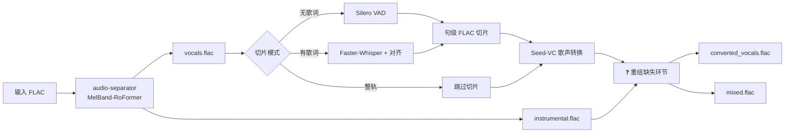
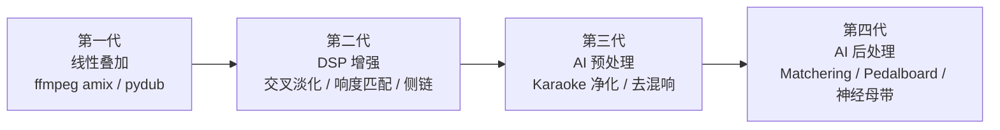
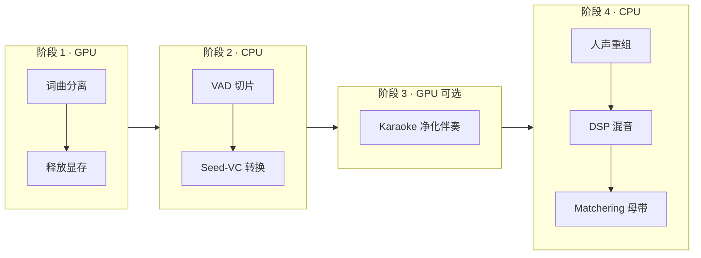
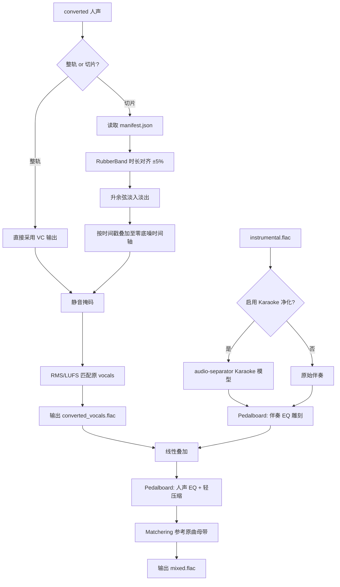

# 人声伴奏结合技术深度调研及系统架构设计报告

> **原始调研问题：** 当前仓库已完成从词曲分离、声乐切片到歌声转换的工作，现需将转换后的声乐切片（或整轨人声）与分离出的背景伴奏重新结合，生成完整歌曲。请深度调研当前主流的结合方案；若无现成方案则进行设计，结合本机硬件给出最终 Top 3 方案。

人声与伴奏重组（Vocal–Instrumental Recomposition）是歌声转换（Singing Voice Conversion, SVC）工业管线的最后一环，在学术界与开源社区中通常与「分离–转换」并列，统称为 **Separation–Conversion–Recomposition** 三段式工作流。YingMusic-SVC 等前沿 SVC 论文明确将「转换后人声与伴奏波形求和」作为推理链路的终点；Hyper-RVC、so-vits-svc-pipeline、stem-voice-clone 等开源 Cover 管线亦均内置独立的 merge 阶段。

本报告针对 `voice-translate` 工作区已落地的 **MelBand-RoFormer 词曲分离 → Silero VAD 声乐切片 → Seed-VC 歌声转换** 管线，系统剖析人声回贴、时长对齐、伴奏净化、响度匹配与智能混音等核心技术，识别当前工程缺口，并结合本机 **RTX 5060 Laptop 8 GB / i7-13700HX / 16 GB RAM** 硬件约束，给出三套可落地的生产级重组方案 Top 3 及分阶段实施路径。

## 1. 业务背景与管线定位

### 1.1 上游管线回顾

`voice-translate` 当前已实现的三阶段串行管线如下（详见 [词曲分离与声乐切片安装指南](./词曲分离与声乐切片安装指南.md) 与 [Seed-VC安装指南](./Seed-VC安装指南.md)）：



| 阶段 | 组件 | 输出 | 资源占用 |
| --- | --- | --- | --- |
| 阶段 1 · GPU | `audio-separator` + MelBand-RoFormer | `vocals.flac` + `instrumental.flac` | ~3.5–4 GB 显存 |
| 阶段 2 · CPU | Silero VAD / Faster-Whisper | `output/slices/*.flac` | CPU，< 5 秒/首 |
| 阶段 3 · GPU | Seed-VC V1（`--f0-condition True`） | `output/converted/*.flac` | ~6–7 GB 显存 |
| **阶段 4 · 待建设** | **人声重组 + 伴奏混音** | `vocals.flac` + `mixed.flac` | CPU 为主，可选 GPU |

### 1.2 重组环节的核心诉求

经需求确认，重组环节需同时满足以下约束：

| 维度 | 要求 |
| --- | --- |
| 工作模式 | **整轨转换**与**切片转换**两种路径均需支持 |
| 最终产物 | ① 转换后的完整人声音轨；② 人声 + 伴奏混音成品 |
| 质量优先级 | 切片接缝自然、人声清晰（伴奏不抢戏）、动态保真 — 三者并重 |
| 技术边界 | 接受完整 AI 增强（去残留人声、智能混音、参考母带等） |
| 输出格式 | 质量优先，FLAC 无损为主，采样率可灵活适配 |

### 1.3 重组在信号链中的物理意义

词曲分离阶段采用时域减法重构：

$$
\text{Instrumental}(t) = \text{Original Mix}(t) - \text{Vocals}(t)
$$

重组阶段的目标并非恢复原始混合音频，而是构造一首「替换人声后的新混音」：

$$
\text{New Mix}(t) = \text{Converted Vocals}(t) + \text{Instrumental}(t)
$$

由于分离模型不可能达到 100% 人声剔除率，`instrumental.flac` 中通常残留 **5%–15%** 的原始歌手人声（Vocal Bleed）。若直接叠加转换人声，听感上易出现「双声叠加」或浑浊感。因此，高质量重组管线必须在简单波形求和之外，处理 **时间轴对齐、响度平衡、静音段幻觉抑制与伴奏净化** 四类工程问题。

## 2. 人声伴奏结合技术现状与核心方法演进

人声伴奏结合技术经历了从简单波形叠加，到 DSP 信号处理增强，再到 AI 辅助净化与智能母带的四代演进。



### 2.1 第一代：线性波形叠加（Linear Summation）

工业界与开源社区最普遍的基线方案，在 SVC 推理完成后直接将转换人声与伴奏相加：

$$
\text{Mix}(t) = \alpha \cdot \text{Vocals}_{\text{conv}}(t) + \beta \cdot \text{Inst}(t)
$$

| 代表项目 | 合并实现 | 附加处理 |
| --- | --- | --- |
| [Hyper-RVC](https://github.com/BF667/Hyper-RVC) | `cli.py merge --vocals --instrumental` | 可选混响、音高调整、和声轨 |
| [so-vits-svc-pipeline](https://github.com/qhgz2013/so-vits-svc-pipeline) | ffmpeg 末端合并 | UVR 分离 + SVC + 一键自动化 |
| YingMusic-SVC 论文 | 声码器输出 + $x_{\text{inst}}$ | Band RoFormer 前端分离 |

**优点：** 实现极简、纯 CPU、延迟 < 1 秒、无额外模型依赖。  
**缺点：** 不处理切片时间轴回贴、VC 时长偏差、伴奏 bleed、SVC 静音段幻觉。

### 2.2 第二代：DSP 信号处理增强（Production DSP）

专业 Cover 制作与 So-VITS-SVC 推理管线采用的增强方案，在叠加前对转换人声进行多维信号调理。

#### 2.2.1 切片时间轴回贴（Timeline Placement）

切片模式下，Silero VAD 将 `vocals.flac` 切为多个句级片段，Seed-VC 逐片转换后须按原始时间戳放回整轨时间轴。每个切片 $i$ 在整轨中的放置位置为：

$$
\text{Timeline}[t] \mathrel{+}= \text{FadeInOut}\bigl(\text{Vocals}_{\text{conv},i}(t - T_{\text{start},i})\bigr)
$$

其中 $T_{\text{start},i}$ 为切片 $i$ 在原曲中的起始采样点，$\text{FadeInOut}$ 为升余弦淡入淡出包络。So-VITS-SVC 通过 `-lg`（`linear_gradient`）参数在相邻推理块之间施加线性交叉淡化，消除强制切片后的不连续感。

#### 2.2.2 时长对齐（Duration Alignment）

扩散式 SVC 模型（含 Seed-VC）的输出时长常与输入切片存在 **±3%–8%** 偏差。工程上采用 RubberBand WSOLA 时域拉伸（`librosa.effects.time_stretch`，底层调用 `pyrubberband`）将转换输出对齐至目标采样点数，拉伸比建议限制在 $\pm 5\%$ 以内，超出则触发告警并回退至最近有效对齐。

#### 2.2.3 静音掩码（Silence Masking）

SVC 模型在静音/换气段易产生微弱「幻觉」噪声。[stem-voice-clone](https://github.com/Daewooki/stem-voice-clone) 项目验证了基于原始切片 RMS 包络的掩码方案：当原始人声能量低于阈值（如 −40 dBFS）时，将转换输出等比衰减至静音，可有效消除段间底噪。

#### 2.2.4 响度匹配（Loudness Matching）

逐片或整轨将转换人声的 RMS / LUFS 对齐至原始 `vocals.flac` 对应区间，保持与原曲混音平衡一致：

$$
g = \frac{\text{RMS}(\text{Vocals}_{\text{orig}})}{\text{RMS}(\text{Vocals}_{\text{conv}})}, \quad \text{Vocals}_{\text{conv}}' = g \cdot \text{Vocals}_{\text{conv}}
$$

#### 2.2.5 混音级 DSP（EQ / 压缩 / 侧链）

[Spotify Pedalboard](https://github.com/spotify/pedalboard) 提供录音室级效果链，常用于 Cover 管线末端：

| 效果 | 参数建议 | 作用 |
| --- | --- | --- |
| HighpassFilter | 80–120 Hz | 去除转换人声低频隆隆声 |
| LowShelfFilter | −2~−4 dB @ 200–500 Hz（伴奏） | 为人声让出中低频空间 |
| Compressor | ratio 2:1–3:1，侧链来自人声 | 人声出现时轻压伴奏 |
| Reverb | 板式混响，mix 5%–15% | 使人声融入伴奏空间感 |

### 2.3 第三代：AI 辅助预处理（Bleed Removal & Enhancement）

针对 `instrumental.flac` 中残留原始人声的问题，可在混音前对伴奏进行二次 AI 净化。

#### 2.3.1 Karaoke 模型二次分离

`audio-separator` 生态提供专用 Karaoke 模型（如 `mel_roformer_karaoke_aufr33_viperx`），可将混合伴奏进一步拆分为「Lead Vocal 残留」与「更纯净伴奏」。净化后的伴奏 bleed 率可降至 **2%–5%**，显著改善「双声」问题。

#### 2.3.2 低 Bleed 伴奏模型

[python-audio-separator](https://github.com/nomadkaraoke/python-audio-separator) 提供 `instrumental_clean` 预设，专为最低人声渗入率优化，可作为分离阶段的替代或补充。

#### 2.3.3 转换人声去混响

MelBand-RoFormer 去混响模型（`melband_roformer_de_reverb`）可去除 Seed-VC 输出中多余的空间反射，使人声更「贴」伴奏。对本项目的干声分离场景收益有限，但对整轨直接转换模式有一定帮助。

### 2.4 第四代：AI 后处理与参考母带（Neural Post-Mix）

#### 2.4.1 Matchering 参考母带

[Matchering](https://github.com/sergree/matchering) 以原始混合曲为参考（Reference），自动匹配转换后混音的响度（LUFS）、频谱平衡与动态范围，使最终 `mixed.flac` 在听感上接近原曲工业母带水准。纯 CPU 运算，单曲约 20–40 秒。

#### 2.4.2 商业级方案（参考）

| 方案 | 能力 | 本地化 |
| --- | --- | --- |
| iZotope Ozone / Neutron | 智能 EQ、压缩、立体声成像 | 付费插件 |
| LALAL.AI / Moises | 云端 stem 分离 + 混音 | 云端 API |
| Kits.ai / ACE Studio | 端到端歌声转换 + 混音导出 | 云端 / 商业 DAW |

上述商业方案音质优秀，但与本项目「本地离线、数据自主」的定位不符，仅作技术参考。

### 2.5 开源 Cover 管线重组实现对比

| 项目 | 重组策略 | 切片支持 | Bleed 处理 | 静音掩码 | 混音后处理 |
| --- | --- | --- | --- | --- | --- |
| **Hyper-RVC** | pydub 线性叠加 | 整轨为主 | ❌ | ❌ | Pedalboard 混响 |
| **so-vits-svc-pipeline** | ffmpeg amix | SVC 内部切片 + crossfade | ❌ | ❌ | ❌ |
| **stem-voice-clone** | 逐轨 RMS 匹配 + 求和 | 多 stem 独立转换 | ❌ | ✅ | ❌ |
| **YingMusic-SVC 论文** | $x_{\text{inst}}$ 直接相加 | 整轨 | 前端 Band RoFormer | ❌ | 工业后期（外部 DAW） |

**结论：** 目前不存在「开箱即用、同时覆盖切片回贴 + bleed 净化 + 参考母带」的单一开源工具。最佳实践是 **借鉴各项目优势，针对 `voice-translate` 管线定制重组模块**。

## 3. 本仓库工程缺口分析

### 3.1 切片时间戳元数据缺失

当前 `scripts/slice-vocals.py` 在 Silero VAD 切片时仅输出 `*_slice_NNN.flac` 文件，**未持久化每个切片的 `start_ms` / `end_ms` 时间戳**。切片模式下的时间轴回贴无法自动执行，须首先扩展切片脚本输出 `manifest.json`：

```json
{
  "source": "output/separated/song_(vocals)_mel_band_roformer_kim_ft_unwa.flac",
  "sample_rate": 44100,
  "slices": [
    {
      "id": "slice_000",
      "file": "song_slice_000.flac",
      "start_ms": 12500,
      "end_ms": 48200,
      "fade_in_ms": 8,
      "fade_out_ms": 15
    }
  ]
}
```

### 3.2 采样率不一致

| 环节 | 典型采样率 |
| --- | --- |
| 词曲分离输出 | 原曲采样率（44.1 / 48 / 96 kHz） |
| Seed-VC 歌声转换 | **44100 Hz**（固定） |

重组前须将 `instrumental.flac` 重采样至 44100 Hz（推荐 `soxr` / `librosa.resample`），或在最终输出阶段统一升采样至原曲采样率。

### 3.3 目录结构未规划

建议在 `output/` 下新增重组产物目录：

| 路径 | 说明 |
| --- | --- |
| `output/converted/` | Seed-VC 转换输出（逐片或整轨） |
| `output/merged/vocals.flac` | 重组后的完整人声音轨 |
| `output/merged/mixed.flac` | 人声 + 伴奏最终混音成品 |
| `output/merged/instrumental_clean.flac` | （可选）Karaoke 净化后的伴奏 |

### 3.4 阶段调度与显存约束

本机 RTX 5060 Laptop 标称 8 GB 显存，Windows 桌面合成器占用 0.5–1.5 GB。重组管线中的 AI 步骤（Karaoke 净化）须与 Seed-VC **串行执行、不可并发**，遵循既有三阶段调度原则：



## 4. 人声伴奏结合方案 Top 3 设计

综合重组质量、工程可落地性、本机硬件适配度以及与现有管线的衔接成本，评选出以下 Top 3 生产级方案。


### 4.1 Top 1：DSP + AI 混合生产级管线（推荐默认方案）

Top 1 方案是兼顾切片接缝自然度、人声清晰度与动态保真的综合最优解，与 `voice-translate` 改良 Top 1 分离方案形成完整四阶段闭环。

#### 4.1.1 架构设计



#### 4.1.2 核心模块说明

| 模块 | 技术选型 | 资源 |
| --- | --- | --- |
| 时间轴回贴 | manifest.json + numpy 零底噪叠加 | CPU |
| 时长对齐 | `pyrubberband` / `librosa.effects.time_stretch` | CPU |
| 静音掩码 | 原始切片 RMS 包络阈值衰减 | CPU |
| 响度匹配 | `pyloudnorm`（ITU-R BS.1770 LUFS） | CPU |
| 伴奏净化 | `audio-separator` Karaoke 模型 | GPU ~3.5 GB |
| 效果链 | `pedalboard`（EQ / 压缩 / 混响） | CPU |
| 参考母带 | `matchering`（以原曲 mix 为 Reference） | CPU |

#### 4.1.3 本机适配评估

| 项目 | 本机配置 | 方案要求 | 评估 |
| --- | --- | --- | --- |
| GPU | RTX 5060 Laptop 8 GB | Karaoke 净化 ~3.5 GB（串行） | ✅ |
| CPU | i7-13700HX 16C/24T | DSP + Matchering | ✅ |
| 内存 | ~16 GB | 整轨 48kHz/5min 约 200 MB 峰值 | ✅ |
| 耗时 | — | 整轨 ~30–60s；切片 ~1–2min | ✅ |

### 4.2 Top 2：Hyper-RVC Lite 快速叠加方案

Top 2 方案专为快速验证端到端管线、资源受限或整轨转换为主的场景设计，借鉴 [Hyper-RVC](https://github.com/BF667/Hyper-RVC) 的 merge 模块实现。

#### 4.2.1 架构设计

```
converted_vocals ──> [Pedalboard 轻混响] ──┐
                                            ├──> pydub.overlay() ──> mixed.flac
instrumental.flac ──────────────────────────┘
```

- 合并命令参考：`python cli.py merge --vocals vocals.flac --instrumental instrumental.flac`
- 可选 `--backing-vocals` 支持和声轨叠加（本项目暂不涉及）
- 切片模式需自行实现基础 manifest 回贴，但不包含时长对齐与 bleed 净化

#### 4.2.2 优劣分析

**优点：** 开发成本极低（约 80 行 Python + 1 个 bat 脚本）；纯 CPU，无 GPU 争抢；整轨模式听感可接受。  
**缺点：** 伴奏人声残留明显；切片接缝可能有咔哒声；无参考母带，响度与原曲偏差较大。

### 4.3 Top 3：stem-voice-clone 智能自动混音方案

Top 3 方案借鉴 [stem-voice-clone](https://github.com/Daewooki/stem-voice-clone) 的重组策略，以 **静音掩码 + 逐段响度匹配 + 自动求和** 为核心，已被 YingMusic-SVC 工业管线间接验证。

#### 4.3.1 架构设计


#### 4.3.2 关键算法

**静音掩码：**

$$
M(t) = \begin{cases} 1 & \text{if } \text{RMS}_{\text{orig}}(t) > \theta \\ \epsilon & \text{otherwise} \end{cases}, \quad \text{Vocals}_{\text{out}}(t) = M(t) \cdot \text{Vocals}_{\text{conv}}(t)
$$

其中 $\theta$ 建议取 −40 dBFS，$\epsilon$ 取 0.01 以避免硬静音导致的频谱不连续。

**逐段响度匹配：** 每片转换输出独立计算增益 $g_i$，确保重组后各乐句音量与原曲一致。

#### 4.3.3 优劣分析

**优点：** 静音段干净，无 SVC 幻觉噪声；保真度高（最少后期染色）；实现复杂度适中。  
**缺点：** 无伴奏 bleed 处理；无 EQ/侧链/母带；切片时长偏差未对齐时仍有轻微错位。

### 4.4 Top 3 方案综合技术指标对比

| 评估维度 | Top 1：DSP+AI 混合 | Top 2：Hyper-RVC Lite | Top 3：stem-voice-clone |
| --- | --- | --- | --- |
| **整轨模式支持** | ✅ 完整 | ✅ 完整 | ✅ 完整 |
| **切片模式支持** | ✅ manifest 回贴 + 对齐 | ⚠️ 需基础 manifest | ⚠️ 需 manifest + 掩码 |
| **接缝自然度** | ★★★★★ 升余弦 + 时长对齐 | ★★★☆☆ 直接叠加 | ★★★★☆ 静音掩码 |
| **人声清晰度** | ★★★★★ Karaoke 净化 + EQ + 侧链 | ★★★☆☆ 无 bleed 处理 | ★★★★☆ 静音段干净 |
| **动态保真** | ★★★★☆ Matchering 参考原曲 | ★★★★☆ 最少处理 | ★★★★★ 最少染色 |
| **伴奏 Bleed 处理** | ✅ Karaoke 模型 | ❌ | ❌ |
| **GPU 需求** | 可选阶段 ~3.5 GB（串行） | 无 | 无 |
| **单曲耗时 (3min)** | 30–90 秒 | < 10 秒 | 15–30 秒 |
| **最低硬件要求** | RTX 5060 8 GB（串行） | 任意 CPU | 任意 CPU |
| **工程落地难度** | 中（~300 行 Python） | **低（~80 行）** | 低–中（~150 行） |
| **与现有管线衔接** | ✅ 最佳（复用 separator-env） | ✅ 良好 | ✅ 良好 |

```mermaid
xychart-beta
    title "Top 3 方案质量维度评分 (满分 5)"
    x-axis ["接缝自然", "人声清晰", "动态保真", "落地速度", "资源友好"]
    y-axis "评分" 0 --> 5
    bar [5, 5, 4, 3, 3]
    bar [3, 3, 4, 5, 5]
    bar [4, 4, 5, 4, 5]
```



> 注：上表三组柱状图依次对应 Top 1、Top 2、Top 3。

## 5. 工程落地实施与最佳实践

### 5.1 分阶段实施路径（推荐）

建议按以下顺序渐进落地，每步可独立验证：

| 步骤 | 内容 | 对应方案 | 预估工时 |
| --- | --- | --- | --- |
| **Step 1** | 整轨线性叠加 `merge-audio.py` + bat 脚本 | Top 2 基线 | 0.5 天 |
| **Step 2** | `slice-vocals.py` 输出 `manifest.json` | 切片回贴基础 | 0.5 天 |
| **Step 3** | 切片回贴 + 升余弦淡化 + RMS 匹配 | Top 3 核心 | 1 天 |
| **Step 4** | 静音掩码 + RubberBand 时长对齐 | Top 1 / Top 3 增强 | 1 天 |
| **Step 5** | Karaoke 模型净化伴奏 | Top 1 AI 预处理 | 0.5 天 |
| **Step 6** | Pedalboard 效果链 + Matchering 母带 | Top 1 AI 后处理 | 1 天 |

### 5.2 采样率与位深度规范

重组管线应遵循以下无损处理规范：

1. **内部运算：** 32-bit float PCM，避免中间环节量化损失。
2. **重采样：** 优先使用 `soxr`（SoX Resampler）或 `librosa.resample(..., res_type='soxr_hq')`。
3. **最终写出：** FLAC / PCM_16 或 PCM_24，采样率建议统一为 44100 Hz（与 Seed-VC 一致）或回写至原曲采样率。
4. **时长一致性：** 输出 `mixed.flac` 采样点数须与 `instrumental.flac` 严格一致，不足部分零填充，超出部分裁切。

### 5.3 切片交叉淡化参数

与 [词曲分离与声乐切片安装指南](./词曲分离与声乐切片安装指南.md) 保持参数一致性：

| 参数 | 当前值 | 重组阶段用途 |
| --- | --- | --- |
| `FADE_IN_MS` | 8 ms | 切片回贴头部升余弦 |
| `FADE_OUT_MS` | 15 ms | 切片回贴尾部降余弦 |
| 邻片重叠 | 建议 20–50 ms | 相邻切片交叉淡化区间 |

相邻切片 $i$ 与 $i+1$ 之间的交叉淡化加权：

$$
\text{Overlap}(t) = w_i(t) \cdot \text{Vocals}_i(t) + w_{i+1}(t) \cdot \text{Vocals}_{i+1}(t)
$$

其中 $w_i(t) + w_{i+1}(t) = 1$，采用线性或升余弦渐变。

### 5.4 响度目标与母带参考

| 指标 | 建议值 | 工具 |
| --- | --- | --- |
| 转换人声 Integrated LUFS | 对齐原 `vocals.flac`（通常 −18 ~ −12 LUFS） | `pyloudnorm` |
| 混音成品 Integrated LUFS | 对齐原曲 mix（Matchering 自动匹配） | `matchering` |
| True Peak | ≤ −1.0 dBTP | `pedalboard.Limiter` |

### 5.5 质量验收清单

| 检查项 | 通过标准 |
| --- | --- |
| 双声/浑浊 | 伴奏中无明显原唱人声残留 |
| 切片接缝 | 换气/句间无咔哒声或音量跳变 |
| 静音段 | 无人声转换幻觉底噪 |
| 响度一致 | 混音成品与原曲响度差 < 1.5 LU |
| 相位/时长 | `mixed.flac` 与原曲等长，起止对齐 |
| 高频完整性 | 16 kHz 以上泛音无明显衰减 |

### 5.6 依赖与环境规划

重组模块建议复用 `separator-env` 虚拟环境（已含 `audio-separator`、`soundfile`、`librosa`），新增依赖：

| 包 | 用途 | 安装 |
| --- | --- | --- |
| `pedalboard` | EQ / 压缩 / 混响效果链 | `uv pip install pedalboard` |
| `pyloudnorm` | LUFS 响度测量与匹配 | `uv pip install pyloudnorm` |
| `matchering` | 参考母带 | `uv pip install matchering` |
| `pyrubberband` | 高质量时长对齐 | `uv pip install pyrubberband`（需系统安装 Rubber Band CLI） |

> **Rubber Band 系统依赖：** Windows 下可通过 `choco install rubberband` 或从 [breakfastquay.com](https://breakfastquay.com/rubberband/) 下载 CLI，确保 `rubberband` 在 PATH 中可用。

## 6. 结论

人声伴奏结合并非简单的波形相加，而是涵盖 **时间轴重建、时长对齐、静音抑制、响度平衡、伴奏净化与参考母带** 的系统工程。当前开源社区虽有多条 Cover 管线（Hyper-RVC、so-vits-svc-pipeline、stem-voice-clone），但均无「一键式」覆盖本项目全部需求的现成方案。

针对 `voice-translate` 工作区，推荐采用 **Top 1（DSP + AI 混合生产级管线）** 作为最终目标架构，并以 **Top 2（Hyper-RVC Lite）** 为快速原型分步实施：

1. **短期（Step 1–2）：** 实现整轨线性叠加，扩展 `slice-vocals.py` 输出 `manifest.json`，打通端到端闭环。
2. **中期（Step 3–4）：** 引入静音掩码、RMS 匹配、时长对齐与切片回贴，达到 Top 3 水准。
3. **长期（Step 5–6）：** 启用 Karaoke 伴奏净化、Pedalboard 效果链与 Matchering 参考母带，完成 Top 1 全量能力。

本机 **RTX 5060 Laptop 8 GB + i7-13700HX + 16 GB RAM** 硬件完全满足上述方案的串行调度需求。重组阶段以 CPU 运算为主，仅 Karaoke 净化步骤需短暂占用 GPU（~3.5 GB），与既有「分离 → 切片 → Seed-VC」三阶段串行原则完全兼容，无需额外硬件投入。

---

## 附录 A：推荐目录结构

```
output/
├── separated/              # 词曲分离产物
│   ├── song_(vocals)_*.flac
│   └── song_(instrumental)_*.flac
├── slices/                 # VAD 切片 + 元数据
│   ├── song_slice_000.flac
│   ├── ...
│   └── manifest.json
├── converted/              # Seed-VC 转换输出
│   ├── song_slice_000.flac
│   └── song_vocals_full.flac
└── merged/                 # 重组最终产物
    ├── vocals.flac         # 完整转换人声
    ├── instrumental_clean.flac  # （可选）净化伴奏
    └── mixed.flac          # 最终混音成品
```

## 附录 B：相关文档索引

| 文档 | 关联内容 |
| --- | --- |
| [词曲分离与声乐切片安装指南](./词曲分离与声乐切片安装指南.md) | 上游分离与切片管线 |
| [Seed-VC安装指南](./Seed-VC安装指南.md) | 歌声转换环境与推理 |
| [歌曲词曲分离与声乐切片技术深度调研及系统架构设计报告](./歌曲词曲分离与声乐切片技术深度调研及系统架构设计报告.md) | 分离阶段 Top 3 方案 |
| [基于普通话人声特征替换粤语歌声的跨语种歌声转换技术调研报告](./基于普通话人声特征替换粤语歌声的跨语种歌声转换技术调研报告.md) | Seed-VC 选型与评估 |
| [人声伴奏结合安装指南](./人声伴奏结合安装指南.md) | 重组阶段安装、参数与排障 |

---

*调研完成日期：2026-07-22*
