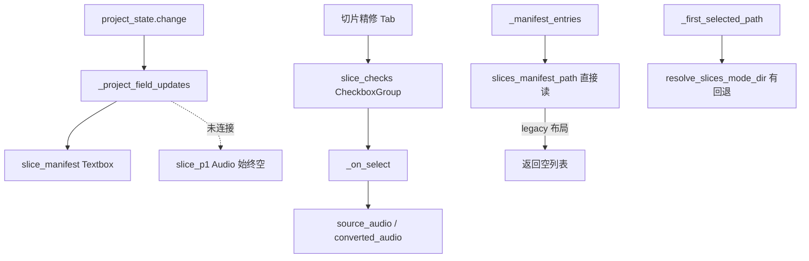
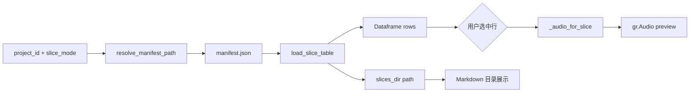

# 切片 Tab 预览增强方案

> **关联文档：** [管线WebUI设计方案.md](./管线WebUI设计方案.md) §6.3.3、[切片模式分仓与精修功能实施方案.md](./切片模式分仓与精修功能实施方案.md)、[切片Tab预览测试验收方案.md](./切片Tab预览测试验收方案.md)  
> **版本：** v1.0  
> **日期：** 2026-07-25  
> **状态：** 已实施（2026-07-25）

---

## 1. 背景与动机

### 1.1 待解决问题

| # | 问题 | 现状 |
|---|------|------|
| P1 | 切片 Tab 无逐片预览入口 | 仅有 manifest 文本框；`slice_p1` 音频控件未接入数据流 |
| P2 | 预览始终为空 | `slice_p1` 不在 `field_outputs` 中，切换项目/运行切片后不刷新 |
| P3 | 精修 Tab 与切片 Tab 能力割裂 | 逐片列表与试听仅在「转换 → 切片精修」 |
| P4 | manifest 路径解析不一致 | `slice_tuner._manifest_entries()` 未走 `resolve_slices_mode_dir()` legacy 回退 |
| P5 | 与设计稿偏离 | 设计稿要求切片产物可试听、可定位目录；当前无法核对时间轴 |

### 1.2 已锁定决策（方案 C）

| # | 决策项 | 结论 |
|---|--------|------|
| D1 | 切片 Tab 主交互 | `gr.Dataframe` 展示 manifest 表 + 行选中驱动 `gr.Audio` |
| D2 | 共享组件 | 新建 `webui/components/slice_preview.py`（`SlicePreviewBundle`） |
| D3 | 精修 Tab 复用 | `slice_tuner.py` 改用同一 bundle 的列表/试听逻辑，保留精修操作区 |
| D4 | 列定义 | `id`、`start_ms`、`end_ms`、`text`、`file`、`status`（可选：精修标记） |
| D5 | 目录入口 | 「打开切片目录」按钮展示绝对路径 + 复制提示（v1 不调用 OS shell） |
| D6 | 模式联动 | VAD/LRC 子 Tab 切换时刷新 Dataframe 与音频 |
| D7 | 移除孤立控件 | 删除未接线的 `slice_p1`；由 `SlicePreviewBundle` 替代 |
| D8 | manifest 读取 | 统一走 `resolve_slices_mode_dir()` + `slices_manifest_path()` |

### 1.3 非目标（v1）

- Dataframe 内嵌每行独立「播放」按钮（Gradio 行级按钮成本高；用行选中代替）
- 同时试听多个切片（仅展示选中行对应音频）
- 在切片 Tab 内编辑切片边界或 overrides
- 转换结果试听（留在「切片精修」Tab）

---

## 2. 现状与根因



| 文件 | 问题 |
|------|------|
| `webui/pipeline_app.py` L386 | `slice_p1` 创建但未加入 `field_outputs` |
| `webui/components/slice_tuner.py` L42-47 | `_manifest_entries` 无 legacy fallback |
| `webui/components/artifacts.py` | `first_audio_in_dir` 已实现但未引用 |

---

## 3. 目标 UI

### 3.1 切片 Tab 布局

```
┌─ 切片 ─────────────────────────────────────────────────────┐
│ 源人声路径 …                                                │
│ [VAD 断句] [LRC 断句]                                       │
│ [运行切片]                                                  │
│ 日志 …                                                      │
├─ 切片列表（Dataframe，可选择行）────────────────────────────┤
│ id        | start_ms | end_ms | text      | file           │
│ slice_000 | 0        | 3200   | 歌词…     | slice_000.flac │
│ slice_001 | 3200     | 6100   | …         | slice_001.flac │
├─ 试听 ─────────────────────────────────────────────────────┤
│ 选中切片 [gr.Audio]                                         │
│ 切片目录：D:\...\output\slices\mysong\lrc\  [复制路径提示]   │
└────────────────────────────────────────────────────────────┘
```

### 3.2 切片精修 Tab（改造后）

```
┌─ 切片精修 ─────────────────────────────────────────────────┐
│ （复用 SlicePreviewBundle 的 Dataframe + 原始切片 Audio）    │
│ 转换结果 [gr.Audio]  ← 保留精修专用                         │
│ 参考音频、精修参数、重转按钮 …（不变）                        │
└────────────────────────────────────────────────────────────┘
```

> 精修 Tab 将 `CheckboxGroup` 替换为 Dataframe 多选（`interactive=True` + 行选择），或保留 CheckboxGroup 但从同一 `load_slice_table()` 数据源生成 — 实施时优先 **单一数据源 `load_slice_table()`**，展示控件可不同。

---

## 4. 技术设计

### 4.1 新增 `webui/components/slice_preview.py`

```python
@dataclass
class SlicePreviewBundle:
    slice_table: gr.Dataframe
    preview_audio: gr.Audio
    slices_dir_label: gr.Markdown   # 目录路径展示
    open_dir_btn: gr.Button         # 刷新/复制提示

def build_slice_preview(*, label: str = "切片列表") -> SlicePreviewBundle: ...

def wire_slice_preview(
    bundle: SlicePreviewBundle,
    project_state: gr.State,
    slice_mode: gr.State,
) -> None: ...
```

### 4.2 新增 `webui/helpers.py` API

```python
def load_slice_table(
    project_id: str | None,
    slice_mode: str,
    *,
    include_tune_status: bool = False,
) -> tuple[list[list], str | None, str | None]:
    """
  返回 (dataframe_rows, selected_audio_path, slices_dir_display).
  rows 列: id, start_ms, end_ms, text, file [, tuned]
  """

def resolve_manifest_path(project_id: str, slice_mode: str) -> Path | None:
    """resolve_slices_mode_dir + manifest 存在性检查。"""
```

**manifest 读取逻辑（统一）：**

```python
def resolve_manifest_path(project_id: str, slice_mode: str) -> Path | None:
    mode_dir = paths.resolve_slices_mode_dir(project_id, slice_mode)
    if mode_dir is None:
        return None
    manifest = mode_dir / "manifest.json"
    return manifest if manifest.is_file() else None
```

### 4.3 Dataframe 行选中 → 音频

```python
def _on_row_select(pid, smode, evt: gr.SelectData):
  # evt.index[0] 为行号
  rows, _, slices_dir = load_slice_table(pid, smode)
  if evt.index is None or not rows:
      return None, slices_dir or "*无切片目录*"
  row = rows[evt.index[0]]
  slice_id = row[0]
  audio = _audio_for_slice(pid, smode, slice_id)
  return audio_if_exists(audio), f"`{slices_dir}`"
```

Gradio 5 `Dataframe.select` 事件：`slice_table.select(fn, inputs, outputs)`。

### 4.4 `field_outputs` 集成

在 `_project_field_updates()` 返回值中增加：

- `slice_table` 数据（`gr.Dataframe` 用 `pd.DataFrame` 或 list of lists）
- `preview_audio` 默认选中第一行（若有）
- `slices_dir_label` 文本

将 `SlicePreviewBundle` 各组件加入 `field_outputs` 列表，替换原 `slice_manifest` 文本框（或保留文本框作为「原始 JSON 摘要」折叠项 — **v1 移除 `slice_manifest` Textbox，信息由 Dataframe 覆盖**）。

### 4.5 切片运行完成后刷新

`slice_run.click(...).then(_project_field_updates, ...)` 确保 `outputs` 含 `SlicePreviewBundle` 组件。

### 4.6 改动文件

| 文件 | 改动 |
|------|------|
| `webui/components/slice_preview.py` | **新建** `SlicePreviewBundle` |
| `webui/helpers.py` | `load_slice_table()`、`resolve_manifest_path()` |
| `webui/pipeline_app.py` | 切片 Tab 接入 bundle；`field_outputs` 更新；移除 `slice_p1`、`slice_manifest` |
| `webui/components/slice_tuner.py` | `_manifest_entries` 改用 `resolve_manifest_path`；可选复用 `load_slice_table` |
| `webui/state.py` | `load_project_defaults` 确保 `manifest` 与 mode 一致 |
| `tests/test_slice_preview.py` | **新建** 单元测试 |
| `tests/run_playwright_slice_preview.py` | **新建** UI 验收 |

---

## 5. 数据流



---

## 6. 分阶段实施

| 阶段 | 名称 | 估时 | 依赖 |
|------|------|------|------|
| 0 | helpers + 单元测试 | 0.5 天 | — |
| 1 | SlicePreviewBundle + 切片 Tab | 1 天 | 阶段 0 |
| 2 | slice_tuner 路径修复与复用 | 0.5 天 | 阶段 0 |
| 3 | Playwright 验收 | 0.5 天 | 阶段 1–2 |
| **合计** | | **约 2.5 天** | |

### 6.1 阶段 0

- [ ] `resolve_manifest_path()` — legacy VAD 回退
- [ ] `load_slice_table()` — 空项目、无 manifest、有 text、精修标记
- [ ] `tests/test_slice_preview.py`

### 6.2 阶段 1

- [ ] `build_slice_preview()` / `wire_slice_preview()`
- [ ] 接入 `pipeline_app.py`；VAD/LRC Tab 切换刷新
- [ ] 移除 `slice_p1`、原 `slice_manifest` Textbox

### 6.3 阶段 2

- [ ] `slice_tuner._manifest_entries` 改用统一解析
- [ ] 精修 Tab 列表与切片 Tab 数据源一致

### 6.4 阶段 3

- [ ] `tests/run_playwright_slice_preview.py`
- [ ] 执行 [切片Tab预览测试验收方案.md](./切片Tab预览测试验收方案.md)

---

## 7. 风险与缓解

| 风险 | 缓解 |
|------|------|
| Gradio Dataframe 行选中 API 版本差异 | 锁定 Gradio 5 文档；Playwright 用例覆盖 |
| 大 manifest（>500 行）卡顿 | v1 全量加载；后续可加 `max_rows` 分页 |
| 删除 Textbox 后用户习惯 | Dataframe 信息超集；日志仍输出切片数量 |
| 精修 Tab CheckboxGroup → Dataframe | 保留多选；精修按钮读选中行 id 列表 |

---

## 8. 开发进展

| 阶段 | 名称 | 状态 | 开始日期 | 完成日期 | 备注 |
|------|------|------|----------|----------|------|
| 0 | helpers + 单元测试 | ✅ 已完成 | 2026-07-25 | 2026-07-25 | |
| 1 | SlicePreviewBundle + 切片 Tab | ✅ 已完成 | 2026-07-25 | 2026-07-25 | |
| 2 | slice_tuner 复用 | ✅ 已完成 | 2026-07-25 | 2026-07-25 | manifest 路径统一 |
| 3 | Playwright 验收 | ✅ 已完成 | 2026-07-25 | 2026-07-25 | test 项目 E2E |

---

## 9. 变更记录

| 日期 | 版本 | 变更摘要 |
|------|------|----------|
| 2026-07-25 | v1.0 | 初版：方案 C Dataframe + 行选中试听 + 共享 SlicePreviewBundle |
