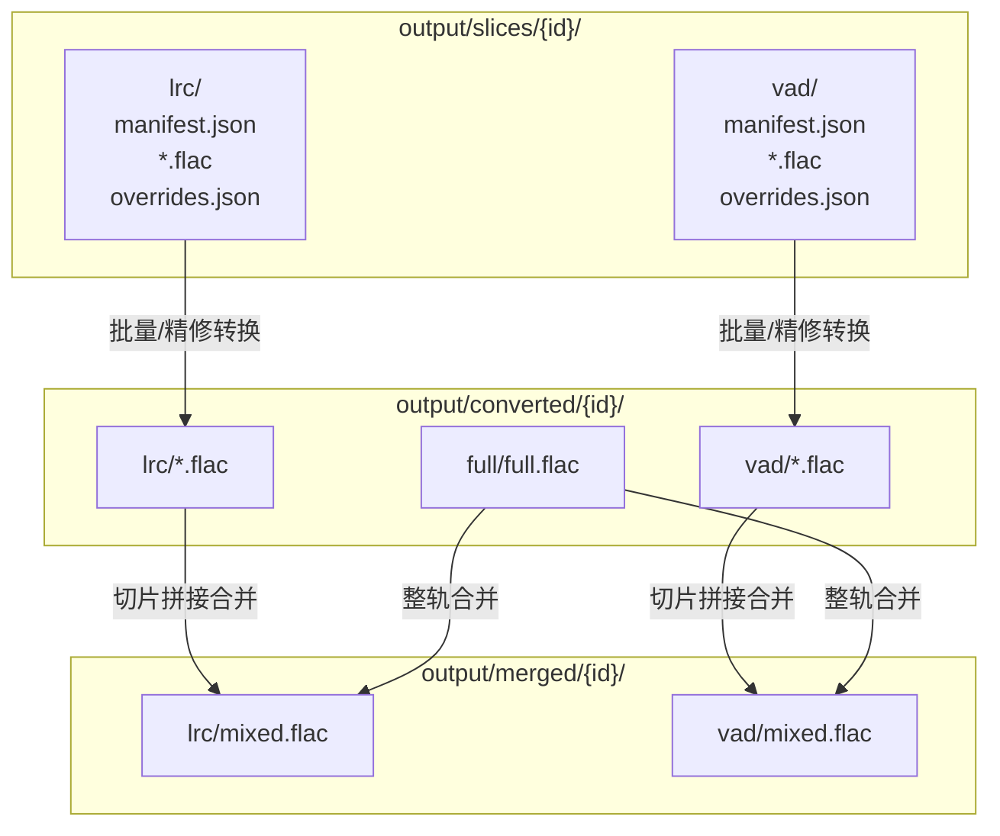
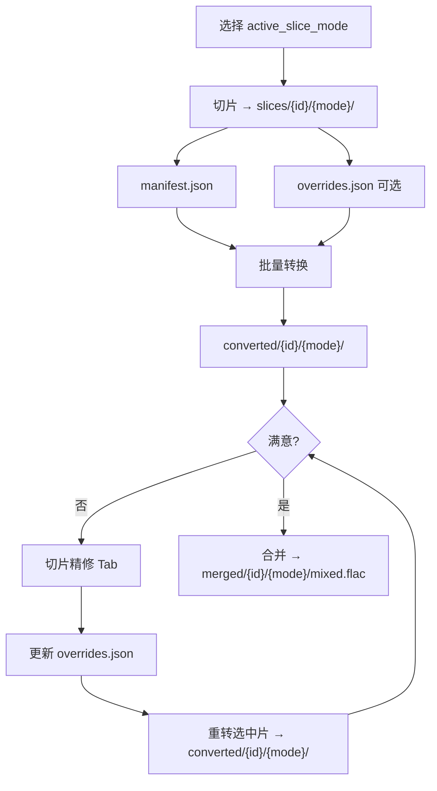
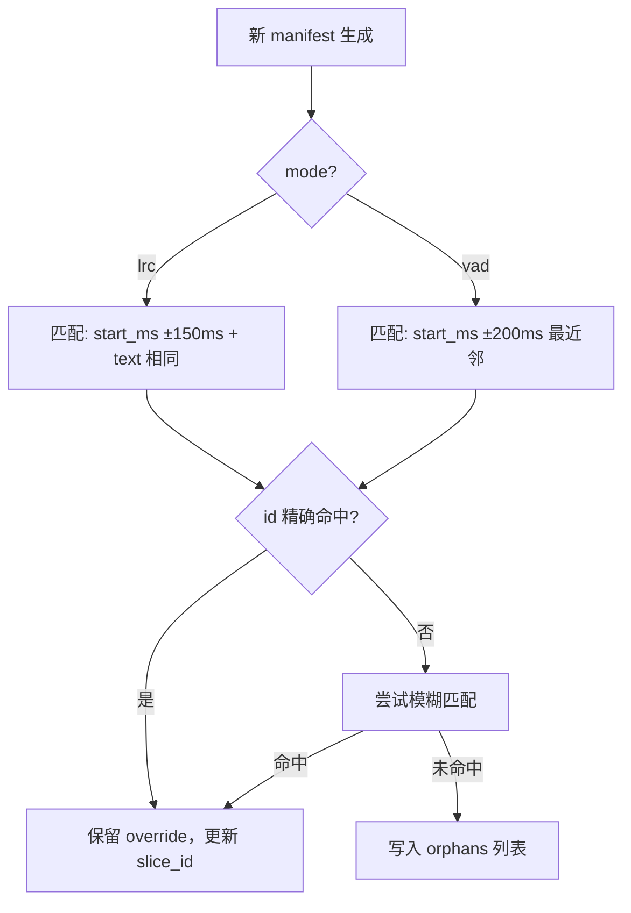
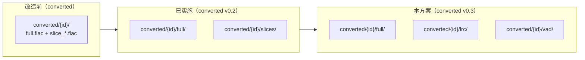

# 切片模式分仓与精修功能实施方案

> **关联文档：** [管线WebUI设计方案.md](./管线WebUI设计方案.md)、[converted产物目录改造与合并修复方案.md](./converted产物目录改造与合并修复方案.md)、[管线WebUI开发记录.md](./管线WebUI开发记录.md)  
> **版本：** v1.0  
> **日期：** 2026-07-24  
> **状态：** 实施中（阶段 0–2 已完成，2026-07-24）

---

## 1. 背景与动机

### 1.1 待解决问题

| # | 问题 | 现状 |
|---|------|------|
| P1 | 批量转换界面缺少高级参数 | 「切片批量」子 Tab 仅展示 `skip_existing` / `limit`；高级参数在子 Tab 下方共用区域，易被误认为整轨专用。运行时后端**已接收**高级参数，但日志不足以验证。 |
| P2 | 缺少单切片精修界面 | 无法对个别切片单独调参（移调、CFG、步数等）并重转；`convert-slices.py` 对所有切片使用同一套参数。 |
| P3 | LRC / VAD 切片互相覆盖 | `output/slices/{id}/` 为扁平布局，切换模式重跑切片会覆盖上一次产物。 |
| P4 | 精修参数无处持久化 | 无 per-slice 参数存储；重切片后无法保留已调好的句子。 |

### 1.2 已锁定决策

| # | 决策项 | 结论 |
|---|--------|------|
| D1 | 转换产物分仓 | `output/converted/{id}/lrc/` 与 `vad/` 分别存放 |
| D2 | 精修参数存储（6-A） | 各模式子目录下 `overrides.json` sidecar |
| D3 | LRC / VAD 共存 | 长期共存，互不覆盖；`active_slice_mode` 指示当前激活子树 |
| D4 | 旧项目迁移 | 自动检测扁平布局并迁入 `lrc/` 或 `vad/` |
| D5 | 合并产物分仓 | `output/merged/{id}/lrc/mixed.flac` 与 `vad/mixed.flac` 双份保留 |
| D6 | 精修范围 | 仅转换参数（移调、CFG、步数等）；不含切片边界重切 |
| D7 | 精修粒度 | 支持多选批量重转（单选即单片） |
| D8 | 参考音色 | 支持 per-slice `reference` 覆盖项目默认 |
| D9 | 精修入口 | 「转换」Tab 内第三子 Tab「切片精修」 |

### 1.3 非目标（v1）

- 切片边界重切（属切片阶段）
- LRC ↔ VAD 跨模式自动迁移 overrides
- 合并产物跨模式混用
- overrides 导入/导出 UI

---

## 2. 目录契约

### 2.1 目标布局

```
output/slices/{project_id}/
  lrc/
    manifest.json       # 几何：id, file, start_ms, end_ms, text(可选)
    *.flac
    overrides.json      # 精修参数（6-A）
  vad/
    manifest.json
    *.flac
    overrides.json

output/converted/{project_id}/
  full/
    full.flac           # 整轨快捷，与模式无关
  lrc/
    *.flac              # 与源切片同名一一对应
  vad/
    *.flac

output/merged/{project_id}/
  lrc/
    mixed.flac
  vad/
    mixed.flac
```

### 2.2 目录关系总览



### 2.3 `project.json` 职责（轻量）

仅存**激活模式**和**阶段级默认参数**，不存 per-slice 细节：

```json
{
  "stages": {
    "slice": {
      "params": { "mode": "lrc" },
      "artifacts": {
        "lrc": {
          "slices_dir": "output/slices/foo/lrc",
          "manifest": "output/slices/foo/lrc/manifest.json"
        },
        "vad": {
          "slices_dir": "output/slices/foo/vad",
          "manifest": "output/slices/foo/vad/manifest.json"
        }
      }
    },
    "convert": {
      "params": {
        "mode": "slice_batch",
        "active_slice_mode": "lrc",
        "diffusion_steps": 40,
        "semi_tone_shift": 0,
        "inference_cfg_rate": 0.7,
        "auto_f0_adjust": true,
        "fp16": true
      }
    },
    "merge": {
      "params": {
        "active_slice_mode": "lrc",
        "profile": "full"
      }
    }
  }
}
```

> `active_slice_mode`：当前 UI / 流水线默认使用的模式子树。两套数据始终保留，切换模式只改激活指针。

### 2.4 `overrides.json` Schema（6-A）

路径：`output/slices/{project}/{lrc|vad}/overrides.json`

```json
{
  "version": 1,
  "global_defaults": {
    "diffusion_steps": 40,
    "length_adjust": 1.0,
    "inference_cfg_rate": 0.7,
    "auto_f0_adjust": true,
    "semi_tone_shift": 0,
    "fp16": true
  },
  "slices": {
    "slice_012": {
      "semi_tone_shift": 2,
      "inference_cfg_rate": 0.5,
      "reference": "input/mysong/refs/chorus.wav"
    }
  },
  "orphans": []
}
```

**参数合并规则**（转换时 per-slice 生效）：

```
effective = global_defaults
            ⊕ project.stages.convert.params（阶段默认）
            ⊕ overrides.slices[slice_id]（条目覆盖）

reference = slice.reference ?? project.reference
```

---

## 3. 端到端数据流



---

## 4. 分阶段实施

### 4.1 阶段依赖


| 阶段 | 名称 | 估时 | 依赖 |
|------|------|------|------|
| 0 | 路径层 + 迁移 | 1–2 天 | — |
| 1 | UI 修复 + 日志 | 0.5 天 | —（可与 0 并行） |
| 3 | 全链路 mode 感知 | 1–2 天 | 阶段 0 |
| 2 | 切片精修 | 3–4 天 | 阶段 0 + 3 |
| **合计** | | **约 5–8 天** | |

---

### 4.2 阶段 0：路径层 + 迁移

#### 4.2.1 新增 `pipeline/paths.py` API

```python
def slices_mode_dir(project_id: str, mode: str) -> Path
    # output/slices/{id}/{lrc|vad}/

def slices_manifest_path(project_id: str, mode: str) -> Path

def slices_overrides_path(project_id: str, mode: str) -> Path

def converted_mode_dir(project_id: str, mode: str) -> Path

def merged_mode_dir(project_id: str, mode: str) -> Path

def resolve_slices_mode_dir(project_id, mode) -> Path | None  # + legacy fallback

def resolve_converted_mode_dir(project_id, mode) -> Path | None

def migrate_legacy_slices_layout(project_id: str) -> str | None  # 返回迁入的 mode
```

#### 4.2.2 迁移逻辑

检测 `output/slices/{id}/manifest.json` 存在于**项目根**（旧扁平布局）时：

| 条件 | 迁入目标 |
|------|----------|
| manifest 含 `"slice_mode": "lrc"` | → `lrc/` |
| manifest 含 `"lrc"` 字段 | → `lrc/` |
| 项目有 `input_lrc` 且 manifest 条目含 `text` 字段 | → `lrc/` |
| 否则 | → `vad/` |

**迁移步骤：**

1. 创建 `{mode}/`，移动 `*.flac` + `manifest.json`
2. 若存在旧 `overrides.json` 一并移动
3. 同步迁移 `output/converted/{id}/slices/` → `converted/{id}/{mode}/`
4. 同步迁移 `output/merged/{id}/mixed.flac` → `merged/{id}/{mode}/mixed.flac`（若存在）
5. 在 `project.json` 写入 `active_slice_mode`
6. 根目录清空后不再写入

**Legacy fallback**（只读，不自动写）：

- `slices/{id}/` 根目录有音频 → 当作 `vad/`
- `converted/{id}/slices/` → 当作当前 `active_slice_mode`
- `merged/{id}/mixed.flac` → 当作当前 `active_slice_mode`

#### 4.2.3 改动文件

| 文件 | 改动 |
|------|------|
| `pipeline/paths.py` | 新 API + legacy resolve |
| `pipeline/store.py` | `resolve_stage_inputs` 按 `slice_mode` 解析；`scan_and_repair` 触发迁移 |
| `pipeline/stages/slice.py` | `output_dir` 默认改为 `slices_mode_dir(id, mode)` |
| `pipeline/stages/convert.py` | 源/目标目录跟 `slice_mode` |
| `pipeline/runner.py` | artifacts 按 mode 分存 |
| `scripts/migrate-slices-layout.py` | 新建或扩展迁移脚本 |
| `tests/test_paths_layout.py` | 新布局 + 迁移用例 |

---

### 4.3 阶段 1：修复问题 P1（UI + 日志）

#### 4.3.1 问题 1 排查结论

| 维度 | 结论 |
|------|------|
| 运行时 | `run_convert` 合并 `convert_batch_params` + `convert_params`，`collect_params(..., convert_mode="slice_batch")` **不会过滤**高级参数 |
| 表象 | UI 分区导致认知偏差；配置日志仅打印 3 个 bool，无法验证 |
| 持久化 | `runner` 完成后仅保存 `diffusion_steps` + `reference`，切换项目后高级参数不回填 |

#### 4.3.2 UI 调整

「转换」Tab →「切片批量」子 Tab 内展示**完整**参数面板（去掉 `slice_batch_only` 拆分）：

```
┌─ 切片批量 ─────────────────────────────────┐
│ 切片目录（默认 slices/{项目}/{当前模式}/）    │
│ ┌─ 转换参数 ─────────────────────────────┐ │
│ │ [☑] 自动 F0 对齐  [☑] FP16 推理          │ │
│ │ [☑] 跳过已有切片                        │ │
│ │ ▼ 高级参数                              │ │
│ │   扩散步数 / CFG / 半音移调 / 试跑片数…  │ │
│ └─────────────────────────────────────────┘ │
└────────────────────────────────────────────┘
参考音频（共用）
[运行转换]
```

#### 4.3.3 配置日志格式

```
[配置] mode=slice_batch slice_mode=lrc diffusion_steps=55 semi_tone_shift=3
       inference_cfg_rate=0.42 skip_existing=True fp16=True auto_f0_adjust=True limit=0
```

#### 4.3.4 改动文件

| 文件 | 改动 |
|------|------|
| `webui/pipeline_app.py` | 合并 convert 参数面板；补全配置日志 |
| `webui/components/mode_panel.py` | 更新 `MERGE_SLICE_HELP` 路径说明 |
| `pipeline/runner.py` | 持久化完整 convert params |

---

### 4.4 阶段 3：全链路 mode 感知

所有读路径的地方统一走 `active_slice_mode`：

| 模块 | 变更 |
|------|------|
| **切片 Tab** | 运行后写入 `artifacts.lrc` / `artifacts.vad`；manifest 预览跟当前模式 |
| **转换 Tab** | 默认 `slices_dir` = `slices/{id}/{mode}/`；产物预览读 `converted/{id}/{mode}/` |
| **合并 Tab** | 切片拼接读 `converted/{id}/{active_mode}/` + 对应 manifest；产物写入 `merged/{id}/{active_mode}/` |
| **向导** | `slice_mode` state 决定子树 |
| **批量队列** | 已有 `slice_mode` Radio，对接新路径 |
| **侧边栏状态** | 显示 `LRC: 42片 ✓  VAD: 38片 ✓` |

#### `store.resolve_stage_inputs` 伪代码

```python
mode = overrides.get("slice_mode") or project.active_slice_mode or "lrc"
resolved["slices_dir"] = rel(slices_mode_dir(pid, mode))
resolved["manifest"] = rel(slices_manifest_path(pid, mode))
resolved["output_dir"] = rel(converted_mode_dir(pid, mode))   # convert stage
resolved["merge_output"] = rel(merged_mode_dir(pid, mode))    # merge stage
```

#### 改动文件

| 文件 | 改动 |
|------|------|
| `pipeline/store.py` | mode 感知 resolve / validate / scan |
| `pipeline/stages/merge.py` | 默认输出到 `merged_mode_dir` |
| `webui/pipeline_app.py` | 各 Tab 路径默认值联动 |
| `webui/state.py` | `load_project_defaults` 返回 mode 分仓信息 |
| `webui/components/wizard.py` | 向导路径联动 |
| `webui/components/batch_queue.py` | 确认 slice_mode 传入链路 |
| `webui/helpers.py` | manifest 预览支持 mode 路径 |

---

### 4.5 阶段 2：切片精修

#### 4.5.1 UI：「转换」Tab 第三子 Tab「切片精修」

```
┌─ 切片精修 ──────────────────────────────────────────────┐
│ 当前模式：[LRC ●] [VAD]   （切换只改 active_slice_mode）  │
├─────────────────────────────────────────────────────────┤
│ 切片列表（CheckboxGroup / Dataframe）                    │
│ ☑ slice_012  00:32–00:38  "歌词文本…"  [已精修]         │
│ ☐ slice_013  00:38–00:45  "…"                           │
├─────────────────────────────────────────────────────────┤
│ 试听                                                     │
│  原始切片 [audio]  |  转换结果 [audio]                     │
├─────────────────────────────────────────────────────────┤
│ 参数（预填：global_defaults ⊕ 选中片 override）           │
│  参考音频 [audio]  ← 可覆盖项目默认                       │
│  半音移调 / CFG / 扩散步数 / …                           │
├─────────────────────────────────────────────────────────┤
│ [重转选中片]  [保存为覆盖]  [清除选中覆盖]  [清除 orphans]  │
└─────────────────────────────────────────────────────────┘
```

#### 4.5.2 交互规则

| 操作 | 行为 |
|------|------|
| 选中 1 片 | 参数面板显示该片 effective 值 |
| 选中多片 | 显示共有值；冲突字段显示「混合」或留空 |
| 保存为覆盖 | 写 `overrides.json` 的 `slices.{id}` |
| 重转选中片 | 调后端，仅处理选中 id，`skip_existing=False` |
| 切换 LRC/VAD | 重载对应子目录列表，互不影响 |

#### 4.5.3 重切片后 overrides 匹配

仅在**同一 `{mode}/` 子目录**内执行：



| 模式 | 匹配策略 | 容差 |
|------|----------|------|
| `lrc` | `start_ms` + `text` 相同 | ±150ms |
| `vad` | `start_ms` 最近邻 | ±200ms |

未匹配条目追加到 `orphans[]`（含旧 id、参数快照、原因）；UI 展示 orphan 数量，支持手动清理。

#### 4.5.4 新增模块

| 文件 | 说明 |
|------|------|
| `pipeline/slice_overrides.py` | 读写 / merge / match / orphans |
| `webui/components/slice_tuner.py` | Gradio 精修面板 |
| `webui/helpers.py` | `load_slice_table(manifest, overrides, converted_dir)` |

#### 4.5.5 `pipeline/slice_overrides.py` 核心 API

```python
@dataclass
class SliceOverrides:
    version: int
    global_defaults: dict[str, Any]
    slices: dict[str, dict[str, Any]]
    orphans: list[dict[str, Any]]

def load(path: Path) -> SliceOverrides
def save(path: Path, data: SliceOverrides) -> None
def effective_params(slice_id, overrides, stage_defaults) -> dict
def merge_after_reslice(old: SliceOverrides, new_manifest, *, mode: str) -> SliceOverrides
```

#### 4.5.6 `convert-slices.py` 扩展

```bash
--slice-ids slice_012,slice_013   # 仅转指定片
--overrides path/to/overrides.json
--force                            # 等同 skip_existing=False
```

循环内 per-slice 逻辑：

```python
for slice in manifest.slices:
    if slice_ids and slice.id not in slice_ids:
        continue
    params = merge(global, overrides.slices.get(slice.id, {}))
    ref = params.get("reference") or default_reference
    convert(slice, ref, params)
```

#### 4.5.7 `run_convert` 新参数

```python
slice_ids: list[str] | None = None
overrides_path: Path | None = None
slice_mode: str = "lrc"
```

#### 4.5.8 改动文件

| 文件 | 改动 |
|------|------|
| `scripts/convert-slices.py` | `--slice-ids`, `--overrides`, per-slice ref |
| `pipeline/stages/convert.py` | 透传新参数 |
| `pipeline/stages/slice.py` | 切片完成后触发 overrides merge |
| `pipeline/slice_overrides.py` | **新建** |
| `webui/components/slice_tuner.py` | **新建** |
| `webui/pipeline_app.py` | 接入精修 Tab |
| `webui/state.py` | `retune_slices_ui()`, `load_slice_overrides()` |
| `tests/test_slice_overrides.py` | **新建** |
| `tests/test_convert_slice_ids.py` | **新建** |

---

## 5. 测试计划

| 类别 | 用例 |
|------|------|
| **路径** | 新布局 resolve；legacy 扁平迁移到 lrc/vad |
| **迁移** | 有 LRC → `lrc/`；纯 VAD → `vad/`；converted/slices 与 merged 同步迁移 |
| **共存** | 同一项目 lrc+vad 各有 manifest；切换 mode 不互相删除 |
| **convert** | 批量参数全量进日志；`--slice-ids` 只转 1 片 |
| **overrides** | 保存/读取；effective merge；重切片后 lrc text 匹配 |
| **orphans** | VAD 大变产生 orphan；UI 可清理 |
| **per-slice ref** | 单片用不同 reference 转换成功 |
| **merge** | LRC / VAD 分别产出 `merged/{id}/{mode}/mixed.flac` |
| **UI smoke** | `build_app()` 不报错；精修 Tab 可加载列表 |

---

## 6. 开发进展

> 实施过程中更新本表。状态：`⬜ 未开始` / `🔄 进行中` / `✅ 已完成` / `⏸ 阻塞`

### 6.1 阶段总览

| 阶段 | 名称 | 状态 | 负责人 | 开始日期 | 完成日期 | 备注 |
|------|------|------|--------|----------|----------|------|
| 0 | 路径层 + 迁移 | ✅ 已完成 | | 2026-07-24 | 2026-07-24 | `pipeline/paths.py`、`migrate_slices_layout.py`、测试通过 |
| 1 | UI 修复 + 日志 | ✅ 已完成 | | 2026-07-24 | 2026-07-24 | 合并 convert 参数面板、完整配置日志 |
| 3 | 全链路 mode 感知 | ✅ 已完成 | | 2026-07-24 | 2026-07-24 | store/UI 路径联动、侧边栏 LRC/VAD 状态 |
| 2 | 切片精修 | ✅ 已完成 | | 2026-07-24 | 2026-07-24 | overrides、精修 Tab、`--slice-ids` |

### 6.2 阶段 0 任务清单

| 任务 | 状态 | 备注 |
|------|------|------|
| `pipeline/paths.py` 新增 mode 分仓 API | ✅ | |
| legacy resolve fallback | ✅ | |
| `migrate_legacy_slices_layout()` 实现 | ✅ | `pipeline/migrate_slices_layout.py` |
| `store.scan_and_repair` 触发自动迁移 | ✅ | |
| `pipeline/stages/slice.py` 输出到 mode 子目录 | ✅ | |
| `pipeline/stages/convert.py` 读写 mode 子目录 | ✅ | |
| `scripts/migrate-slices-layout.py` | ✅ | |
| `tests/test_paths_layout.py` | ✅ | |

### 6.3 阶段 1 任务清单

| 任务 | 状态 | 备注 |
|------|------|------|
| 合并「切片批量」参数面板 | ✅ | 去掉 `slice_batch_only` UI 拆分 |
| 补全 convert 配置日志 | ✅ | |
| `runner` 持久化完整 convert params | ✅ | |
| 更新 `MERGE_SLICE_HELP` 文案 | ✅ | |

### 6.4 阶段 3 任务清单

| 任务 | 状态 | 备注 |
|------|------|------|
| `store.resolve_stage_inputs` mode 感知 | ✅ | |
| 合并阶段输出到 `merged/{id}/{mode}/` | ✅ | |
| 切片 / 转换 / 合并 Tab 路径联动 | ✅ | |
| 向导 mode 路径联动 | ⬜ | 向导仍可用，路径由 store 解析 |
| 批量队列 slice_mode 对接 | ✅ | 原有 Radio 已对接 |
| 侧边栏双模式状态展示 | ✅ | `format_slice_mode_status` |

### 6.5 阶段 2 任务清单

| 任务 | 状态 | 备注 |
|------|------|------|
| `pipeline/slice_overrides.py` | ✅ | |
| `merge_after_reslice` 匹配逻辑 | ✅ | lrc: start_ms+text；vad: start_ms 容差 |
| `convert-slices.py` `--slice-ids` / `--overrides` | ✅ | |
| per-slice reference 支持 | ✅ | |
| `webui/components/slice_tuner.py` | ✅ | |
| 「切片精修」Tab 接入 | ✅ | |
| `tests/test_slice_overrides.py` | ✅ | |
| `tests/test_convert_slice_ids.py` | ⬜ | 合并入 overrides 测试 |

### 6.6 变更日志

| 日期 | 版本 | 变更摘要 |
|------|------|----------|
| 2026-07-24 | v1.1 | 完成阶段 0/1/3/2 实施；55 项单元测试通过 |
| 2026-07-24 | v1.0 | 初版：锁定 LRC/VAD 分仓、6-A overrides、合并产物双份保留 |

---

## 7. 附录

### 7.1 与既有改造的关系

本方案在 [converted产物目录改造与合并修复方案.md](./converted产物目录改造与合并修复方案.md) 已实施的 `full/` + `slices/` 子目录基础上，将 `slices/` 进一步按 `lrc/` / `vad/` 拆分，并同步扩展 `merged/` 目录。



### 7.2 Legacy 兼容策略

| 旧路径 | 新路径 | 处理方式 |
|--------|--------|----------|
| `slices/{id}/manifest.json` | `slices/{id}/{mode}/manifest.json` | 自动迁移 |
| `converted/{id}/slices/` | `converted/{id}/{mode}/` | 自动迁移到 active mode |
| `merged/{id}/mixed.flac` | `merged/{id}/{mode}/mixed.flac` | 自动迁移到 active mode |
| `converted/{id}/full/full.flac` | 不变 | 继续使用 |
