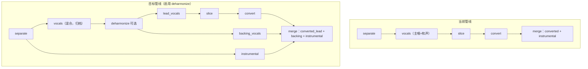
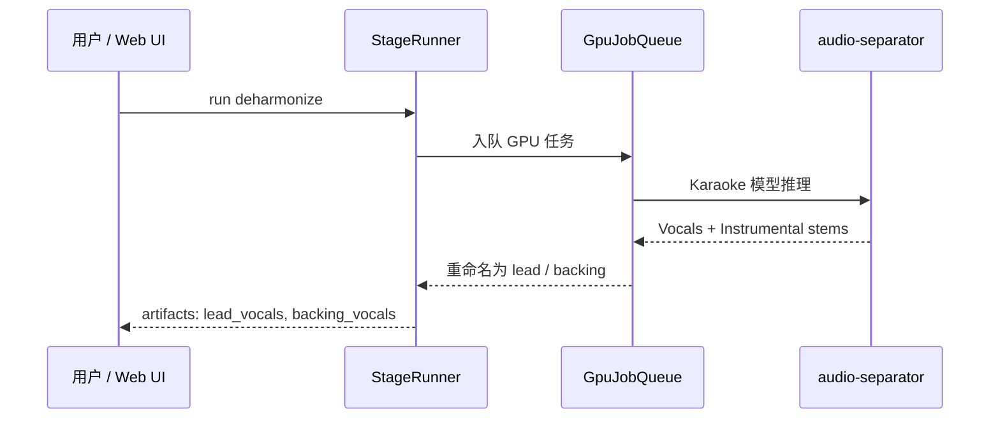
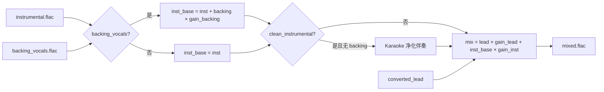

# 和声剥离与三轨合并落地设计方案

> **关联文档：** [已分离人声音轨剥离和声提纯主唱方案调研报告](./已分离人声音轨剥离和声提纯主唱方案调研报告.md)、[人声伴奏结合技术调研报告](./人声伴奏结合技术调研报告.md)、[人声伴奏结合安装指南](./人声伴奏结合安装指南.md)  
> **版本：** v1.0  
> **日期：** 2026-08-01  
> **状态：** 已实施（P0–P3，2026-08-01）  
> **硬件基线：** RTX 5060 Laptop 8 GB VRAM / i7-13700HX / 16 GB RAM

---

## 1. 背景与动机

### 1.1 业务目标

当前管线在 `separate` 阶段产出的人声 stem 包含**主唱 + 背景和声**的混合干音。后续 `slice → convert` 会对整段混合人声做歌声转换（Seed-VC），导致和声也被替换为目标音色，与「仅替换主唱、保留原曲和声」的制作意图不符。

目标能力：

1. 在词曲分离之后，将混合人声解耦为**提纯主唱（lead）**与**背景和声（backing）**两条 stem；
2. **仅对主唱**执行切片与歌声转换；
3. 在 `merge` 阶段按三轨叠加：

$$\text{mixed}(t) = \text{ConvertedLead}(t) + \text{Backing}(t) + \text{Instrumental}(t)$$

等价于先合并伴奏与和声，再叠加转换主唱（线性叠加可交换顺序，但建议分步 gain staging）。

### 1.2 与现有管线的关系



---

## 2. 边界问题确认（已锁定）

经评审，以下边界已在前期分析中确认，本方案作为设计前提，不再重复争论。

| 层级 | 边界问题 | 结论 |
|------|----------|------|
| **算法** | 主唱/和声频域重叠，双 stem 无法完美守恒 | 接受；选用双 stem Karaoke 模型，不以 Bleedless 为主模型 |
| **阶段** | deharmonize 插入点 | **separate 之后、slice 之前**；和声轨**不切片、不 convert** |
| **产物** | 是否保留混合 vocals | **保留** `vocals.flac` 作归档与回退；下游默认改读 `lead_vocals` |
| **merge** | 叠加公式 | 三轨线性叠加；`original_vocals` 参照改为 **lead_vocals** |
| **clean-instrumental** | 与 backing 共存 | 有三轨模式时**默认关闭** Karaoke 净化伴奏（见 §7.3） |
| **GPU** | 8 GB 显存 | separate / deharmonize / convert **串行**，不并行 |

---

## 3. 技术调研结论

### 3.1 方案选型

对 [调研报告 Top 4](./已分离人声音轨剥离和声提纯主唱方案调研报告.md) 结合本仓库约束评估：

| 方案 | 结论 |
|------|------|
| **① python-audio-separator + Karaoke RoFormer** | **首选** — 零新依赖、模型已装、可脚本化、Hyper-RVC 有 `--backing-vocals` 先例 |
| ② MVSep 云端 | 备选 — 品质略高但依赖网络与配额，不符合离线管线主路径 |
| ③ SpectraLayers Pro | 排除 — 商业 DAW、无法自动化 |
| ④ HOT-Step-CPP | 远期 — C++ 集成成本高，可作为性能优化二阶段 |

**主模型：** `mel_band_roformer_karaoke_aufr33_viperx_sdr_10.1956.ckpt`（已在 `separator-env/models/audio-separator/`）

**不采用 Bleedless 作为主模型：** `unwa FT2 Bleedless` 追求主唱极干度，会牺牲和声轨完整性；本需求必须保留 backing stem。

### 3.2 audio-separator Karaoke 模型行为（实测）

在 `audio-separator` 0.44.5 上查询模型元数据：

```json
{
  "filename": "mel_band_roformer_karaoke_aufr33_viperx_sdr_10.1956.ckpt",
  "stems": ["vocals", "instrumental"],
  "target_stem": "vocals"
}
```

**关键语义（输入为已分离的混合人声时）：**

| 输出 stem 名 | 实际含义 | 本方案重命名 |
|--------------|----------|--------------|
| `Vocals` | 提纯主唱（Lead） | `lead_vocals` |
| `Instrumental` | 背景和声（Backing）⚠️ 非伴奏 | `backing_vocals` |

> ⚠️ Karaoke 模型的 `Instrumental` stem 在「全曲分离」语境下指「非主唱部分（伴奏+和声）」；当**输入已是人声干音**时，该 stem 实质为**背景和声**。实施时必须重命名，避免与 `separate` 阶段的 `instrumental.flac` 混淆。

**推荐 CLI 参数（RTX 5060 8 GB）：**

```text
audio-separator <mixed_vocals.flac> \
  -m mel_band_roformer_karaoke_aufr33_viperx_sdr_10.1956.ckpt \
  --model_file_dir separator-env/models/audio-separator \
  --output_dir output/separated \
  --output_format flac \
  --mdxc_segment_size 256 \
  --mdxc_overlap 8 \
  --invert_spect
```

| 参数 | 值 | 说明 |
|------|-----|------|
| `mdxc_segment_size` | 256（或 352） | 显存 ~4–6 GB，与调研报告一致 |
| `mdxc_overlap` | 8（对应 overlap factor ~0.75–0.85） | 减少分段边界伪影 |
| `invert_spect` | 开启 | 光谱倒置，改善主唱重建（调研报告 §Spectral Inversion） |
| `single_stem` | **不使用** | 必须双 stem 输出 |

### 3.3 本机实测（`loveyou` 项目）

测试输入：`output/separated/loveyou_(vocals)_mel_band_roformer_kim_ft_unwa.flac`（时长 265.9 s）

| 指标 | 结果 |
|------|------|
| GPU 推理耗时 | **32 s**（约 8× 实时） |
| backing / orig RMS 比 | **0.47**（和声能量显著，不应跳过） |
| lead ↔ backing 相关系数 | **0.05**（分离正交性良好） |
| orig ↔ lead 相关系数 | 0.88 |
| 线性重建残差 `orig - lead - backing` / orig | **0.0002**（近乎完美相加还原） |

结论：对该曲，Karaoke 模型在**人声干音输入**下可稳定产出可用的 lead/backing 双轨，且线性叠加可还原混合人声，有利于 merge 能量守恒。

### 3.4 无和声跳过策略（调研）

| 策略 | 做法 | 优缺点 |
|------|------|--------|
| **A. 能量阈值（推荐）** | `backing_rms / orig_rms < τ` 则跳过，τ 建议 **0.08–0.12** | 全自动；loveyou(0.47) 不触发，纯主唱试听曲可跳过 |
| B. 用户开关 | `deharmonize_enabled: bool`，默认 false | 简单可控；依赖用户判断 |
| C. 固定执行 | 始终 deharmonize | 无判断成本；纯主唱曲引入多余 GPU 与 artifacts |

**推荐组合：B + A** — UI 提供「启用和声剥离」开关；开启后若 `backing_ratio < τ` 自动降级为 skip，并在日志中记录 `deharmonize_skipped: low_backing_energy`。

---

## 4. 架构设计

### 4.1 新增阶段 `deharmonize`

在 `StageName` 枚举中新增 `DEHARMONIZE = "deharmonize"`，位于 `separate` 与 `slice` 之间。



**阶段属性：**

| 属性 | 值 |
|------|-----|
| 运行环境 | `separator-env`（与 separate 相同） |
| GPU | 是（串行队列） |
| 输入 | `separate` 产出的混合 `vocals.flac` |
| 输出 | `lead_vocals.flac`、`backing_vocals.flac` |
| 可选 | `deharmonize_meta.json`（能量比、跳过原因、模型参数） |

### 4.2 产物路径约定

在 `output/separated/` 下扩展命名（与现有 `(Vocals)` / `(Instrumental)` 风格一致）：

| 产物 | 命名模式 | 示例 |
|------|----------|------|
| 混合人声（已有） | `{id}_(Vocals)_{sep_model}.flac` | `loveyou_(Vocals)_mel_band_roformer_kim_ft_unwa.flac` |
| 伴奏（已有） | `{id}_(Instrumental\|Other)_{sep_model}.flac` | `loveyou_(Other)_mel_band_roformer_kim_ft_unwa.flac` |
| **主唱（新增）** | `{id}_(Lead)_{karaoke_model}.flac` | `loveyou_(Lead)_mel_band_roformer_karaoke_aufr33_viperx_sdr_10.flac` |
| **和声（新增）** | `{id}_(Backing)_{karaoke_model}.flac` | `loveyou_(Backing)_mel_band_roformer_karaoke_aufr33_viperx_sdr_10.flac` |

`pipeline/paths.py` 新增：

- `separated_lead_vocals_path(project_id) -> Path | None`
- `separated_backing_vocals_path(project_id) -> Path | None`
- `has_deharmonize_artifacts(project_id) -> bool`

### 4.3 下游输入解析优先级

`store.resolve_stage_inputs` 调整：

| 阶段 | vocals / source_vocals 解析顺序 |
|------|--------------------------------|
| **slice** | `deharmonize.lead_vocals` → `separate.vocals`（glob） |
| **convert (full_track)** | 同上 |
| **merge `original_vocals`** | `deharmonize.lead_vocals` → `separate.vocals` |
| **merge `backing_vocals`** | `deharmonize.backing_vocals`（仅三轨模式） |

**向后兼容：** 未运行 `deharmonize` 时，行为与当前完全一致。

### 4.4 Merge 三轨扩展

扩展 `scripts/merge-audio.py` 与 `pipeline/stages/merge.py`：



**新增 CLI / stage 参数：**

| 参数 | 类型 | 默认 | 说明 |
|------|------|------|------|
| `backing_vocals` | path | — | 和声轨；有值则启用三轨 merge |
| `backing_gain_db` | float | 0.0 | 和声增益 |
| `include_backing` | bool | auto | 自动：有 backing 产物则叠加 |

**混音公式：**

$$\text{mixed} = g_l \cdot \text{Lead}_{\text{conv}} + g_b \cdot \text{Backing} + g_i \cdot \text{Inst}_{\text{base}}$$

其中 $\text{Inst}_{\text{base}}$ 为原始伴奏或（仅二轨模式）Karaoke 净化后的伴奏。

### 4.5 `clean_instrumental` 与三轨模式互斥规则

| 模式 | `clean_instrumental` | 原因 |
|------|---------------------|------|
| 二轨（无 backing） | 用户可选（默认 false） | 现有行为 |
| **三轨（有 backing）** | **强制 false**（或 UI 禁用并提示） | Karaoke 净化针对伴奏中**主唱残留**；三轨模式已显式还原和声，再净化可能削弱和声频段或与 backing 叠加冲突 |

日志提示示例：`clean_instrumental ignored: three-stem merge with backing_vocals`。

---

## 5. 模块改动清单

### 5.1 后端 / Pipeline

| 文件 | 改动 |
|------|------|
| `pipeline/models.py` | `StageName.DEHARMONIZE` |
| `pipeline/paths.py` | lead/backing glob、产物探测 |
| `pipeline/stages/deharmonize.py` | **新建** — 封装 Karaoke 推理、重命名、跳过逻辑 |
| `pipeline/stages/__init__.py` | 导出 `run_deharmonize` |
| `pipeline/runner.py` | `_execute_stage` 分支；`run_pipeline` 顺序插入 |
| `pipeline/store.py` | `resolve_stage_inputs` / `validate_stage_inputs` / `suggest_next_stage` |
| `pipeline/stage_params.py` | deharmonize + merge 新参数 |
| `pipeline/stage_log.py` | deharmonize 日志字段 |
| `scripts/deharmonize-vocals.py` | **新建** CLI（可选，便于单独调试） |
| `scripts/merge-audio.py` | `--backing-vocals`、`backing_gain_db`、三轨 `mix_tracks` |
| `pipeline/stages/merge.py` | 透传新参数 |

### 5.2 API / 前端

| 文件 | 改动 |
|------|------|
| `api/services/pipeline_service.py` | 允许 `deharmonize` stage |
| `frontend/src/types/pipeline.ts` | `StageName` 扩展 |
| `frontend/src/pages/` | 新增 `DeharmonizePage` 或嵌入 Separate 结果页 |
| `frontend/src/pages/MergePage.tsx` | 展示 backing 产物预览；三轨时禁用 clean_instrumental |

### 5.3 测试

| 文件 | 内容 |
|------|------|
| `tests/test_deharmonize.py` | mock separator；stem 重命名；跳过阈值 |
| `tests/test_merge_backing.py` | 三轨 mix；clean_instrumental 互斥 |
| `tests/test_paths.py` | lead/backing glob |
| `tests/test_store.py` | resolve 优先级 |

---

## 6. 参数设计

### 6.1 `deharmonize` stage_params

| key | 类型 | 默认 | 说明 |
|-----|------|------|------|
| `enabled` | bool | false | 是否执行（也可由是否触发 stage 决定） |
| `model` | choice | `mel_band_roformer_karaoke_aufr33_viperx_sdr_10.1956.ckpt` | Karaoke 模型 |
| `segment_size` | int | 256 | 对应 `--mdxc_segment_size` |
| `overlap` | int | 8 | 对应 `--mdxc_overlap` |
| `invert_spect` | bool | true | 光谱倒置 |
| `skip_backing_ratio_threshold` | float | 0.10 | backing/orig RMS 低于此值则跳过并回退 |
| `force` | bool | false | 忽略阈值强制执行 |

### 6.2 `merge` stage_params 增量

| key | 类型 | 默认 | 说明 |
|-----|------|------|------|
| `backing_vocals` | path | auto | 自动解析 deharmonize 产物 |
| `backing_gain_db` | float | 0.0 | 和声增益 |
| `include_backing` | bool | true | 有 backing 产物时默认叠加 |

---

## 7. GPU 调度与资源预算

```mermaid
gantt
    title RTX 5060 8GB 串行 GPU 阶段
    dateFormat X
    axisFormat %s

    section 典型全链路
    separate (~4GB)     :0, 60
    deharmonize (~5GB)  :60, 45
    convert (~7GB)        :105, 300
    merge (CPU)         :405, 60
```



| 阶段 | 峰值显存 | 典型耗时（4 min 曲） |
|------|----------|---------------------|
| separate | ~4 GB | 1–2 min |
| deharmonize | ~5 GB | **~30–45 s**（loveyou 实测 32 s） |
| convert (Seed-VC) | ~7 GB | 视切片数而定 |
| merge | CPU | 30–90 s（full profile） |

**约束：** `GpuJobQueue` 保持单任务串行；deharmonize 与 separate 共用 `separator-env`，不得与 convert 并行。

---

## 8. 分阶段实施计划

### P0 — 最小可用（后端 CLI + 路径）

- [x] `scripts/deharmonize-vocals.py`：双 stem 输出 + 重命名为 `(Lead)` / `(Backing)`
- [x] `paths.py` glob 函数
- [x] `merge-audio.py`：`--backing-vocals`、`backing_gain_db`
- [x] 手动端到端：`deharmonize → slice(lead) → convert → merge(三轨)`（GPU loveyou CLI deharmonize 已验证；全链路 convert 待人工听感）
- [x] 单元测试：paths、三轨 mix

**验收：** loveyou 曲人工听感 — 和声保留、主唱已转换、无明显双唱。（待 GPU 全链路人工试听）

**P0 测试（2026-08-01）：**

| 命令 | 结果 |
|------|------|
| `pytest tests/test_paths_deharmonize.py tests/test_merge_backing.py` | **6 passed** |
| TC-P0-01 `test_separated_lead_and_backing_glob` | pass |
| TC-P0-02 `test_mix_tracks_three_stem_rms` | pass |
| TC-P0-03 `test_clean_instrumental_ignored_with_backing` | pass |

### P1 — Pipeline 集成

- [x] `StageName.DEHARMONIZE` + `run_deharmonize` + runner/store
- [x] slice/convert/merge 输入解析切换至 lead_vocals
- [x] `deharmonize_meta.json`（能量比、skipped 标志）
- [x] 跳过阈值逻辑

**验收：** `pytest tests/test_deharmonize.py tests/test_store.py`；API `POST /stages/deharmonize` 可跑通。

**P1 测试（2026-08-01）：**

| 命令 / 用例 | 结果 |
|-------------|------|
| `pytest tests/test_deharmonize.py` | **7 passed**（mock separator、stem 重命名、跳过阈值、store resolve） |
| `pytest tests/test_store.py tests/test_inputs.py` | pass（含 lead 优先级） |
| 默认 `run_pipeline` 链 | **不含** deharmonize（`DEFAULT_PIPELINE_STAGES`），向后兼容 |
| TC-DH-03 未跑 deharmonize | slice 仍解析 separate.vocals — `test_store_without_deharmonize_uses_separate_vocals` pass |

### P2 — Web UI

- [x] Deharmonize 阶段卡片（参数 + 运行 + lead/backing 预览）
- [x] Merge 页展示 backing 轨；三轨时禁用 clean_instrumental
- [x] `suggest_next_stage` 在 separate 后推荐 deharmonize（可选）

**P2 测试（2026-08-01）：**

| 项 | 结果 |
|----|------|
| `npm run build`（tsc） | pass |
| Playwright `deharmonize-merge.spec.ts` | 2/2 pass |
| MCP 手工：侧边栏「和声剥离」Tab + loveyou 项目页 | Tab 可见、页头含和声剥离阶段徽章 |

**Playwright MCP 集成测试（2026-08-01 02:14–02:20，loveyou 项目）：**

前置：停止 8000 / 5173 旧进程 → 重启 `uvicorn api.main:app` 与 `npm run dev`，确保测试最新代码。

| 步骤 | 操作 | 结果 |
|------|------|------|
| 1 | 打开「和声剥离」Tab | pass — 参数表单、默认 vocals 路径正常 |
| 2 | UI 触发 deharmonize | pass — `POST /api/projects/loveyou/stages/deharmonize/run` → 200 |
| 3 | 等待 GPU 任务 | pass — ~34 s；`backing_ratio=0.4737`；`project.json` → `deharmonize.status=done` |
| 4 | 日志 | pass — `output/.projects/loveyou/logs/deharmonize-def9c6d39bf4.log` 含 Lead/Backing 路径 |
| 5 | 打开「合并」Tab | pass — 提示「检测到和声轨 — 三轨 merge 模式；Karaoke 净化伴奏已禁用」 |
| 6 | 三轨 UI 控件 | pass — `include_backing` 默认勾选；`clean_instrumental` 隐藏；和声预览可加载 |
| 7 | UI 触发三轨 merge | pass — ~15 s；`success=true` |
| 8 | merge 日志 | pass — `merge-e203e67f1999.log`：`include_backing=true`、`clean_instrumental=false`、`backing_gain_db=6.5` |
| 9 | 产物 | pass — `output/merged/loveyou/full/vocals.flac`、`mixed.flac` |
| 10 | 侧边栏徽章 | pass — loveyou 显示 `●和声剥离` `●合并` |
| 11 | 浏览器控制台 | 0 error |

### P3 — 质量增强（可选）

- [x] `--invert_spect` 默认 true（stage_params + deharmonize）
- [x] backing 自动增益：按 `backing_ratio` 预填 `backing_gain_db`（`get_project_defaults`）
- [ ] 切片模式 manifest 记录 `deharmonize` 参数快照（远期）
- [x] Playwright：三轨 merge 回归用例（`e2e/deharmonize-merge.spec.ts`）

---

## 9. 测试验收用例

| ID | 场景 | 预期 | 自动化结果（2026-08-01） |
|----|------|------|--------------------------|
| TC-DH-01 | loveyou 启用 deharmonize | 产出 Lead + Backing；`backing_ratio > 0.1` | **GPU CLI pass**（`backing_ratio=0.47`，27s）；**UI pass**（MCP：`backing_ratio=0.4737`，34s） |
| TC-DH-02 | 纯主唱试听曲 | `backing_ratio < 0.1` → skip；slice 仍用原 vocals | `test_run_deharmonize_skips_low_backing` pass |
| TC-DH-03 | 未跑 deharmonize | 全链路行为与改造前一致 | `test_store_without_deharmonize_*` + 默认 pipeline 不含 deharmonize pass |
| TC-MG-01 | 三轨 merge | `mixed ≈ lead_conv + backing + inst`（RMS 容差内） | `test_mix_tracks_three_stem_rms` pass |
| TC-MG-02 | 三轨 + clean_instrumental=true | 忽略净化，日志警告 | 单测 + Playwright 隐藏 checkbox pass；MCP merge 日志确认 `clean_instrumental=false` |
| TC-MG-03 | 切片模式 + 三轨 | manifest 回贴基于 lead；backing 整轨叠加 | store resolve lead + merge backing 单测 pass；**full profile 三轨 merge UI 端到端 pass**（2026-08-01 MCP） |
| TC-GPU-01 | separate → deharmonize → convert 串行 | 无 OOM | deharmonize **27s / ~5GB 级** pass（2026-08-01）；convert 串行待测 |

### 9.1 最终测试报告（2026-08-01）

| 层级 | 命令 | 结果 |
|------|------|------|
| Python 单元/集成 | `pytest tests/` | **262 passed** |
| 前端类型检查 | `npm run build` | pass |
| Playwright E2E 全量 | `npm run test:e2e` | **23 passed**（含新增 `deharmonize-merge.spec.ts` 2 例） |
| Playwright MCP 集成 | loveyou：deharmonize → 三轨 merge 全 UI 流程 | **11/11 pass**（见 §8 P2 MCP 表） |

**新增测试文件：**

- `tests/test_paths_deharmonize.py`
- `tests/test_merge_backing.py`
- `tests/test_deharmonize.py`
- `frontend/e2e/deharmonize-merge.spec.ts`

**待人工/GPU 补验：** 基于 **Lead** 人声重新 slice → convert → 三轨 merge 全链路听感；三轨 mixed 成品主观试听。

**2026-08-01 补修：**

1. `separator_env()` 不再设置 `CUDA_VISIBLE_DEVICES=""`（phoneme worker 自行隔离 CPU），修复 separate/deharmonize GPU 推理。
2. `find_karaoke_stems()` 改为匹配 `(Vocals)_` / `(Instrumental)_` 大小写 stem 后缀，避免输入文件名中的 `(vocals)` 误判。

---

## 10. 风险与缓解

| 风险 | 影响 | 缓解 |
|------|------|------|
| Karaoke `Instrumental` 命名误导 | 产物混淆、错误叠加 | 强制重命名为 `(Backing)`；代码注释与 UI 文案 |
| 强混响/合唱曲和声 SDR 低（~7 dB） | 和声轨含主唱 bleed | 接受；可选 backing_gain 微调；远期 MVSep 备选 |
| Bleedless 误用 | 和声轨残缺 | 参数文档与 UI 仅推荐 Karaoke/Duet |
| instrumental 残留与 backing 叠加 | 和声偏厚 | 三轨模式默认关 clean_instrumental；提供 backing_gain 调节 |
| 新增 stage 破坏现有项目 JSON | 旧项目无法跑 | `deharmonize` 默认 skipped；resolve 回退 separate.vocals |
| 8 GB OOM | deharmonize 失败 | segment_size=256；文档化；失败时回退 skip |

---

## 11. 结论

在已确认的边界前提下，本仓库应新增可选 **`deharmonize` 阶段**，采用已安装的 **`mel_band_roformer_karaoke_aufr33_viperx`** 双 stem 模型，在 **RTX 5060 8 GB** 上串行运行；`loveyou` 实测表明 lead/backing 分离质量与线性重建均满足三轨 merge 前提。`merge` 扩展 `--backing-vocals` 与 `backing_gain_db`，三轨模式下禁用 `clean_instrumental`，即可实现「保留原曲和声 + 仅替换主唱」的 Cover 工作流。

**建议实施顺序：** P0（CLI 验证听感）→ P1（管线集成）→ P2（UI）→ P3（增益自动化与回归）。
