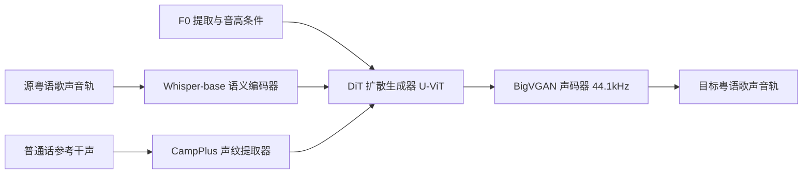

# 基于普通话人声特征替换粤语歌声的跨语种歌声转换技术调研报告

## 现行跨语种语音与歌声克隆市场格局及现成方案评估

在当前的语音合成（TTS）与歌声合成（SVS）技术生态中，针对"使用普通话人声特征替换粤语歌声"这一需求，市场上已经存在数种不同维度的现成解决方案。然而，由于语音（Speech）与歌声（Singing）在音高动态变化、时值拉伸以及情感表达上的巨大差异，现有的现成方案在适用性上呈现出明显的两极分化。

### 现成语音克隆方案的局限性

主流的商业化跨语种语音克隆平台，如 ElevenLabs 和 MiniMax，虽然在标准语音合成领域表现出色，但无法直接满足高质量歌声转换的需求。测试数据表明，ElevenLabs 尽管能够识别广东话文本并利用克隆的声音生成粤语语音，但在声调准确率上仅能达到 80% 至 85% 左右，尤其容易混淆粤语中的三声（阴去）与六声（阳去），且在处理粤语特有的口音和口语词汇时表现欠佳。MiniMax 虽提供了低门槛的"10秒快速语音克隆"服务，但其底层逻辑依然基于文本转语音（TTS）或普通的语音变声，并不支持歌声克隆与歌声转换。此类语音克隆系统在面对歌声中宽广的音域波动、复杂的共鸣和特有的声乐技巧（如颤音、咬字时值的极度拉伸）时，极易产生严重的电音失真和发音断裂。

### 现成歌声克隆方案的适用性

相比之下，专门针对音乐制作开发的歌声克隆与合成平台（如 ACE Studio 和 Kits.ai）则提供了真正意义上开箱即用的跨语种歌声转换方案。此类平台的核心技术在于"语音适配"与"歌声特征分离"。ACE Studio 允许创作者上传普通话歌唱或说话的录音来训练专属的歌手模型。得益于其底层的多语种适配架构，训练完成的普通话歌手模型可以直接读取粤语的 MIDI 旋律与拼音歌词，无需针对粤语进行二次训练，即可自动调整发音、咬字和语句表达，使其符合粤语母语者的听觉期望。Kits.ai 则通过其专有的歌声转换（KVC）技术，允许用户上传普通话干声并在线将其转换为粤语歌声，系统在处理音调稳定性、肺活量动态释放以及声乐细节（如泡音）方面均达到了专业录音室级别。

## 跨语种歌声转换的核心技术瓶颈与机理解析

要实现用普通话人声完美演绎粤语歌声，技术团队必须克服两种语言在声调系统、发音部位以及声学特征解耦上的底层物理差异。

### 语言学层面的声调与音标对齐瓶颈

普通话属于典型的"四声"系统，而粤语则拥有极其复杂的"九声六调"，并保留了古汉语完整的入声韵尾（如以塞音 -p, -t, -k 结尾的字音）。当普通话说话者的声音特征被用于演唱粤语歌曲时，若系统直接进行音素到音素的简单映射，会导致入声尾音丢失，或者因音高曲线上升下降的斜率不拟合而产生严重的"机读感"。

为了攻克这一瓶颈，学术界的前沿研究（如 Transinger 架构）引入了基于国际音标（IPA）的跨语种音标对齐机制。通过将粤语歌词和普通话参考音频同时分解为不依赖特定语言的国际音标元音、辅音及变音符号，模型能够跨越语种壁垒，精准捕捉辅音的咬字位置（如舌尖音、唇齿音）和元音的共鸣腔体分布，从而在重构粤语歌声时保持极高的发音自然度。

### 声学特征解耦与重构的物理机理

在声学物理层面，跨语种歌声转换的本质是在保持源粤语歌声的"语义内容"与"基频旋律"不变的前提下，将"说话人特征（声纹）"替换为目标普通话用户的特征。

$$
L_{ULR} = L_{pr} - \lambda L_{sr}
$$

在基于解耦通用语言表征（ULR）的学术方案中，声学模型训练时引入了上述对抗损失函数，其中 $L_{pr}$ 代表音素预测器的交叉熵损失，用于强制模型提取与说话人无关的纯净语义信息；而 $L_{sr}$ 则代表说话人分类器的损失。通过梯度截断和对抗训练（以参数 $\lambda$ 进行平衡），模型能够彻底剥离源歌手的音色，仅保留其歌唱时的发音骨架。随后，声纹提取器提取普通话目标人声的梅尔倒谱系数（MFCC）或高维声纹特征，并将其作为条件注入到基于扩散变换器（Diffusion Transformer）的波形重建模块中。

为了保障音乐品质，重构过程通常需要引入 NSF（Neural Source Filter）歌声解码器或 BigVGAN 声码器，以 44.1kHz 的超高采样率还原高频泛音区，从而避免了传统语音声码器在高音区产生的相位抵消与谐波失真。

## 深度可行性技术方案调研

结合开源社区与商业应用，以下三套方案在技术成熟度、跨语种还原度以及声音保真度上均代表了当前行业的前沿水平。

### 方案一：基于 Seed-VC 的开源零样本与微调歌声转换方案

[Seed-VC](https://github.com/Plachtaa/seed-vc) 是一款基于扩散变换器（Diffusion Transformer / U-ViT）架构的开源语音与歌声转换框架，其在零样本（Zero-Shot）场景下的跨语种声纹迁移能力极为强悍。项目仓库已于 2025 年归档（ARCHIVED），但代码与 Hugging Face 预训练模型仍可正常使用，社区亦有持续维护的 fork 版本。

#### 模型选型说明

Seed-VC 发布了多个模型，**粤语歌声转换场景应使用 V1 歌声模型**，而非 V2 模型：

| 版本 | 模型名称 | 用途 | 采样率 | 参数量 | 本场景是否适用 |
| --- | --- | --- | --- | --- | --- |
| v1.0 | seed-uvit-whisper-base | **歌声转换（SVC）** | 44100 Hz | 200M | ✅ **推荐** |
| v1.0 | seed-uvit-whisper-small-wavenet | 离线语音转换 | 22050 Hz | 98M | ❌ 不支持 F0 控制 |
| v1.0 | seed-uvit-tat-xlsr-tiny | 实时语音转换 | 22050 Hz | 25M | ❌ 仅适合实时说话 |
| v2.0 | hubert-bsqvae-small | 语音与口音转换 | 22050 Hz | 157M | ⚠️ 无 `--f0-condition`，不适合歌声 |

> **重要修正：** 歌声转换应使用 `inference.py`（V1）并开启 `--f0-condition True`，对应模型 `seed-uvit-whisper-base`。`inference_v2.py` 为 V2 口音/风格转换脚本，**不包含** `--f0-condition` 参数，不适用于保留音高轨迹的歌声转换场景。

#### 技术架构与机制



该方案利用预训练的 Whisper-base 多语言语义编码器提取源粤语歌声的语义表征，增强对未见语种的泛化能力。声纹提取部分使用 CampPlus 捕获目标普通话参考音频的声纹特征，通过 U-ViT 扩散模型进行声学特征融合与重建，最终由 BigVGAN 声码器以 44.1kHz 采样率输出。推理时需开启音高条件控制（`--f0-condition True`），以精准捕捉并锁定原唱歌手的滑音、换气与颤音轨迹。

V2 模型（`inference_v2.py`）采用 CFM（条件流匹配）+ AR（自回归）双模块架构，位于 `modules/v2/cfm.py`，主要用于语音口音与情感风格转换，与本场景的 F0 条件歌声转换路径不同。

#### 硬件与环境要求

| 项目 | 最低要求 | 推荐配置 | 说明 |
| --- | --- | --- | --- |
| GPU | NVIDIA 独显，6 GB 显存 | 8 GB+ 显存 | 歌声转换最低 6 GB，推荐 8 GB+ |
| GPU 架构 | CUDA 11.8+ | CUDA 12.8+ | RTX 50 系（Blackwell / sm_120）**必须**使用 cu128 版 PyTorch |
| 驱动 | NVIDIA Driver 561+ | 最新稳定版 | RTX 50 系需 561+（Windows） |
| CPU | 无硬性要求 | 8 核以上 | 负责音频预处理与数据加载 |
| 内存 | 8 GB | 16 GB+ | 推理时 Whisper + 模型同时驻留内存 |
| 磁盘 | 10 GB 可用空间 | 20 GB+ | 含模型权重（约 3–5 GB）与环境依赖 |
| Python | 3.10 | 3.10 | 官方推荐版本，Windows 上兼容性最佳 |
| 操作系统 | Windows 10/11、Linux | Windows 11 | 官方支持 Windows 与 Linux |

**按任务的显存参考（官方与社区实测）：**

| 任务 | 最低显存 | 推荐显存 |
| --- | --- | --- |
| 普通语音转换 | 4 GB | 8 GB+ |
| **歌声转换（本场景）** | **6 GB** | **8 GB+** |
| V2 模型推理 | 6 GB | 8 GB+ |
| 微调训练（batch=2） | 6–8 GB | 8 GB+ |

**首次运行自动下载的模型（约 3–5 GB）：**

- `seed-uvit-whisper-base` 扩散模型（~200M 参数）
- Whisper-base 语义编码器
- BigVGAN 声码器
- CampPlus 声纹提取器

#### 本机部署可行性评估

基于 2026-07-20 对本机的实测，评估结果如下：

| 项目 | 本机配置 | 要求 | 评估 |
| --- | --- | --- | --- |
| GPU | NVIDIA GeForce RTX 5060 Laptop，8 GB 显存 | 6 GB+（推荐 8 GB+） | ✅ 达标 |
| GPU 架构 | Blackwell，Compute Capability 12.0 (sm_120) | 需 PyTorch cu128 | ⚠️ 需特殊安装 |
| 驱动 / CUDA | Driver 573.22，CUDA 12.8 | CUDA 11.8+（50 系需 12.8） | ✅ 满足 |
| CPU | Intel i7-13700HX（16 核 / 24 线程） | 无硬性要求 | ✅ 充裕 |
| 内存 | 15.7 GB | 建议 16 GB+ | ⚠️ 偏紧 |
| 磁盘 | C 盘剩余 165.9 GB | 10 GB+ | ✅ 充足 |
| 系统 | Windows 11 | Windows 10/11 | ✅ |
| Python | 3.12.10（已安装） | 推荐 3.10 | ⚠️ 建议新建 3.10 环境 |
| PyTorch | 未安装 | 必须，且需 cu128 版本 | ❌ 待配置 |

**综合评分：⭐⭐⭐⭐（4/5）—— 硬件支持本地部署，软件环境待配置。**

- **零样本歌声转换：** 可行。8 GB 显存 + `--fp16 True` + `diffusion-steps 30–50` 可正常运行；笔记本 RTX 5060（115W TDP）单首 3–4 分钟歌曲预计推理 2–8 分钟。
- **可选微调（100 步）：** 勉强可行，建议 `batch-size 1` 并关闭占显存的其他程序。
- **主要风险：** RTX 5060 为 Blackwell 新架构，必须使用 CUDA 12.8 版 PyTorch；16 GB 内存在推理时偏紧，需关闭多余应用；避免同时加载 V1 + V2 模型（易 OOM）。

#### 本地部署步骤

以下步骤基于本机 Windows 11 + RTX 5060 环境编写，部署目录建议为 `D:\docs\research\音频转换\seed-vc`。

**步骤 1：安装 Python 3.10 并创建虚拟环境**

```powershell
# 若尚未安装 Python 3.10，从 python.org 下载安装后执行：
py -3.10 -m venv D:\docs\research\音频转换\seed-vc-env
D:\docs\research\音频转换\seed-vc-env\Scripts\activate
python --version   # 应显示 Python 3.10.x
```

**步骤 2：安装支持 RTX 5060 的 PyTorch（CUDA 12.8）**

RTX 50 系（sm_120）不支持旧版 cu121/cu124 的 PyTorch，必须安装 cu128 版本：

```powershell
pip install torch torchvision torchaudio --index-url https://download.pytorch.org/whl/cu128
```

验证 GPU 是否可用：

```powershell
python -c "import torch; print('PyTorch:', torch.__version__); print('CUDA:', torch.cuda.is_available()); print('GPU:', torch.cuda.get_device_name(0) if torch.cuda.is_available() else 'N/A')"
```

若报错 `sm_120 is not compatible`，尝试 nightly 版本：

```powershell
pip install --pre torch torchvision torchaudio --index-url https://download.pytorch.org/whl/nightly/cu128
```

**步骤 3：克隆 Seed-VC 并安装依赖**

```powershell
cd D:\docs\research\音频转换
git clone https://github.com/Plachtaa/seed-vc.git
cd seed-vc
pip install -r requirements.txt
```

若 Hugging Face 访问困难，设置镜像：

```powershell
$env:HF_ENDPOINT="https://hf-mirror.com"
```

**步骤 4：准备输入音频**

| 文件 | 要求 |
| --- | --- |
| 源粤语歌声（`source`） | 干净干声，无伴奏/和声/混响，建议 WAV 格式，44.1kHz 或 48kHz |
| 普通话参考干声（`target`） | 1–30 秒清晰普通话说话或歌唱片段，无背景噪音 |

**步骤 5：命令行推理（歌声转换，推荐）**

```powershell
python inference.py `
  --source "D:\path\to\源粤语歌声.wav" `
  --target "D:\path\to\普通话参考干声.wav" `
  --output "D:\docs\research\音频转换\output" `
  --diffusion-steps 40 `
  --f0-condition True `
  --fp16 True
```

参数说明：

- `--diffusion-steps`：扩散步数，推荐 30–50（质量优先）或 20–30（速度优先）
- `--f0-condition True`：开启 F0 音高条件，**歌声转换必须开启**
- `--fp16 True`：半精度推理，**8 GB 显存必须开启**，约节省 40% 显存
- `--semi-tone-shift 0`：音高半音偏移，可按需调整（-12 至 +12）

**步骤 6：Web UI 推理（可选）**

```powershell
python app_svc.py --fp16 True
```

浏览器访问 `http://localhost:7860/`，上传源音频与参考音频进行转换。Web UI 会自动加载 `seed-uvit-whisper-base` 歌声模型。

> 显存有限时，**不要**运行 `python app.py --enable-v1 --enable-v2`，该命令会同时加载 V1 和 V2 全部模型，8 GB 显存极易 OOM。

**步骤 7（可选）：微调提升声纹相似度**

若零样本效果不够理想，可用少量普通话干声微调：

```powershell
python train.py `
  --config configs/presets/config_dit_mel_seed_uvit_whisper_base_f0_44k.yml `
  --dataset-dir "D:\path\to\普通话干声数据集" `
  --run-name my-voice-finetune `
  --batch-size 1 `
  --max-steps 100 `
  --num-workers 0
```

- 数据集：每条音频 1–30 秒，至少 1 条，格式支持 `.wav` / `.flac` / `.mp3` 等
- 8 GB 显存建议 `--batch-size 1`；官方 T4 上 100 步约 2 分钟
- 微调完成后，checkpoint 位于 `./runs/my-voice-finetune/ft_model.pth`

**步骤 8：显存优化与故障排查**

| 现象 | 处理方式 |
| --- | --- |
| CUDA OOM（显存不足） | 降低 `--diffusion-steps` 至 20–30；确保 `--fp16 True`；仅加载 SVC 模型 |
| sm_120 不兼容 | 安装 cu128 或 nightly 版 PyTorch（见步骤 2） |
| Hugging Face 下载失败 | 设置 `$env:HF_ENDPOINT="https://hf-mirror.com"` |
| 推理速度慢 | 笔记本 GPU 功耗受限属正常；可降至 `--diffusion-steps 25` |
| 输出有电音/断裂 | 检查源音频是否含伴奏；参考音频是否足够清晰 |
| 内存不足 | 关闭浏览器、IDE 等占内存程序；保留 4–6 GB 给系统 |

**推荐参数配置（本机 RTX 5060 8GB）：**

| 参数 | 质量优先 | 速度优先 |
| --- | --- | --- |
| `--diffusion-steps` | 40 | 25 |
| `--fp16` | True | True |
| `--f0-condition` | True | True |
| 预计单首推理时间 | 5–8 分钟 | 2–4 分钟 |
| 预计显存占用 | ~6–7 GB | ~5–6 GB |

### 方案二：基于 ACE Studio 的专业级跨语种歌声重构方案

ACE Studio 采用了与纯变声（SVC）不同的"歌声合成重构（SVS）"技术路线，代表了商业领域高表现力歌声克隆的最高水准。

- **技术架构与机制：** ACE Studio 的单个歌手声音模型支持多语言演唱，系统通过高级智能语音适配算法，将目标普通话歌手声线的发音结构与粤语的发音系统进行深度映射，避免了因语种不同而产生的发音扭曲。系统还允许用户通过类似 MIDI CC 控制线的方式，绘制气声、胸声、张力、咬字力度等复杂的声乐参数包络，实现非破坏性的歌唱表现力控制。

- **操作流程与部署：**
  - **歌手模型训练：** 创作者需在平台的"自定义歌手"专业槽位中，上传 30 至 100 分钟干净、干燥、无混响、无延迟的普通话歌声或说话干声素材进行深度模型训练。
  - **干声旋律提取：** 将原始粤语歌曲中的原唱人声音轨导入 ACE Studio，点击"干声转换"按钮，系统将自动高精度识别并提取出 MIDI 音符、歌词文本以及精细的 F0 音高曲线。
  - **粤语重构演绎：** 在时间线上应用定制好的普通话歌手模型，系统会自动将普通话声线套入提取出的粤语 MIDI 和歌词中进行合成。由于直接基于发音规则合成，创作者可在钢琴卷帘中对个别粤语多音字或字音进行手动微调，彻底解决跨语种咬字偏差。

### 方案三：基于 Kits.ai 的云端一站式智能歌声转换方案

Kits.ai 是目前全球领先的免本地算力、面向专业音乐制作人的 AI 歌声克隆与转换平台。

- **技术架构与机制：** Kits.ai 开发了专有的 Kits Voice Conversion (KVC) 引擎。该引擎在传统歌声变声系统的基础上进行了底层重构，引入了比标准自监督模型更先进的 Xeus 和 Hybrid 内容编码器，配合自适应内容特征检索平滑算法，在转换跨语种歌声时能保留极高的字词清晰度与声纹相似度。同时，其推理管线内置了自动 EQ 调节和频谱平衡技术，能够自动对齐输入源与输出模型的频谱特性。

- **操作流程与部署：**
  - **声线克隆：** 创作者登录平台，在"Create Voices"页面上传至少 10 分钟干燥、单声道的普通话人声素材（建议进行 Subtle Pitch Correction 和轻度压缩以保证数据集质量），一键启动云端训练。
  - **在线转换：** 训练完成后，在"Voice Changer"界面上传源粤语干声音轨（需确保音轨干净，不含和声与背景伴奏）。
  - **参数调节与输出：** 选择克隆好的普通话声线，调整音高平移（Semitones）和转换引导比例，启动云端转换，即可在线下载 44.1kHz 无损格式的替换人声音轨。

## 综合多维指标对比与 Top 3 方案评级

为了向创作者提供最客观、最贴合实际落地需求的决策依据，以下表格结合了转换品质、发音准确性、资源消耗及资金成本等多重维度，对上述三套可行性方案进行了量化对比。

| 评估维度 | 方案一：Seed-VC (开源扩散模型) | 方案二：ACE Studio (歌声合成重构) | 方案三：Kits.ai (云端一站式变声) |
| --- | --- | --- | --- |
| 技术路径 | 纯声歌变声（Audio-to-Audio SVC） | 旋律提取与歌声合成（Audio-to-MIDI-to-Singing） | 智能云端声歌变声（Cloud SVC） |
| 转换保真度与音质 | 极高（支持 44.1kHz 输出，高音区谐波饱满） | 顶级（重构合成，完全避免音轨分离引入的杂音） | 极高（自适应 EQ 和频谱平衡，听感现代且均衡） |
| 粤语发音与咬字自然度 | 优秀（高度依赖源粤语歌声原唱的咬字清晰度） | 完美（支持对每一个粤语字音、气声、强弱进行手动精修） | 优秀（搭载高级 Xeus 编码器，跨语种过渡圆滑） |
| 声纹相似度还原度 | 高（零样本表现可接受，通过快速微调可达优秀水平） | 顶级（深度定制歌手模型，精准捕捉细微共鸣与发音特色） | 极高（基于 proprietary HD 歌手数据集微调，相似度极高） |
| 数据与算力门槛 | 极低数据（1–30 秒参考音频）；需 NVIDIA 独显 6 GB+（歌声推荐 8 GB+）；RTX 50 系需 PyTorch cu128 | 高数据需求（30–100 分钟高保真干声）；本地算力需求极低 | 中等数据需求（10 分钟干声）；零本地算力（完全托管于云端） |
| 资金支出成本 | 完全免费（开源项目，仅需本地硬件折旧与电费） | 中等（需订阅其专业版软件以激活多语种自定义歌手槽位） | 较低至中等（提供免费额度，付费订阅起步价 $10/月） |
| 版权合规与商用安全性 | 高（本地离线运行，数据完全自主掌控） | 极高（创作者拥有上传数据的完整权利，平台支持商用） | 极高（行业首家获得"Fairly Trained"合规认证的平台） |
| 操作复杂度 | 中等（涉及终端环境配置、参数调整与本地推理） | 高（需具备 DAW 宿主软件使用经验与基本的乐理知识） | 极低（纯网页端图形化操作，拖放式工作流） |

## 实施结论与落地路径推荐

通过对当前跨语种歌声转换技术栈的深度解构，本研究针对不同的应用场景和创作者画像，给出如下具体的落地实施路径推荐：

### 极客玩家与预算敏感型创作者的黄金通道：采用方案一（Seed-VC）

如果创作者具备基本的代码运行能力，且拥有一台配备 NVIDIA 显卡的个人电脑，Seed-VC 毫无疑问是最高效且性价比最高的可行路径。在实际操作中，无需耗费数小时去录制和剪辑训练数据集，只需准备一段 30 秒内自己清晰、无噪音的普通话唱歌片段作为声纹参考源，即可直接对原始粤语歌曲干声进行高质量的变声转换。其内置的 F0 音高追踪机制能够确保原唱歌手的所有歌唱技巧被完整转移到创作者的声线中，输出质量足以满足日常娱乐、Demo 制作和网络音视频内容的创作需求。

**本机可行性结论：** 经实测，本机（RTX 5060 Laptop 8GB + i7-13700HX + 16GB RAM）硬件满足 Seed-VC 歌声转换的最低与推荐显存要求，综合评分 4/5。当前主要障碍为软件环境未配置（PyTorch 未安装，且 RTX 5060 需 cu128 版 PyTorch）。按本文「方案一 → 本地部署步骤」完成环境搭建后，即可开始零样本粤语歌声转换。完整部署步骤见上文方案一章节。

### 音乐制作人与商业出版级品质的终极选择：采用方案二（ACE Studio）

若该转换项目旨在发布正式的音乐单曲，或对粤语发音的字字句句有着近乎苛刻的审美要求，ACE Studio 是唯一能够保障商业级品质的方案。虽然该方案在前期需要创作者在安静环境下，使用专业电容麦克风认真录制 1 小时左右的纯净普通话干声素材，但在中后期制作中，通过其强大的"干声转 MIDI/歌词"技术和多语种语音适配引擎，创作者能获得对整首歌曲无可比拟的控制力。原唱歌手在乐句处理上的瑕疵可以被修正，粤语咬字不准的问题可以通过手动调整音标和拼音来彻底根除，最终导出的无损人声轨可以直接无缝混入各大主流 DAW 软件工程中进行母带制作。

### 追求快捷交付与开箱即用体验的轻量化选择：采用方案三（Kits.ai）

对于不希望折腾本地软硬件环境、同时希望在极短时间内看到高品质转换效果的创作者，Kits.ai 提供了最为友好的折中路线。创作者只需抽出 10 分钟时间录制一段标准的普通话干声并上传，其余的数据清洗、自适应均衡、模型训练和推理合成全部由 Kits 的云端服务器在数分钟内自动完成。其强大的 Xeus 混合编码器在应对普通话到粤语的声学跨越时，展现出了极高的稳定度，能够以极低的时间和精力成本，输出具备现代唱片工业质感的粤语人声音轨。
