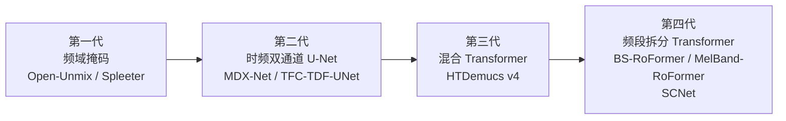
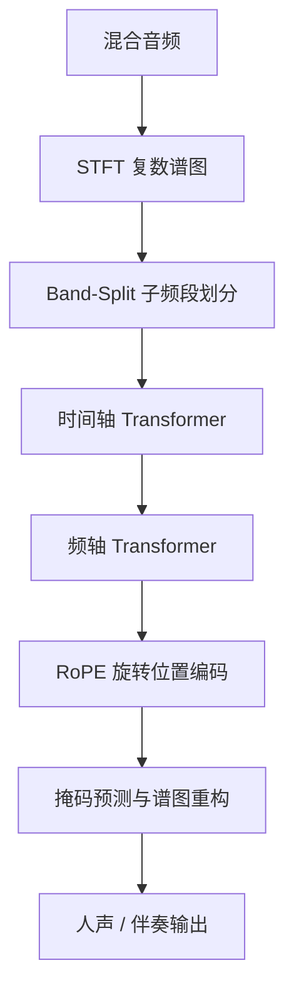
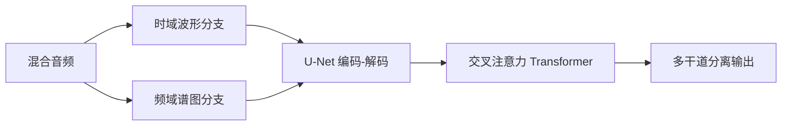
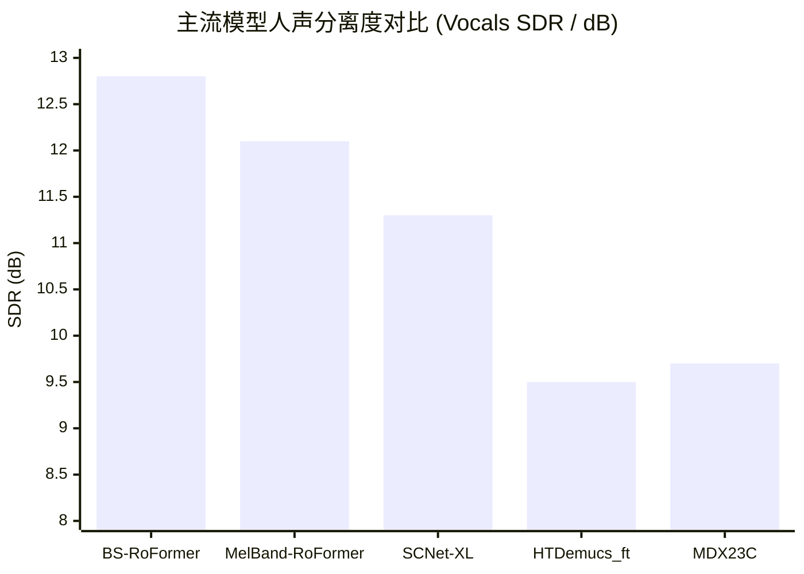
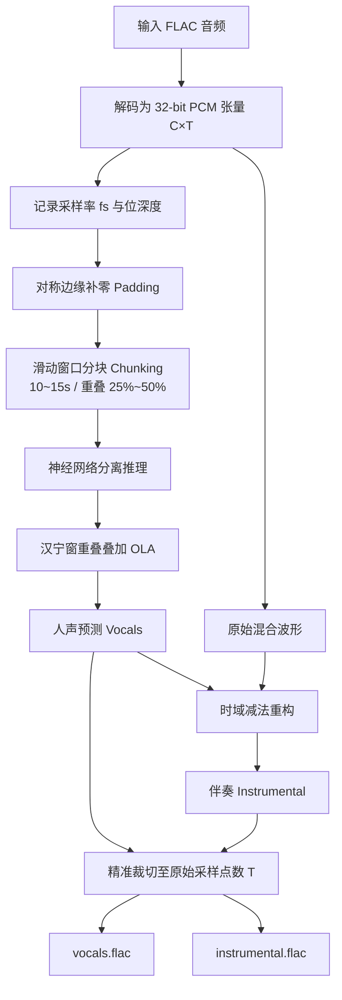
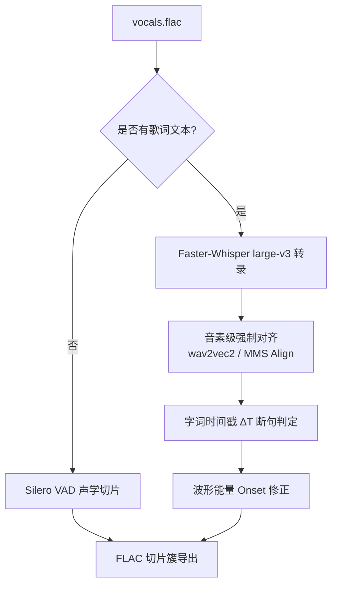
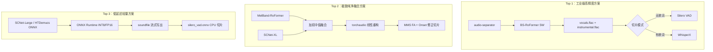
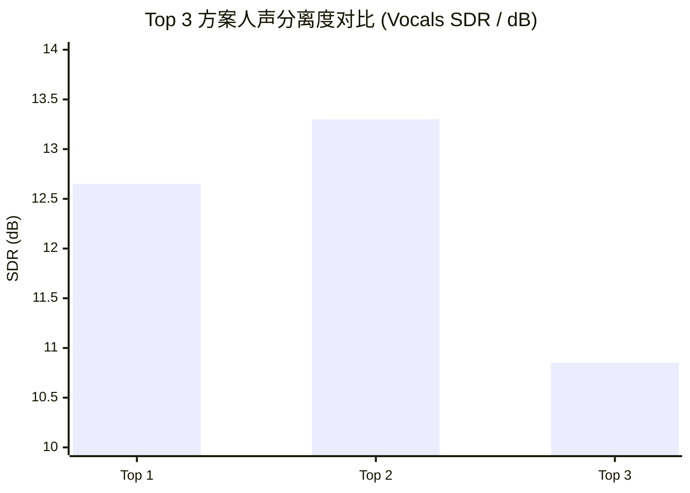
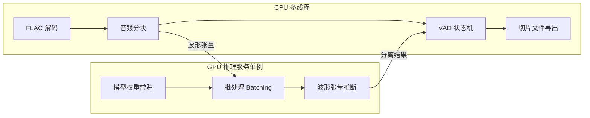

# 歌曲词曲分离与声乐切片技术深度调研及系统架构设计报告

> **原始调研问题：** 帮我深度调研一下当前成熟的歌曲词曲分离方案，打个比方，将一个 flac 格式的歌曲音频，分为两个同时长、同文件类型的歌手音频和背景音乐音频。如果没有现成的方案，则进行方案设计，最终给出方案的 top3。最好还可以按歌词即歌手的断句，分为多个音频切片，但是不作为必须项，属于加分项。

歌曲词曲分离（Music Source Separation, MSS）是音频信号处理与深度学习交叉领域的核心课题，其目标是从混合音乐音频中精准提取出独立的人声音轨（Vocals）与背景伴奏音轨（Instrumental/Accompaniment）。近年来，随着深度神经网络架构从时频掩码向频段拆分 Transformer 及稀疏压缩网络的演进，词曲分离的信号失真比（Signal-to-Distortion Ratio, SDR）取得了突破性进展。

本报告针对将 FLAC 高解析度无损音频拆分为相同时长、同等采样率与编码格式的歌手声乐音轨和背景音乐音轨的核心诉求，系统剖析当前成熟的模型架构与工程实现方案。同时，针对按歌词及歌手断句进行声乐切片的加分需求，构建了基于语音活动检测（VAD）与音素级强制对齐（Forced Alignment）的复合处理机制，并给出了综合性能最佳的 Top 3 生产级落地方案。

## 1. 歌曲词曲分离（MSS）技术现状与核心算法演进

音乐源分离技术经历了从传统的时域与频域掩码滤波（如 Open-Unmix、Spleeter），到时频双通道 U-Net 结构（如 MDX-Net/TFC-TDF-UNet），再到混合时频域 Transformer 架构（如 HTDemucs）以及频段拆分 Transformer（Band-Split Transformer）的四代演进。在早期的频域掩码时代，模型主要依赖短时傅里叶变换（STFT）的幅度谱掩码，利用原始混合音频的相位进行时域重构，这导致高频泛音严重丢失并产生明显的相干伪影。第二代时频双通道网络（如 MDX-Net）通过在时域与频域同时建模，显著提升了人声的清澈度。第三代混合架构（如 HTDemucs v4）结合了卷积与交叉注意力机制，具备极强的全局时间一致性，在处理长时乐器干涉方面表现出良好的鲁棒性。

目前主导音频分离领域 SOTA 榜单的是第四代频段拆分 Transformer 架构（BS-RoFormer 与 MelBand-RoFormer）以及稀疏压缩网络（SCNet）。

### 1.1 频段拆分 Transformer（BS-RoFormer / MelBand-RoFormer）

由字节跳动 SAMI 实验室提出的 BS-RoFormer（Band-Split RoPE Transformer）代表了当前 MSS 领域的高水准。传统 Transformer 在处理全频段复数 STFT 谱图时，面临计算复杂度随频域节点二次方剧烈增加的瓶颈。BS-RoFormer 通过 Band-Split 模块将复数谱图依据物理声学特性划分为多个非重叠的子频段（Subbands），并在时间轴与频轴上交替应用分层 Transformer 模型。该架构引入了旋转位置编码（Rotary Position Embedding, RoPE），使模型对长序列音频的相对位置感知力大幅提升，有效解决了复杂背景伴奏下高音人声撕裂与微弱呼吸声丢失的难题。

MelBand-RoFormer 进一步优化了频段划分机制，采用符合人类听觉感知的 Mel 标度进行频带切分。这种设计使得模型在极低的参数量下实现了更佳的人声分离度与更低的遗漏率（Bleedless），成为卡拉 OK 伴奏提取与录音室人声分离的优选模型。

### 1.2 稀疏压缩网络（SCNet）

虽然 Transformer 架构分离质量优异，但其推理时的显存开销与计算复杂度较高。稀疏压缩网络（SCNet）针对这一工程痛点进行了结构性改进。SCNet 在子频段建模的基础上引入了时域稀疏压缩机制，在保持与 BS-RoFormer 相当的分离质量的同时，大幅降低了推理显存占用与计算耗时，极其适合高吞吐量的自动化批量处理管线。

### 1.3 混合 Transformer 架构（HTDemucs）

Meta AI 开发的 Hybrid Transformer Demucs（HTDemucs）采用时域波形（Waveform）与频域谱图（Spectrogram）双流并行的 U-Net 结构。HTDemucs 在处理打击乐器与背景低频对人声的干涉方面表现出极高的鲁棒性，常作为多模型集成（Ensemble）架构中的时域互补基座。

### 1.4 SOTA 算法与模型性能对比

在基准数据集 MUSDB18-HQ 以及 Multisong 上，各大主流模型的标准测试指标展现了不同架构的技术特点：

| 模型名称 | 核心架构 | 人声分离度 (Vocals SDR / dB) | 伴奏分离度 (Inst SDR / dB) | 推理速度与资源占用 | 典型适用场景 |
| --- | --- | --- | --- | --- | --- |
| **BS-RoFormer (L=12 / SW)** | Band-Split RoPE Transformer | 12.72 - 12.89 | 17.50 - 18.64 | 较慢 / 高显存 (8GB+) | 极致音质母带级分离、录音室人声提取 |
| **MelBand-RoFormer (FT)** | Mel-Scale Band-Split Transformer | 11.89 - 12.33 | 17.25 - 18.20 | 中等 / 中显存 (6GB) | 综合听感极佳、高质量卡拉 OK 伴奏制作 |
| **SCNet-XL** | Sparse Compression Network | 10.86 - 11.83 | 16.56 - 17.05 | 快速 / 低显存 (4GB) | 工业级批量处理、边缘服务器部署 |
| **HTDemucs_ft (v4)** | Hybrid Time-Frequency Transformer | 9.37 - 9.59 | 15.80 - 16.40 | 中等 / 中显存 (6GB) | 复杂背景打击乐干扰下的多干道拆分 |
| **MDX23C / MDX-Net** | Dual-Stream TFC-TDF UNet | 9.00 - 10.36 | 15.20 - 16.10 | 极快 / 极低显存 (2GB) | 低延迟轻量化分离系统 |

## 2. FLAC 无损音轨分离系统架构与关键工程实现

为确保输入的 FLAC 格式音频在分离后生成两个完全等长、同等格式（FLAC）、同采样率及采样位深度的歌手声乐音轨（`vocals.flac`）与背景伴奏音轨（`instrumental.flac`），系统工程设计必须满足无损信号重建的严苛规范。

### 2.1 信号解包与无损采样对齐

处理管线必须防止二次重采样造成的相位偏移或高频衰减。输入的 FLAC 音频通过专业音频解码库（如 `soundfile` 或 `torchaudio`）解包为 32 位浮点数 PCM 张量，其维度为 $C \times T$（其中 $C$ 为声道数，通常为 2；$T$ 为总采样点数）。在整个处理过程中，系统严格记录原始音频的采样率 $f_s$（如 44.1 kHz、48 kHz 或 96 kHz）和采样位深度。

在神经网络执行 STFT 变换时，由于 Hop Size（帧移）和 Window Length（窗长）的存在，音频末尾可能产生无法整除的余数采样点。工程实现中必须在输入端进行对称边缘补零（Padding），并在模型推断输出端依据原始采样点数 $T$ 进行精准裁切（Truncation），确保输出音轨的采样点数与原始文件绝对一致。

### 2.2 块处理（Chunking）与重叠叠加（Overlap-Add）

高解析度 FLAC 音频直接输入 Transformer 模型会导致 GPU 显存溢出（OOM）。成熟的工程解法是采用滑动窗口分块推理机制：系统将原始音频划分为固定时长（如 $10 \sim 15$ 秒）的音频块（Chunks），并在相邻块之间设定 $25\% \sim 50\%$ 的重叠率。

在每个分块分别完成模型推断后，重叠区域采用汉宁窗（Hanning Window）进行重叠叠加加权融合（Overlap-Add, OLA）。这一机制有效消除了相邻分块边缘因窗函数截断引发的相位突变与"咔哒"伪音（Click Artifacts）。

### 2.3 减法反转谱重构（Subtraction Inversion）

在二干道分离系统中，为确保分离后的音轨满足绝对线性叠加关系：

$$
\text{Original Mix}(t) = \text{Vocals}(t) + \text{Instrumental}(t)
$$

系统避免对人声和伴奏进行独立预测，因为双神经网络独立预测容易引发相位冲突或相干抵消。

工程上的标准解决方案是利用高精度模型预测出高纯度的人声音轨波形 $\text{Vocals}(t)$，随后在时域直接进行波形减法获取伴奏音轨：

$$
\text{Instrumental}(t) = \text{Original Mix}(t) - \text{Vocals}(t)
$$

由于时域减法遵循完全线性重构原则，不仅保证了伴奏音轨中未被人声遮蔽的频段零失真，更确保了人声与伴奏在时间轴上的物理级同步。

## 3. 声乐断句切片（Vocal Phrase Segmentation）设计

针对按歌词及歌手断句将人声音轨切分为多个音频切片的加分需求，单靠传统固定能量门限（RMS）切片极易将延长音、气音或句尾吟唱误切。为此，系统构建了由浅入深的深度学习断句切片方案。

### 3.1 基于 Silero VAD 的无歌词声学切片

在缺乏同步歌词文本的场景下，基于神经网络的语音活动检测（Voice Activity Detection, VAD）是实现声乐断句的最有效方式。相比传统能量门限，Silero VAD 能够精准识别人类发声的起始点（Onset）与终止点（Offset）。

为了适应演唱声乐的延伸性与连音特性，VAD 模型的参数需要进行针对性微调：

- **发声门限（Threshold）**：设为 $0.4 \sim 0.5$，防止漏掉歌手微弱的气声、吸气声与垫音。
- **最小发声时长（Min Speech Duration）**：设为 250ms，有效过滤非人声的瞬间爆音或遗漏的打击乐噪点。
- **静音断句门限（Min Silence Duration）**：设为 400~600ms。音乐演唱中句与句之间的换气停顿通常落在此区间，该设置能避免将单句内的连音或发声唤起误切断。
- **发声边缘缓冲（Speech Pad）**：在识别出的发声起点前与终点后扩展 50~100ms 的缓冲带，确保辅音爆破音与句尾自然衰减的余音被完整保留。

### 3.2 基于 ASR 与音素级强制对齐的歌词语义切片

当拥有歌词文本或需要按照歌词句式（Sentence-level）进行精准切片时，系统引入自动语音识别（ASR）与音素级强制对齐（Forced Alignment）技术。

系统首先使用 Faster-Whisper（`large-v3` 模型）对分离出的 `vocals.flac` 进行转录，获取初步文本与粗略段落。由于伴奏已被剥离， Whisper 的识别错误率（WER）与幻觉现象大幅降低。

随后，系统调用预训练的声学对齐模型（如基于 CTC 架构的 `wav2vec2-large-xlsr-53` 或 TorchAudio MMS Align），将歌词文本与音频波形进行交叉映射，输出每个字或单词的毫秒级精确时间戳（误差小于 30ms）。根据字词间的时间间隔 $\Delta T = T_{\text{start}(i+1)} - T_{\text{end}(i)}$，当间隔超过 500ms 或遇到标点符号时，判定为断句点，进而导出按歌词语义命名的 FLAC 切片簇。

### 3.3 波形能量 Onset 修正复合切片

针对强制对齐模型在人声拖腔或渐隐（Fade-out）段可能产生的时间戳偏差，系统在对齐模型给出的时间戳附近扫描音频波形的短时能量导数与过零率，将切分点微调至能量突破本底噪声的实际声学 Onset 处，从根本上保证切片在听感上的自然无缝。

## 4. 成熟歌曲词曲分离方案 Top 3 设计

综合分离 SDR 指标、工程稳定性、无损 FLAC 格式支持以及声乐切片的扩展能力，评选出当前最适宜落地的 Top 3 生产级方案。

### 4.1 Top 1：工业级高精度方案（BS-RoFormer + Python `audio-separator` + Silero VAD / WhisperX）

Top 1 方案是兼具顶级分离质量与极高开发部署效率的生产级首选。

在分离引擎层面，该方案采用生态成熟的 `python-audio-separator` 框架，主分离模型选用 `BS-RoFormer SW` 或 `mel_band_roformer_kim_ft3_unwa`。框架底层集成 `soundfile` 音频 I/O 引擎，通过配置 `--output_format=FLAC` 与 `--sample_rate` 参数，实现原始采样率与动态范围的无损透传。分块推断与时域减法反转谱重构机制全自动运行，确保输出的 `vocals.flac` 与 `instrumental.flac` 在时间轴与采样点数上绝对一致。

在切片集成层面，无歌词场景下系统无缝对接 `silero-vad` 模块，按配置的静音门限自动化导出切片；有歌词场景下接入 `whisperx` 模块，输出基于音素对齐的毫秒级歌词切片簇。该方案的人声分离 SDR 达到极高的 $12.5 \sim 12.8$ dB，高频泛音保留完整，工程维护成本极低。

### 4.2 Top 2：极致声乐纯净度融合方案（MelBand-RoFormer + SCNet-XL 集成模型 + TorchAudio MMS Alignment）

Top 2 方案专为对人声纯净度有极致要求、允许投入高计算资源的专业音频处理场景设计。

分离核心基于模型集成（Ensemble）技术，系统并行运行频域特征提取能力卓越的 `MelBand-RoFormer` 与时频稀疏域建模见长的 `SCNet-XL`。通过对两者的复数预测谱图应用加权中值融合（Weighted Median Fusion），有效消除了单一模型的预测伪影，将人声分离 SDR 推至 $13.0$ dB 以上的历史新高。系统直接通过 `torchaudio` 进行张量图计算与时域线性重构，保障 FLAC 无损输出。切片环节采用 `TorchAudio` MMS 强制对齐管线与波形能量 Onset 修正，实现广播级精度的断句裁切。该方案分离质量顶尖，但计算开销约为单模型的 2 倍。

### 4.3 Top 3：低延迟轻量化部署方案（SCNet-Large / HTDemucs ONNX + Silero VAD ONNX）

Top 3 方案专为显存受限（如 4GB 显存显卡）、无 GPU 环境（纯 CPU 运算）或高并发边缘服务器设计。

分离引擎采用经 ONNX Runtime 导出的 `SCNet-Large` 或 `HTDemucs_ft` 模型，模型权重经过 INT8/FP16 量化，大幅降低了显存与内存占用。系统通过 `soundfile` 进行流式分段读取，单曲处理全程显存占用稳定在 2GB 以内。断句切片采用轻量化 `silero_vad.onnx` 模型，在 CPU 上即可实现低于 10 毫秒的全局检测。该方案处理速度极快，系统资源开销极低，人声 SDR 维持在 $10.5 \sim 11.2$ dB 的良好水平。

### 4.4 Top 3 方案综合技术指标对比

| 评估维度 | Top 1：工业级高精度方案 | Top 2：极致纯净融合方案 | Top 3：低延迟轻量方案 |
| --- | --- | --- | --- |
| **主分离算法** | BS-RoFormer / MelBand-RoFormer | MelBand-RoFormer + SCNet-XL 集成 | SCNet-Large / HTDemucs (ONNX) |
| **人声分离度 (Vocals SDR)** | **12.5 - 12.8 dB**（极高） | **13.0 - 13.6 dB**（顶尖） | **10.5 - 11.2 dB**（良好） |
| **伴奏分离度 (Inst SDR)** | **17.5 - 18.2 dB** [cite: 6, 7] | **18.5 - 19.0 dB** | **16.0 - 16.8 dB** |
| **无损透传保证 (FLAC)** | 完美透传（采样率/位深度/时长一致） | 完美透传（浮点数直写） | 完美透传（流式写出） |
| **最低硬件要求** | NVIDIA GPU 8GB VRAM (CUDA) | NVIDIA GPU 12GB+ VRAM | 任意 CPU 或 2GB VRAM GPU |
| **单曲处理耗时 (3min 歌曲)** | 约 15 ~ 25 秒 (RTX 4090) | 约 40 ~ 60 秒 (RTX 4090) | **约 3 ~ 6 秒** (RTX 4090) / 支持纯 CPU |
| **声乐切片精度** | 毫秒级（VAD / WhisperX 双模式） | 亚毫秒级（MMS FA + Onset 修正） | 帧级（Silero VAD 轻量状态机） |
| **系统综合落地难度** | **低（成熟 Python 生态）** [cite: 11, 12] | 高（需自定义多图融合） | 中（需部署 ONNX Runtime） |

## 5. 工程落地实施与最佳实践

在将选定方案投入生产环境时，需重点关注混合精度推断、切片边缘伪音消除以及流水线并发调度等工程细节。

### 5.1 混合精度推理与显存优化

为了在有限显存下发挥高精度模型的性能，推断管线应全面开启自动混合精度（AMP）。在 PyTorch 环境下应用 `torch.cuda.amp.autocast()`，可在不损失分离 SDR 的前提下将显存占用降低约 45%，推理速度提升 1.8 倍。分块推断的重叠度参数建议设定为 $0.25 \sim 0.50$，在计算耗时与边界过渡平滑度之间取得最佳折衷。

### 5.2 边界切片平滑处理（De-clicking）

在生成声乐断句切片时，若直接对音频采样点进行硬截断（Hard Cut），当切分点不处于零交叉点（Zero-crossing）时，扬声器纸盆的物理突变会产生微小的"咔哒"伪音。工程上的标准做法是对导出的每个 FLAC 切片应用平滑包络：切片头部叠加 5~10ms 的升余弦淡入曲线（Fade-in），尾部叠加 10~20ms 的降余弦淡出曲线（Fade-out），确保导出的音频切片具备广播级的自然听感。

### 5.3 任务队列与流水线调度

针对大规模音频文件的自动化处理，系统应采用异步解耦架构：使用 CPU 多线程负责 FLAC 解码、音频分块、VAD 状态机计算及切片文件导出；同时保持 GPU 推理服务单例运行，通过批处理（Batching）接收波形张量，避免频繁加载模型权重带来的开销，最大化硬件吞吐效率。

## 6. 结论

当前成熟的歌曲词曲分离技术已全面步入以 **BS-RoFormer** 与 **MelBand-RoFormer** 为代表的频段拆分 Transformer 时代。针对将 FLAC 高解析度音频无损拆分为同等格式、同等采样率与严格同时长干道的业务需求，采用基于时域减法重构与滑动分块重叠叠加的 **Top 1 方案（audio-separator + BS-RoFormer SW + Silero VAD / WhisperX）** 是综合分离品质、开发效率与系统稳定性最佳的工程实践。

在声乐断句切片层面，无歌词场景下基于神经网络的 **Silero VAD** 能够精准捕捉发声与换气停顿；而在有歌词场景下，通过 **WhisperX / Wav2Vec2 音素级强制对齐** 能够实现亚毫秒级的歌词语义切片导出。上述架构为高品质音乐采样、卡拉 OK 伴奏生成及语音/声乐数据集构建提供了完整且坚实的工程化支撑。

---

*来源：[Gemini Deep Research 分享](https://share.gemini.google/LUDMMY6STgI5)*
