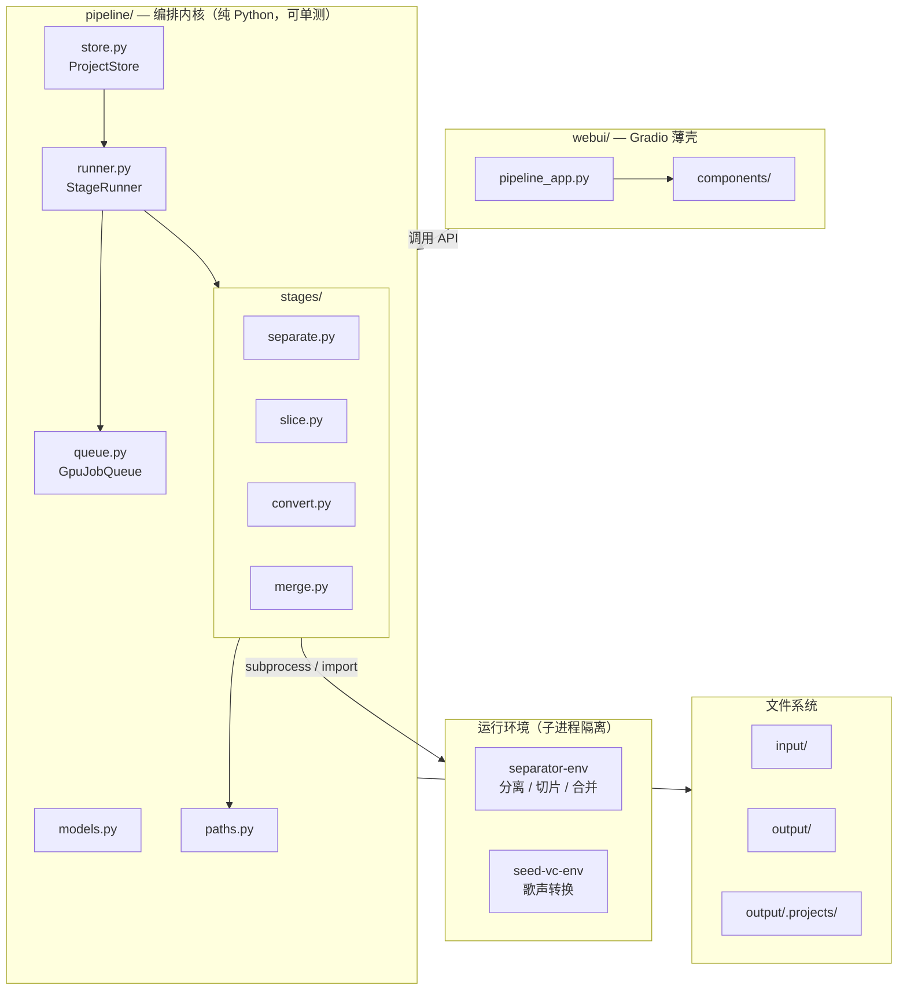
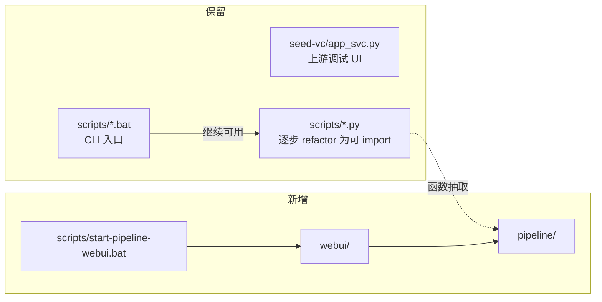
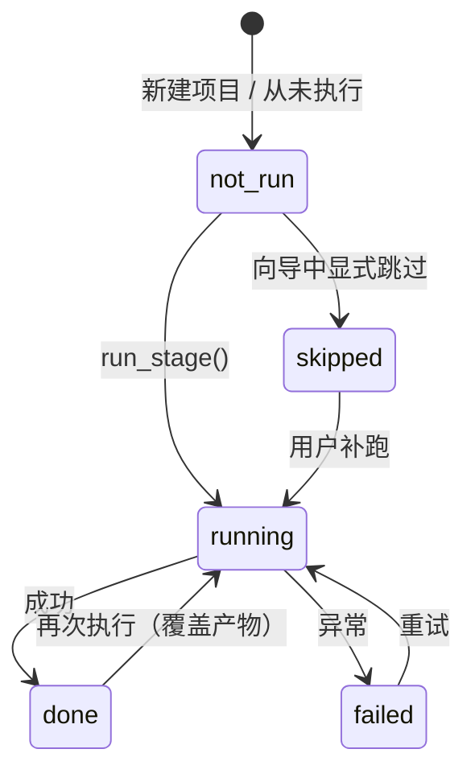
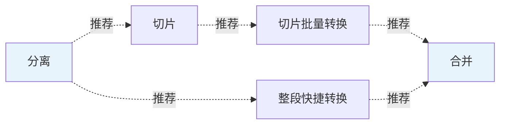
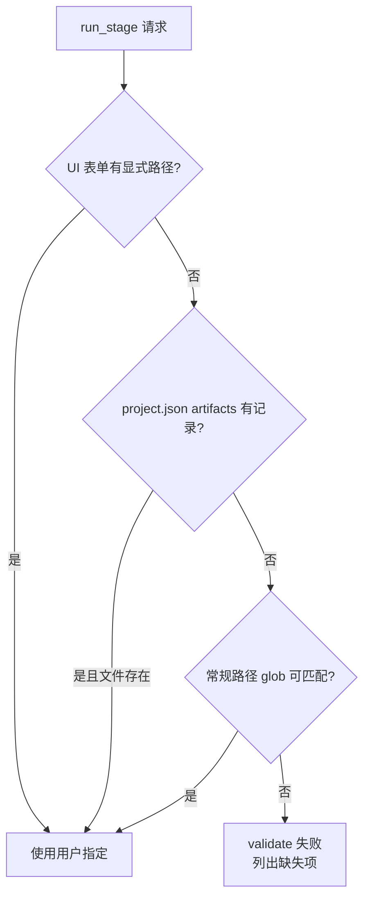
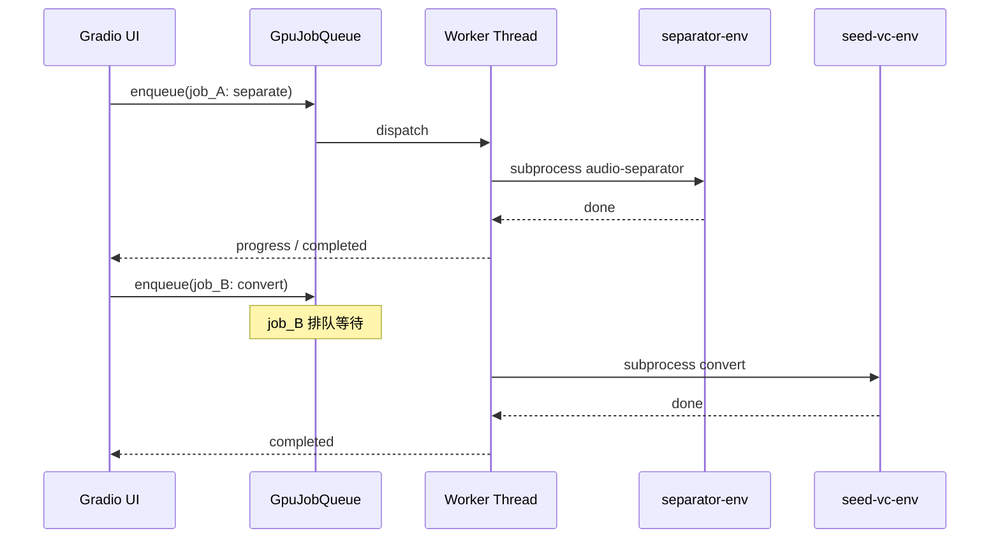
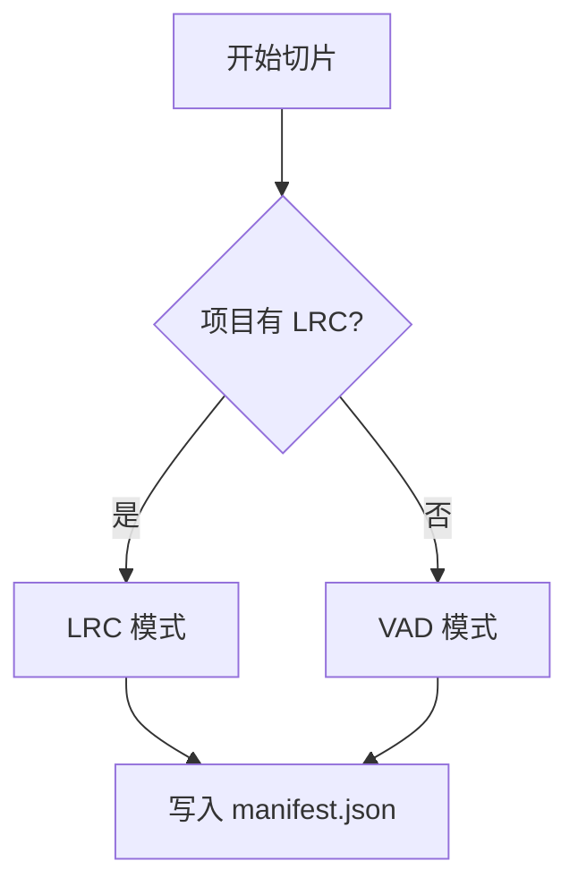
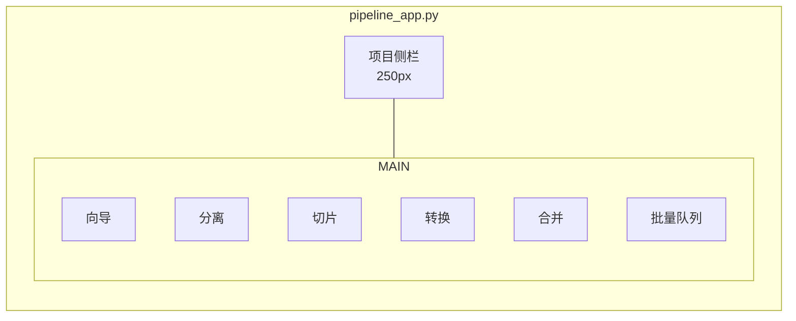
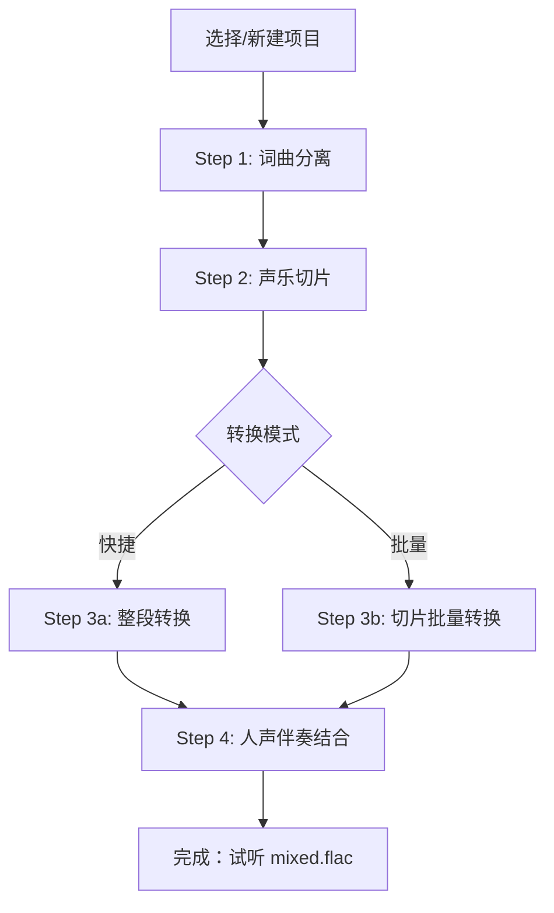
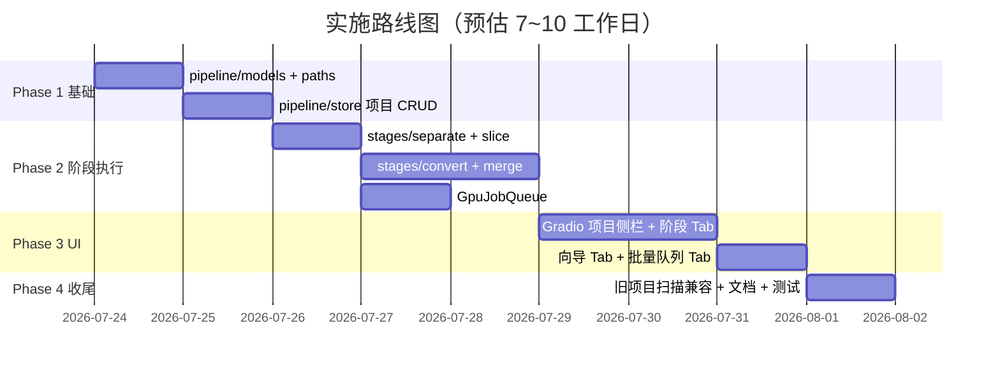

# 管线 Web UI 设计方案

> **方案选型：** 编排内核 + Gradio 薄壳（方案二）  
> **版本：** v0.2  
> **日期：** 2026-07-23  
> **状态：** 四阶段实施已完成（2026-07-23）

---

## 1. 背景与目标

### 1.1 现状

当前 `voice-translate` 项目是一条 **四阶段 CLI 管线**，Web 能力仅覆盖阶段 ③（歌声替换）：

| 阶段 | 能力 | CLI | Web |
|------|------|-----|-----|
| ① 词曲分离 | MelBand-RoFormer | `separate-audio.bat` | ❌ |
| ② 声乐切片 | VAD / LRC | `slice-vocals*.bat` | ❌ |
| ③ 歌声替换 | Seed-VC f0 模型 | `convert-slices.bat` | ⚠️ 仅 `app_svc.py` 单文件交互 |
| ④ 人声伴奏结合 | stitch + mix + master | `merge-audio.bat` | ❌ |

现有 Web UI（`seed-vc/app_svc.py`）存在以下局限：

- 仅支持单文件上传转换，产物通过浏览器下载，**不写入** `output/` 目录
- 与切片批量管线（`manifest.json`）脱节
- 无法管理项目、回看历史产物、串联全流程
- 与分离/合并阶段完全隔离，用户需在 CLI 与 Web 间切换

### 1.2 目标

构建统一的 **管线 Web UI**，满足以下需求（经用户确认）：

| 编号 | 需求 | 说明 |
|------|------|------|
| Q1 | 四阶段全覆盖 | 词曲分离、切片（VAD/LRC）、歌声替换、人声伴奏结合 |
| Q1+ | 双转换模式 | **整段快捷**（试听/快速验证）+ **切片批量**（生产级质量） |
| Q2 | 单首 + 批量 | 项目内逐步操作 + 多项目任务队列 |
| Q3 | 独立 + 向导 | 各阶段可单独重跑 + 一键向导串联 |
| Q4 | 项目制 | 以歌曲名为单位，沿用 `output/` 目录，可回看各阶段产物 |
| Q5 | localhost | 单机本地使用，无需认证与远程访问 |

### 1.3 非目标（本期不做）

- 远程/局域网多用户访问与权限控制
- 替换 Seed-VC 上游 `app_svc.py`（保留为调试入口）
- 模型训练、微调
- 实时歌声转换（`real-time-gui.py`）
- 跨平台（本期仍以 Windows + 现有双 venv 为准）

---

## 2. 总体架构

### 2.1 分层设计



**设计原则：**

1. **编排与 UI 分离**：`pipeline/` 不依赖 Gradio，可被未来 CLI 复用
2. **薄壳 UI**：Gradio 只负责布局、文件上传、进度展示、音频试听
3. **子进程隔离 venv**：`separator-env` 与 `seed-vc-env` 不可合并，通过 `subprocess` 调用
4. **文件即状态**：产物落盘 `output/`，元数据落盘 `output/.projects/`，刷新页面可恢复

### 2.2 与现有组件关系



---

## 3. 目录结构

### 3.1 代码布局

```
voice-translate/
├── pipeline/                        # 新增：编排内核
│   ├── __init__.py
│   ├── models.py                    # Project, StageStatus, Job, ConvertMode 等
│   ├── paths.py                     # 根路径、产物路径解析（消除硬编码 ROOT）
│   ├── store.py                     # ProjectStore：CRUD、扫描、状态同步
│   ├── runner.py                    # StageRunner：单阶段 / 全流程执行
│   ├── queue.py                     # GpuJobQueue：GPU 任务串行队列
│   └── stages/
│       ├── __init__.py
│       ├── separate.py              # 封装 audio-separator
│       ├── slice.py                 # 封装 slice_vocals / slice_vocals_lrc
│       ├── convert.py               # 整段 + 切片批量
│       └── merge.py                 # 封装 merge_audio()
│
├── webui/                           # 新增：Gradio 薄壳
│   ├── pipeline_app.py              # 主入口
│   ├── state.py                     # Gradio State 与 store 桥接
│   └── components/
│       ├── project_sidebar.py       # 项目列表侧栏
│       ├── wizard.py                # 向导 Tab
│       ├── stage_tabs.py            # 分离/切片/转换/合并 Tab
│       ├── batch_queue.py           # 批量队列 Tab
│       └── artifacts.py             # 产物试听/下载组件
│
├── scripts/
│   ├── start-pipeline-webui.bat     # 新增：启动统一 Web UI
│   ├── start-seed-vc-webui.bat      # 保留：上游调试
│   └── ...                          # 现有脚本继续可用
│
├── input/                           # 原始输入
└── output/                          # 各阶段产物（见 3.2）
```

### 3.2 数据目录布局

在沿用现有 `output/` 结构基础上，增加项目元数据层，并将 `merged/` 改为按项目分子目录：

```
output/
├── .projects/
│   └── {project_id}/
│       └── project.json             # 项目元数据（阶段状态、参数快照、路径索引）
│
├── separated/                       # 阶段 ①（已有，全局共享）
│   ├── {song}_(Vocals)_mel_band_roformer_kim_ft_unwa.flac
│   └── {song}_(Instrumental)_mel_band_roformer_kim_ft_unwa.flac
│
├── slices/
│   └── {project_id}/                # 阶段 ②（按项目）
│       ├── manifest.json
│       ├── {prefix}_slice_000.flac
│       └── ...
│
├── converted/
│   └── {project_id}/                # 阶段 ③（按项目）
│       ├── full.flac                # 整段快捷模式产物
│       ├── {slice_name}.flac        # 切片批量模式产物（与 slices 同名）
│       └── convert_manifest.json    # 转换记录（可选）
│
└── merged/
    └── {project_id}/                # 阶段 ④（**调整**：由扁平改为按项目）
        ├── vocals.flac
        ├── mixed.flac
        ├── mixed_mastered.flac      # Matchering 中间产物
        └── instrumental_clean.flac    # Karaoke 净化产物（可选）
```

```
input/
├── {project_id}.flac                # 原始混音（上传或手动放置）
└── {project_id}.lrc                 # 可选歌词
```

### 3.3 路径解析规则

`pipeline/paths.py` 统一管理路径，消除脚本中 `ROOT=D:\code\voice-translate` 硬编码：

| 函数 | 返回值 |
|------|--------|
| `get_root()` | 仓库根目录（由 `pipeline/` 或环境变量 `VOICE_TRANSLATE_ROOT` 解析） |
| `project_meta_path(id)` | `output/.projects/{id}/project.json` |
| `separated_vocals_path(id)` | 在 `output/separated/` 下 glob 匹配 `{id}_(Vocals)_*.flac` |
| `separated_instrumental_path(id)` | 在 `output/separated/` 下 glob 匹配 `{id}_(Instrumental)_*.flac` |
| `slices_dir(id)` | `output/slices/{id}/` |
| `converted_dir(id)` | `output/converted/{id}/` |
| `merged_dir(id)` | `output/merged/{id}/` |
| `input_audio_path(id)` | `input/{id}.flac`（兼容 wav/mp3） |

> **兼容旧项目：** `ProjectStore.scan()` 启动时扫描 `output/slices/`、`output/converted/` 下已有目录，若缺少 `project.json` 则自动补建（状态从文件推断）。

---

## 4. 项目模型

### 4.1 核心数据类

```python
# pipeline/models.py（概念定义）

class StageName(str, Enum):
    SEPARATE = "separate"
    SLICE    = "slice"
    CONVERT  = "convert"
    MERGE    = "merge"

class StageStatus(str, Enum):
    NOT_RUN   = "not_run"      # 本项目内尚未执行过（仅历史记录）
    RUNNING   = "running"      # 执行中
    DONE      = "done"         # 最近一次执行成功
    FAILED    = "failed"       # 最近一次执行失败
    SKIPPED   = "skipped"      # 向导中用户显式跳过（仅历史记录）

class ConvertMode(str, Enum):
    FULL_TRACK  = "full_track"    # 整段快捷
    SLICE_BATCH = "slice_batch"   # 切片批量

class SliceMode(str, Enum):
    VAD = "vad"
    LRC = "lrc"

class JobStatus(str, Enum):
    QUEUED    = "queued"
    RUNNING   = "running"
    COMPLETED = "completed"
    FAILED    = "failed"
    CANCELLED = "cancelled"
```

### 4.2 project.json Schema

```json
{
  "schema_version": 1,
  "id": "test",
  "display_name": "测试歌曲",
  "created_at": "2026-07-23T10:00:00+08:00",
  "updated_at": "2026-07-23T12:30:00+08:00",

  "input": {
    "audio": "input/test.flac",
    "lrc": "input/test.lrc"
  },

  "stages": {
    "separate": {
      "status": "done",
      "started_at": "2026-07-23T10:05:00+08:00",
      "finished_at": "2026-07-23T10:08:30+08:00",
      "params": {
        "model": "mel_band_roformer_kim_ft_unwa.ckpt"
      },
      "artifacts": {
        "vocals": "output/separated/test_(Vocals)_mel_band_roformer_kim_ft_unwa.flac",
        "instrumental": "output/separated/test_(Instrumental)_mel_band_roformer_kim_ft_unwa.flac"
      },
      "error": null
    },

    "slice": {
      "status": "done",
      "started_at": "2026-07-23T10:10:00+08:00",
      "finished_at": "2026-07-23T10:10:45+08:00",
      "params": {
        "mode": "lrc",
        "lrc_path": "input/test.lrc",
        "slice_count": 42
      },
      "artifacts": {
        "slices_dir": "output/slices/test",
        "manifest": "output/slices/test/manifest.json"
      },
      "error": null
    },

    "convert": {
      "status": "done",
      "started_at": "2026-07-23T11:00:00+08:00",
      "finished_at": "2026-07-23T11:45:00+08:00",
      "params": {
        "mode": "slice_batch",
        "reference": "seed-vc/examples/reference/dingzhen_0.wav",
        "diffusion_steps": 40,
        "length_adjust": 1.0,
        "inference_cfg_rate": 0.7,
        "auto_f0_adjust": true,
        "semi_tone_shift": 0,
        "fp16": true,
        "converted_count": 42,
        "total_count": 42
      },
      "artifacts": {
        "converted_dir": "output/converted/test",
        "full_track": null
      },
      "error": null
    },

    "merge": {
      "status": "done",
      "started_at": "2026-07-23T12:00:00+08:00",
      "finished_at": "2026-07-23T12:05:00+08:00",
      "params": {
        "profile": "full",
        "clean_instrumental": true,
        "vocals_gain_db": 0.0,
        "instrumental_gain_db": 0.0
      },
      "artifacts": {
        "merged_dir": "output/merged/test",
        "vocals": "output/merged/test/vocals.flac",
        "mixed": "output/merged/test/mixed.flac"
      },
      "error": null
    }
  },

  "jobs": [
    {
      "job_id": "job-20260723-110000",
      "type": "stage",
      "stage": "convert",
      "status": "completed",
      "created_at": "2026-07-23T11:00:00+08:00",
      "log_path": "output/.projects/test/logs/job-20260723-110000.log"
    }
  ]
}
```

**字段约定：**

- 所有路径均为 **相对于仓库根目录** 的正斜杠路径
- `artifacts` 仅存索引路径，实际文件仍在 `output/` 各阶段目录
- `params` 记录当次运行的参数快照，便于重跑与对比
- `jobs` 保留最近 N 条（默认 20）执行记录

### 4.3 阶段状态与输入校验（双轨模型）

> **设计修正（v0.2）：** 原稿将「阶段历史状态」与「能否执行」混为一谈，导致独立运行某阶段时会被 `separate.done` 等标志位误拦。修正后拆为两条正交逻辑。

#### 4.3.1 问题与原则

| 概念 | 含义 | 是否阻塞执行 |
|------|------|-------------|
| **阶段状态**（`stages.*.status`） | 本项目内该阶段**最近一次执行结果**的历史记录 | ❌ 不阻塞 |
| **输入校验**（`validate_stage_inputs`） | 当前这次运行所需的**文件/参数是否齐备** | ✅ 唯一硬门槛 |

**原则：**

1. **独立操作**：任意阶段 Tab 可随时运行，只要用户提供了该阶段所需的输入（上传、手选路径、或自动解析到的产物）。
2. **向导/一键全流程**：使用「推荐输入链」自动衔接上一步产物，但仍走同一套输入校验，而非检查 `*.done` 标志。
3. **`*.done` 仅用于 UI 展示**（侧栏圆点、向导步骤高亮），**不作为** `run_stage()` 的前置条件。

**典型场景（独立操作不应失败）：**

| 场景 | 所需输入 | 不应要求 |
|------|----------|----------|
| 仅歌声替换 | 源人声文件 + 参考音频 | `separate.done` |
| 仅词曲分离 | 原始混音文件 | 项目内曾跑过其他阶段 |
| 仅合并 | 人声音轨 + 伴奏轨 | `convert.done`（人声可来自外部） |
| 仅切片 | 人声文件（LRC 模式另需歌词） | `separate.done` |

#### 4.3.2 阶段执行状态机（单阶段生命周期）

每个阶段的 `status` 只描述**该阶段自身**的执行过程，阶段之间**无状态转移边**：



#### 4.3.3 向导推荐链（软依赖，仅 UI 提示）

向导 Tab 用**推荐顺序**引导用户，但**不硬编码**为执行门槛：



- 虚线 = 「建议下一步」，点击可预填输入，**不检查**上一步 `status`
- 向导「一键全流程」在启动每步前调用 `resolve_stage_inputs()` 自动填路径；若某步输入无法解析，才中止并提示缺什么文件

#### 4.3.4 输入校验（硬门槛）

**`validate_stage_inputs(stage, inputs) -> (ok, errors)`** — 所有执行路径（独立 Tab / 向导 / 批量队列）统一调用：

| 阶段 | 必需输入 | 条件输入 |
|------|----------|----------|
| separate | `mix_audio`：混音文件路径 | — |
| slice | `vocals`：人声音轨路径 | LRC 模式：`lrc` 歌词路径 |
| convert (full_track) | `source_vocals` + `reference` | — |
| convert (slice_batch) | `slices_dir` 或 `manifest` + `reference` | `manifest` 缺省时扫描目录内音频 |
| merge | `vocals` + `instrumental` | `profile=full` 时建议 `reference`（原曲）；切片模式建议 `manifest` + `original_vocals` |

> 校验的是**路径存在性**和**参数合法性**，与 `stages.separate.status` 等无关。

#### 4.3.5 输入解析优先级（`resolve_stage_inputs`）

当用户未显式指定路径时，按以下顺序自动解析（找到即用，**不要求**上游阶段 `done`）：



**各阶段默认解析规则：**

| 阶段 | 解析顺序（依次尝试） |
|------|----------------------|
| separate | ① UI 上传 → ② `input/{id}.*` |
| slice | ① UI 指定 vocals → ② `stages.separate.artifacts.vocals` → ③ `output/separated/{id}_(Vocals)_*.flac` |
| convert | ① UI 指定 → ② `stages.slice.artifacts` 或 `stages.separate.artifacts.vocals` → ③ glob 扫描 |
| merge | ① UI 指定 → ② `stages.convert.artifacts` + `stages.separate.artifacts.instrumental` → ③ glob 扫描 |

#### 4.3.6 两种校验 API 的分工

| API | 调用方 | 逻辑 |
|-----|--------|------|
| `validate_stage_inputs(stage, inputs)` | 所有 `run_stage()` | 硬门槛：输入文件是否存在 |
| `suggest_next_stage(project_id)` | 向导 UI、侧栏提示 | 软推荐：根据已有产物推断下一步，**返回 None 表示无建议** |
| `validate_pipeline_chain(project_id, stages)` | 向导「一键全流程」、批量队列 | 对链中每一步调用 `resolve` + `validate`；任一步输入不可解析则**预检失败**（启动前拦截，而非跑到一半才报错） |

```python
# 独立 Tab：只校验输入，不看阶段 status
ok, errors = store.validate_stage_inputs("convert", inputs={
    "source_vocals": "/path/to/any/vocals.flac",  # 用户上传或手选
    "reference": "/path/to/ref.wav",
    "mode": "full_track",
})
if ok:
    runner.run_stage(project_id, "convert", inputs)

# 向导全流程：预检整条链
ok, plan = store.validate_pipeline_chain(project_id, stages=[
    "separate", "slice", "convert", "merge"
], convert_mode="slice_batch")
# plan = 每步解析后的 inputs 快照；ok=False 时返回缺什么
```

#### 4.3.7 project.json 补充：`inputs` 字段

为支持独立操作，每阶段增加可选的**用户指定输入**（覆盖自动解析）：

```json
{
  "stages": {
    "convert": {
      "status": "not_run",
      "inputs": {
        "source_vocals": "uploads/custom_vocals.flac",
        "reference": "input/test/reference.wav",
        "mode": "full_track"
      },
      "artifacts": {},
      "error": null
    }
  }
}
```

- `inputs`：用户最后一次指定的输入（独立 Tab 保存）
- `artifacts`：该阶段**产出**路径（执行成功后写入）
- 二者分离：即使 `convert.status = not_run`，只要 `inputs` 中路径有效即可执行

---

## 5. 编排内核设计

### 5.1 ProjectStore

```python
class ProjectStore:
    """项目 CRUD 与状态持久化。"""

    def list_projects(self) -> list[Project]: ...
    def get_project(self, project_id: str) -> Project: ...
    def create_project(
        self,
        project_id: str,
        audio_path: Path,
        lrc_path: Path | None = None,
        display_name: str | None = None,
    ) -> Project: ...

    def scan_and_repair(self) -> list[Project]:
        """扫描 output/ 下已有产物，补建缺失的 project.json。"""

    def update_stage(
        self,
        project_id: str,
        stage: StageName,
        *,
        status: StageStatus,
        params: dict | None = None,
        artifacts: dict | None = None,
        error: str | None = None,
    ) -> None: ...

    def validate_stage_inputs(
        self, stage: StageName, inputs: dict
    ) -> tuple[bool, list[str]]:
        """硬门槛：校验本次运行所需输入是否齐备。返回 (ok, error_messages)。"""

    def resolve_stage_inputs(
        self, project_id: str, stage: StageName, overrides: dict | None = None
    ) -> dict:
        """按 4.3.5 优先级解析输入路径，不要求上游阶段 done。"""

    def suggest_next_stage(self, project_id: str) -> StageName | None:
        """软推荐：根据已有产物推断建议的下一步（仅 UI 提示）。"""

    def validate_pipeline_chain(
        self, project_id: str, stages: list[StageName], **pipeline_params
    ) -> tuple[bool, dict | list[str]]:
        """向导/批量队列预检：解析整条链的 inputs；失败时返回缺失项列表。"""
```

### 5.2 StageRunner

```python
class StageRunner:
    """执行单个阶段或全流程。"""

    def __init__(self, store: ProjectStore, queue: GpuJobQueue): ...

    def run_stage(
        self,
        project_id: str,
        stage: StageName,
        params: dict,
        on_progress: Callable[[ProgressEvent], None] | None = None,
    ) -> StageResult: ...

    def run_pipeline(
        self,
        project_id: str,
        *,
        stages: list[StageName] | None = None,  # None = 全部
        convert_mode: ConvertMode = ConvertMode.SLICE_BATCH,
        slice_mode: SliceMode = SliceMode.LRC,
        stop_on_error: bool = True,
        on_progress: Callable[[ProgressEvent], None] | None = None,
    ) -> PipelineResult: ...
```

**`ProgressEvent` 结构：**

```python
@dataclass
class ProgressEvent:
    project_id: str
    stage: StageName
    job_id: str
    percent: float          # 0.0 ~ 100.0
    message: str            # 如 "[12/42] converting slice_012.flac"
    log_line: str | None    # 追加到日志文件
```

### 5.3 GpuJobQueue

GPU 密集型任务必须串行执行（分离、转换、Karaoke 净化均占 GPU）：



```python
class GpuJobQueue:
  def enqueue(self, job: Job, fn: Callable) -> str: ...
  def cancel(self, job_id: str) -> bool: ...       # 尽力取消（子进程 terminate）
  def get_status(self, job_id: str) -> JobStatus: ...
  def current_job(self) -> Job | None: ...
  def wait(self, job_id: str, timeout: float | None = None) -> JobResult: ...
```

**队列策略：**

- 单 Worker 线程，FIFO
- 同一项目可同时排队多个阶段，但 GPU 任务串行
- CPU 任务（VAD 切片）可在无 GPU 任务时并行，或也入队以简化实现（**v0.1 建议全部入队**）
- 批量队列 Tab 提交的多个项目任务，按提交顺序追加到同一队列

### 5.4 各阶段实现

#### 5.4.1 词曲分离 — `stages/separate.py`

| 项 | 说明 |
|----|------|
| 运行环境 | `separator-env` |
| 调用方式 | subprocess `audio-separator`（与 `separate-audio.bat` 等效） |
| 输入 | `input/{project_id}.flac` |
| 输出 | `output/separated/{id}_(Vocals\|Instrumental)_mel_band_roformer_kim_ft_unwa.flac` |
| 进度 | audio-separator stdout 解析；无结构化进度时显示 indeterminate |
| 前置检查 | `verify-separator-model.py` 模型完整性 |

```python
def run_separate(
    project_id: str,
    *,
    model: str = "mel_band_roformer_kim_ft_unwa.ckpt",
    on_progress: ProgressCallback | None = None,
) -> SeparateResult:
    ...
```

#### 5.4.2 声乐切片 — `stages/slice.py`

| 项 | 说明 |
|----|------|
| 运行环境 | `separator-env` |
| 调用方式 | **import** `scripts/slice-vocals.py` 或 `slice-vocals-lrc.py` 中的函数 |
| VAD 模式 | `slice_vocals(vocals_path, output_dir)` |
| LRC 模式 | `slice_vocals_lrc(lrc_path, vocals_path, output_dir)` |
| 输出目录 | `output/slices/{project_id}/` |
| 进度 | 按切片数量回调 |

**切片模式选择逻辑（向导默认）：**



#### 5.4.3 歌声替换 — `stages/convert.py`

| 项 | 说明 |
|----|------|
| 运行环境 | `seed-vc-env` |
| 调用方式 | subprocess 调用 wrapper 脚本（避免 Gradio 进程加载模型） |

**整段快捷模式（`full_track`）：**

```
输入: output/separated/{id}_(Vocals)_*.flac
参考: 用户上传或指定路径（截断 25s）
输出: output/converted/{id}/full.flac
实现: seed-vc-env/python -m pipeline.stages.convert_full ...
      内部复用 convert-slices.py 的 _convert_audio() 逻辑
```

**切片批量模式（`slice_batch`）：**

```
输入: output/slices/{id}/ + manifest.json
参考: 用户指定
输出: output/converted/{id}/{slice_name}.flac
实现: subprocess seed-vc-env/python scripts/convert-slices.py ...
      参数: --skip-existing --reference ... --output ...
进度: 解析 stdout "[12/42] converting ..."
```

| 参数 | 默认值 | 说明 |
|------|--------|------|
| `diffusion_steps` | 40 | 扩散步数 |
| `length_adjust` | 1.0 | 时长调整 |
| `inference_cfg_rate` | 0.7 | CFG 率 |
| `auto_f0_adjust` | true | 自动 F0 对齐 |
| `semi_tone_shift` | 0 | 半音移调 |
| `fp16` | true | 半精度推理 |
| `skip_existing` | true | 跳过已有输出（重跑友好） |

#### 5.4.4 人声伴奏结合 — `stages/merge.py`

| 项 | 说明 |
|----|------|
| 运行环境 | `separator-env` |
| 调用方式 | **import** `merge_audio()` from `scripts/merge-audio.py` |
| 输出目录 | `output/merged/{project_id}/` |

**自动关联规则：**

| merge 参数 | 来源 |
|------------|------|
| `--vocals` | `convert.mode=full_track` → `converted/{id}/full.flac`；`slice_batch` → `converted/{id}/` 目录 |
| `--instrumental` | `separated_instrumental_path(id)` |
| `--reference` | `input/{id}.flac`（原曲） |
| `--original-vocals` | `separated_vocals_path(id)` |
| `--manifest` | `slices/{id}/manifest.json`（切片模式） |
| `--slices-dir` | `slices/{id}/`（切片模式） |

| profile | 说明 |
|---------|------|
| `quick` | 直接混合，无 stitch |
| `balanced` | stitch + 静音掩码 + RMS 匹配 |
| `full` | 全部：时间对齐 + FX + Karaoke 净化 + Matchering |

---

## 6. Gradio UI 设计

### 6.1 页面布局



### 6.2 项目侧栏

| 元素 | 行为 |
|------|------|
| 项目列表 | 显示 `display_name`、阶段完成度图标（●○） |
| 当前选中 | 高亮，驱动主内容区 |
| [+ 新建项目] | 弹窗：项目 ID、上传音频、可选 LRC |
| 刷新 | 调用 `store.scan_and_repair()` |

阶段完成度显示示例：`●分离 ●切片 ○转换 ○合并`

### 6.3 Tab 功能规格

> **独立操作原则（v0.2）：** 各阶段 Tab 均提供显式输入控件（上传 / 浏览 `output/` / 使用项目默认路径），**不依赖**上游阶段 `status`。侧栏阶段圆点仅反映历史执行记录。

#### 6.3.1 向导 Tab



| 控件 | 说明 |
|------|------|
| 步骤指示器 | 显示 1~4 步，已完成可点击回看产物 |
| [运行当前步骤] | 只执行当前阶段 |
| [从此步跑到最后] | `run_pipeline(stages=[current..merge])` |
| [一键全流程] | `run_pipeline()` 使用向导页参数 |
| 转换模式单选 | `full_track` / `slice_batch` |
| 切片模式 | 有 LRC 默认 LRC，否则 VAD |
| 参考音频上传 | 存入 `input/{id}/reference.wav` 或项目元数据 |
| 进度区 | 实时日志 + 进度条（Gradio `gr.Textbox` + `gr.Progress`） |

#### 6.3.2 分离 Tab

- 显示当前项目输入音频信息
- [运行分离] 按钮（检查模型 → 入队）
- 产物区：人声 / 伴奏 `gr.Audio` 试听
- 支持重新分离（覆盖 `separated/` 产物）

#### 6.3.3 切片 Tab

- **源人声**（必填）：上传 / 浏览本地 / 默认解析（见 4.3.5），不要求本项目已执行分离
- 模式选择：VAD / LRC
- LRC：上传或选择 `input/{id}.lrc`
- 参数（高级）：VAD threshold、min_speech_ms 等
- [运行切片] → 显示切片数量、manifest 预览表
- 产物区：前 5 个切片试听 + 「打开目录」提示

#### 6.3.4 转换 Tab

- **源人声 / 切片目录**（必填）：上传或手选路径，可来自外部文件，不要求 `separate.done`
- 模式切换：**整段快捷** / **切片批量**
- **参考音频**（必填）：上传/选择
- Seed-VC 参数面板（折叠高级选项）
- 切片批量模式：显示 `已转换 / 总数`，支持 `--skip-existing` 续跑
- 产物试听：`full.flac` 或切片列表

#### 6.3.5 合并 Tab

- **人声音轨**（必填）：默认解析 converted 产物，可手选任意路径
- **伴奏轨**（必填）：默认解析 separated instrumental，可手选任意路径
- **原曲参考**（可选，full profile 建议填写）：默认 `input/{id}.flac`
- Profile 选择：quick / balanced / full
- 增益调节：vocals_gain、instrumental_gain
- [运行合并]
- 产物试听：`vocals.flac`、`mixed.flac`

#### 6.3.6 批量队列 Tab


| 功能 | 说明 |
|------|------|
| 多选项目 | Checkbox 列表 |
| 阶段多选 | separate / slice / convert / merge |
| 全局参数 | convert_mode、merge profile |
| 队列管理 | 查看排队、取消未开始任务 |
| 限制 | 同一时刻仅 1 个 GPU 任务运行 |

### 6.4 UI 与内核交互

```python
# webui/state.py — 薄桥接层

_store = ProjectStore()
_runner = StageRunner(_store, _gpu_queue)

def get_projects() -> list[dict]:
    return [p.to_summary() for p in _store.list_projects()]

def run_stage_ui(project_id: str, stage: str, params: dict) -> Generator:
    """Gradio 生成器：yield 进度更新。"""
    for event in _runner.run_stage_async(project_id, stage, params):
        yield event.to_ui_dict()
```

**刷新策略：**

- 长任务使用 `gr.Progress()` + 生成器 `yield`
- 页面刷新后从 `project.json` 恢复状态（不依赖 Gradio Session）
- 日志写入 `output/.projects/{id}/logs/`，UI 可 tail 显示

---

## 7. 启动与运行

### 7.1 启动脚本

`scripts/start-pipeline-webui.bat`：

```bat
@echo off
set NO_PROXY=127.0.0.1,localhost
set no_proxy=127.0.0.1,localhost

cd /d %~dp0..
call separator-env\Scripts\activate.bat

echo Starting Pipeline Web UI at http://127.0.0.1:7860/
python -m webui.pipeline_app
```

> **为何主进程使用 separator-env：** 分离/切片/合并可直接 import；歌声转换通过子进程调用 `seed-vc-env`，避免双 venv 冲突。

### 7.2 端口与代理

| 项 | 值 |
|----|-----|
| 地址 | `http://127.0.0.1:7860/` |
| 代理 | 必须设置 `NO_PROXY=127.0.0.1,localhost`（见 Seed-VC 安装指南） |
| 关闭 | `scripts/stop-pipeline-webui.bat`（kill 7860 端口） |

### 7.3 环境变量

| 变量 | 说明 | 默认 |
|------|------|------|
| `VOICE_TRANSLATE_ROOT` | 仓库根目录 | 自动检测 |
| `SEPARATOR_ENV` | separator-env 路径 | `{root}/separator-env` |
| `SEED_VC_ENV` | seed-vc-env 路径 | `{root}/seed-vc-env` |
| `PIPELINE_WEBUI_PORT` | 监听端口 | `7860` |

---

## 8. 现有代码改造计划

### 8.1 scripts/*.py 函数化

将 CLI 脚本的 `main()` 逻辑抽取为可 import 函数，CLI 保留为薄包装：

| 文件 | 抽取函数 | 状态 |
|------|----------|------|
| `merge-audio.py` | `merge_audio()` | ✅ 已有 |
| `slice-vocals.py` | `slice_vocals()` | ✅ 已有 |
| `slice-vocals-lrc.py` | `slice_vocals_lrc()` | ✅ 已有 |
| `convert-slices.py` | `_convert_audio()`, `convert_slices()` | ✅ 已有 |
| — | `run_separate()` | 新建，封装 audio-separator 调用 |
| — | `convert_full_track()` | 新建，单文件推理 |

### 8.2 merge-audio 输出目录调整

`merge_audio()` 已支持 `-o/--output-dir`，Web UI 统一传入 `output/merged/{project_id}/`。

现有 CLI 默认 `output/merged/` 保持不变，向后兼容。

### 8.3 路径硬编码消除

逐步将以下文件中的 `ROOT=D:\code\voice-translate` 改为 `pipeline.paths.get_root()` 或 `%~dp0..` 相对路径：

- `scripts/separate-audio.bat`
- `scripts/merge-audio.bat`
- `scripts/process-song.bat`
- `scripts/start-seed-vc-webui.bat`

---

## 9. 实施阶段



### Phase 1：基础（2 天）

- [x] 创建 `pipeline/` 包：`models.py`、`paths.py`、`store.py`
- [x] 实现 `project.json` 读写与 `scan_and_repair()`
- [x] 单元测试：路径解析、项目 CRUD、状态机转换

> **Phase 1 完成记录：** 见 [管线WebUI开发记录.md](./管线WebUI开发记录.md#phase-1基础编排内核骨架)（2026-07-23）

### Phase 2：阶段执行（3~4 天）

- [x] `stages/separate.py`、`stages/slice.py`
- [x] `stages/convert.py`（整段 + 批量子进程）
- [x] `stages/merge.py`
- [x] `GpuJobQueue` + `StageRunner`
- [x] 集成测试：Runner mock 测试 + 队列测试（GPU 实测见开发记录）

> **Phase 2 完成记录：** 见 [管线WebUI开发记录.md](./管线WebUI开发记录.md#phase-2阶段执行编排内核执行层)（2026-07-23）

### Phase 3：Gradio UI（2~3 天）

- [x] `webui/pipeline_app.py` 骨架 + 项目侧栏
- [x] 分离 / 切片 / 转换 / 合并 Tab
- [x] 向导 Tab + 批量队列 Tab
- [x] `start-pipeline-webui.bat` / `stop-pipeline-webui.bat`

> **Phase 3 完成记录：** 见 [管线WebUI开发记录.md](./管线WebUI开发记录.md#phase-3-gradio-ui)（2026-07-23）

### Phase 4：收尾（1 天）

- [x] 旧 `output/` 目录自动导入为项目
- [x] 更新 `README.md` 入口说明
- [x] 端到端测试：新建项目 → 全流程 → 产物验证（mock）

> **Phase 4 完成记录：** 见 [管线WebUI开发记录.md](./管线WebUI开发记录.md#phase-4收尾)（2026-07-23）

---

*管线 Web UI 四阶段实施已完成。*

---

## 10. 测试策略

### 10.1 单元测试

```
tests/
├── test_paths.py          # 路径 glob、相对路径
├── test_paths_legacy.py   # 旧版 separated 文件名解析
├── test_store.py          # project.json CRUD、scan_and_repair
├── test_inputs.py         # validate_stage_inputs、resolve 优先级
├── test_queue.py          # 队列 FIFO、取消
├── test_runner.py         # StageRunner mock
├── test_webui_state.py    # Web UI 桥接
└── test_e2e.py            # 端到端（mock，无 GPU）
```

### 10.2 集成测试

| 用例 | 步骤 | 预期 | 自动化 |
|------|------|------|--------|
| E2E-01 整段快捷 | 新建 → 分离 → 整段转换 → 合并(quick) | `merged/{id}/mixed.flac` 存在 | ✅ `test_e2e01`（mock） |
| E2E-02 切片批量 | 新建+LRC → 分离 → LRC切片 → 批量转换 → 合并(full) | 42 切片全部转换，mixed 可播放 | 待 GPU 实测 |
| E2E-03 阶段重跑 | 转换失败后 `--skip-existing` 续跑 | 仅重跑失败切片 | 待 GPU 实测 |
| E2E-04 旧项目导入 | 仅有 `output/slices/test/` | 自动创建 project.json | ✅ `test_e2e04` |
| E2E-05 批量队列 | 2 个项目依次转换 | GPU 串行，无并行冲突 | ✅ `test_e2e05`（mock） |

### 10.3 手动验收清单

- [ ] 浏览器访问 `http://127.0.0.1:7860/` 正常
- [ ] 新建项目上传 flac + lrc
- [ ] 向导一键全流程完成
- [ ] 各 Tab 可独立运行、试听产物
- [ ] 刷新页面后项目状态正确恢复
- [ ] 批量队列 2+ 项目串行执行
- [ ] 现有 CLI 脚本仍可独立使用

---

## 11. 风险与缓解

| 风险 | 影响 | 缓解措施 |
|------|------|----------|
| 双 venv 子进程调度失败 | 转换/分离无法执行 | 封装 `VenvRunner`，统一测试两个 venv 的 python 路径 |
| GPU OOM / 显存未释放 | 连续任务失败 | 每阶段结束后 `torch.cuda.empty_cache()`；子进程隔离天然释放 |
| Gradio 长任务 UI 卡顿 | 体验差 | 生成器 yield + 日志文件；状态以 project.json 为准 |
| 分离产物命名不一致 | 路径解析失败 | `paths.py` 用 glob 而非硬编码文件名；兼容 `(Vocals)` / `(vocals)` |
| 旧 `output/merged/` 扁平结构 | 多项目覆盖 | `scan_and_repair` 迁移；CLI 默认行为不变 |
| FFmpeg 缺失 | 转换/合并失败 | 启动时预检，Gradio 报错中文化（复用 app_svc.py 经验） |
| 代理导致 Gradio 502 | 无法启动 | 启动脚本设置 `NO_PROXY` |

---

## 12. 附录

### 12.1 术语表

| 术语 | 含义 |
|------|------|
| 项目 (Project) | 以 `project_id`（通常等于歌曲名）为单位的处理上下文 |
| 阶段 (Stage) | separate / slice / convert / merge 之一 |
| 整段快捷模式 | 对分离后的整段人声直接做 Seed-VC 转换 |
| 切片批量模式 | 先切片再逐片转换，依赖 manifest.json 时间轴重建 |
| 编排内核 | `pipeline/` 包，负责状态管理与任务调度 |
| GPU 队列 | 保证同一时刻只有一个 GPU 密集型任务运行 |

### 12.2 相关文档

| 文档 | 内容 |
|------|------|
| [词曲分离与声乐切片安装指南](词曲分离与声乐切片安装指南.md) | 阶段 ①② 环境与脚本 |
| [Seed-VC 安装指南](Seed-VC安装指南.md) | 阶段 ③ 环境与模型 |
| [人声伴奏结合安装指南](人声伴奏结合安装指南.md) | 阶段 ④ 环境与 profile |
| [README.md](../README.md) | 项目总览与 CLI 快速开始 |

### 12.3 后续演进（本期不实现）

- CLI 命令 `python -m pipeline run --project test --pipeline` 复用编排内核
- 项目导出/打包（zip 全部产物）
- 转换参数 A/B 对比（同一项目多组 convert params）
- 替换 Gradio 为自定义前端（编排内核不变）

---

*文档结束 — 四阶段已实施，见 [管线WebUI开发记录.md](./管线WebUI开发记录.md)。*
