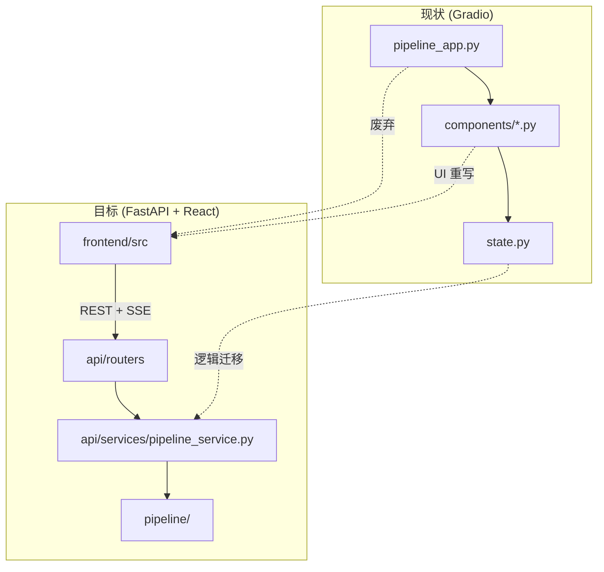

# 管线 Web UI 迁移对照表 — FastAPI + React (Vite) + shadcn/ui

> **目标方案：** FastAPI + React (Vite) + shadcn/ui + TanStack Table/Query  
> **版本：** v0.2  
> **日期：** 2026-07-26  
> **状态：** 规划文档（Phase 0 已完成，进入 Phase 1；v0.2 已纳入评审修订）  
> **前置文档：** [管线 Web UI 设计方案](管线WebUI设计方案.md)  
> **v0.2 修订摘要：** SSE 统一为 fetch + ReadableStream；新增线程/异步边界与任务取消设计；明确 `--workers 1` 启动约束；`/api/media` 路径校验收口为 `resolve_safe_path()`；项目切换改 `key` remount；批量队列统一 SSE 去 polling；schema 端点加缓存策略；工时重估；`webui/` 自 Phase 0 起冻结只读。

---

## 1. 迁移目标与原则

### 1.1 迁移范围

| 层级 | 动作 | 说明 |
|------|------|------|
| `pipeline/` | **保留** | 编排内核、阶段执行、GPU 队列、路径解析 — 零改动或仅加类型导出 |
| `pipeline/stage_params.py` | **保留** | 参数 schema 仍为唯一数据源 |
| `webui/state.py` | **重构为 API Service** | 逻辑迁入 `api/services/pipeline_service.py`，去掉 Gradio 依赖 |
| `webui/helpers.py` | **拆分** | 路径/音频逻辑 → API；格式化 → 前端 `lib/format.ts` |
| `webui/components/*.py` | **替换** | 每个模块映射到 React 页面/组件 + FastAPI 路由 |
| `webui/pipeline_app.py` | **废弃** | 由 `frontend/src/App.tsx` + `api/main.py` 取代 |
| `webui/` 整目录 | **Phase 0 起冻结只读** | 不再修 bug、不接新需求；两套 UI 共用 `output/.projects/`，新 API 不得改动 store schema；Phase 4 删除 |

### 1.2 设计原则

1. **Schema 驱动**：`StageParam` 由后端 API 暴露，前端 `StageParamForm` 动态渲染，不再手写每个 Checkbox。
2. **显式状态**：React 组件 state + TanStack Query 缓存，杜绝 Gradio 隐式 `inputs`/`outputs` 链。
3. **流式优先**：长任务统一走 SSE（`EventSource`），不复用 Gradio Generator yield 模式。
4. **音频走静态文件服务**：本地路径经 `GET /api/media?path=...` 或项目相对路径 URL 暴露给 `<audio>`。
5. **渐进替换**：API 层可先独立于 Gradio 并行运行，再切换前端。

---

## 2. 目标目录结构

```
voice-translate/
├── api/                              # 新增：FastAPI 后端
│   ├── main.py                       # 应用入口、CORS、静态资源
│   ├── deps.py                       # ProjectStore / StageRunner 依赖注入
│   ├── routers/
│   │   ├── projects.py               # 项目 CRUD、defaults、删除预览
│   │   ├── stages.py                 # 单阶段运行 SSE
│   │   ├── pipeline.py               # 向导 / 全流程 SSE
│   │   ├── batch.py                  # 批量队列
│   │   ├── slices.py                 # 切片表、精修 overrides
│   │   ├── params.py                 # StageParam schema 端点
│   │   ├── media.py                  # 音频/文件服务、上传
│   │   └── filesystem.py             # 本地路径浏览（PathInput 替代）
│   ├── schemas/                      # Pydantic 请求/响应模型
│   │   ├── project.py
│   │   ├── stage.py
│   │   └── slice.py
│   └── services/
│       ├── pipeline_service.py       # 自 webui/state.py 迁移
│       └── media_service.py          # 自 webui/helpers.py 迁移
│
├── frontend/                         # 新增：React SPA
│   ├── src/
│   │   ├── App.tsx                   # 布局壳（侧栏 + 主内容 Tabs）
│   │   ├── main.tsx
│   │   ├── routes/                   # 可选：react-router；或 Tabs 内嵌页面
│   │   ├── pages/
│   │   │   ├── WizardPage.tsx
│   │   │   ├── SeparatePage.tsx
│   │   │   ├── SlicePage.tsx
│   │   │   ├── ConvertPage.tsx
│   │   │   ├── MergePage.tsx
│   │   │   └── BatchQueuePage.tsx
│   │   ├── components/
│   │   │   ├── layout/
│   │   │   │   ├── AppSidebar.tsx    # ← project_sidebar.py
│   │   │   │   └── ProjectSelector.tsx
│   │   │   ├── forms/
│   │   │   │   ├── StageParamForm.tsx    # ← stage_params.py
│   │   │   │   ├── PathInput.tsx         # ← path_input.py
│   │   │   │   └── AudioUpload.tsx
│   │   │   ├── slices/
│   │   │   │   ├── SliceTable.tsx        # ← slice_preview.py
│   │   │   │   └── SliceTuner.tsx        # ← slice_tuner.py
│   │   │   ├── pipeline/
│   │   │   │   ├── ModeTabs.tsx          # ← mode_panel.py
│   │   │   │   ├── StageLogPanel.tsx     # 日志 + 状态
│   │   │   │   ├── ArtifactAudio.tsx     # ← artifacts.py
│   │   │   │   └── WizardStepper.tsx     # ← wizard.py
│   │   │   └── ui/                       # shadcn/ui 生成组件
│   │   ├── hooks/
│   │   │   ├── useProject.ts             # TanStack Query：项目列表/详情
│   │   │   ├── useProjectDefaults.ts
│   │   │   ├── useStageRun.ts            # SSE 流式运行
│   │   │   ├── useStageParams.ts         # schema + 保存值
│   │   │   └── useSliceTable.ts
│   │   ├── lib/
│   │   │   ├── api.ts                    # fetch 封装
│   │   │   ├── sse.ts                    # EventSource 工具
│   │   │   ├── format.ts                 # format_stage_icons 等
│   │   │   └── modes.ts                  # ← mode_utils.py 常量
│   │   └── types/
│   │       └── pipeline.ts               # 与 api/schemas 对齐的 TS 类型
│   ├── package.json
│   └── vite.config.ts                    # proxy → localhost:8000
│
├── pipeline/                         # 不变
├── webui/                            # Phase 0 起冻结只读（deprecated），Phase 4 删除
└── scripts/
    ├── start-pipeline-api.bat        # 新增
    └── start-pipeline-web.bat        # 新增：同时启动 api + frontend dev
```

---

## 3. 总体架构对照



---

## 4. 核心基础设施对照

### 4.1 `webui/state.py` → `api/services/pipeline_service.py`

| 现有函数 | 新 API 端点 | 前端 Hook / 组件 | 备注 |
|----------|-------------|------------------|------|
| `refresh_projects()` | `GET /api/projects` | `useProjects()` | 返回 `ProjectSummary[]` |
| `get_projects()` | 同上（无 scan） | 内部缓存刷新 | `refresh` 时调 `scan_and_repair` |
| `create_project_ui()` | `POST /api/projects` | `CreateProjectDialog` | multipart：audio + 可选 lrc |
| `delete_project_ui()` | `DELETE /api/projects/{id}` | `DeleteProjectDialog` | body: `{ scope, confirmed }` |
| `preview_project_deletion_ui()` | `GET /api/projects/{id}/delete-preview?scope=` | 删除预览 Markdown → `Alert` + `Table` | |
| `load_project_defaults()` | `GET /api/projects/{id}/defaults` | `useProjectDefaults(id)` | 切换项目时 invalidate |
| `load_saved_stage_params()` | `GET /api/projects/{id}/params/{stage}` | `useStageParams(id, stage)` | |
| `load_wizard_params()` | `GET /api/projects/{id}/params/wizard` | `WizardPage` 初始化 | |
| `run_stage_ui()` Generator | `POST /api/projects/{id}/stages/{stage}/run` **SSE** | `useStageRun()` | body 传 params；详见 §4.1.2 SSE 传输方案 |
| `run_pipeline_ui()` Generator | `POST /api/projects/{id}/pipeline/run` **SSE** | `usePipelineRun()` | `from_stage` / `stages` |
| `enqueue_batch()` | `POST /api/batch/enqueue` | `BatchQueuePage` | |
| `batch_queue_status()` | `GET /api/batch/status` **SSE**（常驻订阅） | `useBatchStatus()` | 取代 polling，详见 §4.1.3 |
| `clear_batch_queue()` | `POST /api/batch/clear` | 清除按钮 | |
| `run_batch_queue_ui()` Generator | `POST /api/batch/run` **SSE** | `useBatchRun()` | |

#### 4.1.2 SSE 传输方案（fetch + ReadableStream）

原生 `EventSource` 仅支持 GET 且无法携带 body，无法满足「POST + JSON params + 长任务流式」需求。本方案统一采用 `fetch()` + `ReadableStream` 解析 SSE 帧，前端在 `lib/sse.ts` 抽出统一封装。

**前端封装（`lib/sse.ts`）：**

```typescript
export interface SseOptions {
  url: string
  body: unknown
  signal?: AbortSignal
  onMessage: (event: { type: string; data: unknown }) => void
  onError?: (err: Error) => void
}

export async function postSse(opts: SseOptions): Promise<void> {
  const resp = await fetch(opts.url, {
    method: 'POST',
    headers: { 'Content-Type': 'application/json', 'Accept': 'text/event-stream' },
    body: JSON.stringify(opts.body),
    signal: opts.signal,
  })
  if (!resp.ok || !resp.body) throw new Error(`SSE ${resp.status}`)
  const reader = resp.body.getReader()
  const decoder = new TextDecoder()
  let buffer = ''
  while (true) {
    const { value, done } = await reader.read()
    if (done) break
    buffer += decoder.decode(value, { stream: true })
    const frames = buffer.split('\n\n')
    buffer = frames.pop() ?? ''
    for (const frame of frames) {
      const type = /^event: (.+)$/m.exec(frame)?.[1] ?? 'message'
      const data = /^data: (.+)$/m.exec(frame)?.[1] ?? ''
      try { opts.onMessage({ type, data: JSON.parse(data) }) }
      catch { opts.onMessage({ type, data }) }
    }
  }
}
```

**后端响应格式（`StreamingResponse` + `text/event-stream`）：**

```python
from fastapi.responses import StreamingResponse

@router.post("/{project_id}/stages/{stage}/run")
async def run_stage(...):
    async def gen():
        queue: asyncio.Queue = asyncio.Queue()
        loop = asyncio.get_running_loop()

        def on_progress(ev: ProgressEvent) -> None:
            loop.call_soon_threadsafe(queue.put_nowait, ev)

        task = await anyio.to_thread.run_sync(
            runner.run_stage, project_id, stage, params, on_progress
        )
        yield f"event: done\ndata: {json.dumps(task.result)}\n\n"

    return StreamingResponse(gen(), media_type="text/event-stream")
```

**关键约束：**

- **不支持 `Last-Event-ID` 断点续传**：fetch 流无此语义；中断后策略为「前端提示重连，重发整个 stage 请求」。Stage 调用应设计为幂等（同 params 重跑覆盖产物），避免续传需求。
- **取消语义见 §4.1.4**：客户端 `AbortController.abort()` 触发后端 cleanup。
- **不再使用 `EventSourceResponse` 第三方库**：避免 GET-only 限制与文档表述分裂。

#### 4.1.3 批量队列状态：统一 SSE，取消 polling

原 v0.1 设计「`GET /api/batch/status` polling 2s」与 `POST /api/batch/run` SSE 形成「同一队列两个 source of truth」。v0.2 统一为常驻 SSE：

```
GET /api/batch/status   SSE  常驻订阅，队列变化即推送
POST /api/batch/run     SSE  触发执行，进度同样推送
```

前端 `useBatchStatus()` 始终订阅 status SSE；执行时再开 run SSE。两者共用 `BatchItem[]` 状态，由 `batch_service` 单例维护，推送时序：enqueue → status 推送；run 进度 → status 推送 + run 推送 log。

**SSE 事件格式（建议）：**

```json
{ "type": "log", "message": "...", "percent": 42.5 }
{ "type": "status", "items": [{ "project_id": "...", "status": "running" }] }
{ "type": "done", "success": true, "artifacts": { "vocals": "..." } }
{ "type": "error", "message": "..." }
```

#### 4.1.4 任务取消（客户端断开 → 子进程 cleanup）

Gradio 时代关闭页面会留下孤儿子进程（separator-env / seed-vc-env）。HTTP+SSE 必须显式处理：

1. 前端 `AbortController` 在 unmount/页面关闭时 `abort()`。
2. 后端 `StreamingResponse` 检测到客户端断开（`await request.is_disconnected()` 或 fetch 取消引发 `asyncio.CancelledError`）。
3. 调用 `runner.cancel(job_id)`（**需新增**，见下）。
4. `GpuJobQueue` 把当前 job 标记 `CANCELLED`，对子进程发 `terminate()`，等待 5s 后 `kill()`。
5. GPU 显存释放需在 Phase 0 验证（CUDA context 清理）。

**`StageRunner.cancel()` 新增 API（pipeline 内核小改）：**

```python
class StageRunner:
    def cancel(self, job_id: str) -> bool:
        """取消正在运行的 stage job；返回是否成功中断。"""
        with self._lock:
            job = self._jobs.get(job_id)
            if not job or job.job.status != JobStatus.RUNNING:
                return False
            # 由 GpuJobQueue 持有 _current，调用其 _current.fn 内部的 subprocess terminate
            return self.queue.cancel_current()
```

`GpuJobQueue` 需暴露 `cancel_current()`，对当前 `_current.fn` 关联的 subprocess 句柄调用 `terminate()`。子进程句柄需在 `venv_runner` 启动时注册到 `threading.local` 或 job 上下文。

**前端取消示例：**

```typescript
const abortRef = useRef<AbortController>()
const runStage = () => {
  abortRef.current = new AbortController()
  postSse({ url, body: params, signal: abortRef.current.signal, onMessage })
}
useEffect(() => () => abortRef.current?.abort(), [])  // unmount 取消
```

**迁移要点：**

- `run_stage_ui` / `run_pipeline_ui` 的 Generator 改为 `async def` 生成器 + `StreamingResponse`，**阻塞调用必须经 `anyio.to_thread.run_sync` 或 `run_in_threadpool` 隔离**（详见 §4.4）。
- 全局 `_batch_items` / `_batch_lock` 保留在 service 层单例，或迁入 `api/services/batch_service.py`。
- `get_store()` / `get_runner()` 通过 FastAPI `Depends` 注入。
- **`uvicorn --workers 1` 强制约束**：多 worker 会分裂 GPU 队列单例，详见 §11。

---

### 4.2 `webui/helpers.py` → API + 前端拆分

| 函数 | 归属 | 新位置 | 说明 |
|------|------|--------|------|
| `format_stage_icons()` | 前端 | `lib/format.ts` | 纯展示，●○◐✗ 图标 |
| `format_project_choice()` | 前端 | `lib/format.ts` | Select 选项 label |
| `project_choices()` | 前端 | `useProjects` 内 map | 不再需要 Gradio tuple |
| `abs_path()` | API | `media_service.py` | 路径校验、防目录穿越 |
| `audio_if_exists()` | API | `media_service.py` | 返回可访问 URL 或 404 |
| `save_upload()` | API | `media_service.py` | 创建项目时写 input |
| `save_reference_audio()` | API | `POST /api/projects/{id}/reference` | 转换/向导上传参考音 |
| `load_slice_table()` | API | `GET /api/projects/{id}/slices?mode=` | 返回 `{ rows, dirPath, firstAudioUrl }` |
| `load_manifest_entries()` | API | 同上内部使用 | |
| `audio_for_slice()` | API | `GET /api/projects/{id}/slices/{sliceId}/audio` | |
| `resolve_convert_preview_audio()` | API | `GET /api/projects/{id}/artifacts/convert-preview` | query: mode, slice_mode |
| `read_manifest_preview()` | API | `GET /api/projects/{id}/manifest-preview` | 合并 Tab 文本预览 |
| `format_slice_mode_status()` | 前端 | `lib/format.ts` | 侧栏 LRC/VAD 摘要 |
| `split_vocals_paths()` | API | `pipeline_service` 内部 | defaults 响应已拆分 |

---

### 4.3 `webui/mode_utils.py` → `frontend/src/lib/modes.ts`

| 现有 | 新实现 |
|------|--------|
| `mode_from_tab_index()` | `modes[TAB_INDEX]` 或 Tabs `onValueChange` 直接设 string |
| `tab_index_for_mode()` | `MODES.indexOf(mode)` |

**常量迁移（来自 `mode_panel.py`）：**

```typescript
// lib/modes.ts
export const SLICE_MODES = ['vad', 'lrc'] as const
export const CONVERT_MODES = ['slice_batch', 'full_track'] as const
export const MERGE_MODES = ['whole_track', 'slice_stitch'] as const
export const SLICE_TAB_LABELS = ['VAD 断句', 'LRC 歌词断句']
// ... HELP 文本 → i18n 或 constants
```

---

### 4.4 线程/异步边界（必读）

`pipeline/runner.py` 的 `StageRunner.run_stage` / `run_pipeline` 是**同步阻塞**调用，单任务从几十秒到几分钟不等（GPU 子进程）。直接在 FastAPI async 路由里 `await` 或同步调用会**阻塞整个事件循环**，所有 SSE 客户端断流、健康检查超时、批量队列状态停推。

**强制约束：**

1. **阻塞调用必须经线程池隔离**：

   ```python
   result = await anyio.to_thread.run_sync(
       runner.run_stage, project_id, stage, params, on_progress
   )
   # 或：await fastapi.concurrency.run_in_threadpool(runner.run_stage, ...)
   ```

2. **进度回调跨线程回主循环**：`on_progress` 在 GPU worker 线程被调用，不能直接 `await`，必须用 `loop.call_soon_threadsafe` 把事件塞进 `asyncio.Queue`：

   ```python
   async def gen():
       q: asyncio.Queue = asyncio.Queue()
       loop = asyncio.get_running_loop()

       def on_progress(ev: ProgressEvent) -> None:
           loop.call_soon_threadsafe(q.put_nowait, ev)

       # 启动阻塞任务（线程池）
       task = asyncio.create_task(anyio.to_thread.run_sync(
           runner.run_stage, pid, stage, params, on_progress
       ))
       try:
           while not task.done():
               # 100ms 内取一个事件，否则检查任务完成
               try:
                   ev = await asyncio.wait_for(q.get(), timeout=0.1)
                   yield sse_frame(ev)
               except asyncio.TimeoutError:
                   continue
           # 收尾：取空队列
           while not q.empty():
               yield sse_frame(q.get_nowait())
           result = await task
           yield sse_frame({"type": "done", "result": result})
       except asyncio.CancelledError:
           runner.cancel(job_id)  # 见 §4.1.4
           raise
   ```

3. **`GpuJobQueue` 的 worker 是 daemon 线程**，与 async 主循环是两条线程；任何共享状态（`_current`、`_jobs`）已有 `_lock`，但跨线程读取需走 `call_soon_threadsafe`，禁止在 async 协程里直接读 `_current`。

4. **不要在 async 路由里直接 `time.sleep` / `subprocess.run`**：所有阻塞 IO 都要进线程池。

5. **`uvicorn --workers 1`**：单 worker 才能保证 `_gpu_queue` 单例语义（详见 §11）。`--reload` 在开发期可用，但生产启动脚本必须固定 `--workers 1`。

---

## 5. 组件级迁移对照（`webui/components/*.py`）

### 5.0 路径校验收口：`resolve_safe_path()`

`webui/helpers.py` 的 `abs_path()` 在 Gradio 时代是本机调用，攻击面小。迁到 HTTP 后，所有接受路径参数的端点必须经统一校验函数，防目录穿越与任意文件读取。

**实现位置：** `api/services/media_service.py`

```python
from pathlib import Path
from pipeline import paths

ALLOWED_AUDIO_EXTS = {".flac", ".wav", ".mp3", ".m4a", ".ogg", ".lrc"}
ALLOWED_BROWSE_EXTS = ALLOWED_AUDIO_EXTS | {".json", ".txt"}

class UnsafePathError(Exception): ...

def resolve_safe_path(
    raw: str,
    *,
    must_exist: bool = True,
    allow_extensions: set[str] | None = None,
    root: Path | None = None,
) -> Path:
    """将用户传入的路径解析为受限根目录下的安全绝对路径。

    - root 默认 paths.get_root()；可传 paths.get_separator_env() 等更窄根
    - Path(raw).resolve() 后必须 is_relative_to(root)
    - 扩展名白名单（默认音频）
    - must_exist=True 时校验文件存在
    """
    root = root or paths.get_root()
    if not raw:
        raise UnsafePathError("empty path")
    candidate = (root / raw).resolve() if not Path(raw).is_absolute() else Path(raw).resolve()
    try:
        candidate.relative_to(root.resolve())
    except ValueError as exc:
        raise UnsafePathError(f"path outside root: {candidate}") from exc
    if allow_extensions is not None and candidate.suffix.lower() not in allow_extensions:
        raise UnsafePathError(f"extension not allowed: {candidate.suffix}")
    if must_exist and not candidate.exists():
        raise UnsafePathError(f"not found: {candidate}")
    return candidate
```

**强制使用该函数的端点（单一收口）：**

| 端点 | 校验参数 | allow_extensions |
|------|----------|------------------|
| `GET /api/media?path=` | `path` | `ALLOWED_AUDIO_EXTS` |
| `GET /api/fs/browse?path=` | `path`（目录） | 目录模式，扩展名过滤用于子项 |
| `GET /api/projects/{id}/slices/{sliceId}/audio` | 内部拼接 | `ALLOWED_AUDIO_EXTS` |
| `GET /api/projects/{id}/artifacts/convert-preview` | 内部拼接 | `ALLOWED_AUDIO_EXTS` |
| `GET /api/projects/{id}/manifest-preview` | 内部拼接 | `{.json, .txt, .lrc}` |
| `FileBrowserDialog` `upper_limit` | 复用 `resolve_safe_path(root=...)` | — |

**禁止**：在 router 层直接 `Path(path).open()` 或 `FileResponse(path)`；必须经 `media_service` 封装，返回 `FileResponse` 时 path 来自 `resolve_safe_path()` 输出。

---

### 5.1 `project_sidebar.py` → `AppSidebar.tsx` + `CreateProjectDialog.tsx` + `DeleteProjectDialog.tsx`

| Gradio 组件 | shadcn/ui 组件 | 数据流 |
|-------------|----------------|--------|
| `gr.Dropdown` 当前项目 | `Select` | `useProjects()` → `value={projectId}` |
| `gr.Markdown` 阶段状态 | `Card` + `Badge` 行 | `defaults.stage_status_text` 解析或 API 返回结构化 `stages[]` |
| `gr.Button` 刷新列表 | `Button variant="outline"` | `queryClient.invalidateQueries(['projects'])` |
| Accordion「新建项目」 | `Collapsible` 或 `Dialog` | |
| `gr.Textbox` 项目 ID / 名称 | `Input` | react-hook-form |
| `gr.Audio` 混音文件 | `AudioUpload` + `Input[type=file]` | `POST /api/projects` multipart |
| `gr.File` LRC | `Input[type=file] accept=".lrc"` | 同上 |
| `gr.Button` 创建 | `Button` | 成功后 `setProjectId` + invalidate |
| Accordion「删除项目」 | `AlertDialog` | |
| `gr.Radio` 删除范围 | `RadioGroup` | metadata / artifacts / all |
| `gr.Markdown` 删除预览 | `Table` + `ScrollArea` | `GET .../delete-preview` |
| `gr.Checkbox` 确认删除 | `Checkbox` | 显式 `confirmed` 字段提交 |
| `gr.Button` 删除 | `Button variant="destructive"` | `DELETE /api/projects/{id}` |

**原 `wire_sidebar` 行为映射：**

| Gradio 事件 | React 实现 |
|-------------|------------|
| `refresh_btn.click` → 刷新 dropdown + state + status | `useProjects` refetch + `useProjectDefaults` |
| `project_dropdown.change` → 全表单 `_project_field_updates` | `useEffect([projectId])` → `useProjectDefaults` 填充各 Tab 表单 |
| `create_btn.click` → 创建后刷新 | `useMutation(createProject)` onSuccess |
| `delete_btn.click` → 删除后 `.then(field_refresh)` | `useMutation(deleteProject)` onSuccess → reset forms |

**建议增强：** 侧栏阶段状态从 Markdown 字符串改为结构化 JSON，前端用 `Badge` 渲染（`done` / `running` / `failed` / `not_run`），避免解析 `●分离` 文本。

---

### 5.2 `stage_params.py` → `StageParamForm.tsx` + `GET /api/params/schema`

| Gradio | React (shadcn) | API |
|--------|----------------|-----|
| `gr.Checkbox` | `Checkbox` + `FormField` | schema `param_type: bool` |
| `gr.Number` int/float | `Input type="number"` | min/max/step |
| `gr.Dropdown` choice | `Select` + `Combobox`（allow custom） | `choices` 或 `choices_fn` 动态拉取 |
| `gr.Textbox` str | `Input` | |
| `gr.Accordion` 高级参数 | `Collapsible` | **bool 参数放 Collapsible 外**，彻底解决折叠丢值 |
| `separator_model_comparison_markdown()` | `Table` 或 `Markdown` 组件 | `GET /api/params/separator-models` |
| `StageParamPanel.values_to_dict()` | `react-hook-form` `getValues()` | 提交时一次性读取 |
| `updates_from_saved()` | `form.reset(savedParams)` | 切换项目时 `useEffect` |
| `build_wizard_param_panels()` | `WizardParamSections` | `GET /api/params/schema?wizard_only=true` |
| `partition_bool_params()` | 前端 `partitionParams()` | 同逻辑，bool 始终可见 |

**Schema API 响应示例：**

```json
{
  "stage": "convert",
  "params": [
    {
      "key": "fp16",
      "label": "FP16",
      "description": "...",
      "param_type": "bool",
      "default": true,
      "bool_outside_accordion": true
    }
  ],
  "sections": [
    { "title": "转换参数", "keys": ["diffusion_steps", "..."] }
  ]
}
```

**过滤参数（原 `_param_matches_filter`）通过 query 传递：**

- `?vad_only=true` — 切片 VAD 面板
- `?slice_batch_only=true` — 转换批量专用参数
- `?keys=diffusion_steps,length_adjust` — 精修面板

**缓存策略（v0.2 新增）：**

schema 来自 `pipeline/stage_params.py` 的类定义，**进程生命周期内不变**，无需每次切 Tab 拉取。

- **后端**：`GET /api/params/schema` 用 `functools.lru_cache(maxsize=8)` 按 `(stage, vad_only, slice_batch_only, keys)` 缓存构建结果；启动时预热一次。
- **前端**：`useStageParams` 的 TanStack Query 设 `staleTime: Infinity`、`gcTime: Infinity`，仅在显式 `invalidateQueries(['stageParams'])` 时刷新（如检测到后端版本升级）。
- **类型对齐**：schema 是自定义 JSON 格式（非 OpenAPI 标准），`openapi-typescript` 无法直接生成。本期手写 `types/pipeline.ts`，并加单测 `tests/test_schema_types.ts` 断言 TS 类型与 API 返回结构一致；后续若要自动生成，需把 schema 端点改用 Pydantic 模型 + OpenAPI 暴露。

---

### 5.3 `path_input.py` → `PathInput.tsx` + `filesystem` API

| Gradio | React | API |
|--------|-------|-----|
| `gr.Textbox` 路径 | `Input` + 复制按钮 | 受控组件 `value/onChange` |
| `gr.File` picker | `Button`「浏览」→ `FileBrowserDialog` | `GET /api/fs/browse?path=&extensions=` |
| `picker.change` → 写 text | 选中后 `onChange(path)` | 返回服务器绝对路径 |
| `directory=True` | 目录模式：仅选文件夹 | `type=directory` 浏览 API |

**`FileBrowserDialog` 实现：**

- 基于 `GET /api/fs/browse` 列目录，TanStack Table 展示。
- `upper_limit` 限制在 workspace root（`paths.get_root()`），防穿越。
- 双击进入目录，单击选中文件/文件夹。
- 保留手动输入路径（与现 UX 一致）。

---

### 5.4 `slice_preview.py` → `SliceTable.tsx`

| Gradio | React (TanStack Table) | API |
|--------|------------------------|-----|
| `gr.Dataframe` | `<DataTable>` + `useReactTable` | `GET /api/projects/{id}/slices?mode=` |
| `row.select` → 音频 | `onRowClick` / `rowSelection` | `GET .../slices/{sliceId}/audio` → media URL |
| `gr.Audio` 选中切片 | `<audio controls src={url}>` | `ArtifactAudio` 组件 |
| `gr.Markdown` 目录 | `Text` + 复制 `Button` | 响应 `dirPath` |
| `gr.Button` 显示目录 | 内联展示或 `toast` | 同 `dirPath` |
| `slice_mode_radio.change` → refresh | `useSliceTable(projectId, mode)` deps | mode 来自父 Tab |

**列定义（对应 `SLICE_TABLE_HEADERS`）：**

| key | header | 类型 |
|-----|--------|------|
| `id` | id | string |
| `start_ms` | start_ms | number |
| `end_ms` | end_ms | number |
| `text` | text | string |
| `file` | file | string |
| `status` | status | string（精修标记） |

**TanStack Table 能力利用：**

- 行点击 → `setSelectedSliceId` → 并行请求原始音频 URL。
- 可选：列排序、虚拟滚动（切片 >100 时）。
- 多选留给 `SliceTuner`，预览表保持单选。

---

### 5.5 `slice_tuner.py` → `SliceTuner.tsx`（Convert Tab 子 Tab）

| Gradio | React | API |
|--------|-------|-----|
| `gr.CheckboxGroup` 切片列表 | `MultiSelect` 或 Table 多选 | `GET .../slices?mode=` + `tuned` 标记 |
| `gr.Audio` 原始/转换 | 双 `ArtifactAudio` | 按选中 sliceId 取 URL |
| `gr.Audio` 参考音频 | `AudioUpload` | `POST .../reference` |
| `build_stage_param_panel(keys=...)` | `StageParamForm filter keys` | 精修参数子集 |
| `gr.Textbox` orphans | `Textarea readOnly` | `GET .../slices/overrides?mode=` |
| 保存覆盖 | `Button` | `PUT .../slices/overrides` |
| 重转选中片 | `Button` + SSE | `GET .../stages/convert/run?slice_ids=` SSE |
| 清除覆盖 / orphans | `Button` | `DELETE .../slices/overrides` |

**API 端点（新增）：**

```
GET    /api/projects/{id}/slices/overrides?mode=lrc
PUT    /api/projects/{id}/slices/overrides
DELETE /api/projects/{id}/slices/overrides
POST   /api/projects/{id}/slices/overrides/clear-orphans
```

内部继续调用 `pipeline.slice_overrides` 模块，逻辑从 `slice_tuner.py` 迁入 `api/routers/slices.py`。

---

### 5.6 `wizard.py` → `WizardPage.tsx` + `WizardStepper.tsx`

| Gradio | React | API |
|--------|-------|-----|
| `gr.Radio` 当前步骤 | `Stepper` 或 `RadioGroup` 竖排 | 本地 state `currentStep` |
| 切片/转换/合并子 Tabs | `Tabs`（shadcn） | `lib/modes.ts` 常量 |
| `gr.Audio` 参考音频 | `AudioUpload` | 上传 + defaults 回填 |
| `gr.Radio` merge profile | `RadioGroup` | quick/balanced/full |
| `build_wizard_param_panels()` | `StageParamForm wizard` | schema wizard_only |
| `run_step_btn` | `Button` | SSE 单阶段 `run_stage` |
| `run_from_btn` | `Button` | SSE `pipeline/run?from_stage=` |
| `run_all_btn` | `Button` | SSE `pipeline/run` 全流程 |
| `gr.Textbox` log | `StageLogPanel` | SSE 累积 |
| `gr.Audio` mixed 预览 | `ArtifactAudio` | 完成后 `artifacts.mixed` URL |

**原函数映射：**

| Python 函数 | 新位置 |
|-------------|--------|
| `_wizard_runtime_params()` | `api/services/pipeline_service.py` `build_wizard_params()` |
| `_stage_params_for_step()` | 同上，按 `StageName` 分支 |
| `wizard_defaults_updates()` | 前端 `useProjectDefaults` → `form.reset` + `setTabIndex` |
| `paths_merged()` | API 响应 `artifacts.mixed` 路径 |

---

### 5.7 `batch_queue.py` → `BatchQueuePage.tsx`

| Gradio | React | API |
|--------|-------|-----|
| `gr.CheckboxGroup` 项目 | `MultiSelect` + `useProjects` | |
| `gr.CheckboxGroup` 阶段 | `Checkbox` 组 separate/slice/convert/merge | |
| `gr.Radio` convert/slice mode, profile | `RadioGroup` × 3 | |
| 加入队列 | `Button` | `POST /api/batch/enqueue` |
| 执行队列 | `Button` + SSE | `POST /api/batch/run` SSE |
| 清除已完成 | `Button` | `POST /api/batch/clear` |
| `gr.Textbox` 队列状态 | `Textarea` 或 `Table` | polling `GET /api/batch/status` |

---

### 5.8 `mode_panel.py` → `ModeTabs.tsx` + `lib/modes.ts`

| 现有 | 新实现 |
|------|--------|
| `wire_mode_tabs()` | `<Tabs value={mode} onValueChange={setMode}>` — **无需 index↔mode 双向同步** |
| `tabs_selected_update()` | 受控 `value={mode}` 即可 |
| `MERGE_*_HELP` 等常量 | `lib/modes.ts` + 各 Page 内 `<Alert>` |
| `gr.State` 隐藏 mode | React `useState<string>` 或 URL search param |

**关键改进：** 去掉 Gradio `Tabs.select` + `gr.State` 双写，单一 source of truth。

---

### 5.9 `artifacts.py` → `ArtifactAudio.tsx` + artifacts API

| 函数 | React 组件 | API |
|------|------------|-----|
| `artifact_audio_row()` | `<ArtifactAudio label="" src="" />` | |
| `update_separate_artifacts()` | `SeparatePage` 底部双音频 | `defaults` 或 run done 事件 |
| `update_convert_artifacts()` | `ConvertPage` 产物预览 | `GET .../artifacts/convert-preview` |
| `update_merge_artifacts()` | `MergePage` mixed 预览 | run done → `mixed` URL |

**`ArtifactAudio` 组件：**

```tsx
// 接收 serverPath，内部拼 /api/media?path=encodeURIComponent(...)
<audio controls src={mediaUrl} className="w-full" />
```

---

### 5.10 `stage_tabs.py` → 各 `pages/*Page.tsx`

该文件仅为占位，实际 Tab 内容在 `pipeline_app.py`。迁移时拆为独立 Page 组件：

| `pipeline_app.py` Tab | 新 Page | 主要组件 |
|------------------------|---------|----------|
| 向导 | `WizardPage.tsx` | WizardStepper, StageParamForm, StageLogPanel |
| 分离 | `SeparatePage.tsx` | PathInput, StageParamForm, ArtifactAudio×2 |
| 切片 | `SlicePage.tsx` | ModeTabs, PathInput, StageParamForm, SliceTable |
| 转换 | `ConvertPage.tsx` | ModeTabs(3), PathInput, SliceTuner, StageParamForm |
| 合并 | `MergePage.tsx` | ModeTabs(2), PathInput×3, manifest preview, StageParamForm |
| 批量队列 | `BatchQueuePage.tsx` | MultiSelect, Batch 控制 |

---

## 6. `pipeline_app.py` 核心逻辑拆分

### 6.1 布局壳

| `pipeline_app.py` | 新文件 |
|-------------------|--------|
| `gr.Blocks` + `gr.Row` 侧栏/主栏 | `App.tsx`：`SidebarProvider` + `Sidebar` + `main` |
| `gr.Tabs` 顶栏 | `Tabs` 组件，`defaultValue="wizard"` |
| `project_state = gr.State` | `ProjectContext`：`const { projectId, setProjectId }` |
| `app.load(initial_load)` | `useProjects` + 首个项目 auto-select |
| `app.queue(concurrency_limit=2)` | FastAPI 侧 GPU 队列已有；HTTP 可限并发中间件 |

### 6.2 `_project_field_updates()` → 项目切换响应

原函数在切换项目时更新 **30+ 个** Gradio 输出。新架构下，**禁止**用 `useEffect([defaults])` 调 `form.reset()`：TanStack Query 缓存对象引用每次 refetch 都会变，会反复触发 reset，把用户在 A Tab 改了一半未提交的参数被 B Tab 触发的 reset 冲掉。

**正确范式：用 `key` 强制 remount，让 form 在 mount 时从 `defaults` 初始化一次。**

```typescript
// hooks/useProjectDefaults.ts
export function useProjectDefaults(projectId: string | null) {
  return useQuery({
    queryKey: ['projectDefaults', projectId],
    queryFn: () => api.get(`/projects/${projectId}/defaults`),
    enabled: !!projectId,
    staleTime: 30_000,  // 避免切回项目时重复请求
  })
}

// SeparatePage.tsx
const { projectId } = useProject()
const { data: defaults } = useProjectDefaults(projectId)

// 关键：key 变化时整个 form 子树 remount，initialValues 重新读取
return (
  <SeparateForm
    key={projectId}                       // 切项目 → remount
    initialValues={defaults?.stage_params.separate}
    onSubmit={(vals) => runStage({ params: vals })}
  />
)
```

**配套规则：**

1. **不在 form 内部用 `useEffect(initialValues)` 同步**：`react-hook-form` 的 `defaultValues` 仅在 mount 时生效，配合 `key` remount 即可。
2. **不在父组件用 `useEffect` 调 `form.reset`**：除非有显式「重置」按钮触发。
3. **脏值保护（可选）**：若要保留「未提交参数」跨项目切换，可在 form `onChange` 时把 dirty 值写入 `useProjectDirty(id)` 本地缓存，remount 时优先读 dirty 再 fallback defaults；本期默认不实现，切换即丢弃。
4. **切换项目时清旧缓存**：`useProject` 的 `setProjectId` 内部调用 `queryClient.removeQueries({ queryKey: ['projectDefaults', oldId] })`，避免旧数据残留。

**`GET /api/projects/{id}/defaults` 响应应包含：**

```json
{
  "display_name": "...",
  "mix_audio": "...",
  "vocals_path": "...",
  "slice_mode": "vad",
  "convert_mode": "slice_batch",
  "merge_mode": "whole_track",
  "stage_status": { "separate": "done", "slice": "not_run", ... },
  "slice_mode_status": "LRC: 12片 ✓  VAD: —",
  "stage_params": {
    "separate": { "model": "..." },
    "slice": { "vad_threshold": 0.45 },
    "convert": { "fp16": true },
    "merge": { "profile": "full" }
  },
  "wizard_params": { ... },
  "artifacts": {
    "sep_vocals": "/api/media?path=...",
    "sep_inst": "...",
    "convert_preview": "...",
    "mixed": "..."
  }
}
```

### 6.3 各阶段 `run_*` 处理器

| 原函数 | API | 前端 |
|--------|-----|------|
| `run_separate()` | `POST /api/projects/{id}/stages/separate/run` SSE | `SeparatePage` 运行按钮 |
| `run_slice()` | `POST .../stages/slice/run` SSE | 含 config_line 首条 log |
| `run_convert()` | `POST .../stages/convert/run` SSE | body 含 mode, paths, params |
| `run_merge()` | `POST .../stages/merge/run` SSE | merge_mode, profile |
| `.then(_project_field_updates)` | SSE `done` 事件后 `invalidateQueries(['projectDefaults', id])` | |

**参数收集：** API 层调用 `collect_params(stage, body.params, slice_mode=..., convert_mode=...)`，与现逻辑一致。

---

## 7. API 路由总表

| Method | Path | 来源模块 | 说明 |
|--------|------|----------|------|
| GET | `/api/projects` | state, sidebar | 列表 |
| POST | `/api/projects` | sidebar | 创建（multipart） |
| GET | `/api/projects/{id}` | — | 详情 |
| GET | `/api/projects/{id}/defaults` | state, pipeline_app | 切换项目填充 |
| GET | `/api/projects/{id}/delete-preview` | sidebar | |
| DELETE | `/api/projects/{id}` | sidebar | |
| GET | `/api/projects/{id}/params/{stage}` | stage_params | |
| GET | `/api/params/schema` | stage_params | 含 filters |
| GET | `/api/params/separator-models` | stage_params | 模型对比表 |
| GET | `/api/projects/{id}/slices` | slice_preview | `?mode=` |
| GET | `/api/projects/{id}/slices/{sliceId}/audio` | slice_preview | `?kind=source\|converted` |
| GET | `/api/projects/{id}/slices/overrides` | slice_tuner | |
| PUT | `/api/projects/{id}/slices/overrides` | slice_tuner | |
| DELETE | `/api/projects/{id}/slices/overrides` | slice_tuner | |
| POST | `/api/projects/{id}/reference` | helpers | 参考音频 |
| GET | `/api/projects/{id}/artifacts/convert-preview` | artifacts | |
| GET | `/api/projects/{id}/manifest-preview` | merge tab | |
| POST | `/api/projects/{id}/stages/{stage}/run` | pipeline_app | **SSE**（fetch+ReadableStream，见 §4.1.2） |
| POST | `/api/projects/{id}/pipeline/run` | wizard | **SSE** |
| GET | `/api/batch/status` | batch_queue | **SSE**（常驻订阅，见 §4.1.3） |
| POST | `/api/batch/enqueue` | batch_queue | |
| POST | `/api/batch/run` | batch_queue | **SSE** |
| POST | `/api/batch/clear` | batch_queue | |
| GET | `/api/fs/browse` | path_input | 目录浏览 |
| GET | `/api/media` | helpers | `?path=` 音频/文件，路径校验见 §5.0 |

> **SSE 端点统一约定**：所有 SSE 端点使用 `POST` + JSON body 传参（避免 GET URL 长度限制与中文 lrc 编码问题），响应 `text/event-stream`，前端通过 `lib/sse.ts` 的 `postSse()` 订阅。不再使用 `EventSource`。

---

## 8. 前端技术栈与 shadcn 组件映射

| 用途 | 依赖 | shadcn 组件 |
|------|------|-------------|
| 布局 | — | `Sidebar`, `Tabs`, `Card`, `Separator` |
| 表单 | `react-hook-form` + `zod` | `Form`, `Input`, `Checkbox`, `Select`, `RadioGroup`, `Slider` |
| 表格 | `@tanstack/react-table` | `Table`, `DataTable`（shadcn 模板） |
| 数据请求 | `@tanstack/react-query` | — |
| 流式日志 | `lib/sse.ts`（fetch + ReadableStream） | `ScrollArea` + `Textarea` |
| 对话框 | — | `Dialog`, `AlertDialog`, `Collapsible` |
| 通知 | `sonner` | `toast` |
| 图标 | `lucide-react` | 阶段状态图标 |
| 音频 | 原生 `<audio>` | 封装 `ArtifactAudio` |
| 文件浏览 | 自定义 | `Dialog` + `DataTable` |

---

## 9. 推荐实施阶段

### Phase 0 — API 骨架（约 8–10 天）✅ 已完成（2026-07-26）

- [x] 创建 `api/` 目录、`main.py`、CORS、健康检查；`scripts/start-pipeline-api.bat` 固定 `--workers 1`
- [x] 迁移 `pipeline_service.py`（自 `state.py`）
- [x] 实现 `media_service.resolve_safe_path()`（§5.0）+ 所有文件类端点收口
- [x] 实现 `GET/POST/DELETE /api/projects`、`GET .../defaults`
- [x] 实现 `GET /api/params/schema`（含 `lru_cache`）、`GET /api/media`
- [x] **线程/异步边界**（§4.4）：`run_stage` 经 `anyio.to_thread.run_sync` 隔离；进度回调 `call_soon_threadsafe`
- [x] **任务取消**（§4.1.4）：`StageRunner.cancel()` + `GpuJobQueue.cancel_current()` + 子进程 `terminate()`；GPU 显存释放验证——本机无 GPU/无法运行真实分离模型，仅在**逻辑层**验证（真实子进程被 `terminate()`/`kill()`，状态转 `CANCELLED`）；进程级显存实际释放依赖 GPU 驱动行为，建议 Phase 1+ 在有 GPU 的环境补一次人工烟雾测试确认
- [x] 单阶段 SSE：`POST .../stages/separate/run`（fetch+ReadableStream，§4.1.2）
- [x] 新增 `tests/api/`（`test_health.py`、`test_projects.py`、`test_media_security.py`、`test_params_schema.py`、`test_stage_sse.py`、`test_cancellation.py`、`test_startup_script.py`，共 46 项）；`webui/` 按约定保持冻结只读，未改动、未删除其现有测试

**验收记录：** 见 `docs/phase-test-checklist.md` 第 1 节，`TC-Phase0-01`~`06` 与 `TC-P0-01`~`10`（`TC-P0-08` 除外，见备注）均已通过，出口门禁达成，已进入 Phase 1。

### Phase 1 — 前端壳 + 分离/切片 Tab（约 6–8 天）

- [ ] Vite + React + shadcn 初始化
- [ ] `lib/sse.ts`（`postSse` 封装 + `AbortController` 取消）
- [ ] `AppSidebar`、`ProjectContext`（含 `removeQueries` 旧项目缓存）、`StageParamForm`、`PathInput`
- [ ] **项目切换用 `key={projectId}` remount**（§6.2），禁止 `useEffect` + `form.reset`
- [ ] `SeparatePage`、`SlicePage` + `SliceTable`
- [ ] `useStageRun` SSE hook
- [ ] 验证：切换项目参数回填、Checkbox 在 Collapsible 内可靠提交

### Phase 2 — 转换/合并 + 精修（约 6–8 天）

- [ ] `ConvertPage`（三子 Tab）、`SliceTuner`
- [ ] `MergePage`、`ArtifactAudio`
- [ ] overrides API + 精修重转 SSE

### Phase 3 — 向导 + 批量队列（约 4–6 天）

- [ ] `WizardPage` 三步运行
- [ ] `BatchQueuePage` + **`GET /api/batch/status` 常驻 SSE**（§4.1.3，去 polling）
- [ ] 全流程联调

### Phase 4 — 收尾（约 3–4 天）

- [ ] `scripts/start-pipeline-web.bat` 一键启动
- [ ] 更新 README、删除 `webui/`（Phase 0 起已冻结只读）
- [ ] Playwright E2E（可复用现有测试方案文档）
- [ ] 性能：切片表虚拟滚动、SSE 日志截断（对齐现 80 行）
- [ ] 大文件上传改流式（§11 风险表）

**预估总工时：约 27–36 人天（1 人全职 6–8 周）**

> v0.1 估 18–27 人天偏乐观，未计入线程/异步边界、任务取消、路径校验、SSE 封装等基础设施工作。v0.2 重估后建议预留 30% 缓冲至 40 人天。

---

## 10. 测试迁移对照

| 现有测试 | 新测试 |
|----------|--------|
| `tests/test_webui.py` `build_app` | `tests/test_api_health.py` |
| `tests/test_webui_state.py` | `tests/test_api_projects.py`、`tests/test_pipeline_service.py` |
| `docs/*Playwright*` 方案 | `frontend/e2e/` 针对 React 重写选择器 |

**关键回归用例（来自已知 Gradio 缺陷）：**

1. 高级参数 Collapsible **折叠状态**下提交，`fp16` / `skip_existing` 等 bool 值正确到达 API。
2. 切换项目后各 Tab 参数从 `defaults.stage_params` 正确 `reset`。
3. 切片表行选后音频 URL 可播放。
4. 向导「从此步跑到最后」SSE 多阶段日志连续。
5. 批量队列 GPU 串行（后端行为不变，仅验证 API）。

---

## 11. 风险与对策

| 风险 | 对策 |
|------|------|
| 本地路径在浏览器中无法直接 `file://` | 统一 `/api/media` + 路径校验（见 §5.0 `resolve_safe_path()`） |
| 路径穿越攻击（`?path=../../../...`） | `resolve_safe_path()` 强制 `Path.resolve()` + `is_relative_to(paths.get_root())` + 白名单扩展名，所有文件类端点（`/api/media`、`/api/fs/browse`、`/api/projects/{id}/slices/{sliceId}/audio`、`/api/projects/{id}/artifacts/convert-preview`）共用同一函数 |
| SSE 连接中断（长任务） | fetch + ReadableStream 不支持 `Last-Event-ID`；策略为前端提示重连 + 重发整个 stage 请求。Stage 调用设计为幂等（同 params 重跑覆盖产物）。客户端断开由 `AbortController` 触发后端 cleanup（见 §4.1.4） |
| 阻塞调用卡死事件循环 | `StageRunner` 同步 API 经 `anyio.to_thread.run_sync` 隔离；进度回调用 `loop.call_soon_threadsafe` 回主循环（见 §4.4） |
| 多 worker 破坏 GPU 队列单例 | **`uvicorn --workers 1` 强制**；`scripts/start-pipeline-api.bat` 固定参数；生产禁止 `--workers >1`。多 worker 需迁外部队列（Redis/文件锁），不在本期范围 |
| 子进程孤儿（关页面/刷新） | 客户端断开 → `runner.cancel(job_id)` → `GpuJobQueue.cancel_current()` → 子进程 `terminate()`（5s 后 `kill()`）；GPU 显存释放在 Phase 0 验证 |
| 双 venv 子进程 | 保持在 `pipeline/runner.py` + `pipeline/venv_runner.py`，API 层不触碰子进程句柄 |
| 迁移期间两套 UI 并存 | Phase 0 起 `webui/` 标记 deprecated **只读**：不再修 bug、不再接新需求；两套 UI 共用 `output/.projects/`，新 API 不得改动 store schema；Gradio 暂留 `7860` 直至 Phase 4 删除 |
| 前端类型与 Python schema 漂移 | `stage_params` 由 API 动态返回；schema 端点后端 `lru_cache`、前端 `staleTime: Infinity`（见 §5.2）。可选后续用 `openapi-typescript` 生成 Pydantic 模型类型（schema 自定义格式需手写映射） |
| 大文件上传占内存 | `AudioUpload` 改用流式 multipart 或先落临时文件再 `save_upload`；几百 MB flac 不应整块读入内存 |

---

## 12. 文件级速查表

| 原文件 | 行数 | 新后端 | 新前端 | 优先级 |
|--------|------|--------|--------|--------|
| `pipeline_app.py` | 1094 | `routers/*` | `App.tsx` + `pages/*` | P0 拆分 |
| `state.py` | 391 | `services/pipeline_service.py` | `hooks/use*.ts` | P0 |
| `helpers.py` | 253 | `services/media_service.py` | `lib/format.ts` | P0 |
| `components/stage_params.py` | 171 | `routers/params.py` | `StageParamForm.tsx` | P0 |
| `components/project_sidebar.py` | 188 | `routers/projects.py` | `AppSidebar.tsx` | P0 |
| `components/slice_preview.py` | 95 | `routers/slices.py` | `SliceTable.tsx` | P1 |
| `components/slice_tuner.py` | 287 | `routers/slices.py` | `SliceTuner.tsx` | P1 |
| `components/wizard.py` | 335 | `routers/pipeline.py` | `WizardPage.tsx` | P2 |
| `components/batch_queue.py` | 63 | `routers/batch.py` | `BatchQueuePage.tsx` | P2 |
| `components/path_input.py` | 58 | `routers/filesystem.py` | `PathInput.tsx` | P0 |
| `components/mode_panel.py` | 76 | — | `ModeTabs.tsx` + `modes.ts` | P1 |
| `components/artifacts.py` | 32 | `routers` artifacts | `ArtifactAudio.tsx` | P1 |
| `mode_utils.py` | 19 | — | `lib/modes.ts` | P1 |
| `components/stage_tabs.py` | 5 | — | （拆入 pages） | — |

---

## 13. 参考

- [管线 Web UI 设计方案](管线WebUI设计方案.md) — 原始需求与阶段定义
- [FastAPI SSE](https://fastapi.tiangolo.com/advanced/custom-response/#streamingresponse)
- [shadcn/ui Data Table](https://ui.shadcn.com/docs/components/data-table)
- [TanStack Query](https://tanstack.com/query/latest)
- OmniVoice-Studio 架构（Tauri + FastAPI + SSE）— 同类音视频管线参考
