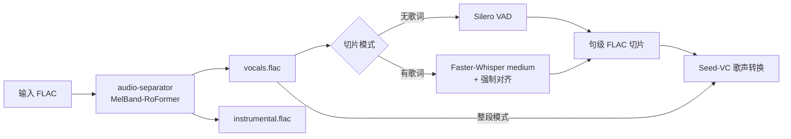
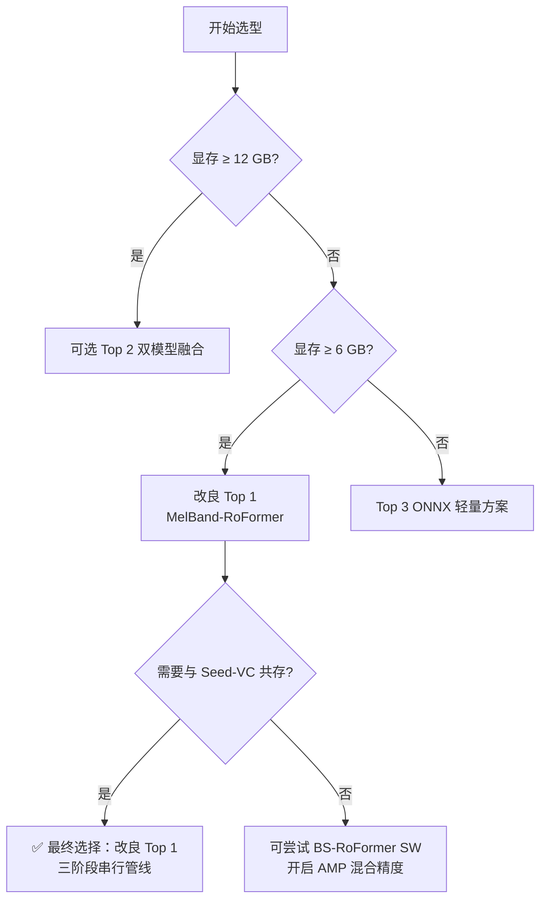
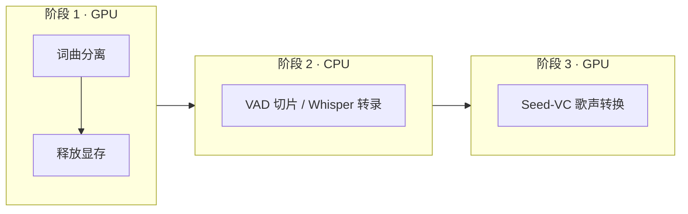
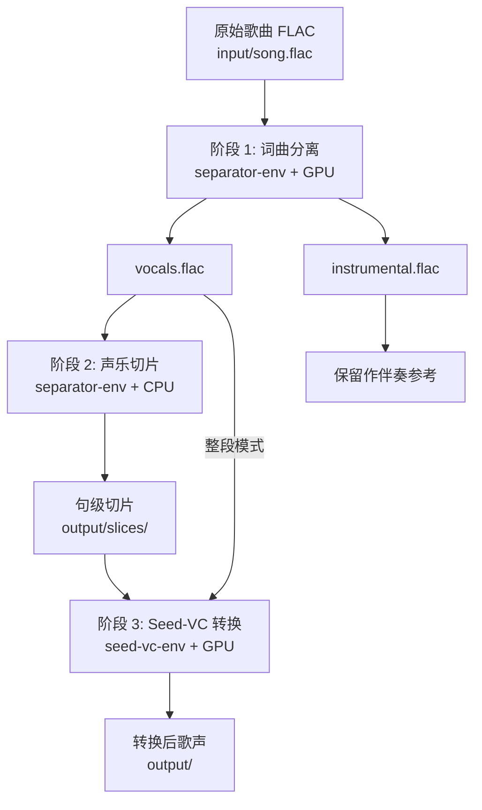
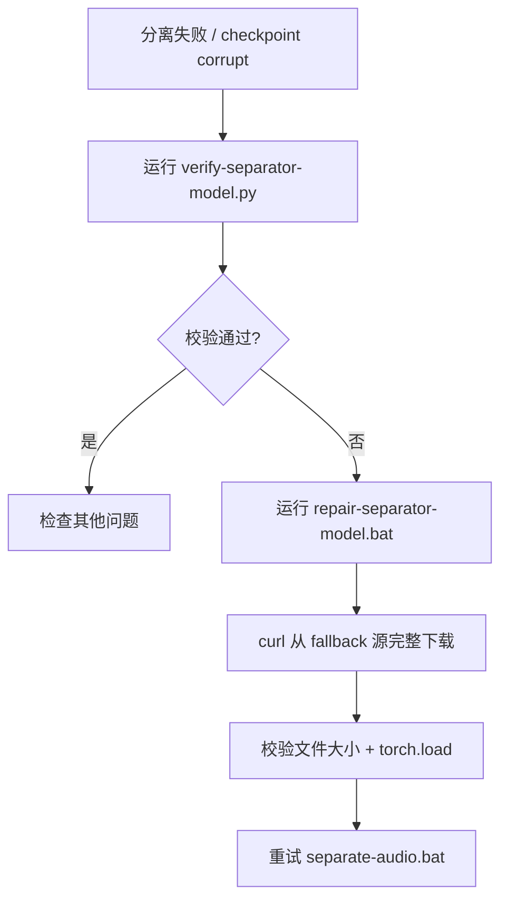
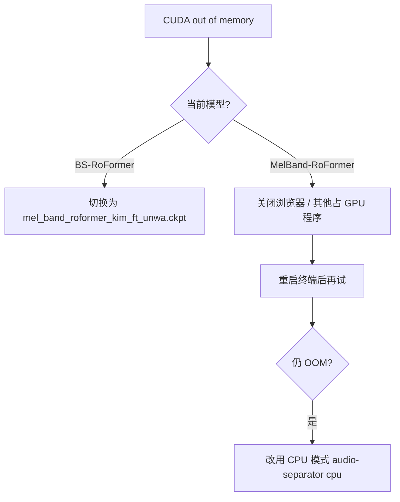

# 词曲分离与声乐切片安装指南（改良版 Top 1）

> 适用场景：将 FLAC 歌曲无损拆分为 `vocals.flac` + `instrumental.flac`，并按句切片后供 Seed-VC 歌声转换使用  
> 核心框架：`audio-separator` + MelBand-RoFormer + Silero VAD / Faster-Whisper  
> 包管理工具：**uv**（与 Seed-VC 环境保持一致）  
> 最后更新：2026-07-22

---

## 1. 方案概述

本方案是 [歌曲词曲分离与声乐切片技术深度调研及系统架构设计报告](./歌曲词曲分离与声乐切片技术深度调研及系统架构设计报告.md) 中 **Top 1（工业级高精度方案）** 的改良版，针对本机硬件与 `voice-translate` 工作流做了针对性调整。



| 组件 | 选型 | 作用 |
| --- | --- | --- |
| 分离引擎 | `audio-separator` | 成熟 Python 框架，内置分块 OLA、时域减法重构、FLAC 透传 |
| 主分离模型 | `mel_band_roformer_kim_ft_unwa.ckpt` | MelBand-RoFormer 人声微调版，显存友好、bleed 低 |
| 无歌词切片 | Silero VAD | 按换气停顿自动断句 |
| 有歌词切片 | Faster-Whisper `medium` | 转录 + 字词时间戳断句（省内存） |
| 下游消费 | Seed-VC | 将干净人声作为参考音进行跨语种歌声转换 |

---

## 2. 方案选型理由

### 2.1 候选方案对比

调研报告给出了三个生产级方案，结合本机配置评估如下：

| 方案 | 人声 SDR | 最低显存 | 本机适配 | 结论 |
| --- | --- | --- | --- | --- |
| **Top 1 原版**（BS-RoFormer SW） | 12.5–12.8 dB | 8 GB+ | ⚠️ 临界 | 音质最高，但 8 GB 笔记本显存易 OOM |
| **改良 Top 1**（MelBand-RoFormer） | 12.1–12.4 dB | ~6 GB | ✅ 推荐 | 音质接近、显存安全边际大 |
| **Top 2**（双模型融合） | 13.0+ dB | 12 GB+ | ❌ 不满足 | 16 GB 内存 + 8 GB 显存无法稳定运行 |
| **Top 3**（ONNX 轻量） | 10.5–11.2 dB | 2 GB | ✅ 可用 | 有 GPU 时音质损失不值得作为默认 |



### 2.2 选择改良 Top 1 的六个理由

**① 显存安全边际**

本机 RTX 5060 Laptop 标称 8 GB 显存，但 Windows 桌面合成器、浏览器等会占用 0.5–1.5 GB。BS-RoFormer SW 在 AMP 下仍需约 7–8 GB，容易 OOM；MelBand-RoFormer 在 AMP 下约 3.5–4 GB，为后续 Seed-VC 留出充足空间。

**② 音质与资源的甜点**

MelBand-RoFormer 人声 SDR 约 12.1–12.4 dB，与 BS-RoFormer 差距约 0.5 dB，听感上几乎无差别。Mel 标度频带划分带来更低的伴奏渗入率（bleedless），对歌声转换参考音更重要。

**③ 排除 Top 2**

双模型并行融合（MelBand + SCNet-XL）需要 12 GB+ 显存，本机 8 GB 不满足；串行运行耗时翻倍且 16 GB 系统内存偏紧，工程维护成本也高。

**④ 工程落地成本最低**

`audio-separator` 一条命令即可完成 FLAC 分离，内置：

- 32-bit PCM 解码与原始采样率透传
- 滑动窗口分块 + 汉宁窗 OLA 消除咔哒声
- 时域减法重构：`instrumental = mix - vocals`

**⑤ 与 voice-translate 管线天然衔接**

分离产物 `vocals.flac` 可直接作为 Seed-VC 参考音输入；三阶段串行调度避免 GPU/内存争抢：



**⑥ 切片策略可按需切换**

| 场景 | 方案 | 资源占用 |
| --- | --- | --- |
| 无歌词，按换气断句 | Silero VAD | CPU，< 5 秒/首 |
| 有歌词，按句式断句 | Faster-Whisper `medium` | GPU ~1.5 GB / 内存 ~2 GB |
| 整首歌直接转换 | 跳过切片 | 零额外开销 |

> 不使用 Whisper `large-v3`：在 16 GB 内存下与分离模型叠加易爆内存，`medium` 对中文歌词已足够。

---

## 3. 环境与路径

### 3.1 本机硬件评估

| 项目 | 本机配置 | 方案要求 | 评估 |
| --- | --- | --- | --- |
| GPU | NVIDIA GeForce RTX 5060 Laptop，8 GB | MelBand-RoFormer ~6 GB | ✅ |
| GPU 架构 | Blackwell，sm_120 | 需 PyTorch cu128 | ⚠️ 必须 cu128 |
| 驱动 / CUDA | Driver 573.22，CUDA 12.8 | RTX 50 系需 12.8 | ✅ |
| CPU | Intel i7-13700HX（16C / 24T） | VAD / 解码足够 | ✅ |
| 内存 | ~16 GB | 建议串行执行各阶段 | ⚠️ 偏紧 |
| 系统 | Windows 11 | Windows 10/11 | ✅ |

### 3.2 目录规划

| 项目 | 路径 |
| --- | --- |
| 工作区根目录 | `D:\code\voice-translate` |
| 词曲分离虚拟环境 | `D:\code\voice-translate\separator-env` |
| Seed-VC 虚拟环境（已有） | `D:\code\voice-translate\seed-vc-env` |
| 分离模型权重（自动下载） | `D:\code\voice-translate\separator-env\models\audio-separator\` |
| Silero VAD 权重 | `D:\code\voice-translate\separator-env\models\torch-hub\` |
| Faster-Whisper 权重（可选） | `D:\code\voice-translate\separator-env\models\hf-cache\` |
| 输入音频 | `D:\code\voice-translate\input\` |
| 分离输出 | `D:\code\voice-translate\output\separated\` |
| 切片输出 | `D:\code\voice-translate\output\slices\` |
| 相关文档 | `D:\code\voice-translate\docs\` |

> **环境隔离说明：** 词曲分离使用独立虚拟环境 `separator-env`，与 `seed-vc-env` 隔离，避免 PyTorch / onnxruntime 版本冲突。两环境均使用 cu128 版 PyTorch，但各自独立安装。

### 3.3 全局环境变量

与 Seed-VC 共用同一套用户级配置（若已按 [Seed-VC安装指南](./Seed-VC安装指南.md) 设置，可跳过）：

| 配置项 | 值 | 作用 |
| --- | --- | --- |
| `HF_ENDPOINT` | `https://hf-mirror.com` | 加速 Hugging Face 模型下载（Silero / Whisper） |
| `NO_PROXY` | `127.0.0.1,localhost` | 防止代理拦截本地服务 |
| `UV_CACHE_DIR` | `D:\uv-cache` | 缩短 uv 缓存路径，避免 Windows 路径过长 |
| `AUDIO_SEPARATOR_MODEL_DIR` | `D:\code\voice-translate\separator-env\models\audio-separator` | audio-separator 模型权重目录（启动脚本自动设置） |
| `TORCH_HOME` | `D:\code\voice-translate\separator-env\models\torch-hub` | Silero VAD 等 torch.hub 模型缓存 |
| `HF_HOME` | `D:\code\voice-translate\separator-env\models\hf-cache` | Faster-Whisper 等 Hugging Face 模型缓存 |

> **模型缓存原则：** 所有模型与权重均存放在 `separator-env\models\` 下，不写入用户主目录（如 `%USERPROFILE%\.cache\`），便于迁移、备份与版本库 `.gitignore` 管理。

---

## 4. 安装步骤

### 步骤 1：创建虚拟环境

```powershell
uv python install 3.10
uv venv --python 3.10 D:\code\voice-translate\separator-env
D:\code\voice-translate\separator-env\Scripts\activate
python --version   # 应显示 Python 3.10.x
```

### 步骤 2：安装 PyTorch（CUDA 12.8）

RTX 5060（sm_120）**必须**使用 cu128 版本，安装方式与 Seed-VC 相同。

```powershell
# 确保 separator-env 已激活
D:\code\voice-translate\separator-env\Scripts\activate

# 设置短缓存路径
$env:UV_CACHE_DIR = "D:\uv-cache"

# 安装 PyTorch
uv pip install torch torchvision torchaudio --index-url https://download.pytorch.org/whl/cu128
```

验证 GPU：

```powershell
python -c "import torch; print('PyTorch:', torch.__version__); print('CUDA:', torch.cuda.is_available()); print('GPU:', torch.cuda.get_device_name(0))"
```

期望输出：

```
PyTorch: 2.x.x+cu128
CUDA: True
GPU: NVIDIA GeForce RTX 5060 Laptop GPU
```

> 若 `sm_120 is not compatible`，改用 nightly 源，详见 [Seed-VC安装指南 §4.1](./Seed-VC安装指南.md#41-pytorch-cu128-安装失败分析与修复windows)。

### 步骤 3：安装 audio-separator

```powershell
D:\code\voice-translate\separator-env\Scripts\activate
uv pip install "audio-separator[gpu]"
```

验证安装：

```powershell
audio-separator --help
```

### 步骤 4：查看可用模型并确认主模型

```powershell
audio-separator --list_models --list_filter mel_band
```

本方案默认使用：

| 模型文件名 | SDR | 说明 |
| --- | --- | --- |
| `mel_band_roformer_kim_ft_unwa.ckpt` | vocals ~12.4 dB | **默认主模型**，人声微调、显存友好 |
| `vocals_mel_band_roformer.ckpt` | vocals ~12.6 dB | 备选，Kimberley Jensen 版 |
| `model_bs_roformer_ep_317_sdr_12.9755.ckpt` | vocals ~12.9 dB | 极致音质备选，显存充裕时可尝试 |

首次运行分离命令时，模型会自动下载到 `separator-env\models\audio-separator\`。

### 步骤 5：安装切片依赖

**Silero VAD（无歌词断句，必装）：**

```powershell
uv pip install silero-vad soundfile
```

**Faster-Whisper（有歌词断句，可选）：**

```powershell
uv pip install faster-whisper
```

### 步骤 6：创建目录与模型缓存路径

```powershell
New-Item -ItemType Directory -Force -Path D:\code\voice-translate\input
New-Item -ItemType Directory -Force -Path D:\code\voice-translate\output\separated
New-Item -ItemType Directory -Force -Path D:\code\voice-translate\output\slices
New-Item -ItemType Directory -Force -Path D:\code\voice-translate\separator-env\models\audio-separator
New-Item -ItemType Directory -Force -Path D:\code\voice-translate\separator-env\models\torch-hub
New-Item -ItemType Directory -Force -Path D:\code\voice-translate\separator-env\models\hf-cache
```

### 步骤 7：预下载主分离模型（推荐）

> 主模型完整大小为 **913,100,690 字节（约 871 MB）**。若下载不完整，分离时会报 checkpoint corrupt，请运行 `scripts\repair-separator-model.bat` 修复。

```powershell
# 推荐：使用修复脚本（含下载 + 校验）
scripts\repair-separator-model.bat

# 备选：audio-separator 自动下载（网络不稳定时可能截断）
D:\code\voice-translate\separator-env\Scripts\activate
$env:AUDIO_SEPARATOR_MODEL_DIR = "D:\code\voice-translate\separator-env\models\audio-separator"
audio-separator --download_model_only `
  --model_filename mel_band_roformer_kim_ft_unwa.ckpt `
  --model_file_dir $env:AUDIO_SEPARATOR_MODEL_DIR
python scripts\verify-separator-model.py
```

### 步骤 8：验证完整安装

```powershell
D:\code\voice-translate\separator-env\Scripts\activate

# 设置模型缓存环境变量（与启动脚本一致）
$env:TORCH_HOME = "D:\code\voice-translate\separator-env\models\torch-hub"
$env:HF_HOME = "D:\code\voice-translate\separator-env\models\hf-cache"

# 1. 检查 audio-separator
audio-separator --version

# 2. 检查 Silero VAD
python -c "from silero_vad import load_silero_vad; load_silero_vad(); print('Silero VAD OK')"

# 3. 检查 Faster-Whisper（若已安装）
python -c "from faster_whisper import WhisperModel; print('Faster-Whisper OK')"
```

---

## 5. 使用示例

> **推荐方式：** 使用 `scripts\` 下的 bat 脚本，自动激活 `separator-env` 并设置模型缓存路径。手动命令仅作调试或自定义参数时使用。

### 5.1 快速开始

在工作区根目录 `D:\code\voice-translate` 下执行：

```powershell
# 1. 将 FLAC 放入 input/ 后，执行词曲分离
scripts\separate-audio.bat input\song.flac

# 2. 对人声轨按句切片（将文件名替换为实际输出）
scripts\slice-vocals.bat output\separated\song_(Vocals)_mel_band_roformer_kim_ft_unwa.flac

# 3. 启动 Seed-VC 做歌声转换
scripts\start-seed-vc-webui.bat
```

| 步骤 | 脚本 | 输出目录 |
| --- | --- | --- |
| 词曲分离 | `scripts\separate-audio.bat` | `output\separated\` |
| 声乐切片 | `scripts\slice-vocals.bat` | `output\slices\` |
| 歌声转换 | `scripts\start-seed-vc-webui.bat` | `output\` |

> 分离与 Seed-VC **不要同时占用 GPU**，按顺序串行执行。完整管线说明见 [§6](#6-与-seed-vc-管线衔接)。

### 5.2 词曲分离

**推荐（一键脚本）：**

```powershell
scripts\separate-audio.bat input\song.flac
```

脚本会自动完成：激活 `separator-env`、设置 `AUDIO_SEPARATOR_MODEL_DIR` / `TORCH_HOME` / `HF_HOME`、调用 MelBand-RoFormer 主模型、输出 FLAC 到 `output\separated\`。

输出文件（示例）：

```
output/separated/
├── song_(Vocals)_mel_band_roformer_kim_ft_unwa.flac
└── song_(Instrumental)_mel_band_roformer_kim_ft_unwa.flac
```

> `audio-separator` 默认启用分块推断与时域减法重构，输出音轨与输入等长、等采样率。

**备选（手动命令）：**

适用于需要自定义参数或排查问题时：

```powershell
D:\code\voice-translate\separator-env\Scripts\activate

$env:AUDIO_SEPARATOR_MODEL_DIR = "D:\code\voice-translate\separator-env\models\audio-separator"
$env:TORCH_HOME = "D:\code\voice-translate\separator-env\models\torch-hub"
$env:HF_HOME = "D:\code\voice-translate\separator-env\models\hf-cache"

audio-separator D:\code\voice-translate\input\song.flac `
  --model_filename mel_band_roformer_kim_ft_unwa.ckpt `
  --model_file_dir $env:AUDIO_SEPARATOR_MODEL_DIR `
  --output_format flac `
  --output_dir D:\code\voice-translate\output\separated
```

**极致音质模式（GPU 空闲时可选，仅手动）：**

```powershell
audio-separator D:\code\voice-translate\input\song.flac `
  --model_filename model_bs_roformer_ep_317_sdr_12.9755.ckpt `
  --model_file_dir $env:AUDIO_SEPARATOR_MODEL_DIR `
  --output_format flac `
  --output_dir D:\code\voice-translate\output\separated
```

若出现 CUDA OOM，退回 MelBand-RoFormer 主模型或改用 `scripts\separate-audio.bat`。

### 5.3 无歌词声学切片（Silero VAD）

**推荐（一键脚本）：**

```powershell
# 默认输出到 output\slices\
scripts\slice-vocals.bat output\separated\song_(Vocals)_mel_band_roformer_kim_ft_unwa.flac

# 指定输出目录
scripts\slice-vocals.bat output\separated\song_(Vocals)_mel_band_roformer_kim_ft_unwa.flac output\slices\my-song
```

输出文件（示例）：

```
output/slices/
├── song_(Vocals)_mel_band_roformer_kim_ft_unwa_slice_000.flac
├── song_(Vocals)_mel_band_roformer_kim_ft_unwa_slice_001.flac
└── ...
```

脚本内置 VAD 参数与 fade 处理（`scripts\slice-vocals.py`）：

| 参数 | 值 | 说明 |
| --- | --- | --- |
| `threshold` | 0.45 | 捕捉气声与垫音，避免漏检 |
| `min_speech_duration_ms` | 250 | 过滤瞬间噪点 |
| `min_silence_duration_ms` | 500 | 按换气停顿断句 |
| `speech_pad_ms` | 80 | 保留辅音爆破与句尾余音 |
| fade-in / fade-out | 8 ms / 15 ms | 避免硬截断产生咔哒声 |

**备选（手动命令）：**

```powershell
D:\code\voice-translate\separator-env\Scripts\activate
$env:TORCH_HOME = "D:\code\voice-translate\separator-env\models\torch-hub"

python scripts\slice-vocals.py output\separated\song_(Vocals)_mel_band_roformer_kim_ft_unwa.flac
python scripts\slice-vocals.py output\separated\song_(Vocals)_mel_band_roformer_kim_ft_unwa.flac -o output\slices\my-song
```

### 5.4 有歌词语义切片（Faster-Whisper，可选）

当前未封装 bat 脚本，需手动安装 `faster-whisper` 后调用（见 [§4 步骤 5](#步骤-5安装切片依赖)）：

```powershell
D:\code\voice-translate\separator-env\Scripts\activate
$env:HF_HOME = "D:\code\voice-translate\separator-env\models\hf-cache"

python -c "
from faster_whisper import WhisperModel
model = WhisperModel('medium', device='cuda', compute_type='float16')
segments, info = model.transcribe('output/separated/song_(Vocals)_mel_band_roformer_kim_ft_unwa.flac', language='zh')
for seg in segments:
    print(f'[{seg.start:.2f}s -> {seg.end:.2f}s] {seg.text}')
"
```

当字词间隔 > 500 ms 或遇到标点时，判定为断句点，据此切割波形。

---

## 6. 与 Seed-VC 管线衔接

完整工作流如下（操作命令见 [§5.1 快速开始](#51-快速开始)）：



阶段 3 启动方式：

```powershell
# 推荐：使用启动脚本（自动切换 seed-vc-env）
scripts\start-seed-vc-webui.bat

# 备选：手动启动
deactivate
D:\code\voice-translate\seed-vc-env\Scripts\activate
cd D:\code\voice-translate\seed-vc
python app_svc.py --fp16 True
```

在 Web UI 中上传 `output/slices/` 下的切片，或 `output/separated/` 下的整段人声作为参考音。

> **关键原则：** 分离与 Seed-VC **不要同时占用 GPU**。完成分离后执行 `deactivate` 并切换环境，再启动 Seed-VC。

---

## 7. 性能预估与调优

### 7.1 本机耗时参考（3 分钟 FLAC 歌曲）

| 阶段 | 预估耗时 | 硬件 |
| --- | --- | --- |
| MelBand-RoFormer 分离 | 20–35 秒 | GPU |
| Silero VAD 切片 | < 5 秒 | CPU |
| Faster-Whisper medium 转录 | 30–60 秒 | GPU |
| Seed-VC 歌声转换 | 30–90 秒 | GPU |

### 7.2 显存优化

| 手段 | 效果 |
| --- | --- |
| 使用 MelBand-RoFormer 而非 BS-RoFormer | 显存从 ~7 GB 降至 ~4 GB |
| 关闭其他占 GPU 的程序 | 释放 0.5–1.5 GB |
| 分离完成后 `torch.cuda.empty_cache()` | 为 Seed-VC 腾出空间 |
| 分块重叠率 25%（默认） | 平衡质量与速度 |

### 7.3 备选轻量模式

当 Seed-VC 正在占用 GPU、需在后台做分离时，可切换到 CPU 模式：

```powershell
# 安装 CPU 版（仅需一次）
uv pip install "audio-separator[cpu]"

audio-separator input\song.flac `
  --model_filename mel_band_roformer_kim_ft_unwa.ckpt `
  --output_format flac `
  --output_dir output\separated
```

CPU 模式下 3 分钟歌曲约需 3–8 分钟，但完全不占 GPU。

---

## 8. 常见问题

### 8.1 模型文件损坏（checkpoint corrupt）

**现象：** 加载模型时报 `PytorchStreamReader failed reading zip archive: failed finding central directory`，或文件大小不是 **913,100,690 字节**（约 871 MB）。

**根因：** `mel_band_roformer_kim_ft_unwa.ckpt` 在 UVR 官方源已 404，`audio-separator` 需从 GitHub fallback 源下载约 871 MB 权重。若下载中断、被代理截断，或旧文件残留，会因 `download_file_if_not_exists` 跳过重新下载而导致损坏文件一直被复用。



**修复（推荐）：**

```powershell
scripts\repair-separator-model.bat
```

脚本会：删除损坏文件 → 从 `python-audio-separator` Release 完整下载 → 校验大小与 `torch.load`。

**手动修复：**

```powershell
# 1. 删除损坏文件
Remove-Item D:\code\voice-translate\separator-env\models\audio-separator\mel_band_roformer_kim_ft_unwa.ckpt

# 2. 用 curl 完整下载（不要用中断过的 audio-separator 自动下载）
curl -L --retry 5 --retry-delay 3 `
  -o D:\code\voice-translate\separator-env\models\audio-separator\mel_band_roformer_kim_ft_unwa.ckpt `
  https://github.com/nomadkaraoke/python-audio-separator/releases/download/model-configs/mel_band_roformer_kim_ft_unwa.ckpt

# 3. 验证
python scripts\verify-separator-model.py
```

### 8.2 CUDA OOM（显存不足）



### 8.3 模型下载失败

```powershell
# 检查网络与代理
echo $env:HTTP_PROXY
echo $env:HF_ENDPOINT

# audio-separator 模型从 GitHub Release 下载，通常不受 HF 镜像影响
# 若 GitHub 访问慢，确保代理可用：
# $env:HTTPS_PROXY = "http://127.0.0.1:7897"
```

### 8.4 输出文件采样率与输入不一致

确认未手动指定 `--sample_rate` 参数。默认行为是透传原始采样率。若需强制保持：

```powershell
audio-separator input\song.flac `
  --model_filename mel_band_roformer_kim_ft_unwa.ckpt `
  --output_format flac `
  --sample_rate 44100
```

### 8.5 切片出现咔哒声

- 检查切分点是否在零交叉处
- 为每个切片添加 fade-in / fade-out（5–20 ms）
- 适当增大 `speech_pad_ms` 至 100

### 8.6 与 seed-vc-env 的 PyTorch 版本冲突

两个环境完全隔离，互不影响。`separator-env` 专用于分离与切片，`seed-vc-env` 专用于歌声转换。不要在同一 venv 中混装两套依赖。

---

## 9. 脚本清单

| 脚本 | 说明 |
| --- | --- |
| `scripts/separate-audio.bat` | 一键词曲分离（运行前自动校验模型） |
| `scripts/slice-vocals.bat` | Silero VAD 切片（含 fade 处理） |
| `scripts/slice-vocals.py` | 切片核心逻辑 |
| `scripts/verify-separator-model.py` | 校验主模型大小与完整性 |
| `scripts/repair-separator-model.bat` | 修复损坏的主模型权重 |

---

## 10. 参考文档

- [歌曲词曲分离与声乐切片技术深度调研及系统架构设计报告](./歌曲词曲分离与声乐切片技术深度调研及系统架构设计报告.md)
- [Seed-VC 本地安装指南](./Seed-VC安装指南.md)
- [audio-separator 官方 README](https://github.com/nomadkaraoke/python-audio-separator)
- [Silero VAD](https://github.com/snakers4/silero-vad)
- [Faster-Whisper](https://github.com/SYSTRAN/faster-whisper)
