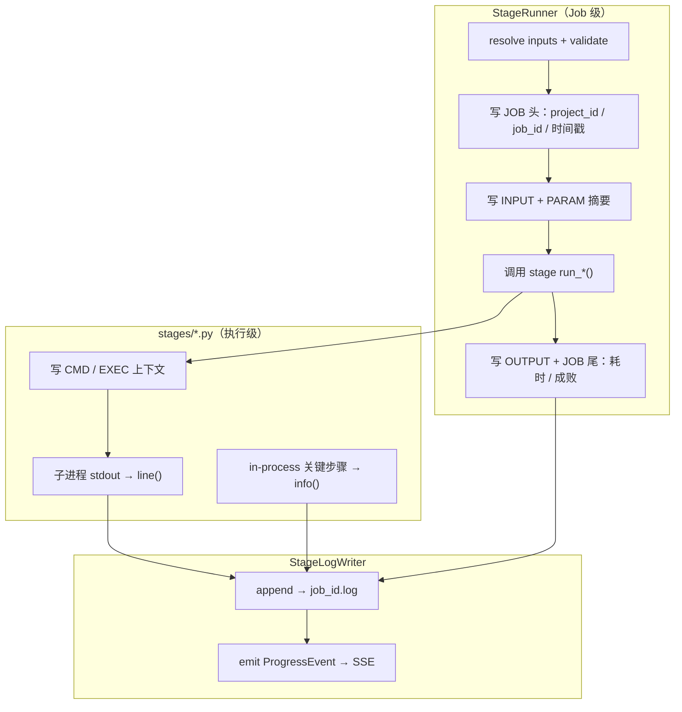
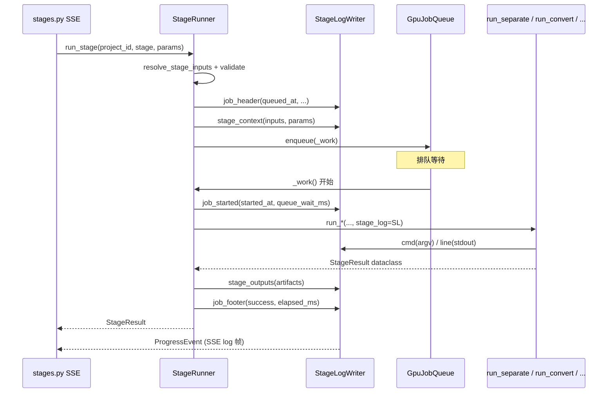
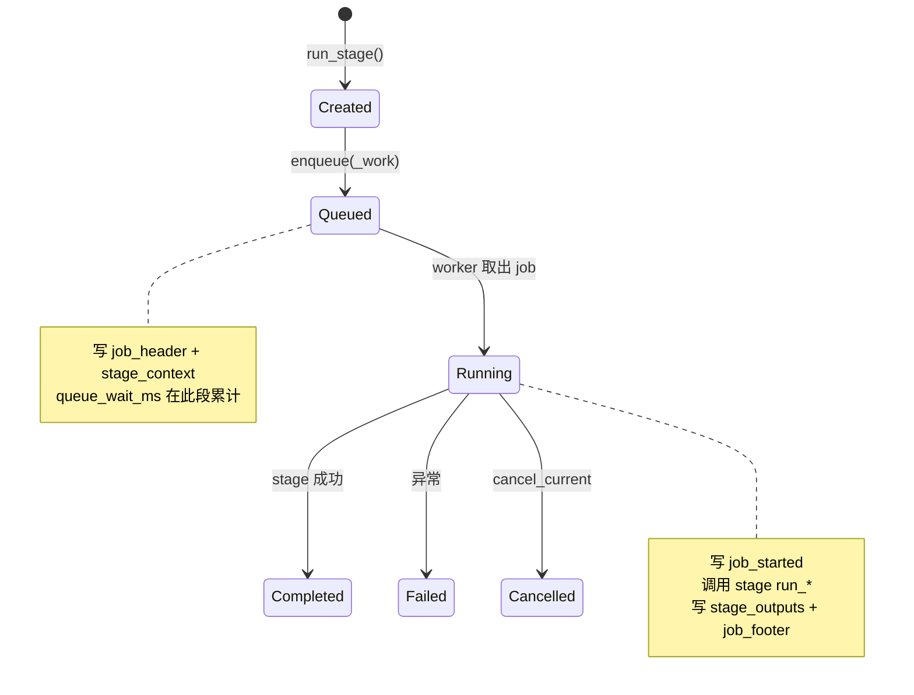
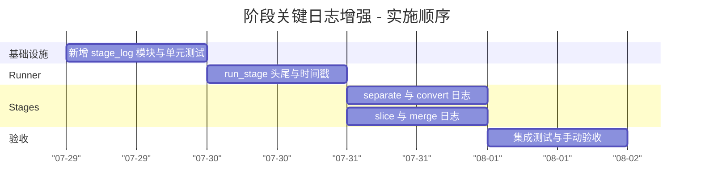

# 阶段关键日志增强方案

> **关联文档：** [管线WebUI迁移对照表-FastAPI-React.md](./管线WebUI迁移对照表-FastAPI-React.md)、[切片模式分仓与精修功能实施方案.md](./切片模式分仓与精修功能实施方案.md)  
> **版本：** v1.0  
> **日期：** 2026-07-29  
> **状态：** 评审通过（待开发）  
> **范围：** 方案一（Runner 层阶段头/尾摘要）+ 方案二局部（Stage 层 cmd 与子进程输出）

---

## 1. 背景与动机

### 1.1 现状问题

当前后端**未使用** Python 标准 `logging` 模块。阶段日志通过 `ProgressEvent.log_line` 经 `StageRunner._log()` 写入 `projects_meta/{project_id}/logs/{job_id}.log`，并经由 SSE 推送到前端 `StageLogPanel`。

| 阶段 | 现有日志内容 | 缺失信息 |
|------|-------------|----------|
| separate | 子进程 stdout + `Separating {filename}` | 输入 mix 路径、分离模型、输出目录 |
| slice | `Starting slice` / `Wrote N slices` | vocals/lrc 路径、VAD 参数、manifest 路径 |
| convert | 子进程 stdout + 开始/结束摘要 | reference、slices_dir、推理参数、完整 cmd |
| merge | merge 脚本 on_line + profile | 人声/伴奏路径、增益参数、输出路径 |

参数 schema 已在 `pipeline/stage_params.py` 维护，输入路径在 `ProjectStore.resolve_stage_inputs()` 与 `StageRunner._execute_stage()` 中解析完毕，但**均未写入日志**。排查「前端下发了什么高级参数、实际用了哪条路径」时，需要对照 UI 与磁盘，效率低。

### 1.2 目标

在每个阶段 job 的 log 文件中，**固定位置**可见：

1. **Job 级元数据**：`project_id`、`job_id`、入队时间、开始执行时间、排队等待时长  
2. **输入**：解析后的文件/目录（相对 repo root 的路径）  
3. **参数**：前端下发值；区分 wizard 参数、高级参数（非 default）、模式相关字段  
4. **命令**（subprocess 阶段）：完整 argv，便于复现  
5. **过程**：子进程 stdout（或 in-process 阶段的关键步骤行）  
6. **输出**：artifacts 摘要（目录/文件路径、计数）

### 1.3 非目标（v1）

- 引入 Python `logging` 全局配置或独立 log 轮转服务  
- 修改 SSE 协议或前端 `StageLogPanel` 渲染逻辑  
- JSONL / 结构化日志检索 API（留作后续）  
- 记录环境变量、proxy、token 等敏感信息  
- seed-vc / audio-separator 第三方库内部 debug 日志的统一采集  

---

## 2. 总体架构

### 2.1 职责划分



**原则：**

- **Runner 只写一次**阶段上下文（inputs + params），避免与 Stage 重复。  
- **Stage 只写**与执行方式相关的细节（cmd、python 解释器、子进程行、in-process 模块调用说明）。  
- 所有行经统一 `StageLogWriter` 落盘并转发 SSE，保持现有 `ProgressEvent` 契约不变。

### 2.2 与现有组件关系



---

## 3. 新增模块：`pipeline/stage_log.py`

### 3.1 `StageLogWriter`

单一写入器，由 `StageRunner.run_stage` 创建并注入各 stage。

```python
@dataclass
class StageLogWriter:
    project_id: str
    stage: StageName
    job_id: str
    log_path: Path
    on_progress: Callable[[ProgressEvent], None] | None
    _percent: float = 0.0

    def job_header(self, *, queued_at: str, created_at: str) -> None: ...
    def job_started(self, *, started_at: str, queue_wait_ms: int) -> None: ...
    def section(self, title: str, lines: dict[str, str] | list[str]) -> None: ...
    def inputs(self, mapping: dict[str, str | None]) -> None: ...      # [INPUT]
    def params(self, groups: ParamLogGroups) -> None: ...             # [PARAM]
    def cmd(self, argv: list[str], *, cwd: str | None = None, python: str | None = None) -> None: ...
    def exec_context(self, **kv: str) -> None: ...   # in-process 阶段，无 subprocess
    def info(self, message: str) -> None: ...
    def line(self, message: str) -> None: ...        # [PROC] 子进程透传
    def outputs(self, mapping: dict[str, str | None], **extra) -> None: ...
    def job_footer(self, *, success: bool, elapsed_ms: int, error: str | None = None) -> None: ...
```

**行前缀约定（固定宽度标签，便于 grep）：**

| 前缀 | 含义 | 写入方 |
|------|------|--------|
| `[JOB]` | job 元数据、起止 | Runner |
| `[INPUT]` | 输入路径 | Runner |
| `[PARAM]` | 参数键值 | Runner |
| `[CMD]` | subprocess 命令 | Stage（separate / convert） |
| `[EXEC]` | in-process 执行说明 | Stage（slice / merge） |
| `[PROC]` | 子进程或脚本输出行 | Stage |
| `[OUT]` | 输出路径 / 计数 | Runner |
| `[ERR]` | 失败摘要 | Runner |

**示例 log 片段（convert / slice_batch）：**

```
[JOB] === separate stage job=separate-a1b2c3d4e5f6 ===
[JOB] project_id=mysong  stage=convert  created_at=2026-07-29T15:30:01+08:00
[JOB] queued_at=2026-07-29T15:30:01+08:00  log=projects_meta/mysong/logs/separate-a1b2c3d4e5f6.log
[JOB] started_at=2026-07-29T15:30:04+08:00  queue_wait_ms=3120
[INPUT] source_vocals=output/separated/mysong/vocals.flac
[INPUT] reference=input/reference.wav
[INPUT] slices_dir=output/slices/mysong/lrc
[INPUT] manifest=output/slices/mysong/lrc/manifest.json
[INPUT] output_dir=output/converted/mysong/lrc
[PARAM] mode=slice_batch  active_slice_mode=lrc
[PARAM] wizard: diffusion_steps=40 inference_cfg_rate=0.7 semi_tone_shift=0 auto_f0_adjust=true
[PARAM] advanced: length_adjust=1.05 fp16=false
[PARAM] default: skip_existing=true limit=0
[CMD] python=D:\voice-translate\seed-vc-env\Scripts\python.exe
[CMD] cwd=D:\voice-translate
[CMD] argv: D:\...\python.exe D:\...\scripts\convert-slices.py output/slices/mysong/lrc --reference ... --output ...
[PROC] [1/42] slice_001.flac
[PROC] [2/42] slice_002.flac
...
[OUT] converted_dir=output/converted/mysong/lrc
[OUT] converted_count=42/42
[JOB] === done success=true elapsed_ms=312450 ===
```

### 3.2 参数分组：`ParamLogGroups`

复用 `pipeline/stage_params.py`，不重复定义 schema。

```python
@dataclass
class ParamLogGroups:
    mode: dict[str, Any]           # mode / active_slice_mode / profile 等
    wizard: dict[str, Any]         # StageParam.wizard=True 且本次生效
    advanced: dict[str, Any]       # 非 wizard、且 value != default_stage_params
    defaulted: dict[str, Any]      # 未下发或等于 default（可选省略值，仅列 key）
```

**过滤规则：**

- 调用 `collect_params(stage, params, slice_mode=..., convert_mode=...)`，与运行时一致。  
- LRC 模式下不输出 `vad_only` 参数；`slice_batch_only` / `full_track_only` 按 convert mode 过滤。  
- `defaulted` 组 v1 **只列 key 名**（如 `default: skip_existing, limit`），减少噪声；若与 default 不同的 advanced 为空则不打印 `[PARAM] advanced` 段。

### 3.3 路径格式化

- 一律使用 `rel_path(path, store.root)`，与 `ProjectStore` artifacts 一致。  
- 值为 `None` 或缺失的 input key **跳过**，不打印空行。  
- Windows 路径在 log 中统一为 `/` 分隔（`rel_path` 已处理）。

---

## 4. Runner 层改动（`pipeline/runner.py`）

### 4.1 时间戳与排队时长

`GpuJobQueue` 当前不记录「入队 → 开始执行」间隔。v1 在 Runner 侧补齐：

| 字段 | 记录点 | 说明 |
|------|--------|------|
| `created_at` | `run_stage` 入口 | 已有 `utc_now_iso()`，写入 Job 与 log |
| `queued_at` | `enqueue` 前 | 与 `created_at` 相同或略早（ms 级） |
| `started_at` | `_work()` 第一行 | GPU worker 线程开始执行 `_execute_stage` 的时刻 |
| `queue_wait_ms` | `started_at - queued_at` | 毫秒整数 |
| `elapsed_ms` | `_work()` 结束 | 自 `started_at` 至 stage 返回 |



**实现要点：**

1. `_work()` 闭包内第一行调用 `stage_log.job_started(...)`。  
2. `job_header` 在 `enqueue` **之前**写入（此时已确定 `job_id`、`log_path`），保证即使排队很久，log 文件已包含完整上下文。  
3. 失败路径：`_finalize_stage` 判定 `FAILED` / `CANCELLED` 时仍写 `job_footer(success=false, error=...)`。

### 4.2 各阶段 INPUT / OUT 字段契约

Runner 在调用 stage 前根据 `stage` 枚举写入 inputs；结束后根据 `_execute_stage` 返回值写 outputs。

| Stage | `[INPUT]` keys | `[OUT]` keys |
|-------|----------------|--------------|
| separate | `mix_audio` | `vocals`, `instrumental` |
| slice | `vocals`, `lrc`（LRC 模式）, `output_dir`, `mode` | `slices_dir`, `manifest`, `slice_count` |
| convert | `mode`, `source_vocals`, `reference`, `slices_dir`, `manifest`, `output_dir` / `output_path`, `overrides_path`（若存在） | `converted_dir`, `full_track`, `converted_count`, `total_count` |
| merge | `vocals`, `instrumental`, `reference`, `original_vocals`, `manifest`, `slices_dir`, `output_dir`, `profile` | `merged_dir`, `vocals`, `mixed` |

路径来源：`inputs`（`resolve_stage_inputs`）+ `_execute_stage` 内 `_abs()` 解析结果；Runner 将最终绝对路径转 rel 后交给 `StageLogWriter`.

### 4.3 `StageRunner.run_stage` 伪代码

```python
def run_stage(...):
    params = dict(params or {})
    inputs = self.store.resolve_stage_inputs(project_id, stage, params)
    # validate ...

    job_id = self.queue.new_job_id(stage.value)
    log_path = paths.project_logs_dir(project_id) / f"{job_id}.log"
    created_at = queued_at = utc_now_iso()

    stage_log = StageLogWriter(project_id, stage, job_id, log_path, on_progress=_log)
    stage_log.job_header(queued_at=queued_at, created_at=created_at)
    stage_log.inputs(pick_inputs(stage, inputs, params, root))
    stage_log.params(build_param_groups(stage, params, inputs))

    t_started: list[str] = []  # 闭包可变容器

    def _work():
        t_started.append(utc_now_iso())
        stage_log.job_started(started_at=t_started[0], queue_wait_ms=...)
        return self._execute_stage(..., stage_log=stage_log)

    self.queue.enqueue(...)
    job_result = self.queue.wait(job_id)

    # outputs + footer 在 _execute_stage 成功返回后、或 _finalize 失败分支写入
    return self._finalize_stage(...)
```

`_finalize_stage` 负责在失败时补写 `[ERR]` + `job_footer`；成功时 outputs 已在 `_execute_stage` 末尾写入。

---

## 5. Stage 层改动

### 5.1 函数签名

四个 stage 入口增加可选参数（默认 `None` 以保持脚本/测试直接调用兼容）：

```python
def run_separate(..., stage_log: StageLogWriter | None = None) -> SeparateResult: ...
def run_slice(..., stage_log: StageLogWriter | None = None) -> SliceResult: ...
def run_convert(..., stage_log: StageLogWriter | None = None) -> ConvertResult: ...
def run_merge(..., stage_log: StageLogWriter | None = None) -> MergeResult: ...
```

当 `stage_log is None` 时，行为与现网一致（仅 `_emit` progress，不写 cmd 块）。

### 5.2 Subprocess 阶段：separate / convert

在 `run_subprocess` **之前**调用：

```python
if stage_log:
    stage_log.cmd(
        [str(x) for x in cmd],
        cwd=str(root),
        python=str(separator_python())  # 或 seed_vc_python()
    )
```

子进程回调：

```python
def _line_handler(line: str) -> None:
    if stage_log:
        stage_log.line(line)
    else:
        # 现有 _emit 逻辑
```

**保留**现有 `_emit` 用于 SSE `percent` / `message` 更新；`stage_log.line` 负责 `[PROC]` 前缀与落盘。避免重复：当 `stage_log` 存在时，由 `StageLogWriter.line` 内部调用 `on_progress` 并设置 `log_line=f"[PROC] {line}"`。

### 5.3 In-process 阶段：slice / merge

无 subprocess argv，改用 `[EXEC]`：

**slice 示例：**

```
[EXEC] handler=scripts/slice-vocals-lrc.py  mode=lrc
[EXEC] lrc_path=input/mysong.lrc  vocals=...  output_dir=...
```

或 VAD：

```
[EXEC] handler=scripts/slice-vocals.py  mode=vad
[EXEC] vad_threshold=0.45 min_speech_ms=250 min_silence_ms=500 speech_pad_ms=80
```

**merge 示例：**

```
[EXEC] handler=scripts/merge-audio.py  profile=full
[EXEC] clean_instrumental=false skip_mastering=false vocals_gain_db=0.0 instrumental_gain_db=0.0
```

merge 脚本已有 `on_line` → 经 `stage_log.line` 输出 `[PROC]`。

### 5.4 职责边界（避免重复）

| 内容 | Runner | Stage |
|------|--------|-------|
| project_id / job_id / 时间 | ✅ | |
| inputs 路径 | ✅ | |
| params 分组 | ✅ | |
| cmd / exec 上下文 | | ✅ |
| 子进程 stdout | | ✅ |
| outputs / 计数 | ✅ | |
| progress percent | | ✅（现有 `_emit`） |

Stage **不再**打印 inputs/params（已由 Runner 写入）；Stage **不再**单独写 `Wrote ...` 类摘要行，统一由 Runner `[OUT]` 承担（可保留一条 `[PROC] Done: ...` 若子进程有）。

---

## 6. 持久化与 SSE

### 6.1 文件路径

不变：`projects_meta/{project_id}/logs/{job_id}.log`（见 `paths.project_logs_dir`）。

每个 stage run 对应一个 log 文件；wizard / pipeline 串联时每个 stage 独立文件，与现网一致。

### 6.2 ProgressEvent

**不扩展** dataclass 字段。`StageLogWriter` 每条 log 构造：

```python
ProgressEvent(
    project_id=...,
    stage=...,
    job_id=...,
    percent=self._percent,
    message=short_message,      # UI 主行，可截断
    log_line=prefixed_full_line # 落盘 + SSE 完整行
)
```

`StageRunner._log` 逻辑不变：`if event.log_line: append file`.

### 6.3 前端

`StageLogPanel` 继续渲染 `[{percent}%] {log_line ?? message}`，**无需改动**。结构化段落以文本前缀区分，用户肉眼可扫。

---

## 7. 辅助函数（`stage_log.py` 内）

| 函数 | 职责 |
|------|------|
| `pick_inputs(stage, inputs, params, root)` | 按 §4.2 表选取 key 并 rel_path |
| `build_param_groups(stage, params, inputs)` | 调用 `collect_params` + `default_stage_params` + wizard 标记 |
| `format_cmd(argv, cwd, python)` | 多行 `[CMD]`，argv 过长时仍单行输出（不折行隐藏） |
| `ms_between(iso_start, iso_end)` | 计算 queue_wait / elapsed |

---

## 8. 测试策略

### 8.1 单元测试（`tests/test_stage_log.py`，新建）

| 用例 | 断言 |
|------|------|
| `build_param_groups` LRC slice | 不含 vad_threshold 等 |
| `build_param_groups` advanced diff | `length_adjust=1.05` 进 advanced，`skip_existing=true` 进 defaulted |
| `StageLogWriter` 写文件 | tmp_path 下 log 含 `[JOB]`/`[INPUT]`/`[PARAM]` 顺序 |
| `format_cmd` | python / cwd / argv 三行 |

### 8.2 集成测试（扩展 `tests/test_runner.py` 或 `tests/api/test_pipeline.py`）

- Mock `run_separate` / `run_convert`，传入真实 `StageLogWriter`，断言 mock 收到 `stage_log` 且非 None。  
- 对 separate：mock `run_subprocess`，断言 log 文件含 `[CMD]` 与 `[OUT]`。  
- 失败路径：stage 抛异常 → log 含 `[ERR]` 与 `success=false`。

### 8.3 回归

- `tests/api/test_stage_sse.py`：SSE 仍收到 `log_line` 字段。  
- 现有 cancellation 测试：cancel 后 log footer 为 `cancelled` / `success=false`。

---

## 9. 实施计划



> **说明：** 原甘特图使用 `after` 依赖链，且任务名含 `/`、`+`、`.py` 等字符，部分 Markdown 预览器解析失败。上表改为**显式日期**、**简化任务名**；a3/a4 同日并行，a5 在两者之后（8/1）。步骤与下表仍一一对应。

| 步骤 | 文件 | 说明 |
|------|------|------|
| 1 | `pipeline/stage_log.py` | `StageLogWriter` + `build_param_groups` |
| 2 | `pipeline/runner.py` | 创建 writer、时间戳、inputs/params/outputs/footer |
| 3 | `pipeline/stages/separate.py` | `stage_log.cmd` + `line` |
| 4 | `pipeline/stages/convert.py` | 同上（full_track + slice_batch 两分支） |
| 5 | `pipeline/stages/slice.py` | `stage_log.exec_context` |
| 6 | `pipeline/stages/merge.py` | `exec_context` + `line` |
| 7 | `tests/test_stage_log.py` | 单元测试 |
| 8 | `tests/test_runner.py` 等 | 集成测试 |

**预估工作量：** 约 1–2 人日（含测试）。

---

## 10. 风险与缓解

| 风险 | 缓解 |
|------|------|
| cmd 行过长（含绝对路径） | 接受；排障优先可复现。argv 中路径可后续改为 rel_path 优化 |
| 与现有 `_emit` 重复输出 | `stage_log` 存在时统一由 writer 发 progress；stage 内合并逻辑 |
| 排队时间不准确（时钟回拨） | 使用 monotonic 计时算 `queue_wait_ms` / `elapsed_ms`，ISO 仅展示 |
| log 文件变大 | 仍按 job 分文件；前端仍截断 80 行；不引入 rotation |
| 测试 mock 签名变更 | `stage_log` 默认 Optional，旧测试可不改 mock 参数 |

---

## 11. 后续扩展（不在 v1）

- `GET /api/projects/{id}/jobs/{job_id}/log` 读取历史 log  
- Batch 队列汇总视图按 `[JOB]` 行聚合  
- JSONL 结构化事件（`log_kind: stage_context`）与前端折叠面板  
- 将 `[PARAM] advanced` 与前端「高级参数」面板 key 对齐的契约测试  

---

## 12. 评审检查清单

> **评审结论：** 通过（2026-07-29）。v1 暂不开发，待排期后按 §9 实施计划执行。

- [x] Runner / Stage 职责划分是否清晰、无重复段落  
- [x] 参数分组（wizard / advanced / default）是否符合产品预期  
- [x] slice / merge 用 `[EXEC]` 替代 `[CMD]` 是否可接受  
- [x] 排队时间 monotonic + ISO 双轨是否满足运维需求  
- [x] v1 不改 SSE / 前端是否 OK  

---

**文档结束**
