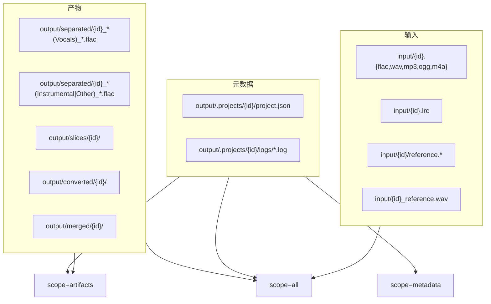

# 项目删除完整清理方案

> **关联文档：** [管线WebUI设计方案.md](./管线WebUI设计方案.md)、[管线WebUI开发记录.md](./管线WebUI开发记录.md)、[项目删除功能测试验收方案.md](./项目删除功能测试验收方案.md)  
> **版本：** v1.0  
> **日期：** 2026-07-25  
> **状态：** 已实施（2026-07-25）

---

## 1. 背景与动机

### 1.1 待解决问题

| # | 问题 | 现状 |
|---|------|------|
| P1 | Web UI 无删除入口 | 侧边栏仅有「刷新列表」「新建项目」，无法从界面移除项目 |
| P2 | Store 删除不完整 | `delete_project(remove_files=True)` 仅删 `slices/`、`converted/`、`merged/`，不清理 `input/`、`separated/` |
| P3 | 无分级删除 | 用户无法选择「仅移出列表」或「保留原文件只删产物」 |
| P4 | 无删除预览 | 删除前无法确认将影响的文件与目录 |
| P5 | UI 与 Store 未桥接 | `state.py` 无 `delete_project_ui()`；`delete_project` 无测试覆盖 |

### 1.2 已锁定决策（方案 B）

| # | 决策项 | 结论 |
|---|--------|------|
| D1 | 删除粒度 | 三档 scope：`metadata` / `artifacts` / `all` |
| D2 | 路径枚举 | 统一由 `paths.collect_project_artifacts()` 产出，Store 与 UI 共用 |
| D3 | 删除入口 | 侧边栏「项目」区，折叠面板「删除项目」 |
| D4 | 安全确认 | 必须勾选确认 + 展示待删路径预览后方可执行 |
| D5 | 删除后行为 | 刷新项目列表；若删的是当前项目则清空各 Tab 状态 |
| D6 | 批量队列 | 删除后从 CheckboxGroup 选项中移除对应 ID |
| D7 | 不可恢复 | v1 不做回收站；彻底删除为不可逆操作 |

### 1.3 非目标（v1）

- 软删除 / 回收站 / 恢复
- 删除进行中的 GPU 任务（需先取消或等待完成，v1 仅提示）
- 跨项目共享产物（如 legacy `output/merged/mixed.flac`）的自动归属判定

---

## 2. 删除范围契约

### 2.1 项目关联路径总览



### 2.2 三档 scope 定义

| scope | 说明 | 删除内容 |
|-------|------|----------|
| `metadata` | 仅从 Web UI 列表移除 | `output/.projects/{id}/`（含 `project.json`、日志） |
| `artifacts` | 删除管线产物，保留原始素材 | `metadata` + `output/separated/` 中该项目 stems + `output/slices/{id}/` + `output/converted/{id}/` + `output/merged/{id}/` |
| `all` | 彻底删除 | `artifacts` + `input/{id}.*` + `input/{id}.lrc` + `input/{id}/` + `input/{id}_reference.*` |

> **注意：** `output/merged/mixed.flac`（无项目子目录的 legacy 全局文件）不在自动清理范围内；若需清理须手动处理。

### 2.3 `collect_project_artifacts()` 返回结构

```python
@dataclass
class ProjectArtifactGroup:
    metadata: list[Path]      # 文件或目录
    artifacts: list[Path]     # separated + slices + converted + merged
    inputs: list[Path]        # input 下与项目相关的文件/目录

def collect_project_artifacts(project_id: str) -> ProjectArtifactGroup:
    """枚举磁盘上与 project_id 关联的所有路径（存在才返回）。"""
```

**separated 匹配规则**（复用 `paths.separated_vocals_path` / `separated_instrumental_path` 及 glob 扩展）：

- `{id}_*(Vocals)_*.flac`
- `{id}_*(Instrumental)_*.flac` / `{id}_*(Other)_*.flac`

**input 匹配规则**：

- `input_audio_path(project_id)` 解析到的音频
- `input_lrc_path(project_id)`
- `project_reference_path(project_id)`
- `input/{id}/` 目录（若存在）

---

## 3. 后端设计

### 3.1 `ProjectStore.delete_project()` 扩展

```python
DeleteScope = Literal["metadata", "artifacts", "all"]

def delete_project(
    self,
    project_id: str,
    *,
    scope: DeleteScope = "metadata",
) -> list[str]:
    """
  按 scope 删除项目关联路径。
  返回已删除（或尝试删除）的路径字符串列表，供 UI 展示。
  """
```

**执行顺序：**

1. 校验 `project_id` 存在（`metadata` scope 时若仅有磁盘产物无 `project.json`，仍允许按 ID 清理）
2. `group = paths.collect_project_artifacts(project_id)`
3. 按 scope 合并待删列表
4. 先删文件再删目录（目录用 `shutil.rmtree`）
5. 对 `separated/*.flac` 仅 `unlink`，不删 `separated/` 根目录
6. 返回相对仓库根的路径列表

### 3.2 `state.delete_project_ui()`

```python
def delete_project_ui(
    project_id: str | None,
    scope: str,
    *,
    confirmed: bool,
) -> tuple[bool, str, list[str]]:
    """
  返回 (success, message, deleted_paths)。
  confirmed=False 时仅预览，不执行删除。
  """
```

### 3.3 删除前预览 API

```python
def preview_project_deletion(project_id: str | None, scope: str) -> str:
    """返回 Markdown 表格：类型 | 路径 | 存在。"""
```

---

## 4. Web UI 设计

### 4.1 侧边栏布局

```
┌─ 项目 ─────────────────────────────────────┐
│ 当前项目 [Dropdown ▼]                       │
│ 阶段状态 …                                  │
│ [刷新列表]                                  │
├─ 新建项目（Accordion）──────────────────────┤
│ …                                          │
├─ 删除项目（Accordion，默认折叠）─────────────┤
│ 删除范围：                                  │
│   ○ 仅从列表移除（保留所有文件）             │
│   ○ 删除产物（保留 input 原文件）            │
│   ● 彻底删除（含 input 与 separated）        │
│                                             │
│ 待删除路径预览（Markdown，只读）              │
│ [刷新预览]                                  │
│                                             │
│ ☐ 我确认删除以上路径，且知晓不可恢复          │
│ [删除当前项目]  variant=stop                │
│ 操作结果 …                                  │
└─────────────────────────────────────────────┘
```

### 4.2 交互规则

| 操作 | 行为 |
|------|------|
| 切换「当前项目」 | 清空确认勾选；刷新删除预览 |
| 切换删除范围 Radio | 重新生成预览 Markdown |
| 点击「刷新预览」 | 调用 `preview_project_deletion`，不执行删除 |
| 点击「删除当前项目」 | `confirmed=False` 或未选项目 → 报错；否则 `delete_project_ui` |
| 删除成功 | 刷新 Dropdown；`project_state=None`；触发 `field_outputs` 全量清空 |
| 删除失败 | 展示错误与部分已删路径（best-effort 删除时） |

### 4.3 改动文件

| 文件 | 改动 |
|------|------|
| `pipeline/paths.py` | 新增 `ProjectArtifactGroup`、`collect_project_artifacts()` |
| `pipeline/store.py` | 重写 `delete_project(scope=...)`；废弃 `remove_files` 参数（内部映射到 scope） |
| `webui/state.py` | `preview_project_deletion_ui()`、`delete_project_ui()` |
| `webui/components/project_sidebar.py` | 删除 Accordion、Radio、预览、确认、按钮与事件绑定 |
| `webui/pipeline_app.py` | 删除成功后联动 `field_outputs` 刷新 |
| `webui/components/batch_queue.py` | 删除后刷新 CheckboxGroup（若侧边栏删除触发全局 refresh） |
| `tests/test_paths.py` | `collect_project_artifacts` 枚举用例 |
| `tests/test_store.py` | 三档 scope 删除用例 |
| `tests/run_playwright_project_delete.py` | UI 验收（见测试方案） |

---

## 5. 分阶段实施

| 阶段 | 名称 | 估时 | 依赖 |
|------|------|------|------|
| 0 | 路径枚举 + 单元测试 | 0.5 天 | — |
| 1 | Store 删除逻辑 | 0.5 天 | 阶段 0 |
| 2 | UI 接入 + 预览 | 1 天 | 阶段 1 |
| 3 | Playwright 验收 | 0.5 天 | 阶段 2 |
| **合计** | | **约 2.5 天** | |

### 5.1 阶段 0：路径枚举

- [ ] `ProjectArtifactGroup` 数据类
- [ ] `collect_project_artifacts(project_id)` 实现
- [ ] 覆盖：仅有 metadata、仅有 separated、完整项目、无 `project.json` 仅有产物

### 5.2 阶段 1：Store

- [ ] `delete_project(scope=...)` 实现
- [ ] 将现有 `remove_files=True` 调用方迁移为 `scope="artifacts"`
- [ ] `tests/test_store.py` 三档 scope 用例

### 5.3 阶段 2：UI

- [ ] `project_sidebar.py` 删除面板
- [ ] `state.py` 预览与删除桥接
- [ ] 删除后清空当前项目状态

### 5.4 阶段 3：验收

- [ ] `tests/run_playwright_project_delete.py`
- [ ] 执行 [项目删除功能测试验收方案.md](./项目删除功能测试验收方案.md) 全用例

---

## 6. 风险与缓解

| 风险 | 缓解 |
|------|------|
| 误删 input 原文件 | `all` scope 需勾选确认；预览列出全部路径 |
| 删除时 GPU 任务运行中 | v1 检测 `project.stages.*.status == running` 时拒绝并提示 |
| `separated/` 下文件名不规范 | glob + 现有 `separated_*_path` 双重匹配 |
| 删除后 `scan_and_repair` 重建项目 | `all` / `artifacts` 应删净产物；`metadata` 保留产物时刷新会再次出现 — 符合预期 |
| Windows 文件占用 | 删除失败路径记入返回列表，UI 提示关闭占用进程后重试 |

---

## 7. 开发进展

> 实施过程中更新本表。

| 阶段 | 名称 | 状态 | 开始日期 | 完成日期 | 备注 |
|------|------|------|----------|----------|------|
| 0 | 路径枚举 + 单元测试 | ✅ 已完成 | 2026-07-25 | 2026-07-25 | |
| 1 | Store 删除逻辑 | ✅ 已完成 | 2026-07-25 | 2026-07-25 | |
| 2 | UI 接入 + 预览 | ✅ 已完成 | 2026-07-25 | 2026-07-25 | |
| 3 | Playwright 验收 | ✅ 已完成 | 2026-07-25 | 2026-07-25 | mysong scope=all E2E |

---

## 8. 变更记录

| 日期 | 版本 | 变更摘要 |
|------|------|----------|
| 2026-07-25 | v1.0 | 初版：方案 B 完整清理 + 三档 scope + UI 删除面板 |
